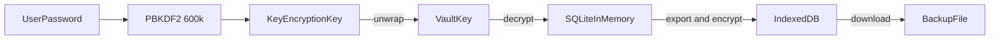

# Jaybi

Take control of your finances without handing them to anyone.

**Live at [https://jaybi.uz](https://jaybi.uz).**

**Jaybi** (جيبي) is a private income and expense ledger for a person, a family, or a small team. It runs entirely in the browser. There is no server, no account to sign up for, and no analytics. The ledger is an SQLite database encrypted with AES-256-GCM and stored on your device. The website itself is only static files, so it can be hosted free on GitHub Pages. This repository is `kool277/iqtisod`.

Jaybi was called Moliya up to version 1.2.0 and was served from `kool277.github.io/iqtisod`. That old address now redirects to jaybi.uz. Stored data keeps the old name on purpose: backups are still `.moliya` files, and every vault and backup made under either name keeps opening (see [docs/data-format.md](docs/data-format.md#names)). Browsers keep data per website, so a vault created at the old address does not appear at jaybi.uz by itself; the [admin guide](docs/admin-guide.md#moving-to-jaybiuz) explains how to bring it over with a backup.

## Why it exists

Most budgeting apps ask you to trust a company with your bank-level details. Spreadsheets keep the data local, but they are easy to lose, hard to share safely, and have no access control. Jaybi sits between the two:

- **Private by default.** Records are encrypted before they are saved. The hosting provider only ever serves the app's code and never sees your numbers.
- **Shared without a server.** Several people can use the same vault, each with their own password and role.
- **Understandable at a glance.** A dashboard shows where the money came from and where it went for any period.
- **Local language.** The interface is available in Oʻzbekcha (Latin and Cyrillic), Russian, and English.

It suits a household tracking a shared budget, a small business or community group keeping simple books, or anyone who wants a finance tool that works offline once loaded and keeps data on their own device.

## Features

- Encrypted vault created on first run with a master (admin) password.
- Three roles: **Admin** (everything), **Manager** (add, edit, and delete records for their group), and **Viewer** (read-only dashboard and ledger for their group).
- Groups, so one vault can hold separate budgets (for example "Home" and "Shop"), each with its income, expenses, net, transaction count, and latest activity for the chosen period, one line per currency. Choosing a group opens its records in the ledger.
- Income and expense records with category, date, currency, notes, and an optional receipt photo.
- Timeline filters for today, this week, this month, last month, year to date, or a custom range.
- Dashboard with net balance, total income, total expenses, savings rate, and four charts: monthly income against expenses, expenses by category, spending over time, and spending by group or by person, for all groups or one.
- Tables for the ledger, people, codes, groups, audit log (latest 10,000 entries), categories, earlier copies, and private safes: sort by any column, search that ignores case, accents, and script, filters, column choices remembered per browser, cards on a phone, in-place edits and bulk delete in the ledger, and export of exactly what the table shows for Admins.
- Official exchange rates on the dashboard for soʻm, won, and shekel against the US dollar in both directions (UZS↔USD, KRW↔USD, ILS↔USD), from the Central Bank of Uzbekistan, the European Central Bank, and the Bank of Israel, with the rate date, the source, the change since the previous rate, a stale warning, and an exact converter. Rates are fetched and cross-checked once or twice a day by a GitHub Actions job and published on the same site, so the browser never contacts a third party.
- Admin settings page for the vault name, vault currency, and income and expense categories in all four languages.
- Private safes for every person: encrypted, owner-only places for payment cards, subscriptions (with monthly and yearly totals per currency and upcoming payments), and notes. Not even an Admin can open them. Password re-entry to open, locking with the vault, masked card numbers, an optional recovery code, a 30-day trash, and a private activity list.
- One-time invite and reset codes (valid 24 hours by default), so people choose their own passwords and an Admin never needs to know them.
- Account page where everyone changes their own password, turns on an optional sign-in check with an authenticator app, and chooses when the vault locks itself. People whose password was set by an Admin must choose their own at next sign-in.
- Password rules (12+ characters, no common passwords) and attempt limits with a growing wait after repeated wrong passwords or codes.
- Collapsible sidebar that remembers its state.
- Exact money: amounts are stored as whole minor units (cents, tiyin) and never rounded, with per-currency subtotals for records outside the vault currency.
- Hash-chained audit log of every change, with before and after values. It catches damage and edits by people without a password, and warns Admins when the log got shorter or was rewritten since this browser last saw it. It is not signed, so a member who knows a password could still rewrite it.
- Encrypted backup file (`.moliya`) for moving a vault to another browser or keeping a safe copy, with a reminder when the last backup is older than 7 days.
- Data exports for Admins, for spreadsheets, accountants, and long-term archiving: CSV, JSON, JSON Lines, Excel, PDF report, and SQLite, for all data or one period and group. Exports are encrypted by default (AES-256 ZIP or an SQLCipher 4 database) with an export password of at least 14 characters that must differ from the sign-in password and pass the same common-password and vault-name/email checks as sign-in passwords. ZIP needs a strong password (its key derivation is fixed and fast), so the form starts with a generated 120-bit one. Private safes are never exported.
- Versioned data formats: every vault and backup made by any release keeps opening in every later release, and a standalone tool opens backups without the website.
- In-app version display and a prompt to reload when a new version is deployed.
- Day, night, and system themes. Language and theme choices are remembered.

## How it works



1. A random 256-bit **vault key** encrypts the whole SQLite database.
2. Each person's password is stretched with PBKDF2 (SHA-256, 600,000 iterations, 32-byte salt) into a **key-encryption key**, which wraps a copy of the vault key. Adding a person adds one more wrapped copy. Wraps made by 1.0.0 (200,000 iterations) still open and are strengthened at the person's next sign-in.
3. Signing in unwraps the vault key and decrypts the database into memory. Nothing readable is written to disk.
4. Changes are re-encrypted and saved to the browser's IndexedDB within about a second of each edit, every 5 seconds while changes are pending, and when the tab is hidden or the vault is locked.
5. Private safes are encrypted a second time inside the database. A separate PBKDF2 run over the owner's password (or their recovery code) unlocks a **personal key**, which unlocks one key per safe. Nobody else's password or key opens them.

Refreshing or closing the tab locks the vault, and so does a period without activity (15 minutes unless changed to 5, 30, or 60 in Account). Private safes lock with it. Signing in again is required.

## Versions and data longevity

Jaybi uses [Semantic Versioning](https://semver.org/); see the [changelog](CHANGELOG.md). The database schema, the stored browser record, and the backup file each carry their own format version, independent of the app version, and every backup records the app version that made it.

Every release must open every vault and backup ever produced, for at least ten years. Upgrades run automatically on first sign-in, one step at a time, inside transactions, and keep the original copy in the browser. Real backups from each release are kept in `tests/fixtures/backups/` and must open, with exact totals, in every build. The formats are specified in [docs/data-format.md](docs/data-format.md), and `npm run decrypt` opens any backup with Node.js alone.

## Quick start

Requirements: Node.js 22.12 or newer and npm.

```bash
npm ci --ignore-scripts   # install exactly what package-lock.json pins, as CI does
npm run dev               # development server
npm test                  # unit tests
npm run build             # type-check and build static files into dist/
```

Open the address Vite prints (usually `http://localhost:5173`), create a vault, and start adding records.

| Command | What it does |
| --- | --- |
| `npm run dev` | Start the development server |
| `npm run build` | Type-check and build static files into `dist/` |
| `npm run preview` | Serve the built `dist/` locally |
| `npm run typecheck` | Type-check only |
| `npm test` | Run unit tests, including every golden backup (Vitest) |
| `npm run test:e2e` | Run browser tests (Playwright) against the dev server. Run `npx playwright install chromium` once first |
| `npm run test:e2e:preview` | Build, then run the browser tests against the production bundle, as CI does |
| `npm run rates:fetch -- --out .fx-data` | Fetch, validate, and write an exchange-rate snapshot (copy `.fx-data/rates` to `public/rates` to see live rates in `npm run dev`) |
| `npm run decrypt -- <file> --list` | Open a backup without the website (see the [admin guide](docs/admin-guide.md#opening-a-backup-without-the-website)) |

## Documentation

- [User guide](docs/user-guide.md) is for Managers and Viewers who record and review money, and for anyone using private safes.
- [Admin guide](docs/admin-guide.md) covers setting up a vault, settings and categories, people, groups, backups, and recovery.
- [Developer guide](docs/developer-guide.md) covers architecture, code layout, conventions, and how to extend the app.
- [DevOps guide](docs/devops-guide.md) covers building, CI, releases, GitHub Pages, the jaybi.uz domain and DNS, exchange rates, other hosts, and operational risks.
- [Data format](docs/data-format.md) specifies every stored and exported format and the rules that keep old data readable. JSON Schemas for exports are in [docs/schemas/](docs/schemas/).
- [Security policy](SECURITY.md) lists supported versions, how to report a vulnerability, and the threat model in brief.
- [Changelog](CHANGELOG.md) lists what changed in each release.

## Security in one paragraph

Data is protected by encryption at rest and by passwords. It is **not** protected from someone who already holds a valid password: the vault is a single encrypted database, so any person who can sign in could, with developer tools, read every group's records, not only their own. Roles control what the app shows and allows, not what the cryptography hides. The exception is private safes, which are encrypted with keys derived only from their owner's password or recovery code, so Admins and other people cannot read them even with the decrypted database; they do not hide how many items someone has, and they do not protect against a compromised device. Email addresses are stored unencrypted next to the ciphertext so the app knows whose key to try. There is no password recovery. If every password is lost, the data cannot be recovered. Backups made before 1.2.0 contain key material for each person and should be replaced after upgrading. See the [admin guide](docs/admin-guide.md#security-limits-to-know) for the full list.

To report a vulnerability, use GitHub's [private security advisory form](https://github.com/kool277/iqtisod/security/advisories/new), not a public issue. [SECURITY.md](SECURITY.md) explains what to include and what to expect.

## Tech stack

React 19, TypeScript, Vite, Tailwind CSS 4, Chart.js, Lucide icons, `@sqlite.org/sqlite-wasm`, the Web Crypto API, jsPDF, write-excel-file, zip.js, Vitest, Playwright, GitHub Actions, CodeQL, and Dependabot.

## Status

Version 1.4.0, in production since 1.0.0 and served from [jaybi.uz](https://jaybi.uz) since 1.3.0. The core features work and are covered by unit tests, browser tests, and golden backups from every release. Known gaps and suggested next steps are listed in the [developer guide](docs/developer-guide.md#known-gaps-and-next-steps).

## License

The repository does not include a license file yet, so no open-source license is granted for the app's own code. Bundled third-party parts keep their own licenses: `coi-serviceworker` (MIT), the Noto Sans font subset (SIL OFL 1.1, `src/assets/fonts/OFL.txt`), the QR code generator adapted from Project Nayuki (MIT), and the npm dependencies listed in `package-lock.json`.
