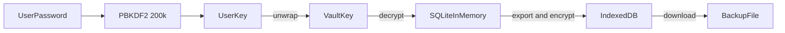

# iqtisod

Take control of your finances without handing them to anyone.

iqtisod is the repository for **Moliya**, a private income and expense ledger for a person, a family, or a small team. It runs entirely in the browser. There is no server, no account to sign up for, and no analytics. The ledger is an SQLite database encrypted with AES-256-GCM and stored on your device. The website itself is only static files, so it can be hosted free on GitHub Pages.

## Why it exists

Most budgeting apps ask you to trust a company with your bank-level details. Spreadsheets keep the data local, but they are easy to lose, hard to share safely, and have no access control. Moliya sits between the two:

- **Private by default.** Records are encrypted before they are saved. The hosting provider only ever serves the app's code and never sees your numbers.
- **Shared without a server.** Several people can use the same vault, each with their own password and role.
- **Understandable at a glance.** A dashboard shows where the money came from and where it went for any period.
- **Local language.** The interface is available in Oʻzbekcha (Latin and Cyrillic), Russian, and English.

It suits a household tracking a shared budget, a small business or community group keeping simple books, or anyone who wants a finance tool that works offline once loaded and keeps data on their own device.

## Features

- Encrypted vault created on first run with a master (admin) password.
- Three roles: **Admin** (everything), **Manager** (add, edit, and delete records for their group), and **Viewer** (read-only dashboard and ledger for their group).
- Groups, so one vault can hold separate budgets (for example "Home" and "Shop").
- Income and expense records with category, date, currency, notes, and an optional receipt photo.
- Timeline filters for today, this week, this month, last month, year to date, or a custom range.
- Dashboard with net balance, total income, total expenses, savings rate, and four charts: monthly income against expenses, expenses by category, spending over time, and spending by group or by person.
- Admin settings page for the vault name, vault currency, and income and expense categories in all four languages.
- Collapsible sidebar that remembers its state.
- Audit log of every change.
- Encrypted backup file (`.moliya`) for moving a vault to another browser or keeping a safe copy.
- Day, night, and system themes. Language and theme choices are remembered.

## How it works



1. A random 256-bit **vault key** encrypts the whole SQLite database.
2. Each person's password is stretched with PBKDF2 (SHA-256, 200,000 iterations, 32-byte salt) into a **personal key**, which wraps a copy of the vault key. Adding a person adds one more wrapped copy.
3. Signing in unwraps the vault key and decrypts the database into memory. Nothing readable is written to disk.
4. Changes are re-encrypted and saved to the browser's IndexedDB within about a second of each edit, every 5 seconds while changes are pending, and when the tab is hidden or the vault is locked.

Refreshing or closing the tab locks the vault. Signing in again is required.

## Quick start

Requirements: Node.js 20.19 or newer (22 LTS recommended) and npm.

```bash
npm install
npm run dev
```

Open the address Vite prints (usually `http://localhost:5173`), create a vault, and start adding records.

| Command | What it does |
| --- | --- |
| `npm run dev` | Start the development server |
| `npm run build` | Type-check and build static files into `dist/` |
| `npm run preview` | Serve the built `dist/` locally |
| `npm test` | Run unit tests (Vitest) |
| `npm run test:e2e` | Run browser tests (Playwright). Run `npx playwright install chromium` once first |

## Documentation

- [User guide](docs/user-guide.md) is for Managers and Viewers who record and review money.
- [Admin guide](docs/admin-guide.md) covers setting up a vault, settings and categories, people, groups, backups, and recovery.
- [Developer guide](docs/developer-guide.md) covers architecture, code layout, conventions, and how to extend the app.
- [DevOps guide](docs/devops-guide.md) covers building, CI, GitHub Pages, other hosts, and operational risks.

## Security in one paragraph

Data is protected by encryption at rest and by passwords. It is **not** protected from someone who already holds a valid password: the vault is a single encrypted database, so any person who can sign in could, with developer tools, read every group's records, not only their own. Roles control what the app shows and allows, not what the cryptography hides. Email addresses are stored unencrypted next to the ciphertext so the app knows whose key to try. There is no password recovery. If every password is lost, the data cannot be recovered. See the [admin guide](docs/admin-guide.md#security-limits-to-know) for the full list.

## Tech stack

React 19, TypeScript, Vite, Tailwind CSS 4, Chart.js, Lucide icons, `@sqlite.org/sqlite-wasm`, the Web Crypto API, Vitest, Playwright, and GitHub Actions.

## Status

Version 1.0.0. The core features work and are covered by unit and browser tests. Known gaps and suggested next steps are listed in the [developer guide](docs/developer-guide.md#known-gaps-and-next-steps).
