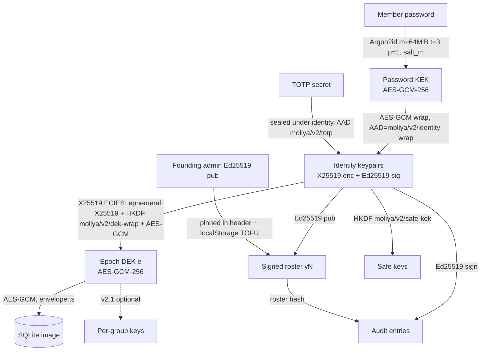

# Jaybi v2.0 — Per-person keys, rotation, signed roster and audit

Status: APPROVED for Alpha. The owner's answers to the open questions are recorded in section 11; this document is the source of truth for v2.0.
Target: v2.0.0 (current: v1.6.0)

## 1. Summary and decisions

v1.6 encrypts the whole vault under one data key (DEK) that every member can unwrap with their password. Roles, group scopes and the audit trail are enforced by app code, not by cryptography. A removed member who kept a copy of the DEK or of an old record can still read everything, and any member can rewrite the audit chain consistently.

v2.0 gives every person their own keypairs, makes the member list a signed document rooted in the founding admin's key, rotates the DEK whenever someone is removed, and signs every audit entry. Existing vaults are upgraded by one admin, who becomes the founder; everyone else is re-invited with a new code.

| # | Decision | Rationale |
|---|---|---|
| D1 | Per-person identity keys: X25519 (encryption) + Ed25519 (signatures) via Web Crypto. Suite id `J2-X25519-ED25519` in the header and every signed or wrapped object; `J2-P256` reserved. | Native, no JS crypto dependency. Feature-detected at setup; unsupported browsers are refused with a clear message instead of a silent downgrade. |
| D2 | Argon2id (m=64 MiB, t=3, p=1) for all v2 password wraps, lazy-loaded WASM in a Worker. PBKDF2-SHA256 600k stays read-only for v1 data. | Raises offline guessing cost by roughly two orders of magnitude on GPUs. The CSP already allows `'wasm-unsafe-eval'` and `worker-src 'self'`. |
| D3 | Trust root = founding admin's Ed25519 public key, pinned in the vault header and in each member's `localStorage` on first login (TOFU). The founder is whoever creates a new 2.0 vault, or the first admin to sign in to an existing vault on 2.0 and confirm the upgrade. The founder key is permanent. | No server, so trust must be anchored on the device. |
| D4 | Roster (members, roles, groups, public keys, epoch) is versioned, hash-chained and signed by an admin. | Makes role and membership changes tamper-evident and attributable. |
| D5 | Every audit entry signed by its actor, chained to the previous entry and to the roster version. Verified on unlock: roster or header failure blocks, audit failure warns. | Moves the audit log from “consistent” to “attributable”. |
| D6 | Removing a member creates a new epoch DEK, re-encrypts the DB, and ECIES-wraps the DEK to each remaining member (`moliya/v2/dek-wrap`). Demotion only issues a new signed roster version; rotation on demotion arrives with per-group keys in 2.1. | Real revocation for future data. With one DEK a demoted member still reads everything, so rotating on demotion would cost a re-encryption and an archive purge for no access change. Old backups stay readable to people who held them; this is stated in the UI. |
| D7 | Per-group keys deferred to optional v2.1. | Needs the single SQLite image split by group; large cost (see 9.4). |
| D8 | Re-invite everyone: the founder's device converts the vault to v2 with a fresh DEK, and only the founder keeps access. Every v1 password wrap and every open v1 code is destroyed at the upgrade; each other member gets a new invite code from an admin. No provisional keys, no countersigning. Import of backups from every released version is kept. | A v1 password cannot authenticate a new key (anyone holding the DEK sees every verifier), so lazy migration would need an admin countersign step anyway. Re-inviting is simpler and leaves no weak PBKDF2 wraps in v2 records. The ten-year read guarantee in `docs/data-format.md` still holds. |
| D9 | No renames: `moliya-vault`, `moliya-export`, IndexedDB `moliya`, `moliya.*` keys, `.moliya`, all `moliya/...` labels, `tools/moliya-decrypt.mjs`, the package name. New labels under `moliya/v2/...`. | Data-format compatibility rules. |
| D10 | Golden fixtures in `tests/fixtures/backups/v1..v4` and `MANIFEST.json` entries are never edited; a `v5/` fixture is added. | Fixtures prove old files still open. |

Out of scope for v2.0: servers or sync, hardware keys or passkeys as the identity root, per-group keys, multi-admin quorum.

## 2. Threat model

Assets: ledger contents, safe contents, TOTP secrets, the integrity of roles and of the audit trail. Jaybi has no server, so “the vault” is whatever file or IndexedDB record a person holds; attackers who have a copy can work offline forever.

| Adversary | v1.6 | v2.0 | Remaining gap |
|---|---|---|---|
| **Removed member** (had a password, now removed) | Their wrap is deleted, but the DEK is unchanged. If they kept a backup, an archive, or the raw DEK from devtools, they can decrypt every **future** copy of the vault they get hold of. | Removal triggers rotation: new epoch DEK, DB re-encrypted, no wrap for them. Future copies are unreadable to them. Their key is marked `removed` in the signed roster, so entries they sign afterwards fail verification. | Data up to their removal stays readable to them from any copy they already had. Cannot be fixed without a server. |
| **Curious Viewer with devtools** | Holds the full DEK in memory; can read every table, including groups outside their scope, and other people's metadata. Role is UI-only. | Same in v2.0: one DEK for the whole DB, so a Viewer can still read every group. They **cannot** forge roster changes or audit entries as someone else (no private key), and any edit they push is signed as them and fails the role check. | Read confidentiality between groups needs per-group keys (v2.1). Safes stay private (personal keys) in both versions. |
| **Malicious Manager** | Can edit the DB directly with the DEK: change roles in the `users` table, rewrite or truncate audit entries and recompute hashes. Detected only if another device cached the old head. | Cannot change roles or membership (only admins sign the roster; verification blocks). Cannot rewrite others' audit entries (signatures). Can still delete the tail of the audit or write bogus ledger rows signed as themselves. Tail deletion is caught by the cached head (`compareAuditHead`) on other devices and by the header's `auditHead`. | Ledger edits within their role are allowed by design; they are now attributable. |
| **Stolen device (locked)** | Offline guessing against PBKDF2-SHA256 600k: GPU rate ~10⁵-10⁶ guesses/s per card. Verifier hash is an equally cheap oracle. | Argon2id 64 MiB: ~10²-10³ guesses/s per GPU. No separate verifier hash. | Weak passwords still fall. Unlocked device: attacker has what the user has. |
| **Backup thief** | Same as stolen device, against every member's wrap; the weakest password in the household unlocks everything. | Same weakest-link property against Argon2id wraps of identity keys; any member's identity unwraps the epoch DEK. A v2 record holds no PBKDF2 wraps at all: the upgrade destroys every v1 wrap and starts epoch 1 with a fresh DEK. Backups after a rotation do not contain wraps for removed members. | Still weakest-link across members. Pre-upgrade backups and the local pre-upgrade archive keep their v1 wraps and open only those older copies. Documented; password strength meter stays. |
| **Member who is not re-invited after the upgrade** | n/a | Their v1 wrap is gone from every v2 record, and the v2 DEK is new, so their password opens nothing written after the upgrade. | They keep whatever pre-upgrade copies they already had. |
| **Compromised host or supply chain** (GitHub Pages account, npm dependency, CDN-free but build pipeline) | Malicious JS can exfiltrate the DEK and passwords on next unlock. | Same. Signed roster and pinned founder key do not help against code that runs inside the app. The Argon2 WASM adds one more vendored artefact to audit. | Fundamental for a web app. Mitigations: SRI on release zips, reproducible build, `SHA256SUMS`, offline install from the release zip, `tools/moliya-decrypt.mjs` for exit. |
| **Vault substitution** (attacker swaps the whole IndexedDB record or hands over a crafted backup) | Accepted if any wrap opens with the password (an attacker who knows a password can build a fresh vault). | Founder key pinned in `localStorage` on first login: a vault with a different founder is blocked. Roster version rollback is blocked against the locally cached version. | First login on a new device is TOFU; the UI shows the founder fingerprint for out-of-band comparison. |

## 3. Cryptographic design

### 3.1 Where v1.6 stands (grounding)

| Concern | v1.6 code | Notes |
|---|---|---|
| Password KDF | `src/crypto/crypto.service.ts`: `CURRENT_KDF` (PBKDF2-SHA256 600k), `LEGACY_KDF` (200k), `deriveKeyAndVerifier`, `deriveKey`, `kdfNeedsUpgrade` | One derivation yields both the wrapping key and the login verifier. |
| DEK wrap per user | `src/services/auth.service.ts` (`unwrapUserDek`, login at ~L146/L189/L279), `src/services/user.service.ts` (`WRAP_AAD_V1` = `moliya/wrap/v1\|userId`), `src/db/storage.ts` (`wrapsFromRecord`) | Every member's password-KEK wraps the **same** DEK. Removing a member deletes their wrap, but the DEK never changes, so anyone who copied the DEK or an old record keeps access. |
| Password verifier | `users.password_hash` = HKDF(`moliya/verifier/v1`) of the PBKDF2 bits (see `docs/data-format.md`, “Password verifier”) | An offline guessing oracle as cheap as the wrap. |
| Grants (one-time codes) | `src/crypto/access-crypto.ts` (`hkdfKey`, `GRANT_KEK_INFO`, `GRANT_VERIFIER_INFO`), `src/services/grant.service.ts` | HKDF from password bits, AES-GCM `wrapKey` with AAD. |
| Safes (personal keys) | `src/crypto/safe-crypto.ts` (`PERSONAL_KEY_USAGES`, AAD labels `moliya.pk`, `moliya.pk-recovery`, `moliya.safe-key`, `moliya.item`, `moliya.totp`), `src/services/safe.service.ts`, table `user_keys` | Already a per-person secret under the password; v2 re-roots it on the identity key. |
| DB payload | `src/db/envelope.ts` (`PAYLOAD_CIPHER` = AES-GCM-256, validation at ~L153) | Whole SQLite image encrypted under the DEK. |
| Storage | `src/db/storage.ts` (IndexedDB `moliya`, `readVault`/`writeVault`, archives with `MAX_ARCHIVES = 3`, `readAux`/`writeAux`) | Archives keep old records, so they hold old DEKs too. |
| Versions | `src/db/versions.ts`: `SCHEMA_VERSION = 4`, `RECORD_VERSION = 2`, `BACKUP_VERSION = 2` | v2.0 bumps all three (see 3.6). |
| Audit | `src/db/audit-chain.ts` (`GENESIS_HASH`, `auditHash`, `insertAuditLink`, `auditHead`, `compareAuditHead`, `verifyAuditChain`), `src/services/audit.service.ts` | Hash-chained, **unsigned**: anyone holding the DEK can rewrite the chain consistently. The head check catches truncation only against a locally cached head. |
| Export | `src/services/export/password.ts`, `src/services/export/sqlcipher.ts` (PBKDF2-SHA512) | Export formats stay; only the backup envelope changes. |
| CSP | `vite.config.ts` L20 `script-src 'self' 'wasm-unsafe-eval'`, L25 `worker-src 'self'`, L33-34 Trusted Types | Argon2 WASM in a Worker needs **no new CSP directive**; add a CSP test assertion so it stays that way. |

The core v1 weakness: authorization (roles, scopes) is enforced by app code over a DB that every member can fully decrypt. Roles are UI policy, not cryptography.

### 3.2 Key hierarchy



Key points:
- **Password KEK** only unwraps the member's identity private keys. It never touches the DEK directly in v2.
- **Identity keys** are per person, generated in the browser at setup or first v2 login, private parts non-extractable after unwrap (`extractable: false` on import).
- **Epoch DEK**: a fresh random AES-GCM-256 key per epoch. Epoch 1 starts at setup or at the founder upgrade (the v1 DEK is never reused); the epoch increments on removal (Beta). Each member gets one ECIES wrap per epoch.
- **Verifier**: the v1 PBKDF2 verifier is replaced by proof of possession: a successful AES-GCM unwrap of the identity blob is the password check. No separate verifier hash is stored for v2 members (removes an offline-guessing oracle that was cheaper than the wrap).

### 3.3 Suites

| Suite id | Agreement | Signature | KDF | AEAD | Status |
|---|---|---|---|---|---|
| `J2-X25519-ED25519` | X25519 | Ed25519 | HKDF-SHA256 | AES-GCM-256 | Default |
| `J2-P256` | ECDH P-256 | ECDSA P-256 SHA-256 | HKDF-SHA256 | AES-GCM-256 | Reserved, implemented only if feature detection data shows need |

Feature detection at setup and first v2 login: `crypto.subtle.generateKey({name:'X25519'}, ...)` and `{name:'Ed25519'}`, plus a sign/verify and deriveBits round trip. On failure: refuse with `v2.unsupportedBrowser` (no silent fallback in v2.0). The suite id is written in the vault header, every wrap, the roster, and every signed payload, so a later P-256 vault is unambiguous.

### 3.4 Labels (HKDF info / AAD)

All new labels live under `moliya/v2/`. Existing labels (`moliya/wrap/v1`, `moliya/verifier/v1`, `GRANT_KEK_INFO`, the `moliya.pk`/`moliya.safe-key`/`moliya.item`/`moliya.totp` safe AADs) are untouched and still used to read v1 data.

| Label | Use |
|---|---|
| `moliya/v2/identity-wrap` | AAD for AES-GCM wrap of identity private keys under the password KEK (AAD also binds `vaultId`, `memberId`, `suite`) |
| `moliya/v2/dek-wrap` | HKDF info for ECIES wrap of epoch DEK to a member |
| `moliya/v2/dek-wrap-aad` | AAD: `vaultId‖epoch‖memberId‖recipientPubHash‖suite` |
| `moliya/v2/roster` | Domain separation prefix for roster signatures |
| `moliya/v2/audit` | Domain separation prefix for audit entry signatures |
| `moliya/v2/header` | Domain separation prefix for the vault header signature |
| `moliya/v2/safe-kek` | HKDF info deriving the safe wrapping key from identity material |
| `moliya/v2/totp` | AAD sealing the TOTP secret |
| `moliya/v2/backup` | Reserved. The backup version 3 file is the record plus `format`/`exportedAt`, as today, so it needs no envelope AAD of its own (golden fixture directory `v5/`) |
| `moliya/v2/invite` | HKDF info prefix for invite keys (`moliya/v2/invite\|kek`, `moliya/v2/invite\|sig`) and AAD prefix for the invite DEK wrap |
| `moliya/v2/binding` | Domain separation prefix for key-binding signatures written when an invite is redeemed |

### 3.5 Formats

**Argon2id params** (stored per wrap so they can be raised later):
```json
{ "name": "Argon2id", "m": 65536, "t": 3, "p": 1, "len": 32, "v": 19 }
```
`KdfParams` in `crypto.service.ts` becomes a union: `{name:'PBKDF2',...} | {name:'Argon2id',...}`. PBKDF2 remains read-only for v1 wraps.

**Identity blob** (one per member, in the vault):
```json
{
  "v": 2, "suite": "J2-X25519-ED25519", "memberId": "m_…", "email": "…",
  "kdf": { "name": "Argon2id", "m": 65536, "t": 3, "p": 1, "len": 32, "v": 19 },
  "salt": "b64(16)", "iv": "b64(12)",
  "sealed": "b64(AES-GCM(pkcs8_x25519 ‖ pkcs8_ed25519))",
  "encPub": "b64(raw32)", "sigPub": "b64(raw32)"
}
```
`email` is the sign-in lookup key (as in v1 wraps). The AAD binds `vaultId`, `memberId`, `suite`, `encPub` and `sigPub`, so a blob cannot be moved to another member or paired with other public keys. The public keys in the blob are only a hint: verification always takes a member's keys from the signed roster.

**ECIES DEK wrap** (one per member per epoch):
```json
{ "v": 2, "suite": "J2-X25519-ED25519", "epoch": 4, "memberId": "m_…",
  "epk": "b64(raw32 ephemeral X25519 pub)", "salt": "b64(32)", "iv": "b64(12)",
  "ct": "b64(AES-GCM(raw DEK))" }
```
Derivation: `shared = X25519(eph_priv, member_encPub)`; `kek = HKDF-SHA256(ikm=shared, salt, info="moliya/v2/dek-wrap"‖suite)`; AEAD AAD = `moliya/v2/dek-wrap-aad` fields. Fresh ephemeral key per wrap.

### 3.6 Vault header v2

Stored where v1 keeps the vault record (`primary` in IndexedDB `moliya`, format id `moliya-vault`; names unchanged). Version bumps in `src/db/versions.ts`: `RECORD_VERSION` 2 → 3, `BACKUP_VERSION` 2 → 3, `SCHEMA_VERSION` 4 → 5 (new tables `roster_versions`, `key_bindings`, `audit_sigs`; `audit_logs` unchanged; `audit_sigs` stays empty until RC). Schema 5 is applied only when a vault becomes record 3 (setup or founder upgrade): a v1.6 vault opened in 2.0 and not upgraded stays record 2 / schema 4, so 1.6 can still open it. The backup file is the same JSON with `format` and `exportedAt`, as today. A 1.6 reader meets record/backup 3 and refuses with `FORMAT_TOO_NEW`, which is the intended behaviour. The golden-fixture directory for this is `tests/fixtures/backups/v5/` (directories there are named by schema version).

```json
{
  "format": "moliya-vault",
  "version": 3,
  "schemaVersion": 5,
  "suite": "J2-X25519-ED25519",
  "vaultId": "v_01J…",
  "createdAt": "2026-10-04T07:00:00Z",
  "founder": { "memberId": "m_…", "sigPub": "b64", "fingerprint": "hex(sha256(sigPub))[0:32]" },
  "epoch": 4,
  "roster": { "version": 12, "hash": "hex(sha256(canonical roster v12))" },
  "auditHead": { "seq": 3810, "hash": "hex" },
  "identities": { "m_…": { /* identity blob */ } },
  "dekWraps": { "m_…": { /* ECIES wrap, epoch 4 */ } },
  "grants": [ /* open invite codes: Argon2id params, salt, iv, DEK wrapped under the invite KEK (4.2) */ ],
  "payload": { "cipher": { "name": "AES-GCM", "length": 256 }, "iv": "b64", "epoch": 4 },
  "sig": { "by": "m_…", "alg": "Ed25519", "value": "b64" }
}
```
There is no `legacy` section: v2 records never carry v1 wraps (D8). `sig` covers `moliya/v2/header` ‖ canonical(header without `sig`, `identities`, `dekWraps`, `grants`). Wraps are self-authenticating via AEAD and pinned to keys in the signed roster, so they do not need to be inside the header signature (lets any member's client rewrap their own blob on password change without an admin). Every member who saves the vault re-signs the header (the payload IV and audit head change on each save), so the header signer only has to be an `active` member; every trust-relevant header field (founder, roster hash, epoch) is checked separately against the admin-signed roster.

### 3.7 Canonical signed payloads

Canonicalization: RFC 8785 JCS (sorted keys, no whitespace, UTF-8, integers only, no floats). Implement in `src/crypto/canonical.ts` (≈60 lines, no dependency). Signed bytes = `utf8(label) ‖ 0x00 ‖ JCS(payload)`.

**Roster document:**
```json
{
  "type": "roster", "suite": "J2-X25519-ED25519", "vaultId": "v_…",
  "version": 12, "prev": "hex(sha256(JCS(roster v11)))", "epoch": 4,
  "issuedAt": "2026-10-04T07:00:00Z", "issuedBy": "m_admin",
  "members": [
    { "id": "m_…", "email": "…", "role": "Admin|Manager|Viewer", "group": 3,
      "status": "active", "encPub": "b64", "sigPub": "b64" },
    { "id": "m_…", "email": "…", "role": "Viewer", "group": 3,
      "status": "invited", "inviteSigPub": "b64", "inviteExpiresAt": "…" },
    { "id": "m_…", "email": "…", "role": "Manager", "group": 3,
      "status": "removed", "encPub": "b64", "sigPub": "b64" }
  ],
  "sig": "b64(Ed25519 over moliya/v2/roster‖0‖JCS(doc without sig))"
}
```
Statuses are `active`, `invited` and `removed`; there is no provisional or unconfirmed state. Role names and the single `group` id match the `users` table, so the roster is a signed snapshot of who may sign in with which role: on every unlock the active members' email, role and group in the `users` table must equal the roster's, and an admin's save signs a new version whenever they differ. A member who leaves an `active` or `invited` state is carried forward as `removed` (with their old keys, so their earlier signatures stay attributable).

**Key binding** (written by an invitee when they redeem; folded into the roster by the next admin save):
```json
{ "type": "binding", "suite": "J2-X25519-ED25519", "vaultId": "v_…", "memberId": "m_…",
  "rosterVersion": 12, "inviteSigPub": "b64", "encPub": "b64", "sigPub": "b64", "at": "…",
  "inviteSig": "b64(Ed25519 by invite key over moliya/v2/binding‖0‖JCS(doc without sigs))",
  "memberSig": "b64(Ed25519 by the new sigPub over the same bytes)" }
```
**Audit entry:**
```json
{
  "type": "audit", "vaultId": "v_…", "seq": 3810,
  "prev": "hex(sha256(JCS(entry 3809)))", "rosterVersion": 12, "epoch": 4,
  "at": "…", "actor": "m_…", "action": "txn.create", "target": "…",
  "digest": "hex(sha256(change summary))",
  "sig": "b64(Ed25519 over moliya/v2/audit‖0‖JCS(entry without sig))"
}
```
The existing `src/db/audit-chain.ts` hash chain (`auditHash`, `insertAuditLink`) is extended, not replaced: v1 entries keep their unsigned hashes; the first v2 entry has `prev` = hash of the last v1 entry and records `"bridge": true`. Signatures live in a side table `audit_sigs(seq PRIMARY KEY, actor, roster_version, epoch, sig)` so `audit_logs` and `auditHash` stay byte-identical for v1 rows. `verifyAuditChain` gains a signature pass; `compareAuditHead` keeps its local rollback check.

### 3.8 Verification rules (run on every unlock, in this order)

1. **Pinned founder**: `header.founder.sigPub` must equal `localStorage['moliya.v2.founder.<vaultId>']` if present. First login: store it (TOFU) and show the fingerprint. Mismatch → **block** (`v2.verify.founderMismatch`).
2. **Header signature** verifies under the `sigPub` of a member who is `active` in the effective roster (latest version plus valid key bindings) → else **block**. The header's `founder` must equal roster v1's signer and `roster.hash` must equal the hash of the latest stored version.
3. **Roster chain**: v1 must be signed by the founder and list the founder as an active Admin; each vN+1 has `prev = hash(vN)` and is signed by a member who was an active Admin in vN; version numbers strictly increase with no gaps; the last-seen version (`moliya.v2.rosterSeen.<vaultId>`) must not exceed the current version (rollback check). Key bindings must name an `invited` member of the latest version and carry valid invite and member signatures. The active members in the `users` table must match the effective roster (email, role, group). Failure → **block**. Rollback → **block** with admin override text explaining risk.
4. **Self check**: my `memberId` is `active` in the effective roster and my `encPub`/`sigPub` match my unwrapped identity → else **block** (“you have been removed”).
5. **Epoch**: `header.epoch == roster.epoch == my dekWrap.epoch` → else **block**.
6. **Audit chain**: every v2 entry's `prev` links; `sig` verifies under the actor's `sigPub` from the roster version the entry names; the actor's role in that version permits the action; `rosterVersion` is non-decreasing. Broken link or bad signature → **warn** (red health row, writes still allowed for admins so they can investigate; viewers see read-only banner). The verified head is cached in `moliya.v2.auditSeen.<vaultId>`; a head going backwards → **warn**.
7. **Payload**: AES-GCM decrypt with epoch DEK (AEAD authenticates).

The roster and bindings live inside the encrypted DB, so in practice the payload is decrypted (step 7, authenticated by AEAD) before steps 2-4 run; nothing from the DB is used and no session is opened until every blocking step passes.

Verification cost is linear in audit length; cache “verified up to seq N + hash” locally and verify only the tail on subsequent unlocks (full re-verify available from Health check).

## 4. Flows

Notation: `IK_m` = member m's identity keys, `DEK_e` = epoch e data key, `R_n` = roster version n, `sign_m(x)` = Ed25519 under m's key with the right label.

### 4.1 Setup (new vault, founding admin)

(Behind the build flag until rc, see 9; without it setup still creates a 1.6-style vault that an admin can upgrade.)

1. Feature-detect X25519 and Ed25519 (3.3). Unsupported → refuse with `v2.unsupportedBrowser`.
2. Start the Argon2 Worker in the background while the person types (hides the WASM fetch).
3. Generate `IK_founder`, `DEK_1`, `vaultId`. Seal `IK_founder` under Argon2id(password) (`moliya/v2/identity-wrap`).
4. `R_1` = { founder as admin, epoch 1 }, signed by the founder. ECIES-wrap `DEK_1` to the founder.
5. Create the DB (schema 5), write audit entry 1 `VAULT_CREATED` signed by the founder, sign the header, `writeVault`.
6. Pin `moliya.v2.founder.<vaultId>` and `moliya.v2.rosterSeen.<vaultId>` in localStorage. Show the founder fingerprint (24 hex characters in groups of 4) with “write this down”.

### 4.2 Invite (admin adds a person)

No server, so the invitee cannot hand their public key to the admin in advance. Replace the v1 “admin sets a temporary password” step with an invite code:

1. Admin enters email, role, group. App generates a one-time invite code (same alphabet and length as current one-time codes in `grant.service.ts`). A new person's future member id is the grant id; a re-invite (existing person, v1 kind `RESET`) keeps their user id, so their records and history stay theirs.
2. `bits = Argon2id(code, salt)`; `kek = HKDF(bits, "moliya/v2/invite|kek")`; `seed = HKDF(bits, "moliya/v2/invite|sig")` → deterministic invite Ed25519 key (pkcs8 from seed). The `access_grants` row stores the invite `sigPub` as its code check value.
3. `DEK_e` is wrapped under the invite KEK with AAD `moliya/v2/invite|vaultId|grantId|kind|email|expiresAt|suite`, and stored in the header's `grants` (same fields as a v1 grant, Argon2id params). The admin's save signs `R_n+1` with the person as `status: "invited"`, `inviteSigPub`, `inviteExpiresAt`.
4. Invitee opens the vault with email + code, runs the full unlock verification (3.8; TOFU on a fresh device), picks a password, generates `IK_m`, seals it under Argon2id, ECIES-wraps `DEK_e` to themselves, ends the grant (deleting the invite wrap), and writes a **key binding** (3.7) signed by the invite key and by `IK_m`.
5. Verifiers accept the binding because the invite key is in an admin-signed roster. The next save by any admin folds it in (`status: "active"`, invite fields removed, binding row deleted). No admin review step is needed: the binding is authenticated by the code the admin handed out.

Expired or unused invites: the admin can revoke; the next admin save drops the `invited` entry. The invite wrap gives DEK access to anyone with the code, exactly like v1 one-time codes; same expiry rules (`expiresAt`). In a v2 vault the v1 “temporary password” option is not offered: the admin would know the new member's private keys.

### 4.3 Login (unlock)

1. Read the record; dispatch on `version` (1-2 → v1 path, 3 → v2 path).
2. v2: find the identity blob by email → Argon2id in the Worker → AES-GCM unwrap. Failure = wrong password (the timing-equalising dummy derivation in `auth.service.ts` L48-51 switches to Argon2id for v2 records).
3. Import private keys non-extractable. ECIES-unwrap `DEK_e`.
4. Run verification 3.8 (founder pin, header sig, roster chain, self, epoch, audit tail). Decrypt payload.
5. TOTP if enabled (4.7). Update `rosterSeen` and `auditSeen` only after everything passes.
6. v1 path (record 1-2) and the person is an admin: offer the founder upgrade (5.2). Non-admins keep using the v1 vault unchanged until an admin upgrades it.

### 4.4 Role change

- **Any role or group change** (promotion, demotion, group move): the admin's save signs `R_n+1` with the new role and group. Audit `USER_UPDATED` (existing action). No rotation in 2.0, including demotion (decision 11.3): with one DEK the demoted member still reads the whole DB either way, and every later audit entry is checked against the roster version it names, so the role boundary is already clear. Rotation on demotion or group removal arrives with per-group keys in 2.1, where it is a real access cut.
- Last admin cannot demote themselves (existing rule, kept). Demoting the founder is allowed; the founder key stays the trust root for roster v1 only.

### 4.5 Remove member + rotate

1. Admin confirms (dialog states plainly: “They keep anything they already copied, including old backups”).
2. Generate `DEK_e+1`. Sign `R_n+1` with the member `status: "removed"`, `epoch: e+1`. Open invites are listed in the dialog (step 4).
3. Re-encrypt the SQLite image under `DEK_e+1` (one AES-GCM pass, same cost as a normal save).
4. ECIES-wrap `DEK_e+1` to every remaining `active` member's `encPub`. Invite wraps are re-issued under the new DEK or revoked (admin chooses; default revoke).
5. Safes: unaffected (personal keys). The removed member's own safes become unreadable to everyone (as in v1, where safes are personal); the dialog says so.
6. Audit `MEMBER_REMOVED` + `EPOCH_ROTATED {from, to}` signed by the admin. Sign the header. Write in one IndexedDB transaction with an archive of the previous record (`reason: "upgrade"` → new reason `"rotation"`). **Archives from before the rotation are deleted** after the new record commits, otherwise the local archive still opens with the old DEK for the removed member's wrap. The admin is told to also delete old exported backups if that matters.
7. Other devices: on next unlock their copy (if it is an older record from a backup) has the old epoch; they continue on it until they import the newer backup. There is no sync; this is the existing single-device model.

Suspension (v1.6 “suspend”) follows the same path as removal in Beta. Until Beta (Alpha), removal and suspension mark the member `removed` in the next roster and delete their identity blob and DEK wrap, but do not rotate: this is the v1.6 level of protection for future data, stated in the Alpha release notes.

### 4.6 Password change

Only the member's own identity blob changes: Argon2id(new password, new salt) → re-seal `IK_m`. No roster change, no rotation, no admin needed. Audit `PASSWORD_CHANGED` signed by `IK_m`. Admin password **reset** (member forgot it) cannot recover `IK_m`: the admin removes and re-invites the person, which rotates. Signed audit history under the old key stays valid (old `sigPub` remains in old roster versions).

### 4.7 TOTP

The TOTP secret (today in `user_totp`, sealed with `moliya.totp`) is re-sealed under a key derived from `IK_m` (`moliya/v2/totp`). TOTP stays a second check inside the app, not a key factor: anyone with the file and the password can skip it offline, as today. The doc and UI keep saying so.

### 4.8 Safes

`user_keys.wrapped_key` (personal key under the PBKDF2 password key) gets a v2 wrap under `HKDF(IK_m X25519 self-agreement / sealed seed, "moliya/v2/safe-kek")`. Simplest correct option: store a random 32-byte `safeSeed` inside the sealed identity blob and derive the safe KEK from it. Recovery codes (`recovery_wrapped_key`) are unchanged. `enc_version` goes to 2 for re-wrapped rows; 1 stays readable.

### 4.9 Backup export / import

- **Export**: the backup file is the record plus `format`/`exportedAt` (unchanged rule). It contains identity blobs, current-epoch wraps, the roster chain (inside the DB) and signatures. A backup opens with any active member's password.
- **Import v1-v4** (record/backup 1-2): unchanged reader path; the imported vault is a v1.6-style vault and is offered the founder upgrade (5.2) at the next admin sign-in.
- **Import v5** (record/backup 3): full verification 3.8 before replacing. Founder mismatch with the pinned key → block, with an explicit “this is a different household” message and an admin-only override that re-pins (audited). Roster version lower than `rosterSeen` → warn “this backup is older than what this device has seen; people removed since then may be back”.

### 4.10 Restoring an old backup after a rotation

An admin restores a backup from epoch e after rotating to e+1:
- The backup opens with the old DEK and contains the removed member's wrap. The app detects `roster.version < rosterSeen` and shows a blocking choice: **cancel**, or **restore and re-apply removals**: the app replays the removals from the newer roster chain it has cached locally (`moliya.v2.rosterTail.<vaultId>`, the last 20 signed roster docs) and rotates again to e+2.
- If the device has no cached newer roster (fresh device), the restored vault is what it is; the warning says removed people may have access to this copy.
- Honest statement in the UI and docs: anyone who held an old backup can open that backup forever. Rotation protects data written after it.

## 5. Migration and compatibility

### 5.1 Reader matrix after v2.0

| Input | v2.0 reads? | v2.0 writes | Older apps on a v2.0 file |
|---|---|---|---|
| Record/backup 1 (1.0.0), schema 1 | Yes, unchanged path | Record 2, schema 4 until an admin upgrades; then record 3, schema 5 | n/a |
| Record/backup 2 (1.1.0-1.6.0), schemas 2-4, wraps with or without `aad` | Yes, unchanged path | Record 2, schema 4 until an admin upgrades (5.2); then record 3, schema 5 | 1.6 still opens a vault that 2.0 has not upgraded |
| Record/backup 3, schema 5 (v2.0) | Yes | Record 3 | 1.6 and earlier refuse with `FORMAT_TOO_NEW`; data untouched |

`tools/moliya-decrypt.mjs` gains a v2 path: Argon2id via Node's built-in `crypto.argon2` (Node 24.7 or later; older Node gets a clear message, and v1 files keep working on Node 22), X25519 ECIES unwrap via Node `crypto.webcrypto`. No WASM and no dependency, so the tool stays one self-contained file. `MOLIYA_PASSWORD` keeps working. The tool also gets `--verify` to run the header and roster checks (audit signatures join in RC).

### 5.2 Founder upgrade and re-invite (existing v1.6 vaults)

The owner chose to re-invite everyone rather than migrate members lazily (decision 11.2). There are no provisional keys, migration bindings or countersign steps.

1. **An admin signs in to a v1.6 vault on 2.0** through the unchanged v1 path (password unwraps the v1 DEK via `unwrapUserDek`). The app offers the upgrade on a one-time screen that says plainly: “You become the household's founder. Everyone else loses access until you give them a new invite code. Their old passwords will stop working.” The admin can postpone; the vault then stays a fully working v1.6 vault (record 2, schema 4) and the offer returns at the next admin sign-in. The first admin to confirm becomes the founder (decision 11.1). The admin re-enters their password to confirm (it seals the new identity).
2. **Upgrade transaction** (one `writeVault` with `expectedStamp`):
   - Feature-detect the suite (3.3); unsupported → refuse, nothing changes.
   - Archive the v1.6 record (`reason: "upgrade"`, existing mechanism in `storage.ts`); this is the rollback path.
   - Apply schema 5. Generate `IK_founder`, `vaultId` and a **fresh** `DEK_1`; the v1 DEK is never reused, so a v1 wrap kept in an old backup opens only that old copy.
   - In the DB: end every open v1 code (`access_grants`, reason `UPGRADE`), clear `password_hash` and `salt` for every user (no v1 verifiers remain), and write audit `VAULT_UPGRADED { fromRecord, toRecord, founderFingerprint, reinvite: N }`.
   - `R_1` = { founder as active Admin }, epoch 1, signed by the founder. Every other person stays in the `users` table (records, history, safes untouched) but is not in the roster and has no wrap: People shows them as “Needs a new invite”.
   - Seal the record (version 3) with only the founder's identity blob and DEK wrap and no grants: **every v1 password wrap is destroyed**. Sign the header, write, pin the founder and `rosterSeen` in localStorage, and show the founder fingerprint.
3. **Re-invite**: an admin issues each person a re-invite code (the v1 reset-code flow, now carrying the v2 key wrap, 4.2). The person keeps their user id, records and history. Their sign-in check (TOTP) is dropped as in a v1 reset, because it was sealed under their old password. Safes reopen if they pick the same password as before (safe keys have their own salt), otherwise with their recovery code, exactly as after a v1 reset.
4. **Other devices** holding the v1.6 record keep opening their own copy with v1 passwords until they import a 2.0 backup; that copy is the pre-upgrade data and nothing newer.

### 5.3 Compatibility rules (unchanged and new)

- No identifier in `docs/data-format.md` “Names” is renamed. New: `moliya/v2/*` labels, `moliya.v2.*` localStorage keys (`founder.<vaultId>`, `rosterSeen.<vaultId>`, `auditSeen.<vaultId>`, `rosterTail.<vaultId>`).
- Readers never drop a version (existing rule). PBKDF2 is kept for reads forever; v2.0 never writes PBKDF2 vault wraps into a record 3. (Until safes and TOTP are re-rooted on the identity in Beta, their per-person keys stay under PBKDF2 with their own salts, as in 1.6.)
- KDF bounds check (`docs/data-format.md` “anything outside the bounds is rejected”) gets Argon2id bounds: `m` 19 456-262 144 KiB, `t` 2-10, `p` 1-4, `len` 32. Stops a crafted file from forcing a 4 GiB allocation.
- `docs/data-format.md` gets a new row in the version matrix, a “Record version 3” section, the identity/wrap/roster/audit formats from section 3, and the Argon2id KDF row. `docs/schemas/` is unaffected (exports do not change).
- Rollback to 1.6 after the upgrade: refused by 1.6 (`FORMAT_TOO_NEW`). The pre-upgrade archive downloads as a v1.6 backup, so the devops rollback note says “restore the archive; changes since the upgrade are lost, and every member's old password works again on that copy”.

## 6. UI/UX, health-check rows, i18n keys

### 6.1 Screens and changes

| Where | Change |
|---|---|
| Setup | Browser capability check before the form; “Preparing secure key derivation…” only if the Worker is still loading at submit. After creation: founder fingerprint card with copy and “I wrote it down”. |
| Sign-in | Progress text during Argon2id (“Checking password…”, about 1 s). First sign-in on a device: “This household's admin key is `ABCD EFGH …`. Compare it with your admin.” with Continue / Cancel. |
| Upgrade offer (admin, v1.6 vault) | One-time screen: “Upgrade this household to Jaybi 2.0 keys. You become the founder. Everyone else needs a new invite code from you; their old passwords stop working.” Password field, “Upgrade now” and “Not now”. After the upgrade: founder fingerprint card, then People with a “Needs a new invite” filter. |
| People | New column: key status (Active, Invited, Needs a new invite, Removed) and fingerprint (expandable). In a v2 vault “Invite” replaces “Set temporary password”, and “Reset password” becomes “New invite code”. |
| Remove dialog (Beta) | Lists consequences: new key for everyone, their access to future data ends, old copies stay readable to them, their safes become unreadable. Requires typing the person's name. Demotion has no extra dialog in 2.0 (roster change only). |
| Backup | Restore of an older or foreign backup shows the 4.10 / 4.9 warnings. Note under Export: “Anyone who was a member when this backup was made can open it.” |
| Audit log (RC) | Each entry shows a signature badge: verified or failed. Filter “Show problems only”. |
| Blocking error screen | For founder mismatch, roster failure, removed member, epoch mismatch. Plain language, no stack trace, “Download this vault as a file” escape hatch for the admin. |

### 6.2 Health-check rows (`src/health/report.ts`, strings in `src/i18n/health/*.ts`)

| Row id | Green | Amber | Red |
|---|---|---|---|
| `keys.suite` | Suite supported | — | Browser lacks X25519/Ed25519 |
| `keys.founderPin` | Matches pinned fingerprint | First sign-in on this device (just pinned) | Mismatch |
| `keys.roster` | Chain valid, version N, signed by admins | Redeemed invites waiting for the next admin save; people who still need a new invite after the upgrade (count) | Broken chain, bad signature, rollback |
| `keys.epoch` | Epoch N, all active members wrapped | — | Header / roster / wrap epoch disagree |
| `keys.kdf` | All identity wraps Argon2id at current params | Params below current | Params out of bounds |
| `audit.signatures` (RC) | All v2 entries verified (tail since last check) | — | Bad signature, role violation, chain break, head went backwards |

On a v1.6 vault opened in 2.0 the keys rows show one amber row, `keys.upgrade` (“This household still uses 1.6 keys; an admin can upgrade it”).
| `backup.afterRotation` | Last backup is from the current epoch | No backup since last rotation | — |

“Full re-verify” button runs 3.8 over the whole audit, not just the tail.

### 6.3 i18n keys

New namespace `src/i18n/keys/{en,ru,uz-Latn,uz-Cyrl}.ts` (mirrors the existing `people/`, `health/`, `export/` split), plus additions to `health/*` and `people/*`. The existing key-parity test must cover the new namespace. Approximate count: 70 keys × 4 locales.

```text
v2.unsupportedBrowser            v2.unsupportedBrowserHelp
v2.kdf.preparing                 v2.kdf.checking
v2.founder.fingerprintTitle      v2.founder.fingerprintHelp       v2.founder.firstSeen
v2.upgrade.title                 v2.upgrade.body                  v2.upgrade.confirm    v2.upgrade.later
v2.upgrade.done                  v2.upgrade.reinviteHelp
v2.invite.create                 v2.invite.codeHelp               v2.invite.expired     v2.invite.revoke
v2.rotate.removeTitle            v2.rotate.removeBody
v2.rotate.oldCopiesWarning       v2.rotate.safesLost              v2.rotate.typeName
v2.verify.founderMismatch        v2.verify.rosterBroken           v2.verify.rosterRollback
v2.verify.removed                v2.verify.epochMismatch          v2.verify.auditWarn   v2.verify.downloadEscape
v2.backup.olderThanSeen          v2.backup.foreignFounder         v2.backup.reapplyRemovals
v2.backup.exportNote
v2.audit.sigVerified             v2.audit.sigFailed               v2.audit.problemsOnly
health.keys.*  (rows × green/amber/red/help)
people.keyStatus.{active,invited,needsInvite,removed}             people.fingerprint
```

Terminology for translators (glossary in `src/i18n/help/*`): “key” not “certificate”; “fingerprint” as a short code to compare out loud; avoid “encryption epoch” in UI text, say “new household key”.

## 7. Performance estimate

Estimates, to be replaced by measurements in the alpha (bench page under `tests/bench/`, not shipped). Reference devices: mid-range Android (Snapdragon 7-series class), 2020 laptop.

| Operation | Mid-range phone | Laptop | Notes |
|---|---|---|---|
| Argon2id m=64 MiB, t=3, p=1 (WASM, Worker) | 0.6-1.2 s | 0.2-0.4 s | Dominant unlock cost. Needs 64 MiB extra memory briefly; low-memory devices (≤2 GB) may fail allocation → message and suggest closing tabs. No automatic parameter lowering. |
| PBKDF2-SHA256 600k (v1 read path) | 0.4-0.8 s | 0.1-0.2 s | Only for legacy wraps. |
| Argon2 WASM download | ~25-40 KB gzip, once, cached by the service worker | | Lazy chunk; not in the first-load budget. Prefetched on the sign-in screen idle. |
| X25519 keygen / deriveBits, Ed25519 keygen | < 5 ms each | < 1 ms | Native Web Crypto. |
| Ed25519 verify | ~0.3-1 ms | ~0.1 ms | |
| Unlock verification (cached tail of ≤ 100 entries + roster ≤ 50 versions) | < 0.2 s | < 0.05 s | Cached head makes it constant per session. |
| Full audit re-verify, 10 000 entries | 5-10 s | 1-2 s | Health check only, in a Worker, with progress. |
| Sign one audit entry | ~1 ms | | Per write; negligible. |
| Rotation: re-encrypt a 20 MB SQLite image + N ECIES wraps | 0.3-0.8 s + N × 5 ms | 0.1-0.2 s | Same as a normal save plus wraps; N ≤ ~20 members. |
| Vault size growth | ~0.5 KB per member (identity + wrap), ~150 B per audit entry (signature row), ~1 KB per roster version | | 10 000 entries ≈ +1.5 MB before compression. |

First-load budget: at most +2 KB gzip over 1.6.0. `canonical.ts`, the v2 crypto, roster verification and unlock code load in a lazy chunk the first time a record 3 is opened, set up or upgraded to; Argon2 and the full re-verify run in lazy Worker chunks.

## 8. Testing plan

### 8.1 Unit (Vitest)

- `canonical.ts`: RFC 8785 test vectors (key order, Unicode escaping, integers, rejects floats and duplicate keys).
- Argon2id: RFC 9106 test vectors through the Worker and through `tools/moliya-decrypt.mjs`; bounds rejection (m, t, p out of range).
- ECIES wrap/unwrap round trip; AAD binding: changing `vaultId`, `epoch`, `memberId`, or `suite` makes unwrap fail.
- Identity seal/unseal; wrong password; AAD swap between two members fails.
- Roster: build, sign, verify chain; non-admin signer rejected; signer who was admin in vN but not vN-1 accepted only for vN+1; version gap and duplicate rejected; key binding accepted only for an `invited` member with both signatures; `users` table and roster mismatch rejected.
- Founder upgrade: the record 3 holds no v1 wrap and no v1 grant, every `password_hash`/`salt` is cleared, the DEK is new (the v1 DEK fails on the new body), and a non-founder's v1 password no longer opens it.
- Audit: sign/verify; role-permission matrix per action; bridge entry linking to the last v1 hash; `auditHash` output for v1 rows byte-identical to 1.6 (regression).
- Feature detection: mocked `crypto.subtle` without X25519/Ed25519 → refusal path.

### 8.2 Tamper tests (each must produce the stated outcome)

| Tamper | Expected |
|---|---|
| Flip one byte in any roster doc field | Block `rosterBroken` |
| Replace roster with an older valid version | Block `rosterRollback` (device has seen newer) |
| Remove the last roster version (and fix header) | Header sig fails → block |
| Add a member via a roster signed by a Manager | Block |
| Change founder `sigPub` in header and re-sign the whole chain with a new key | Block `founderMismatch` on a pinned device; TOFU prompt on a fresh one |
| Edit an audit entry's `action`/`target` | Warn `audit.signatures` red |
| Re-sign an edited entry with the actor's real key but claim another `actor` | Warn |
| Truncate the audit tail | Warn (head went backwards vs `auditSeen` and header `auditHead`) |
| Delete an `audit_sigs` row | Warn (unsigned v2 entry) |
| Audit entry by a removed member dated after removal (`rosterVersion` ≥ removal) | Warn |
| Swap two members' DEK wraps or identity blobs | Unwrap fails (AAD) |
| Wrap with epoch e-1 after rotation | Block `epochMismatch` |
| Argon2 params `m = 4 GiB` | Rejected as damaged before allocation |
| Removed member's old identity + new vault after rotation | Cannot unwrap `DEK_e+1` |
| v1.6 app opening a v2.0 record | `FORMAT_TOO_NEW`, record untouched |

### 8.3 Golden fixtures

- `tests/fixtures/backups/v1..v4/*` and their `SHA256SUMS` are **never edited**. Existing tests that open them with the same expected totals keep passing; add one test per old fixture that opens it in v2.0 **and** runs the founder upgrade, then checks totals again.
- Add `tests/fixtures/backups/v5/roster-household.moliya` + `.expected.json` + `SHA256SUMS`, and a new entry in `MANIFEST.json` (appended; existing entries untouched). Contents: founder + 2 active members + 1 removed member, epoch 2 (one rotation), roster v4, ~30 signed audit entries including a bridge entry, one safe, one TOTP member, Argon2id params at default. The expected file lists the roster fingerprints and audit head so the verifier is pinned to a frozen file.
- Fixture generation script under `tests/fixtures/backups/README.md` instructions, with fixed seeds where Web Crypto allows (identity keys imported from fixed pkcs8 bytes, not generated) so the file is reproducible.
- `tools/moliya-decrypt.mjs` test runs against v1-v5 fixtures.

### 8.4 End-to-end (Playwright)

Setup → invite → redeem → remove + rotate → removed member cannot sign in; v1.6 vault founder upgrade, then a re-invited member signs in and a member who was not re-invited cannot; roster tamper blocks unlock; export after rotation and import on a clean profile (TOFU prompt); restore an older backup after rotation (re-apply removals); unsupported browser (stub `crypto.subtle.generateKey` to reject X25519) shows the refusal screen; CSP test asserts `'wasm-unsafe-eval'` and `worker-src 'self'` are present and no `unsafe-eval` crept in; Trusted Types violation listener stays silent during Argon2 load.

### 8.5 i18n

Key-parity test extended to `src/i18n/keys/*`; snapshot of the health rows in all four locales.

## 9. Phased delivery

Effort in focused engineer-days for one developer who knows the codebase, including tests and docs. Each phase ships behind a build flag until rc; only rc becomes 2.0.0. The flag is `VITE_V2_KEYS=1` at build time: it decides whether **setup creates** v2 vaults and whether admins are **offered the upgrade**. Reading, unlocking, verifying and editing a record 3 never depends on the flag (readers never drop a version), so a v2 backup opens in any 2.0 build.

### 9.1 Alpha (2.0.0-alpha): identity keys, Argon2id, signed roster, founder upgrade

Scope:
- Suite `J2-X25519-ED25519` with feature detection and the `v2.unsupportedBrowser` refusal (3.3).
- Argon2id (m=64 MiB, t=3, p=1) in a lazy-loaded Worker behind a KDF abstraction (`KdfParams` union with bounds); PBKDF2-SHA256 600k stays the read path for v1 data.
- JCS canonicalization, identity blobs, ECIES DEK wrap (single epoch; no rotation yet).
- Record/backup 3 and schema 5 (`roster_versions`, `key_bindings`, `audit_sigs` created empty) with the header of 3.6 and its signature.
- Signed hash-chained roster derived from the `users` table at each admin save; founder pinned in the header and in localStorage (TOFU), `rosterSeen` rollback check.
- Setup of new v2 vaults (4.1) behind the build flag.
- Founder upgrade with re-invite (5.2): fresh DEK, every v1 wrap and open v1 code destroyed, “Needs a new invite” in People.
- Invites and re-invites carrying the v2 key wrap, key bindings folded by the next admin save (4.2). No temporary passwords in v2 vaults.
- Unlock verification 3.8 steps 1-5 and 7, blocking screen on founder, header or roster failure; `keys.*` Health check rows.
- Password change re-seals the identity (4.6). Removal and suspension update the roster and drop the member's wrap, without rotation (4.5, last paragraph).
- `tools/moliya-decrypt.mjs` v2 path and `--verify`.
- `src/i18n/keys/*` in all four locales as a lazy chunk, with key parity.
- `docs/data-format.md` (record 3), `SECURITY.md`, CHANGELOG `2.0.0-alpha.1`.

Not in Alpha: rotation (Beta), safe KEK and TOTP re-rooted on the identity (Beta; until then they stay under PBKDF2 with their own salts, as in 1.6), golden `v5/` fixture (Beta), signed audit entries (RC).

| Files | Change |
|---|---|
| `src/crypto/crypto.service.ts`, `src/crypto/kdf.ts` (new) | `KdfParams` union, Argon2id bounds, dispatch |
| `src/crypto/argon2.worker.ts`, `src/crypto/argon2.ts` (new) | Worker + lazy loader. The Argon2 WASM comes from the `hash-wasm` package (MIT, compiled from the reference C implementation, WASM embedded in the module so no extra fetch or CSP change), imported only by the Worker chunk |
| `src/crypto/identity.ts`, `src/crypto/ecies.ts`, `src/crypto/canonical.ts`, `src/crypto/suite.ts` (new) | Keys, wraps, JCS, feature detection |
| `src/crypto/roster.ts` (new), `src/services/v2/*` (new) | Build, sign, verify, bindings, upgrade, unlock, seal |
| `src/db/versions.ts`, `src/db/envelope.ts`, `src/db/storage.ts`, `src/db/migrations/*` | Versions 3/3/5, header fields, new tables |
| `src/services/auth.service.ts`, `user.service.ts`, `account.service.ts`, `grant.service.ts` | Dispatch to the v2 path for record 3 |
| `tools/moliya-decrypt.mjs` | Argon2id (Node `crypto.argon2`) + ECIES path, `--verify` |
| `src/i18n/keys/*`, `src/i18n/people/*`, UI in People, Setup, Sign-in | Strings and screens |
| `docs/data-format.md`, `SECURITY.md`, `CHANGELOG.md` | Record 3 spec, alpha notes |

Effort: **12-16 days** (less than the lazy-migration plan: no provisional bindings, no countersign UI, no legacy wraps in record 3). Risks: Argon2 memory failures on low-end phones (measure first; fallback is a clear error, not weaker params); Safari/Firefox X25519/Ed25519 gaps on older versions (feature detection decides support matrix, publish it); admins upgrading without realising every member needs a new code (the upgrade screen must be blunt, and “Not now” keeps 1.6 behaviour).

### 9.2 Beta (2.0.0-beta): rotation

Scope: epochs, remove + rotate (demotion does not rotate in 2.0), archive purge after rotation, invite re-issue/revoke, restore-after-rotation with roster tail replay, safe KEK and TOTP re-rooted on the identity (4.7, 4.8), `backup.afterRotation` row.

| Files | Change |
|---|---|
| `src/services/rotation.service.ts` (new) | Rotate transaction |
| `src/db/storage.ts` | Archive reason `rotation`, purge of pre-rotation archives |
| `src/services/user.service.ts`, People UI, remove dialog | Wiring + consequences dialog |
| `src/crypto/safe-crypto.ts`, `src/services/safe.service.ts`, `src/services/totp.service.ts` | Safe KEK and TOTP seal from identity, `enc_version` 2 |
| Backup import path, `src/health/report.ts` | Older-than-seen and foreign-founder handling, epoch rows |
| `tests/fixtures/backups/v5/*`, `MANIFEST.json` (append) | Golden v5 fixture (needs epochs, so lands here) |

Effort: **7-10 days** (no pending-member drop and no demotion rotation; safes/TOTP re-rooting moved in from Alpha). Risks: partial-write during rotation (must be one IndexedDB transaction; test with injected failures); multi-device users holding older epochs and being confused; admins expecting rotation to revoke old backups (copy must be blunt).

### 9.3 RC (2.0.0-rc → 2.0.0): signed audit

Scope: `audit_sigs` table, sign on every write, verification with role matrix and cached tail, bridge entry, audit badges and filter, full re-verify in a Worker, all tamper tests, all four locales complete, docs.

| Files | Change |
|---|---|
| `src/db/audit-chain.ts` | Signature pass in `verifyAuditChain`, tail cache |
| `src/services/audit.service.ts`, `src/services/audit-log.ts` | Sign at insert |
| `src/crypto/audit-sign.ts` (new), role-permission table | Per-action policy |
| Audit log UI, `src/components/audit-label.ts`, `src/health/report.ts` | Badges, rows |
| `tests/**` tamper suite, e2e | Section 8 |

Effort: **8-10 days**. Risks: role-permission matrix drifting from app checks (single source of truth table shared by UI and verifier); large audit logs on slow phones (tail cache, Worker); clock-free ordering (rely on `seq` and roster version, never on timestamps).

**Total v2.0: about 27-36 days**, plus 1 week of external review of section 3 before alpha code freeze is recommended.

### 9.4 Optional 2.1: per-group keys

What it buys: real read confidentiality between groups (a Viewer scoped to “Shop” cannot read “Household” even with devtools). Closes the largest remaining row in the threat model.

What it costs:
- The single encrypted SQLite image must split: one shared DB (groups, roster, categories, audit) under the epoch DEK, plus one encrypted SQLite image (or encrypted row payloads) per group under a group key. Cross-group reports, totals and transfers need to open several DBs and join in memory.
- Each group key is ECIES-wrapped to its members and rotated on scope changes; rotation count grows with groups × changes.
- New record version and schema, migration that moves rows by group, new golden fixture, every query in services that crosses groups reviewed. Export (`moliya-export`, SQLite export, ZIP) must respect the viewer's groups.
- Audit entries touching a group must not leak its contents to non-members (store a digest in the shared chain, details in the group DB).

Effort: **20-30 days**, with the highest regression risk of any phase (reports and totals). Recommendation: ship only if households actually use group scopes for privacy (measure via an opt-in survey or support requests), not for organisation.

## 10. Residual limits

What v2.0 still does not protect against, stated as plainly as the UI and docs will state it:

1. **Old copies are forever.** Anyone who held a backup, an archive, an exported file, or the raw DEK from devtools can read that copy for as long as they keep it. Rotation protects data written after it, nothing before.
2. **One DEK per epoch covers the whole ledger.** Every active member, Viewers included, can read every group with devtools. Roles and group scopes limit what people can *change* (signatures + role checks), not what they can *read*, until v2.1 per-group keys.
3. **Signatures detect, they do not prevent.** A member holding the DEK can still write arbitrary bytes into the vault. Verification flags it on the next unlock; it cannot stop a destructive write or recover lost data. Backups remain the recovery path.
4. **Tail deletion and rollback are caught only against a cached head.** A fresh device, a cleared browser, or a member who never saw the newer state has nothing to compare with. There is no server to hold the truth.
5. **First use is trust-on-first-use.** A substituted vault on a brand-new device is accepted unless the person compares the founder fingerprint out of band.
6. **Weakest password wins.** Any member's password opens the epoch DEK. Argon2id makes guessing about 100-1000× more expensive than PBKDF2 600k, but a short or reused password still falls. Pre-upgrade backups and archives keep their v1 PBKDF2 wraps (for the pre-upgrade data only), and until Beta each member's safe key and TOTP secret stay under PBKDF2 as in 1.6.
7. **TOTP is not a key factor.** Offline, with the file and a password, TOTP is skipped. It guards the running app only.
8. **The running code is trusted.** A compromised GitHub Pages deploy, dependency, or browser extension can read keys and passwords at unlock. Signed rosters and pinned keys do nothing against code inside the origin.
9. **Forgotten password = new identity.** An admin cannot reset a v2 password; they remove and re-invite, which rotates the DEK and orphans that person's safes (unless they kept a safe recovery code).
10. **Founder key loss is permanent.** If the founder forgets their password and no other admin exists, nobody can sign roster changes. The vault stays readable by the remaining members but membership is frozen. Mitigation: setup and the People page nudge for a second admin.
11. **Browser support floor.** Browsers without Web Crypto X25519/Ed25519 cannot set up or open a v2 vault until the reserved `J2-P256` suite is built. Older apps (1.6 and earlier) refuse v2 files.
12. **Metadata is visible to every member.** Roster names, roles, group ids and audit entries are inside the shared DB; signatures add attribution, not privacy.
13. **The upgrade is a flag day for members.** Until an admin re-invites them, members other than the founder cannot sign in to the upgraded vault. An admin who upgrades by mistake can restore the pre-upgrade archive (losing changes made since).

## 11. Decisions (resolved)

The owner answered the three questions that shaped the design. They are reflected in sections 1-10.

| # | Decision | Where it lands |
|---|---|---|
| 11.1 | **Founder / trust root.** The first admin to sign in to 2.0 (and confirm the upgrade) becomes the founder; their Ed25519 key is the permanent pinned trust root. No “claim household” step and no confirmation by other admins. | D3, 3.8 step 1, 5.2 step 1 |
| 11.2 | **Migration: re-invite everyone.** No lazy migration, no provisional keys, no countersigning. On upgrade the founder's device converts the vault to v2 (fresh DEK) and only the founder keeps access; every v1 password wrap and open v1 code is destroyed. Every other member gets a new invite code from an admin. | D8, 2, 3.6, 4.2, 4.3, 5.2, 6, 9.1 |
| 11.3 | **Demotion does not rotate.** Only removal rotates the vault key in 2.0; demotion only updates the signed roster. Rotation on demotion arrives with per-group keys in 2.1. | D6, 4.4, 9.2 |

Implementation choices made while applying these decisions (can be revisited without changing the format):
- The upgrade is **offered, not forced**: an admin may choose “Not now”, and the vault stays a working 1.6 vault (record 2, schema 4, still readable by 1.6). The first admin to confirm becomes the founder, which is the same person as “the first admin to sign in” whenever the first admin accepts.
- Redeemed invites are folded into the roster automatically by the next admin save; there is no review step, because the binding is authenticated by the invite code the admin issued.
- In Alpha the build flag `VITE_V2_KEYS=1` gates only setup of v2 vaults and the upgrade offer (9).

### Remaining minor open items

Defaults apply unless the owner says otherwise.

| # | Question | Default if no answer | Why it matters |
|---|---|---|---|
| Q4 | Should pre-rotation archives be purged automatically (default), or kept with a warning? | Purge | Kept archives still open with the old DEK on that device. |
| Q5 | Minimum browser matrix for 2.0 (X25519/Ed25519 in Web Crypto): is refusing older Safari/Firefox acceptable, or must `J2-P256` ship in 2.0? | Refuse; P-256 reserved | P-256 adds roughly 4-6 days and a second set of fixtures and tamper tests. |
| Q6 | Argon2id parameters: is 64 MiB acceptable on the lowest phones you support (2 GB RAM)? Measure in alpha; lower to 46 MiB / t=4 if allocation fails too often? | 64 MiB, no auto-lowering | Lowering later is safe (params are per wrap), but every lower setting is weaker for everyone using it. |
| Q7 | Should audit-signature failures **block** writes for non-admins instead of warning? | Warn; viewers read-only banner | Blocking can lock a household out over one bad entry; warning keeps the vault usable. |
| Q8 | Do you want a second-admin nudge to become a hard requirement (two admins before inviting others)? | Nudge only | Founder key loss freezes the roster permanently (section 10, item 10). |
| Q9 | External review: budget a one-week outside review of section 3 before alpha freeze? | Yes | Custom ECIES and signed-roster logic is where subtle mistakes live. |
| Q10 | Per-group keys (v2.1): do households actually use group scopes for privacy from each other, or just for organisation? | Defer until there is evidence | Decides whether the 20-30 day 2.1 phase is worth its regression risk. |
