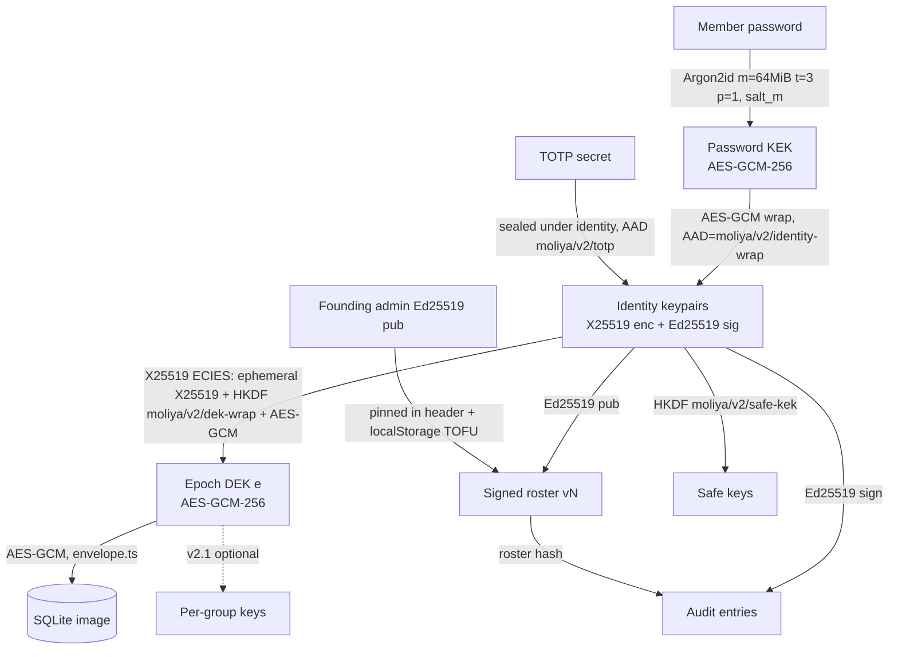

# Jaybi v2.0 — Per-person keys, rotation, signed roster and audit

Status: DRAFT (planning only, no code changes yet)
Target: v2.0.0 (current: v1.6.0)

## 1. Summary and decisions

v1.6 encrypts the whole vault under one data key (DEK) that every member can unwrap with their password. Roles, group scopes and the audit trail are enforced by app code, not by cryptography. A removed member who kept a copy of the DEK or of an old record can still read everything, and any member can rewrite the audit chain consistently.

v2.0 gives every person their own keypairs, makes the member list a signed document rooted in the founding admin's key, rotates the DEK whenever someone loses access, and signs every audit entry.

| # | Decision | Rationale |
|---|---|---|
| D1 | Per-person identity keys: X25519 (encryption) + Ed25519 (signatures) via Web Crypto. Suite id `J2-X25519-ED25519` in the header and every signed or wrapped object; `J2-P256` reserved. | Native, no JS crypto dependency. Feature-detected at setup; unsupported browsers are refused with a clear message instead of a silent downgrade. |
| D2 | Argon2id (m=64 MiB, t=3, p=1) for all v2 password wraps, lazy-loaded WASM in a Worker. PBKDF2-SHA256 600k stays read-only for v1 data. | Raises offline guessing cost by roughly two orders of magnitude on GPUs. The CSP already allows `'wasm-unsafe-eval'` and `worker-src 'self'`. |
| D3 | Trust root = founding admin's Ed25519 public key, pinned in the vault header and in each member's `localStorage` on first login (TOFU). | No server, so trust must be anchored on the device. |
| D4 | Roster (members, roles, groups, public keys, epoch) is versioned, hash-chained and signed by an admin. | Makes role and membership changes tamper-evident and attributable. |
| D5 | Every audit entry signed by its actor, chained to the previous entry and to the roster version. Verified on unlock: roster or header failure blocks, audit failure warns. | Moves the audit log from “consistent” to “attributable”. |
| D6 | Removing or demoting a member creates a new epoch DEK, re-encrypts the DB, and ECIES-wraps the DEK to each remaining member (`moliya/v2/dek-wrap`). | Real revocation for future data. Old backups stay readable to people who held them; this is stated in the UI. |
| D7 | Per-group keys deferred to optional v2.1. | Needs the single SQLite image split by group; large cost (see 9.4). |
| D8 | Lazy migration: each member re-enters their password once to create keys. Members who never return are dropped at the first rotation with an admin warning. Import of backups from every released version is kept. | No flag day; satisfies the ten-year read guarantee in `docs/data-format.md`. |
| D9 | No renames: `moliya-vault`, `moliya-export`, IndexedDB `moliya`, `moliya.*` keys, `.moliya`, all `moliya/...` labels, `tools/moliya-decrypt.mjs`, the package name. New labels under `moliya/v2/...`. | Data-format compatibility rules. |
| D10 | Golden fixtures in `tests/fixtures/backups/v1..v4` and `MANIFEST.json` entries are never edited; a `v5/` fixture is added. | Fixtures prove old files still open. |

Out of scope for v2.0: servers or sync, hardware keys or passkeys as the identity root, per-group keys, multi-admin quorum.

## 2. Threat model

Assets: ledger contents, safe contents, TOTP secrets, the integrity of roles and of the audit trail. Jaybi has no server, so “the vault” is whatever file or IndexedDB record a person holds; attackers who have a copy can work offline forever.

| Adversary | v1.6 | v2.0 | Remaining gap |
|---|---|---|---|
| **Removed member** (had a password, now removed) | Their wrap is deleted, but the DEK is unchanged. If they kept a backup, an archive, or the raw DEK from devtools, they can decrypt every **future** copy of the vault they get hold of. | Removal triggers rotation: new epoch DEK, DB re-encrypted, no wrap for them. Future copies are unreadable to them. Their key is marked `removed` in the signed roster, so entries they sign afterwards fail verification. | Data up to their removal stays readable to them from any copy they already had. Cannot be fixed without a server. |
| **Curious Viewer with devtools** | Holds the full DEK in memory; can read every table, including groups outside their scope, and other people's metadata. Role is UI-only. | Same in v2.0: one DEK for the whole DB, so a Viewer can still read every group. They **cannot** forge roster changes or audit entries as someone else (no private key), and any edit they push is signed as them and fails the role check. | Read confidentiality between groups needs per-group keys (v2.1). Safes stay private (personal keys) in both versions. |
| **Malicious Manager** | Can edit the DB directly with the DEK: change roles in the `users` table, rewrite or truncate audit entries and recompute hashes. Detected only if another device cached the old head. | Cannot change roles or membership (only admins sign the roster; verification blocks). Cannot rewrite others' audit entries (signatures). Can still delete the tail of the audit or write bogus ledger rows signed as themselves. Tail deletion is caught by the cached head (`compareAuditHead`) on other devices and by the header's `auditHead`. | Ledger edits within their role are allowed by design; they are now attributable. |
| **Stolen device (locked)** | Offline guessing against PBKDF2-SHA256 600k: GPU rate ~10⁵-10⁶ guesses/s per card. Verifier hash is an equally cheap oracle. | Argon2id 64 MiB: ~10²-10³ guesses/s per GPU. No separate verifier hash. | Weak passwords still fall. Unlocked device: attacker has what the user has. |
| **Backup thief** | Same as stolen device, against every member's wrap; the weakest password in the household unlocks everything. | Same weakest-link property against Argon2id wraps of identity keys; any member's identity unwraps the epoch DEK. Backups after a rotation do not contain wraps for removed members. | Still weakest-link across members. Documented; password strength meter stays. |
| **Compromised host or supply chain** (GitHub Pages account, npm dependency, CDN-free but build pipeline) | Malicious JS can exfiltrate the DEK and passwords on next unlock. | Same. Signed roster and pinned founder key do not help against code that runs inside the app. The Argon2 WASM adds one more vendored artefact to audit. | Fundamental for a web app. Mitigations: SRI on release zips, reproducible build, `SHA256SUMS`, offline install from the release zip, `tools/moliya-decrypt.mjs` for exit. |
| **Vault substitution** (attacker swaps the whole IndexedDB record or hands over a crafted backup) | Accepted if any wrap opens with the password (an attacker who knows a password can build a fresh vault). | Founder key pinned in `localStorage` on first login: a vault with a different founder is blocked. Roster version rollback is blocked against the locally cached version. | First login on a new device is TOFU; the UI shows the founder fingerprint for out-of-band comparison. |

## 3. Cryptographic design

### 3.1 Where v1.6 stands (grounding)

| Concern | v1.6 code | Notes |
|---|---|---|
| Password KDF | `src/crypto/crypto.service.ts`: `CURRENT_KDF` (PBKDF2-SHA256 600k), `LEGACY_KDF` (200k), `deriveKeyAndVerifier`, `deriveKey`, `kdfNeedsUpgrade` | One derivation yields both the wrapping key and the login verifier. |
| DEK wrap per user | `src/services/auth.service.ts` (`unwrapUserDek`, login at ~L146/L189/L279), `src/services/user.service.ts` (`WRAP_AAD_V1` = `moliya/wrap/v1\|userId`), `src/db/storage.ts` (`wrapsFromRecord`) | Every member's password-KEK wraps the **same** DEK. Removing a member deletes their wrap, but the DEK never changes, so anyone who copied the DEK or an old record keeps access. |
| Password verifier | `users.password_hash` = HKDF(`moliya/verifier/v1`) of the PBKDF2 bits (see `docs/data-format.md`, “Password verifier”) | An offline guessing oracle as cheap as the wrap. |
| Grants (one-time codes) | `src/crypto/access-crypto.ts` (`hkdfKey`, `GRANT_KEK_INFO`, `GRANT_VERIFIER_INFO`), `src/services/grant.service.ts` | HKDF from password bits, AES-GCM `wrapKey` with AAD. |
| Safes (personal keys) | `src/crypto/safe-crypto.ts` (`PERSONAL_KEY_USAGES`, AAD labels `moliya.pk`, `moliya.pk-recovery`, `moliya.safe-key`, `moliya.item`, `moliya.totp`), `src/services/safe.service.ts`, table `user_keys` | Already a per-person secret under the password; v2 re-roots it on the identity key. |
| DB payload | `src/db/envelope.ts` (`PAYLOAD_CIPHER` = AES-GCM-256, validation at ~L153) | Whole SQLite image encrypted under the DEK. |
| Storage | `src/db/storage.ts` (IndexedDB `moliya`, `readVault`/`writeVault`, archives with `MAX_ARCHIVES = 3`, `readAux`/`writeAux`) | Archives keep old records, so they hold old DEKs too. |
| Versions | `src/db/versions.ts`: `SCHEMA_VERSION = 4`, `RECORD_VERSION = 2`, `BACKUP_VERSION = 2` | v2.0 bumps all three (see 3.6). |
| Audit | `src/db/audit-chain.ts` (`GENESIS_HASH`, `auditHash`, `insertAuditLink`, `auditHead`, `compareAuditHead`, `verifyAuditChain`), `src/services/audit.service.ts` | Hash-chained, **unsigned**: anyone holding the DEK can rewrite the chain consistently. The head check catches truncation only against a locally cached head. |
| Export | `src/services/export/password.ts`, `src/services/export/sqlcipher.ts` (PBKDF2-SHA512) | Export formats stay; only the backup envelope changes. |
| CSP | `vite.config.ts` L20 `script-src 'self' 'wasm-unsafe-eval'`, L25 `worker-src 'self'`, L33-34 Trusted Types | Argon2 WASM in a Worker needs **no new CSP directive**; add a CSP test assertion so it stays that way. |

The core v1 weakness: authorization (roles, scopes) is enforced by app code over a DB that every member can fully decrypt. Roles are UI policy, not cryptography.

### 3.2 Key hierarchy



Key points:
- **Password KEK** only unwraps the member's identity private keys. It never touches the DEK directly in v2.
- **Identity keys** are per person, generated in the browser at setup or first v2 login, private parts non-extractable after unwrap (`extractable: false` on import).
- **Epoch DEK**: a fresh random AES-GCM-256 key per epoch. Epoch increments on removal or demotion. Each member gets one ECIES wrap per epoch.
- **Verifier**: the v1 PBKDF2 verifier is replaced by proof of possession: a successful AES-GCM unwrap of the identity blob is the password check. No separate verifier hash is stored for v2 members (removes an offline-guessing oracle that was cheaper than the wrap).

### 3.3 Suites

| Suite id | Agreement | Signature | KDF | AEAD | Status |
|---|---|---|---|---|---|
| `J2-X25519-ED25519` | X25519 | Ed25519 | HKDF-SHA256 | AES-GCM-256 | Default |
| `J2-P256` | ECDH P-256 | ECDSA P-256 SHA-256 | HKDF-SHA256 | AES-GCM-256 | Reserved, implemented only if feature detection data shows need |

Feature detection at setup and first v2 login: `crypto.subtle.generateKey({name:'X25519'}, ...)` and `{name:'Ed25519'}`, plus a sign/verify and deriveBits round trip. On failure: refuse with `v2.unsupportedBrowser` (no silent fallback in v2.0). The suite id is written in the vault header, every wrap, the roster, and every signed payload, so a later P-256 vault is unambiguous.

### 3.4 Labels (HKDF info / AAD)

All new labels live under `moliya/v2/`. Existing labels (`moliya/wrap/v1`, `moliya/verifier/v1`, `GRANT_KEK_INFO`, the `moliya.pk`/`moliya.safe-key`/`moliya.item`/`moliya.totp` safe AADs) are untouched and still used to read v1 data.

| Label | Use |
|---|---|
| `moliya/v2/identity-wrap` | AAD for AES-GCM wrap of identity private keys under the password KEK (AAD also binds `vaultId`, `memberId`, `suite`) |
| `moliya/v2/dek-wrap` | HKDF info for ECIES wrap of epoch DEK to a member |
| `moliya/v2/dek-wrap-aad` | AAD: `vaultId‖epoch‖memberId‖recipientPubHash‖suite` |
| `moliya/v2/roster` | Domain separation prefix for roster signatures |
| `moliya/v2/audit` | Domain separation prefix for audit entry signatures |
| `moliya/v2/header` | Domain separation prefix for the vault header signature |
| `moliya/v2/safe-kek` | HKDF info deriving the safe wrapping key from identity material |
| `moliya/v2/totp` | AAD sealing the TOTP secret |
| `moliya/v2/backup` | AAD for the v5 backup envelope |
| `moliya/v2/invite` | AAD/HKDF info for invite bundles |

### 3.5 Formats

**Argon2id params** (stored per wrap so they can be raised later):
```json
{ "name": "Argon2id", "m": 65536, "t": 3, "p": 1, "len": 32, "v": 19 }
```
`KdfParams` in `crypto.service.ts` becomes a union: `{name:'PBKDF2',...} | {name:'Argon2id',...}`. PBKDF2 remains read-only for v1 wraps.

**Identity blob** (one per member, in the vault):
```json
{
  "v": 2, "suite": "J2-X25519-ED25519", "memberId": "m_…",
  "kdf": { "name": "Argon2id", "m": 65536, "t": 3, "p": 1, "len": 32, "v": 19 },
  "salt": "b64(16)", "iv": "b64(12)",
  "sealed": "b64(AES-GCM(pkcs8_x25519 ‖ pkcs8_ed25519))",
  "encPub": "b64(raw32)", "sigPub": "b64(raw32)"
}
```

**ECIES DEK wrap** (one per member per epoch):
```json
{ "v": 2, "suite": "J2-X25519-ED25519", "epoch": 4, "memberId": "m_…",
  "epk": "b64(raw32 ephemeral X25519 pub)", "salt": "b64(32)", "iv": "b64(12)",
  "ct": "b64(AES-GCM(raw DEK))" }
```
Derivation: `shared = X25519(eph_priv, member_encPub)`; `kek = HKDF-SHA256(ikm=shared, salt, info="moliya/v2/dek-wrap"‖suite)`; AEAD AAD = `moliya/v2/dek-wrap-aad` fields. Fresh ephemeral key per wrap.

### 3.6 Vault header v2

Stored where v1 keeps the vault record (`primary` in IndexedDB `moliya`, format id `moliya-vault`; names unchanged). Version bumps in `src/db/versions.ts`: `RECORD_VERSION` 2 → 3, `BACKUP_VERSION` 2 → 3, `SCHEMA_VERSION` 4 → 5 (new tables `roster_versions`, `audit_sigs`; `audit_logs` unchanged). The backup file is the same JSON with `format` and `exportedAt`, as today. A 1.6 reader meets record/backup 3 and refuses with `FORMAT_TOO_NEW`, which is the intended behaviour. The golden-fixture directory for this is `tests/fixtures/backups/v5/` (directories there are named by schema version).

```json
{
  "format": "moliya-vault",
  "version": 3,
  "schemaVersion": 5,
  "suite": "J2-X25519-ED25519",
  "vaultId": "v_01J…",
  "createdAt": "2026-10-04T07:00:00Z",
  "founder": { "memberId": "m_…", "sigPub": "b64", "fingerprint": "hex(sha256(sigPub))[0:32]" },
  "epoch": 4,
  "roster": { "version": 12, "hash": "hex(sha256(canonical roster v12))" },
  "auditHead": { "seq": 3810, "hash": "hex" },
  "identities": { "m_…": { /* identity blob */ } },
  "dekWraps": { "m_…": { /* ECIES wrap, epoch 4 */ } },
  "payload": { "cipher": { "name": "AES-GCM", "length": 256 }, "iv": "b64", "epoch": 4 },
  "legacy": { "v1Wraps": { /* untouched v1 PBKDF2 wraps of members not yet migrated, epoch 0 only */ } },
  "sig": { "by": "m_…", "alg": "Ed25519", "value": "b64" }
}
```
`sig` covers `moliya/v2/header` ‖ canonical(header without `sig`, `identities`, `dekWraps`, `legacy`). Wraps are self-authenticating via AEAD and pinned to keys in the signed roster, so they do not need to be inside the header signature (lets any member's client rewrap their own blob on password change without an admin).

### 3.7 Canonical signed payloads

Canonicalization: RFC 8785 JCS (sorted keys, no whitespace, UTF-8, integers only, no floats). Implement in `src/crypto/canonical.ts` (≈60 lines, no dependency). Signed bytes = `utf8(label) ‖ 0x00 ‖ JCS(payload)`.

**Roster document:**
```json
{
  "type": "roster", "suite": "J2-X25519-ED25519", "vaultId": "v_…",
  "version": 12, "prev": "hex(sha256(JCS(roster v11)))", "epoch": 4,
  "issuedAt": "2026-10-04T07:00:00Z", "issuedBy": "m_admin",
  "members": [
    { "id": "m_…", "name": "…", "role": "admin|manager|viewer",
      "groups": ["g_…"], "encPub": "b64", "sigPub": "b64",
      "status": "active|pending-v2|removed", "since": 3 }
  ],
  "sig": "b64(Ed25519 over moliya/v2/roster‖0‖JCS(doc without sig))"
}
```
**Audit entry:**
```json
{
  "type": "audit", "vaultId": "v_…", "seq": 3810,
  "prev": "hex(sha256(JCS(entry 3809)))", "rosterVersion": 12, "epoch": 4,
  "at": "…", "actor": "m_…", "action": "txn.create", "target": "…",
  "digest": "hex(sha256(change summary))",
  "sig": "b64(Ed25519 over moliya/v2/audit‖0‖JCS(entry without sig))"
}
```
The existing `src/db/audit-chain.ts` hash chain (`auditHash`, `insertAuditLink`) is extended, not replaced: v1 entries keep their unsigned hashes; the first v2 entry has `prev` = hash of the last v1 entry and records `"bridge": true`. Signatures live in a side table `audit_sigs(seq PRIMARY KEY, actor, roster_version, epoch, sig)` so `audit_logs` and `auditHash` stay byte-identical for v1 rows. `verifyAuditChain` gains a signature pass; `compareAuditHead` keeps its local rollback check.

### 3.8 Verification rules (run on every unlock, in this order)

1. **Pinned founder**: `header.founder.sigPub` must equal `localStorage['moliya.v2.founder.<vaultId>']` if present. First login: store it (TOFU) and show the fingerprint. Mismatch → **block** (`v2.verify.founderMismatch`).
2. **Header signature** verifies under a key that is an admin in the roster version it names → else **block**.
3. **Roster chain**: v1 must be signed by the founder; each vN+1 has `prev = hash(vN)` and is signed by a member who was `admin` in vN; version numbers strictly increase; the last-seen version (`moliya.v2.rosterSeen.<vaultId>`) must not exceed the current version (rollback check). Failure → **block**. Rollback → **block** with admin override text explaining risk.
4. **Self check**: my `memberId` is `active` in the latest roster and my `encPub`/`sigPub` match my unwrapped identity → else **block** (“you have been removed”).
5. **Epoch**: `header.epoch == roster.epoch == my dekWrap.epoch` → else **block**.
6. **Audit chain**: every v2 entry's `prev` links; `sig` verifies under the actor's `sigPub` from the roster version the entry names; the actor's role in that version permits the action; `rosterVersion` is non-decreasing. Broken link or bad signature → **warn** (red health row, writes still allowed for admins so they can investigate; viewers see read-only banner). The verified head is cached in `moliya.v2.auditSeen.<vaultId>`; a head going backwards → **warn**.
7. **Payload**: AES-GCM decrypt with epoch DEK (AEAD authenticates).

Verification cost is linear in audit length; cache “verified up to seq N + hash” locally and verify only the tail on subsequent unlocks (full re-verify available from Health check).

## 4. Flows

Notation: `IK_m` = member m's identity keys, `DEK_e` = epoch e data key, `R_n` = roster version n, `sign_m(x)` = Ed25519 under m's key with the right label.

### 4.1 Setup (new vault, founding admin)

1. Feature-detect X25519 and Ed25519 (3.3). Unsupported → refuse with `v2.unsupportedBrowser`.
2. Start the Argon2 Worker in the background while the person types (hides the WASM fetch).
3. Generate `IK_founder`, `DEK_1`, `vaultId`. Seal `IK_founder` under Argon2id(password) (`moliya/v2/identity-wrap`).
4. `R_1` = { founder as admin, epoch 1 }, signed by the founder. ECIES-wrap `DEK_1` to the founder.
5. Create the DB (schema 5), write audit entry 1 `VAULT_CREATED` signed by the founder, sign the header, `writeVault`.
6. Pin `moliya.v2.founder.<vaultId>` and `moliya.v2.rosterSeen.<vaultId>` in localStorage. Show the founder fingerprint (24 hex characters in groups of 4) with “write this down”.

### 4.2 Invite (admin adds a person)

No server, so the invitee cannot hand their public key to the admin in advance. Replace the v1 “admin sets a temporary password” step with an invite code:

1. Admin enters name, role, groups. App generates a one-time invite code (same alphabet and length as current one-time codes in `grant.service.ts`).
2. `seed = HKDF(Argon2id(code, salt), "moliya/v2/invite")` → deterministic invite Ed25519 key (pkcs8 from seed) and invite KEK.
3. Admin signs `R_n+1` with the person as `status: "invited"`, `inviteSigPub`, `inviteExpiresAt`. `DEK_e` is wrapped under the invite KEK (stored like a v1 grant, in `grants`, with `kind: "invite"`).
4. Invitee opens the vault with email + code, picks a password, generates `IK_m`, re-wraps `DEK_e` to themselves by ECIES, deletes the invite wrap, and writes a **key binding** `{ memberId, encPub, sigPub, rosterVersion }` signed by the invite key and by `IK_m`.
5. Verifiers accept the binding because the invite key is in an admin-signed roster. The next roster change by any admin folds it in (`status: "active"`, invite fields removed).

Expired or unused invites: the admin can revoke (new roster version). The invite wrap gives DEK access to anyone with the code, exactly like v1 one-time codes; same expiry rules (`expiresAt`).

### 4.3 Login (unlock)

1. Read the record; dispatch on `version` (2 → v1 path, 3 → v2 path).
2. v2: find the identity blob by email → Argon2id in the Worker → AES-GCM unwrap. Failure = wrong password (the timing-equalising dummy derivation in `auth.service.ts` L48-51 switches to Argon2id).
3. Import private keys non-extractable. ECIES-unwrap `DEK_e`.
4. Run verification 3.8 (founder pin, header sig, roster chain, self, epoch, audit tail). Decrypt payload.
5. TOTP if enabled (4.7). Update `rosterSeen` and `auditSeen` only after everything passes.
6. If the record is v2 (v1.6 format) or the member is `pending-v2`: run lazy migration (5.2).

### 4.4 Role change

- **Promotion** (viewer → manager, manager → admin) and group additions: admin signs `R_n+1`. No rotation (access only grows). Audit `ROLE_CHANGED`.
- **Demotion or group removal**: `R_n+1` with the new role **and** a rotation (4.5 steps 2-6, without removing anyone). The demoted member gets a wrap of the new DEK, so in v2.0 they still read the whole DB; what the rotation buys is a clean epoch boundary: every audit entry after it is checked against the new role, and the same code path becomes the real access cut once v2.1 per-group keys exist. The dialog says this plainly. (Cost is one re-encryption, see section 7. Whether to skip it until v2.1 is open question Q3.)
- Last admin cannot demote themselves (existing rule, kept). Demoting the founder is allowed; the founder key stays the trust root for roster v1 only.

### 4.5 Remove member + rotate

1. Admin confirms (dialog states plainly: “They keep anything they already copied, including old backups”).
2. Generate `DEK_e+1`. Sign `R_n+1` with the member `status: "removed"`, `epoch: e+1`. Pending-v2 members who have not migrated are also removed here (warning lists them first, 5.3).
3. Re-encrypt the SQLite image under `DEK_e+1` (one AES-GCM pass, same cost as a normal save).
4. ECIES-wrap `DEK_e+1` to every remaining `active` member's `encPub`. Invite wraps are re-issued under the new DEK or revoked (admin chooses; default revoke).
5. Safes: unaffected (personal keys). The removed member's own safes become unreadable to everyone (as in v1, where safes are personal); the dialog says so.
6. Audit `MEMBER_REMOVED` + `EPOCH_ROTATED {from, to}` signed by the admin. Sign the header. Write in one IndexedDB transaction with an archive of the previous record (`reason: "upgrade"` → new reason `"rotation"`). **Archives from before the rotation are deleted** after the new record commits, otherwise the local archive still opens with the old DEK for the removed member's wrap. The admin is told to also delete old exported backups if that matters.
7. Other devices: on next unlock their copy (if it is an older record from a backup) has the old epoch; they continue on it until they import the newer backup. There is no sync; this is the existing single-device model.

### 4.6 Password change

Only the member's own identity blob changes: Argon2id(new password, new salt) → re-seal `IK_m`. No roster change, no rotation, no admin needed. Audit `PASSWORD_CHANGED` signed by `IK_m`. Admin password **reset** (member forgot it) cannot recover `IK_m`: the admin removes and re-invites the person, which rotates. Signed audit history under the old key stays valid (old `sigPub` remains in old roster versions).

### 4.7 TOTP

The TOTP secret (today in `user_totp`, sealed with `moliya.totp`) is re-sealed under a key derived from `IK_m` (`moliya/v2/totp`). TOTP stays a second check inside the app, not a key factor: anyone with the file and the password can skip it offline, as today. The doc and UI keep saying so.

### 4.8 Safes

`user_keys.wrapped_key` (personal key under the PBKDF2 password key) gets a v2 wrap under `HKDF(IK_m X25519 self-agreement / sealed seed, "moliya/v2/safe-kek")`. Simplest correct option: store a random 32-byte `safeSeed` inside the sealed identity blob and derive the safe KEK from it. Recovery codes (`recovery_wrapped_key`) are unchanged. `enc_version` goes to 2 for re-wrapped rows; 1 stays readable.

### 4.9 Backup export / import

- **Export**: the backup file is the record plus `format`/`exportedAt` (unchanged rule). It contains identity blobs, current-epoch wraps, the roster chain (inside the DB) and signatures. A backup opens with any active member's password.
- **Import v1-v4** (record/backup 1-2): unchanged reader path; the imported vault is a v1.6-style vault and goes through lazy migration on the next login.
- **Import v5** (record/backup 3): full verification 3.8 before replacing. Founder mismatch with the pinned key → block, with an explicit “this is a different household” message and an admin-only override that re-pins (audited). Roster version lower than `rosterSeen` → warn “this backup is older than what this device has seen; people removed since then may be back”.

### 4.10 Restoring an old backup after a rotation

An admin restores a backup from epoch e after rotating to e+1:
- The backup opens with the old DEK and contains the removed member's wrap. The app detects `roster.version < rosterSeen` and shows a blocking choice: **cancel**, or **restore and re-apply removals**: the app replays the removals from the newer roster chain it has cached locally (`moliya.v2.rosterTail.<vaultId>`, the last 20 signed roster docs) and rotates again to e+2.
- If the device has no cached newer roster (fresh device), the restored vault is what it is; the warning says removed people may have access to this copy.
- Honest statement in the UI and docs: anyone who held an old backup can open that backup forever. Rotation protects data written after it.

## 5. Migration and compatibility

### 5.1 Reader matrix after v2.0

| Input | v2.0 reads? | v2.0 writes | Older apps on a v2.0 file |
|---|---|---|---|
| Record/backup 1 (1.0.0), schema 1 | Yes, unchanged path | Record 3, schema 5 after migration | n/a |
| Record/backup 2 (1.1.0-1.6.0), schemas 2-4, wraps with or without `aad` | Yes, unchanged path | Record 3 after the first admin migrates | n/a |
| Record/backup 3, schema 5 (v2.0) | Yes | Record 3 | 1.6 and earlier refuse with `FORMAT_TOO_NEW`; data untouched |

`tools/moliya-decrypt.mjs` gains a v2 path: Argon2id via the same vendored WASM (loaded with `WebAssembly.instantiate` in Node, no network), X25519 ECIES unwrap via Node `crypto.webcrypto`. `MOLIYA_PASSWORD` keeps working. The tool also gets `--verify` to run the roster and audit checks.

### 5.2 Lazy migration of an existing v1.6 vault

1. **First admin to log in on v2.0** (password unwraps the v1 DEK through the existing `unwrapUserDek` path):
   - Archive the v1.6 record (`reason: "upgrade"`, existing mechanism in `storage.ts`).
   - Generate `IK_admin`; this admin becomes the founder. Build `R_1` from the `users` table: every current member with their role and groups, `status: "pending-v2"` (no keys) except this admin (`active`). Epoch stays 0: the v1 DEK is kept as `DEK_0` so not-yet-migrated members can still unlock with their v1 wrap.
   - Keep the v1 wraps in `legacy.v1Wraps` (PBKDF2, `moliya/wrap/v1`). Write the bridge audit entry and the signed header. Record 3, schema 5.
2. **Each other member on their first v2.0 login**: v1 wrap opens `DEK_0` → verify roster from the founder pin → generate `IK_m`, seal under Argon2id → ECIES wrap of `DEK_0` → delete their v1 wrap and their `password_hash` verifier → write a **migration binding** signed by `IK_m`.
   - A migration binding cannot be authenticated by the v1 password alone (anyone holding the DEK can see the verifier and could claim another person's slot). So it is **provisional**: the next admin unlock shows “Aziz set up keys on this device. Fingerprint …” and countersigns it into a new roster version. Until then, that member's audit entries verify but show as “unconfirmed”.
3. **Members who never return**: still `pending-v2` at the first rotation. The rotation dialog lists them (“these 2 people have not signed in since the update and will lose access”); the admin can cancel, or proceed, which marks them `removed`. They can be re-invited.
4. Until the first rotation, `legacy.v1Wraps` exist, so the vault's offline-guessing strength is the weakest PBKDF2 wrap. The Health check shows this as amber with the count of unmigrated people.

### 5.3 Compatibility rules (unchanged and new)

- No identifier in `docs/data-format.md` “Names” is renamed. New: `moliya/v2/*` labels, `moliya.v2.*` localStorage keys (`founder.<vaultId>`, `rosterSeen.<vaultId>`, `auditSeen.<vaultId>`, `rosterTail.<vaultId>`).
- Readers never drop a version (existing rule). PBKDF2 is kept for reads forever; v2.0 never writes PBKDF2 wraps except the untouched legacy ones.
- KDF bounds check (`docs/data-format.md` “anything outside the bounds is rejected”) gets Argon2id bounds: `m` 19 456-262 144 KiB, `t` 2-10, `p` 1-4, `len` 32. Stops a crafted file from forcing a 4 GiB allocation.
- `docs/data-format.md` gets a new row in the version matrix, a “Record version 3” section, the identity/wrap/roster/audit formats from section 3, and the Argon2id KDF row. `docs/schemas/` is unaffected (exports do not change).
- Rollback to 1.6 after migration: refused by 1.6 (`FORMAT_TOO_NEW`). The pre-migration archive downloads as a v1.6 backup, so the devops rollback note says “restore the archive; changes since the upgrade are lost”.

## 6. UI/UX, health-check rows, i18n keys

### 6.1 Screens and changes

| Where | Change |
|---|---|
| Setup | Browser capability check before the form; “Preparing secure key derivation…” only if the Worker is still loading at submit. After creation: founder fingerprint card with copy and “I wrote it down”. |
| Sign-in | Progress text during Argon2id (“Checking password…”, about 1 s). First sign-in on a device: “This household's admin key is `ABCD EFGH …`. Compare it with your admin.” with Continue / Cancel. |
| First v2 sign-in (migration) | One-time interstitial: “Jaybi 2.0 creates your personal keys. This takes a few seconds and happens once.” |
| People | New columns: key status (Active, Waiting for first sign-in, Unconfirmed, Removed) and fingerprint (expandable). “Invite” replaces “Set temporary password”. Admin banner when unconfirmed bindings exist, with “Review” → countersign. |
| Remove / demote dialog | Lists consequences: new key for everyone, their access to future data ends, old copies stay readable to them, their safes become unreadable, N people still on the old version will also lose access. Requires typing the person's name for removal. |
| Backup | Restore of an older or foreign backup shows the 4.10 / 4.9 warnings. Note under Export: “Anyone who was a member when this backup was made can open it.” |
| Audit log | Each entry shows a signature badge: verified, unconfirmed signer, failed. Filter “Show problems only”. |
| Blocking error screen | For founder mismatch, roster failure, removed member, epoch mismatch. Plain language, no stack trace, “Download this vault as a file” escape hatch for the admin. |

### 6.2 Health-check rows (`src/health/report.ts`, strings in `src/i18n/health/*.ts`)

| Row id | Green | Amber | Red |
|---|---|---|---|
| `keys.suite` | Suite supported | — | Browser lacks X25519/Ed25519 |
| `keys.founderPin` | Matches pinned fingerprint | First sign-in on this device (just pinned) | Mismatch |
| `keys.roster` | Chain valid, version N, signed by admins | Unconfirmed bindings waiting for admin | Broken chain, bad signature, rollback |
| `keys.epoch` | Epoch N, all active members wrapped | Members still on legacy v1 wraps (count) | Header / roster / wrap epoch disagree |
| `keys.kdf` | All wraps Argon2id at current params | Legacy PBKDF2 wraps remain; params below current | Params out of bounds |
| `audit.signatures` | All v2 entries verified (tail since last check) | Entries from unconfirmed signers | Bad signature, role violation, chain break, head went backwards |
| `backup.afterRotation` | Last backup is from the current epoch | No backup since last rotation | — |

“Full re-verify” button runs 3.8 over the whole audit, not just the tail.

### 6.3 i18n keys

New namespace `src/i18n/keys/{en,ru,uz-Latn,uz-Cyrl}.ts` (mirrors the existing `people/`, `health/`, `export/` split), plus additions to `health/*` and `people/*`. The existing key-parity test must cover the new namespace. Approximate count: 70 keys × 4 locales.

```text
v2.unsupportedBrowser            v2.unsupportedBrowserHelp
v2.kdf.preparing                 v2.kdf.checking
v2.founder.fingerprintTitle      v2.founder.fingerprintHelp       v2.founder.firstSeen
v2.migrate.title                 v2.migrate.body                  v2.migrate.done
v2.invite.create                 v2.invite.codeHelp               v2.invite.expired     v2.invite.revoke
v2.binding.unconfirmed           v2.binding.review                v2.binding.confirm
v2.rotate.removeTitle            v2.rotate.removeBody             v2.rotate.demoteBody
v2.rotate.pendingWillLose        v2.rotate.oldCopiesWarning       v2.rotate.safesLost   v2.rotate.typeName
v2.verify.founderMismatch        v2.verify.rosterBroken           v2.verify.rosterRollback
v2.verify.removed                v2.verify.epochMismatch          v2.verify.auditWarn   v2.verify.downloadEscape
v2.backup.olderThanSeen          v2.backup.foreignFounder         v2.backup.reapplyRemovals
v2.backup.exportNote
v2.audit.sigVerified             v2.audit.sigUnconfirmed          v2.audit.sigFailed    v2.audit.problemsOnly
health.keys.*  (7 rows × green/amber/red/help)
people.keyStatus.{active,pending,unconfirmed,removed}             people.fingerprint
```

Terminology for translators (glossary in `src/i18n/help/*`): “key” not “certificate”; “fingerprint” as a short code to compare out loud; avoid “encryption epoch” in UI text, say “new household key”.

## 7. Performance estimate

Estimates, to be replaced by measurements in the alpha (bench page under `tests/bench/`, not shipped). Reference devices: mid-range Android (Snapdragon 7-series class), 2020 laptop.

| Operation | Mid-range phone | Laptop | Notes |
|---|---|---|---|
| Argon2id m=64 MiB, t=3, p=1 (WASM, Worker) | 0.6-1.2 s | 0.2-0.4 s | Dominant unlock cost. Needs 64 MiB extra memory briefly; low-memory devices (≤2 GB) may fail allocation → message and suggest closing tabs. No automatic parameter lowering. |
| PBKDF2-SHA256 600k (v1 read path) | 0.4-0.8 s | 0.1-0.2 s | Only for legacy wraps. |
| Argon2 WASM download | ~25-40 KB gzip, once, cached by the service worker | | Lazy chunk; not in the first-load budget. Prefetched on the sign-in screen idle. |
| X25519 keygen / deriveBits, Ed25519 keygen | < 5 ms each | < 1 ms | Native Web Crypto. |
| Ed25519 verify | ~0.3-1 ms | ~0.1 ms | |
| Unlock verification (cached tail of ≤ 100 entries + roster ≤ 50 versions) | < 0.2 s | < 0.05 s | Cached head makes it constant per session. |
| Full audit re-verify, 10 000 entries | 5-10 s | 1-2 s | Health check only, in a Worker, with progress. |
| Sign one audit entry | ~1 ms | | Per write; negligible. |
| Rotation: re-encrypt a 20 MB SQLite image + N ECIES wraps | 0.3-0.8 s + N × 5 ms | 0.1-0.2 s | Same as a normal save plus wraps; N ≤ ~20 members. |
| Vault size growth | ~0.5 KB per member (identity + wrap), ~150 B per audit entry (signature row), ~1 KB per roster version | | 10 000 entries ≈ +1.5 MB before compression. |

First-load budget: unchanged except `canonical.ts` and the v2 verify code (~6-10 KB gzip) in the main bundle; Argon2 and the full re-verify run in lazy chunks.

## 8. Testing plan

### 8.1 Unit (Vitest)

- `canonical.ts`: RFC 8785 test vectors (key order, Unicode escaping, integers, rejects floats and duplicate keys).
- Argon2id: RFC 9106 test vectors through the Worker and through `tools/moliya-decrypt.mjs`; bounds rejection (m, t, p out of range).
- ECIES wrap/unwrap round trip; AAD binding: changing `vaultId`, `epoch`, `memberId`, or `suite` makes unwrap fail.
- Identity seal/unseal; wrong password; AAD swap between two members fails.
- Roster: build, sign, verify chain; non-admin signer rejected; signer who was admin in vN but not vN-1 accepted only for vN+1; version gap and duplicate rejected.
- Audit: sign/verify; role-permission matrix per action; bridge entry linking to the last v1 hash; `auditHash` output for v1 rows byte-identical to 1.6 (regression).
- Feature detection: mocked `crypto.subtle` without X25519/Ed25519 → refusal path.

### 8.2 Tamper tests (each must produce the stated outcome)

| Tamper | Expected |
|---|---|
| Flip one byte in any roster doc field | Block `rosterBroken` |
| Replace roster with an older valid version | Block `rosterRollback` (device has seen newer) |
| Remove the last roster version (and fix header) | Header sig fails → block |
| Add a member via a roster signed by a Manager | Block |
| Change founder `sigPub` in header and re-sign the whole chain with a new key | Block `founderMismatch` on a pinned device; TOFU prompt on a fresh one |
| Edit an audit entry's `action`/`target` | Warn `audit.signatures` red |
| Re-sign an edited entry with the actor's real key but claim another `actor` | Warn |
| Truncate the audit tail | Warn (head went backwards vs `auditSeen` and header `auditHead`) |
| Delete an `audit_sigs` row | Warn (unsigned v2 entry) |
| Audit entry by a removed member dated after removal (`rosterVersion` ≥ removal) | Warn |
| Swap two members' DEK wraps or identity blobs | Unwrap fails (AAD) |
| Wrap with epoch e-1 after rotation | Block `epochMismatch` |
| Argon2 params `m = 4 GiB` | Rejected as damaged before allocation |
| Removed member's old identity + new vault after rotation | Cannot unwrap `DEK_e+1` |
| v1.6 app opening a v2.0 record | `FORMAT_TOO_NEW`, record untouched |

### 8.3 Golden fixtures

- `tests/fixtures/backups/v1..v4/*` and their `SHA256SUMS` are **never edited**. Existing tests that open them with the same expected totals keep passing; add one test per old fixture that opens it in v2.0 **and** runs lazy migration, then checks totals again.
- Add `tests/fixtures/backups/v5/roster-household.moliya` + `.expected.json` + `SHA256SUMS`, and a new entry in `MANIFEST.json` (appended; existing entries untouched). Contents: founder + 2 active members + 1 removed member, epoch 2 (one rotation), roster v4, ~30 signed audit entries including a bridge entry, one safe, one TOTP member, Argon2id params at default. The expected file lists the roster fingerprints and audit head so the verifier is pinned to a frozen file.
- Fixture generation script under `tests/fixtures/backups/README.md` instructions, with fixed seeds where Web Crypto allows (identity keys imported from fixed pkcs8 bytes, not generated) so the file is reproducible.
- `tools/moliya-decrypt.mjs` test runs against v1-v5 fixtures.

### 8.4 End-to-end (Playwright)

Setup → invite → redeem → remove + rotate → removed member cannot sign in; v1.6 vault migration with two members where one never returns; export after rotation and import on a clean profile (TOFU prompt); restore an older backup after rotation (re-apply removals); unsupported browser (stub `crypto.subtle.generateKey` to reject X25519) shows the refusal screen; CSP test asserts `'wasm-unsafe-eval'` and `worker-src 'self'` are present and no `unsafe-eval` crept in; Trusted Types violation listener stays silent during Argon2 load.

### 8.5 i18n

Key-parity test extended to `src/i18n/keys/*`; snapshot of the health rows in all four locales.

## 9. Phased delivery

Effort in focused engineer-days for one developer who knows the codebase, including tests and docs. Each phase ships behind a build flag until rc; only rc becomes 2.0.0.

### 9.1 Alpha (2.0.0-alpha): identity keys, Argon2id, signed roster

Scope: suite detection, Argon2id Worker, identity blobs, ECIES DEK wrap (single epoch), founder pin, roster docs and verification, record/backup 3 and schema 5, lazy migration with provisional bindings, invites, decrypt tool v2 path.

| Files | Change |
|---|---|
| `src/crypto/crypto.service.ts` | `KdfParams` union, Argon2id bounds, dispatch |
| `src/crypto/argon2.worker.ts`, `src/crypto/argon2.ts`, `vendor/argon2/*.wasm` (new) | Worker + lazy loader + vendored WASM with checksum |
| `src/crypto/identity.ts`, `src/crypto/ecies.ts`, `src/crypto/canonical.ts`, `src/crypto/suite.ts` (new) | Keys, wraps, JCS, feature detection |
| `src/crypto/roster.ts` (new), `src/services/roster.service.ts` (new) | Build, sign, verify, bindings |
| `src/db/versions.ts`, `src/db/envelope.ts`, `src/db/storage.ts`, `src/db/migrations/*` | Versions 3/3/5, header fields, `roster_versions` table |
| `src/services/auth.service.ts`, `user.service.ts`, `account.service.ts`, `grant.service.ts` | v2 login, migration, invite, password change |
| `src/crypto/safe-crypto.ts`, `src/services/safe.service.ts` | Safe KEK from identity, `enc_version` 2 |
| `tools/moliya-decrypt.mjs` | Argon2id + ECIES path |
| `src/i18n/keys/*`, `src/i18n/people/*`, UI in People, Setup, Sign-in | Strings and screens |
| `docs/data-format.md`, `docs/devops-guide.md` | Record 3 spec, rollback note |

Effort: **15-20 days**. Risks: Argon2 memory failures on low-end phones (measure first; fallback is a clear error, not weaker params); Safari/Firefox X25519/Ed25519 gaps on older versions (feature detection decides support matrix, publish it); migration binding UX confusing admins.

### 9.2 Beta (2.0.0-beta): rotation

Scope: epochs, remove + rotate, demote + rotate, pending-member drop with warning, archive purge after rotation, invite re-issue/revoke, restore-after-rotation with roster tail replay, `backup.afterRotation` row.

| Files | Change |
|---|---|
| `src/services/rotation.service.ts` (new) | Rotate transaction |
| `src/db/storage.ts` | Archive reason `rotation`, purge of pre-rotation archives |
| `src/services/user.service.ts`, People UI, remove/demote dialog | Wiring + consequences dialog |
| Backup import path, `src/health/report.ts` | Older-than-seen and foreign-founder handling, epoch rows |
| `tests/fixtures/backups/v5/*`, `MANIFEST.json` (append) | Golden v5 fixture (needs epochs, so lands here) |

Effort: **8-12 days**. Risks: partial-write during rotation (must be one IndexedDB transaction; test with injected failures); multi-device users holding older epochs and being confused; admins expecting rotation to revoke old backups (copy must be blunt).

### 9.3 RC (2.0.0-rc → 2.0.0): signed audit

Scope: `audit_sigs` table, sign on every write, verification with role matrix and cached tail, bridge entry, audit badges and filter, full re-verify in a Worker, all tamper tests, all four locales complete, docs.

| Files | Change |
|---|---|
| `src/db/audit-chain.ts` | Signature pass in `verifyAuditChain`, tail cache |
| `src/services/audit.service.ts`, `src/services/audit-log.ts` | Sign at insert |
| `src/crypto/audit-sign.ts` (new), role-permission table | Per-action policy |
| Audit log UI, `src/components/audit-label.ts`, `src/health/report.ts` | Badges, rows |
| `tests/**` tamper suite, e2e | Section 8 |

Effort: **8-10 days**. Risks: role-permission matrix drifting from app checks (single source of truth table shared by UI and verifier); large audit logs on slow phones (tail cache, Worker); clock-free ordering (rely on `seq` and roster version, never on timestamps).

**Total v2.0: about 31-42 days**, plus 1 week of external review of section 3 before alpha code freeze is recommended.

### 9.4 Optional 2.1: per-group keys

What it buys: real read confidentiality between groups (a Viewer scoped to “Shop” cannot read “Household” even with devtools). Closes the largest remaining row in the threat model.

What it costs:
- The single encrypted SQLite image must split: one shared DB (groups, roster, categories, audit) under the epoch DEK, plus one encrypted SQLite image (or encrypted row payloads) per group under a group key. Cross-group reports, totals and transfers need to open several DBs and join in memory.
- Each group key is ECIES-wrapped to its members and rotated on scope changes; rotation count grows with groups × changes.
- New record version and schema, migration that moves rows by group, new golden fixture, every query in services that crosses groups reviewed. Export (`moliya-export`, SQLite export, ZIP) must respect the viewer's groups.
- Audit entries touching a group must not leak its contents to non-members (store a digest in the shared chain, details in the group DB).

Effort: **20-30 days**, with the highest regression risk of any phase (reports and totals). Recommendation: ship only if households actually use group scopes for privacy (measure via an opt-in survey or support requests), not for organisation.

## 10. Residual limits

_TODO_

## 11. Open questions for the owner

_TODO_
