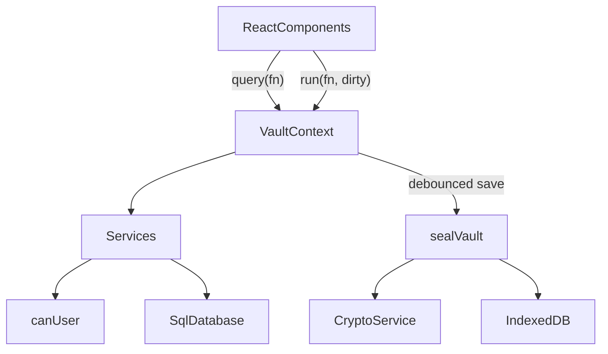

# Developer guide

This guide explains how Moliya is built and how to continue it safely. Read the [README](../README.md) first for the product overview.

## Setup

- Node.js 22.12+ (`.nvmrc` pins the major version CI uses). npm comes with it.
- `npm install`
- `npm run dev` starts Vite on port 5173 with the cross-origin isolation headers.
- `npm run typecheck` runs `tsc --noEmit`. `npm test` runs unit tests in Node (no browser needed).
- `npx playwright install chromium` once, then `npm run test:e2e` (against the dev server) or `npm run test:e2e:preview` (builds, then tests the production bundle on port 4173 with the Content Security Policy active, as CI does).
- `npm run build` runs `tsc --noEmit` and then `vite build` into `dist/`. `npm run preview` serves `dist/`.
- `npm run decrypt -- <file.moliya> --list` runs the standalone recovery tool.

## Architecture

Everything runs in the browser. There is no backend.



### Encryption

Implemented in `src/crypto/crypto.service.ts`, orchestrated in `src/services/auth.service.ts`. The byte-level format is specified in [data-format.md](data-format.md).

- **DEK (vault key)**: `generateDek()` creates a random, extractable AES-GCM-256 key. It exists only in memory while unlocked.
- **Vault KEK (key-encryption key)**: `deriveKeyAndVerifier(password, salt, kdf)` runs PBKDF2 (`derivePbkdf2Bits`) with the wrap's own parameters and imports the 256 bits as a non-extractable AES-GCM key that wraps the DEK. New wraps use `CURRENT_KDF` (PBKDF2-SHA-256, 600,000 iterations, the OWASP 2023+ figure). `isKdfParams` accepts any hash in `KDF_HASHES` and iterations within `KDF_ITERATION_BOUNDS`, so every parameter set ever written still opens. The raw bits are zero-filled after use. Do not call this the "personal key": that name belongs to the private safes key below.
- **Verifier**: `verifierFromBits(raw)` returns `hex(HKDF-SHA-256(raw, salt = empty, info = VERIFIER_INFO))` with `VERIFIER_INFO = 'moliya/verifier/v1'`, and that is what `users.password_hash` stores. It is not key material: nothing derives or unwraps anything from it, and login does **not** compare it; login succeeds only if unwrapping and GCM decryption succeed. Up to 1.1.0 the column held the raw PBKDF2 hex, which *was* the vault KEK. Migration 3 blanks it, and whenever the stored value differs from the HKDF form `unlockVault` re-wraps the DEK under a fresh salt and stores the new verifier, so a leaked pre-1.2.0 value stops matching any live wrap. `verifyOwnPassword(vault, password)` checks a password by unwrapping the person's own vault wrap.
- **Re-wrap on login**: when `kdfNeedsUpgrade(wrap.kdf)` or the stored verifier differs, `unlockVault` wraps the same DEK with a fresh salt and `CURRENT_KDF` and verifies the new wrap. It writes `CREDENTIALS_UPGRADED` only when the KDF parameters change. The session is marked `needsSave` and saved immediately.
- **Wraps**: `wrapDek` and `unwrapDek` use AES-GCM `wrapKey('raw')` with a fresh 12-byte IV.
- **Snapshot**: `sqlite3_js_db_export` gives the database bytes, which are encrypted with `encryptDatabase` (fresh 12-byte IV per save).

### Private safes

Private safes are owner-only containers for cards, subscriptions, and notes, stored as encrypted rows in four tables inside the (already encrypted) database. The byte-level scheme, AAD labels, and payload shapes are in [data-format.md](data-format.md#private-safes); this section is about the code.

- **Crypto** (`src/crypto/safe-crypto.ts`): `derivePersonalKek` runs its own PBKDF2 (`user_keys.kdf`, a separate 32-byte `kdf_salt`) and then HKDF with `PERSONAL_KEK_INFO = 'moliya/personal-kek/v1'`, so it never reuses the vault KEK or the verifier. `deriveRecoveryKek` uses HKDF over the 15 recovery code bytes with `RECOVERY_KEK_INFO`. `aad(label, ...parts)` builds `JSON.stringify([label, ENC_VERSION, ...parts])`. `wrapWithAad`/`unwrapWithAad` wrap keys and `sealJson`/`openJson` encrypt payloads, always with AAD and a fresh IV, padding plaintext to `PAD_BLOCK` (256 bytes) with a `MAX_PLAINTEXT_BYTES` (32 KiB) limit and zero-filling buffers. Every failure is a bare `DecryptError`. `generateRecoveryCode`, `formatRecoveryCode`, and `parseRecoveryCode` implement the Crockford base32 code with a mod-37 check symbol.
- **Key hierarchy**: password or recovery code → personal KEK or recovery KEK → **personal key** (one per person, `user_keys`) → **safe key** per safe and `key_version` (`safes`) → safe meta and items. The personal key also encrypts the person's `UserSafeMeta` (order, default safe, preferences) and activity events.
- **Service** (`src/services/safe.service.ts`): every function takes the `OpenVault` and the in-memory `SafeKeyring`, checks `keyring.userId === vault.user.id` (`SAFES_LOCKED` otherwise), and filters every query by `owner_user_id`. There is deliberately no `canUser` check, so no role can ever reach someone else's safes. Functions do all crypto first, then one synchronous `withTransaction` that writes the rows and an encrypted `safe_events` row. Item writes check `rev` and `key_version` and throw `ITEM_CONFLICT` if another write got there first.
- **Status and unlock**: `getSafeStatus` reports `initialized`, `mustChangePassword`, `stale` (`rewrapped_at < password_changed_at`), and `hasRecovery`. `initializeSafes` and `resetSafes` refuse while `must_change_password = 1`. `unlockSafes` takes an `UnlockSecret`: `password`, or `previousPassword`/`recoveryCode` plus `current`. The latter two verify the current password, unwrap the personal key as extractable inside the function, rewrap it under the current password, and write `PASSWORD_REWRAPPED`. A password that fails on a stale wrap gives `SAFES_STALE` so the UI can switch to the stale form. The personal key is never unwrapped with an Admin-set password. Unlock also rewraps weaker KDF parameters, purges trash older than `TRASH_DAYS` (30), and returns `previousUnlockAt`.
- **Recent authentication**: `confirmRecentAuth` re-derives the personal KEK and sets `keyring.lastAuthAt`; `assertRecentAuth` throws `REAUTH_REQUIRED` after `RECENT_AUTH_MS` (2 minutes). `purgeSafe`, `purgeItems`, `rotateSafeKey`, and `openSafe` without a password call it. `createRecoveryCode` and `resetSafes` take the password directly. The UI must also confirm recent authentication before revealing or copying a card number or CVV.
- **Password changes**: `changeOwnPassword` (`src/services/account.service.ts`) verifies the current password, rewraps the DEK under the new one with a fresh salt, stores the verifier, clears `must_change_password`, sets `password_changed_at`, writes `PASSWORD_CHANGED`, and, through `preparePasswordRewrap`, rewraps the personal key in the same transaction when the current password opens it and the person was not in the must-change state. `resetUserPassword` and `createUser` set `must_change_password = 1` and `password_changed_at`; `resetUserPassword` refuses the caller's own id with `USE_ACCOUNT`. `deleteUser` deletes the person's `safe_events`, `secure_items`, `safes`, and `user_keys` explicitly in the same transaction (the `ON DELETE CASCADE` foreign keys are a backstop).
- **Domain** (`src/domain/`): `safes.ts` holds the payload types, colours, icons, preference choices, event types, `SAFE_LIMITS`, `TRASH_DAYS`, `RECENT_AUTH_MS`, and `validateSafeInput`. `cards.ts` has Luhn, brand detection (longest prefix wins), `checkCardNumber` (strict Luhn for Visa, Mastercard, Amex, and Mir; a warning only for UzCard, Humo, UnionPay, and Other), masking, and `expiryStatus` (`SOON` within `EXPIRY_SOON_DAYS`, 60). `subscriptions.ts` has `nextRenewal` (month steps clamped to the month end), `monthlyMinor` and `yearlyMinor` (BigInt, half-even, custom cycles at 365.2425 days a year), `subscriptionSummary` (per-currency totals of active subscriptions and the next 30 days), and `validateSubscription`. `items.ts` dispatches validation by `kind`.
- **Exports**: `exportPlainDatabase` and `tools/moliya-decrypt.mjs` (without `--keep-keys`) delete every row of the four safe tables. There is no plaintext export of safes.
- **Out of scope**: a compromised device or modified JavaScript, an Admin who resets a password and also plants a forged key (only secrets stored after the reset are exposed), metadata such as counts, size buckets, `deleted_at`, and write timing, and undetected deletion or rollback of rows. See [What the safe layer does not protect](data-format.md#what-the-safe-layer-does-not-protect) before changing anything in this area.

### Storage record and backups

- `src/db/versions.ts` holds `SCHEMA_VERSION`, `RECORD_VERSION`, and `BACKUP_VERSION`.
- `src/db/envelope.ts` is the only place that reads or writes record and backup layouts. `decodeStoredRecord` and `parseBackupJson` accept every released version (1 and 2), validate lengths and KDF bounds, and throw `FormatTooNewError` for anything newer. `toBackupJson` writes the current version; `storedToBackupJson` re-emits an archived version 1 record as the exact version 1 backup.
- `src/db/storage.ts` is the IndexedDB layer. `writeVault(record, { expectedStamp, archive })` does a compare-and-swap on `updatedAt` and, when asked, stores the replaced record under `archive:<time>:<reason>` in the same transaction (at most `MAX_ARCHIVES`).
- `src/services/backup.service.ts` builds file names and text, records `last_backup_at`, and computes the stale-backup reminder (`BACKUP_STALE_DAYS`).

### SQLite

`src/db/sqlite.ts` wraps `@sqlite.org/sqlite-wasm` OO1 API in `SqlDatabase`:

- `openEmpty()` and `openBytes(bytes)` (uses `sqlite3_deserialize` with `FREEONCLOSE | RESIZEABLE`). Both turn on `PRAGMA foreign_keys` and `PRAGMA secure_delete`, so deleted rows (for example shredded safes) are zeroed rather than left in free pages.
- `exec`, `query`, `queryOne`, `queryValue` with positional `?` parameters. BigInts are converted to numbers, and blobs are returned as `null` (store binary data as text).
- `withTransaction(fn)` for `BEGIN`/`COMMIT`/`ROLLBACK`.
- `export()` returns the database bytes.

The database is always in memory on the main thread. OPFS is deliberately not used, because it would store plaintext on disk. Vite emits `sqlite3-worker1` and `sqlite3-opfs-async-proxy` assets from the package even though they are unused.

Schema: built only by migrations in `src/db/migrations/` (`0001-baseline.sql`, `0002-exact-money.ts`, `0003-private-safes.sql`, listed in `index.ts`). `migrate(db, { appVersion })` runs on create, unlock, and therefore import. Seed data: `src/db/seed.ts`. Settings keys: `currency`, `vault_name`, `vault_created_at`, `last_backup_at`.

Money is stored as `transactions.amount_minor` (integer minor units, ISO 4217 exponent from the `currencies` table). `src/lib/money.ts` is the only place that converts: `parseAmount(text, currency)` accepts `.` or `,` as the decimal separator and spaces as grouping, and rejects extra decimals (`AMOUNT_PRECISION`) or amounts over `MAX_AMOUNT_MINOR`. Display uses `formatMoney(minor, …)`, inputs use `minorToDecimal`, charts use `toMajor`. Percentages use `percentOf` (exact, half-even). Never add amounts of different currencies.

The audit log is append-only and hash-chained (`src/db/audit-chain.ts`). `writeAudit` must run inside the same transaction as the change; `auditIntegrity` re-verifies the chain for the Audit page.

### Session and saving

`src/context/VaultContext.tsx` owns the unlocked `OpenVault` (`db`, `dek`, `wraps`, `user`, `currency`, `vaultName`, `createdAt`, `lastBackupAt`) in a ref so it never re-renders or leaks into React state.

- `query(fn)` runs a synchronous read.
- `run(fn, { dirty: true })` runs a write, refreshes the user snapshot, bumps `revision`, and schedules a save.
- Saves are serialized through a promise chain. They are triggered 800 ms after the last change, every 5 seconds while dirty, on `pagehide` and `visibilitychange` to hidden, before lock, and before export. Unload saves are best effort, because browsers may kill the page before IndexedDB finishes.
- Every save is a compare-and-swap against the `updatedAt` the session loaded. A mismatch (another tab, an import, an old cached build) sets save state `conflict` and stops autosave instead of overwriting.
- Unlock takes the Web Lock `moliya-vault-session` (`src/lib/session-lock.ts`); a second tab gets `VAULT_IN_USE`. Lock releases it.
- If unlock migrated the schema or upgraded a record, the first save stores the untouched original as an `upgrade` archive in the same IndexedDB transaction.
- After unlock or setup the app calls `navigator.storage.persist()` (`src/lib/persistence.ts`) so the browser does not evict the vault under storage pressure or, in Safari, after 7 days without a visit.
- Status flows: `checking` → `setup` or `locked` → `ready`. `error` means the stored record could not be read; `bootError` holds the error code (`FORMAT_TOO_NEW`, `RECORD_INVALID`, or a raw message).
- The whole vault locks after 15 minutes without activity.

Components read data with `useMemo(() => query(...), [query, revision, ...])`, so any write re-renders the lists.

`SafeContext` holds the `SafeKeyring` (personal key, unwrapped safe keys, which password-each-time safes are open, decrypted `UserSafeMeta`, `lastAuthAt`) in memory only (a ref, mirrored into context state so pages re-render). Keys in it are non-extractable `CryptoKey`s. It is never put in the URL, storage, or logs. Safe writes still go through `run(fn, { dirty: true })` so they are saved with the vault. The keyring and all decrypted items are dropped when the safes lock: on **Lock safes**, after the idle time from `UserSafeMeta.autoLockMinutes` (5 minutes by default), after the tab has been hidden for more than 60 seconds, and when the vault locks. Revealed values hide after `revealSeconds`, and copied values are cleared from the clipboard after `clipboardSeconds`, on lock, and on `pagehide` (`src/lib/clipboard.ts`; best effort, the browser may refuse).

### RBAC

`src/rbac/index.ts` defines `Permission`, `permissionsForRole(role)`, and `canUser(user, permission)`.

Permissions are stored in the `roles` table as JSON, and `loadUser` reads them from the database. `syncRolePermissions` (`src/db/seed.ts`) rewrites that JSON from `permissionsForRole` on every unlock, before `loadUser`, so changes to the matrix reach existing vaults and backups without a migration. It only updates the three built-in roles; adding a new role still needs a migration.

Every service function checks `canUser` and, for non-admins, restricts to `user.groupId`. UI hiding (`AppShell` navigation, buttons in `Timeline`) is a convenience, not the guard.

Private safes and the Account page are outside RBAC on purpose. They are available to every role, and access is decided by ownership (`owner_user_id` and the keyring's `userId`) and by cryptography, never by a permission. Do not add a permission that grants access to other people's safes; it could not work anyway without their keys.

### Services

| File | Responsibility |
| --- | --- |
| `auth.service.ts` | Create vault, unlock (including the verifier upgrade), seal, `verifyOwnPassword`, email and password validation, `loadUser` (with `mustChangePassword`) |
| `account.service.ts` | `changeOwnPassword` for every role, including the private safes rewrap |
| `user.service.ts` | List, create, reset password, update, delete users. Keeps `vault.wraps` in sync. Create and reset set `must_change_password`; delete shreds the person's safe rows |
| `safe.service.ts` | Private safes: setup, unlock (password, previous password, recovery code), recent authentication, safes, items, move and copy, trash, key rotation, activity, preferences, recovery code, password rewrap, reset. Ownership only, no RBAC |
| `group.service.ts` | List, create, delete groups |
| `finance.service.ts` | Categories, transaction CRUD, validation, dashboard aggregation |
| `settings.service.ts` | Vault name and currency (`updateVaultSettings`, also updates `vault.vaultName` and `vault.currency`), category create, update, and delete. Gated by `MANAGE_SETTINGS` |
| `audit.service.ts` | `writeAudit` (call inside the same transaction as the change), `listAudit`, `auditIntegrity` |
| `backup.service.ts` | Backup file text and names, `noteExport`, `backupReminder` |
| `export.service.ts` | Plaintext CSV and SQLite exports (gated by `EXPORT_VAULT`, audited). The SQLite export blanks password columns and drops all safe rows |

Errors are `AppError` subclasses with a string code (`src/domain/errors.ts`). `src/lib/errors.ts` maps codes to translated messages. Add a case there when you add a code. Safe errors are `SafeError` with a `SafeErrorCode`, translated from the `safeErrors` section of the dictionaries.

### UI

- Routing: `HashRouter` in `src/App.tsx`. `/setup`, `/login`, and `/app/*` are guarded by vault status. Every page under `/app` is loaded with `React.lazy`, the dashboard loads Chart.js lazily, and `src/db/sqlite.ts` imports sqlite-wasm on first use, so the first screen only needs React.
- Versioning: `tools/build-info.ts` injects `__APP_VERSION__`, `__BUILD_COMMIT__`, and `__BUILD_DATE__` (read through `src/lib/version.ts`) and the build writes `version.json`. `UpdateBanner` polls it in production and offers a reload (locking first) when a new build is deployed. The version shows in the sidebar, on the sign-in screens, and in Settings → About.
- `AppShell.tsx`: navigation filtered by permission, top bar with the sidebar collapse toggle, and `PeriodProvider` (the shared period for dashboard and ledger). The collapsed state is `data-sidebar` on `app-shell`; desktop shrinks the nav to a 65px icon rail, mobile hides the nav row.
- Pages: `Dashboard.tsx`, `Timeline.tsx` (ledger and form), `AdminPages.tsx` (users, groups, audit, backup), `SettingsPage.tsx` (vault name, currency, categories), and `AuthScreens.tsx` (setup, login).
- Private safes and Account (`src/components/safes/`, `AccountPage.tsx`) are lazy routes for every role: `/app/safes` (setup, unlock or stale form, safe grid, search, favourites, upcoming payments, expiring cards), `/app/safes/:safeId` (one safe, its items and settings), `/app/safes/trash`, `/app/safes/activity`, and `/app/account` (change password, safe preferences, recovery code, reset safes). While `user.mustChangePassword` is true, every `/app/*` path redirects to `/app/account`. The selected item is never in the URL; only the safe id is.
- The Users page always shows `users.resetSafesWarn` on password reset and `users.removeSafesWarn` on removal, whatever the person has, so the UI never reveals whether someone uses safes. The reset action is not offered on the Admin's own row (`USE_ACCOUNT`).
- Long values: grid and flex children that hold text need `min-w-0`, or they refuse to shrink and overflow. KPI figures use a container query (`@container` on the card, `clamp(…, 9cqi, …)` on the value) so they scale with the card, not the viewport. `formatMoney` drops the fraction for whole amounts.
- Charts: `Charts.tsx` registers only the Chart.js pieces that are used, and picks colors from the resolved theme.
- Styling: Tailwind 4 with design tokens in `src/index.css` (`paper`, `card`, `ink`, `muted`, `line`, `pine`, `clay`, `brass`, `brass-soft`, `on-pine`, `pine-ink`, `clay-ink`). `pine`/`clay` are dark green/red fills in both themes; use `text-pine-ink`/`text-clay-ink` for green/red text (lighter in dark mode for AA contrast). Dark mode is the `.dark` class on `<html>`, set by `ThemeContext`.
- i18n: `src/i18n/en.ts` is the source of truth. `Messages = typeof en`, so TypeScript forces `ru`, `uz-Latn`, and `uz-Cyrl` to have the same keys. `t('section.key')` is type-checked.
- Local storage keys: `moliya.locale`, `moliya.theme`, and `moliya.sidebar` (`collapsed` or `expanded`).

## Project layout

```text
.github/workflows/             ci.yml (checks), deploy.yml (main → Pages), release.yml (tags), codeql.yml
.github/dependabot.yml         weekly npm and Actions updates
index.html                     loads coi-config.js and coi-serviceworker.js before the app
public/coi-serviceworker.js    vendored v0.1.7 (MIT), not bundled
src/
  App.tsx, main.tsx, index.css
  components/                  pages and UI pieces; safes/ holds the private safes pages
  context/                     Vault, Safe, I18n, Theme, Period providers
  crypto/                      Web Crypto wrappers (vault and private safes), byte helpers
  db/                          versions, envelope, IndexedDB, migrations, audit chain, SQLite wrapper, seed
  domain/                      shared types, error classes, safes, cards, subscriptions, item validation
  i18n/                        en, ru, uz-Latn, uz-Cyrl dictionaries
  lib/                         money, dates, version, updates, persistence, session lock, sha256, clipboard, errors
  rbac/                        permissions
  services/                    business logic
tests/
  fixtures/backups/            golden backups from every release (immutable, SHA-256 pinned)
  support/                     fixture helpers shared by tests
  unit/                        Vitest
  e2e/                         Playwright
tools/
  build-info.ts                version, commit, and build date for the bundle
  fixtures/<version>/          generators that produced each fixture set
  moliya-decrypt.mjs           dependency-free recovery CLI
```

## Conventions

- Keep crypto, db, rbac, and services free of React so they stay testable in Node.
- Every write goes through a service that checks permission and group scope, and writes an audit entry in the same transaction.
- Call writes from the UI through `run(..., { dirty: true })`. Never touch `vault.db` directly from a component.
- All user-visible text goes through `t()`. Add the English key first, then the other three.
- Give interactive elements a `data-testid` when tests need them.
- Comments only for constraints the code cannot show.
- Private safe secrets (card numbers, CVVs, names, notes, recovery codes, passwords) never go into URLs, `document.title`, `title` or `aria-label` attributes, `data-*` attributes (test ids included), `console` calls, error messages, the save-state label, or local storage. Errors from safe crypto are bare codes. `safes.lifecycle.test.ts` fails on any `console` call in safe services, crypto, domain, or components.
- Every input in a safe form has `autoComplete="off" spellCheck={false} autoCorrect="off" autoCapitalize="off"`, so browsers neither save the value nor send it to a cloud spell checker. The CVV uses `type="password"`. Note bodies render as plain text, and subscription links only for `https:` and `http:` URLs.
- Show card numbers masked (`maskPan`, last four digits only) unless the owner reveals them after recent authentication.
- Run `npm test`, `npm run build`, and `npm run test:e2e` before pushing. CI runs all three.

## Common tasks

### Add a translated string

1. Add the key to `src/i18n/en.ts`.
2. `npx tsc --noEmit` now fails for the other three files. Add the translations there.
3. `tests/unit/i18n.test.ts` checks that all four locales have identical keys and no empty values.

### Add a page

1. Create the component in `src/components/`.
2. Add a route under `/app` in `src/App.tsx`.
3. Add a navigation entry in `AppShell.tsx` with the permission it needs, and an icon from `lucide-react`.
4. Guard the page itself with `canUser` and the service calls with permission checks.

### Add a service write

```ts
export function renameGroup(vault: OpenVault, groupId: number, name: string): void {
  if (!canUser(vault.user, Permission.MANAGE_GROUPS)) throw new ForbiddenError()
  const trimmed = name.trim()
  if (!trimmed) throw new ValidationError('REQUIRED')
  vault.db.withTransaction(() => {
    vault.db.exec('UPDATE groups SET name = ? WHERE id = ?', [trimmed, groupId])
    writeAudit(vault.db, vault.user.id, 'GROUP_RENAMED', 'group', String(groupId), { name: trimmed })
  })
}
```

Then call it from the UI with `run((vault) => renameGroup(vault, id, name), { dirty: true })`, and add `audit.actions.GROUP_RENAMED` to all four dictionaries.

### Change the schema

1. Add `src/db/migrations/000N-short-name.ts` (or `.sql` imported with `?raw`) and append `{ version: N, name, up }` to `MIGRATIONS`. Never edit a released migration.
2. Bump `SCHEMA_VERSION` in `src/db/versions.ts`. `assertMigrationsMatchSchemaVersion` and the migrations test fail if they disagree.
3. Each migration runs in its own transaction with foreign keys off, followed by `PRAGMA foreign_key_check`, `user_version`, and a `schema_migrations` row. Throw to abort: that migration rolls back, the stored encrypted record is never touched (migrations run on the in-memory copy), and the user sees `MIGRATION_FAILED`. `PRAGMA quick_check` runs after the last step.
4. Prefer `CHECK` constraints over `STRICT` tables so older SQLite tools can still read exported files.
5. Add tests in `tests/unit/migrations.test.ts` against the previous version's fixtures, then follow [Changing a format](data-format.md#changing-a-format) for the release fixture.

### Change the storage or backup format

Bump `RECORD_VERSION` or `BACKUP_VERSION`, add a new branch in `src/db/envelope.ts` while keeping every existing one, rename or add a field that older builds will fail on rather than misread, update [data-format.md](data-format.md), and add a fixture from the release.

## Tests

- **Unit** (`tests/unit`, Node environment, real `crypto.subtle`, the Node build of sqlite-wasm through `resolve.conditions`):
  - `fixtures.test.ts`: every golden backup in `tests/fixtures/backups` opens for every person with exact records, totals, and an intact audit chain; survives upgrade, re-seal, and a new backup; and 1.0.0's IndexedDB record re-exports byte for byte. For `v3/safes-household` it also opens each person's private safes (the stale Viewer through the previous password and the recovery code) with exact items and subscription totals, and checks nobody else can unwrap them. Fails if a fixture changes or a format version has no fixture.
  - `migrations.test.ts`: 1.0.0 detection, float-to-minor conversion, the 1.1.0 → 1.2.0 upgrade (safe tables, blanked `password_hash`), identical schema for upgraded and new databases, append-only audit log, full rollback of a failing migration, refusal of newer schemas.
  - `safe-crypto.test.ts`: 256-byte padding and the size limit, equal ciphertext sizes for a card and a short note, failure on a wrong key, any changed AAD part, or a flipped bit, AAD-bound key wraps, separation of the personal KEK from the vault KEK and the verifier, and recovery code formatting and parsing.
  - `safes.service.test.ts`: setup and every item kind through seal and unlock, validation and revisions, order, default, archive, encrypted preferences, trash rules and 30-day expiry, move and copy re-encryption, key rotation (trashed items included), password-each-time safes, and the safe limit.
  - `safes.password.test.ts`: rewrap on a password change, recovery after an admin reset with the previous password or the recovery code, adding and replacing a recovery code, losing both and resetting, refusal of a wrap forged under the temporary password, and forced password change for Admin-created accounts.
  - `safes.isolation.test.ts`: no plaintext secret anywhere in the decrypted database, an Admin with the full database cannot open another person's safes, the verifier is not key material, rows swapped between users fail, and no safe activity in the shared audit log.
  - `safes.lifecycle.test.ts`: removing a person shreds their safe rows, safes survive a backup round trip, and no `console` calls in safe code.
  - `cards.test.ts` and `subscriptions.test.ts`: Luhn, brand ranges, strict and lenient Luhn, masking, expiry boundaries, card validation (optional CVV, no PIN); monthly and yearly normalisation with half-even rounding, month-end renewals, per-currency totals, and subscription validation.
  - `envelope.test.ts`: version 1 and 2 records and backups, KDF bounds, tamper cases, newer-format refusal.
  - `money.test.ts`: parsing, legacy conversion, formatting, percentages.
  - `archival.test.ts`: SHA-256 against Node, audit tamper detection, CSV and SQLite exports (no password material, no safe rows), update detection.
  - `decrypt-cli.test.ts`: the recovery CLI against every fixture, including removal of password material and safe rows, and `--keep-keys` keeping the still-encrypted safe rows.
  - `crypto.service.test.ts`, `rbac.test.ts`, `i18n.test.ts`, `dates.test.ts`, `vault.test.ts`, `settings.test.ts`: primitives, permissions, locale parity, periods, the full vault flow, and settings.
- **End to end** (Chromium):
  - `vault.spec.ts`: setup, records, dashboard and charts, language and theme, settings and categories, sidebar, roles, and backup export and import.
  - `upgrade.spec.ts`: a real 1.0.0 IndexedDB record upgraded in the browser (records, totals, stored format, archive download), a 1.0.0 backup import, refusal of a newer or damaged record, the single-session lock, and no CSP violations in preview mode.
  - `safes.spec.ts`: cards, subscriptions, and notes in a private safe with masked secrets and auto-lock, and recovery after an admin reset with the previous password or with the recovery code.

Test helpers for safes (a household vault with an Admin and a Manager, sample card, subscription, and note, and byte search for plaintext leaks) are in `tests/support/safes.ts`. The v3 fixture was produced by `tools/fixtures/v3/generate.gen.ts` with 1.2.0.

Each Playwright test gets a fresh browser context, so IndexedDB starts empty. The warning "localStorage is not available" during unit tests comes from Node and is harmless.

## Known gaps and next steps

Roughly in priority order:

1. **Vault key rotation.** On user removal, password reset, or on demand: generate a new DEK, re-encrypt, and re-wrap for the remaining users. Today a removed person with an old copy can still decrypt new copies.2. **Soft delete and corrections.** Records are hard-deleted; the audit log keeps the full snapshot. Accounting-style reversing entries or a `deleted_at` column would make history visible in the ledger itself.
3. **UI for existing services**: change a user's role or group (`updateUser` exists) and rename groups.
4. **Private safes follow-ups**: decryption of safes in `tools/moliya-decrypt.mjs` for the owner; an encrypted per-safe manifest so deleted or rolled-back rows are detected; rotating the personal key (for example after the recovery code was used); a way to delete earlier copies kept in the browser, so shredded data can be removed sooner.
5. **Cryptographic group isolation**, if groups must be hidden from each other. This needs per-group keys or separate vaults.
6. **Receipts outside the database.** Images are stored as data URLs inside SQLite, and the whole database is re-encrypted on every save.
7. **Exchange rates**, if mixed-currency totals are ever needed. Store the rate and its date with each conversion; never convert silently.
8. **A separate `IMPORT_VAULT` check.** The permission exists, but the backup page is gated by `EXPORT_VAULT` only.
9. **Offline support**: a caching service worker that coexists with `coi-serviceworker`.
10. **Multi-device sync.** Out of scope for a serverless design today. Any future sync must merge, not overwrite.
