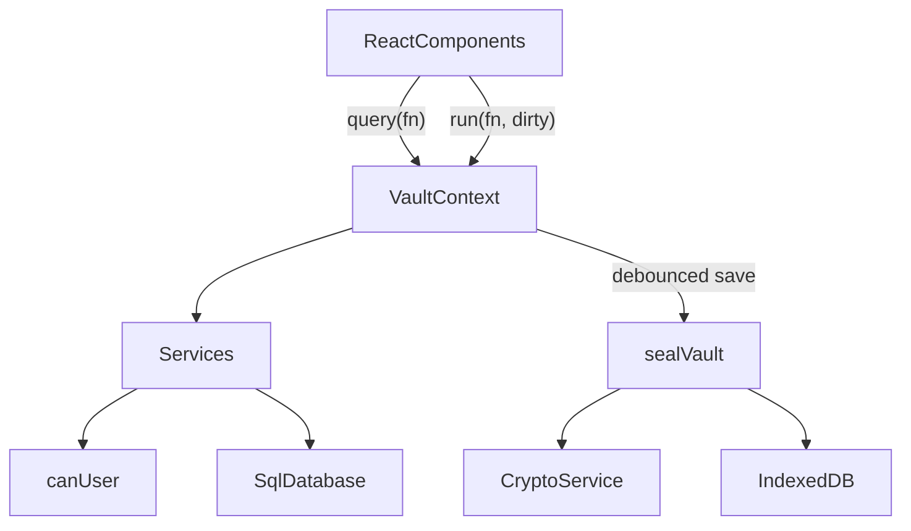

# Developer guide

This guide explains how Moliya is built and how to continue it safely. Read the [README](../README.md) first for the product overview.

## Setup

- Node.js 22.12+ (`.nvmrc` pins the major version CI uses). npm comes with it.
- `npm install`
- `npm run dev` starts Vite on port 5173 with the cross-origin isolation headers.
- `npm run typecheck` runs `tsc --noEmit`. `npm test` runs unit tests in Node (no browser needed).
- `npx playwright install chromium` once, then `npm run test:e2e` (against the dev server) or `npm run test:e2e:preview` (builds, then tests the production bundle on port 4173 with the Content Security Policy active, as CI does).
- `npm run build` runs `tsc --noEmit` and then `vite build` into `dist/`. `npm run preview` serves `dist/`.
- `npm run decrypt -- <file.moliya> --list` runs the standalone recovery tool.

## Architecture

Everything runs in the browser. There is no backend.



### Encryption

Implemented in `src/crypto/crypto.service.ts`, orchestrated in `src/services/auth.service.ts`. The byte-level format is specified in [data-format.md](data-format.md).

- **DEK (vault key)**: `generateDek()` creates a random, extractable AES-GCM-256 key. It exists only in memory while unlocked.
- **Vault KEK (key-encryption key)**: `deriveKeyAndVerifier(password, salt, kdf)` runs PBKDF2 (`derivePbkdf2Bits`) with the wrap's own parameters and imports the 256 bits as a non-extractable AES-GCM key that wraps the DEK. New wraps use `CURRENT_KDF` (PBKDF2-SHA-256, 600,000 iterations, the OWASP 2023+ figure). `isKdfParams` accepts any hash in `KDF_HASHES` and iterations within `KDF_ITERATION_BOUNDS`, so every parameter set ever written still opens. The raw bits are zero-filled after use. Do not call this the "personal key": that name belongs to the private safes key below.
- **Verifier**: `verifierFromBits(raw)` returns `hex(HKDF-SHA-256(raw, salt = empty, info = VERIFIER_INFO))` with `VERIFIER_INFO = 'moliya/verifier/v1'`, and that is what `users.password_hash` stores. It is not key material: nothing derives or unwraps anything from it, and login does **not** compare it; login succeeds only if unwrapping and GCM decryption succeed. Up to 1.1.0 the column held the raw PBKDF2 hex, which *was* the vault KEK. Migration 3 blanks it, and whenever the stored value differs from the HKDF form `unlockVault` re-wraps the DEK under a fresh salt and stores the new verifier, so a leaked pre-1.2.0 value stops matching any live wrap. `verifyOwnPassword(vault, password)` checks a password by unwrapping the person's own vault wrap.
- **Re-wrap on login**: when `kdfNeedsUpgrade(wrap.kdf)` or the stored verifier differs, `unlockVault` wraps the same DEK with a fresh salt and `CURRENT_KDF` and verifies the new wrap. It writes `CREDENTIALS_UPGRADED` only when the KDF parameters change. The session is marked `needsSave` and saved immediately.
- **Wraps**: `wrapDek` and `unwrapDek` use AES-GCM `wrapKey('raw')` with a fresh 12-byte IV.
- **Snapshot**: `sqlite3_js_db_export` gives the database bytes, which are encrypted with `encryptDatabase` (fresh 12-byte IV per save).
- **Bounds**: `KDF_ITERATION_BOUNDS` is 100,000 to 2,000,000 from 1.3.0 (it was 10,000,000), so a crafted file cannot make the importer's own browser run PBKDF2 for minutes. The recovery CLI keeps 10,000,000.
- **Equal timing**: `unlockVault` (unknown email) and `redeemGrant` (no matching grant) call `spendPasswordWork`, one real PBKDF2 derivation with a random salt, so an unknown address fails as slowly as a wrong password. Emails are plaintext in the envelope anyway; this only removes the obvious timing difference.

### One-time codes and the sign-in check

Both are in 1.3.0. The byte-level formats are in [data-format.md](data-format.md#one-time-codes).

- **Codes** (`src/lib/access-code.ts`): `generateAccessCode` returns 135 random bits as 27 Crockford base32 characters plus a mod-37 check character, displayed as seven groups of four. `normalizeAccessCode` applies the usual Crockford look-alike rules and rejects a bad length, character, or check symbol before any key derivation (`INVITE_CODE`).
- **Crypto** (`src/crypto/access-crypto.ts`): `deriveGrantKeys` runs PBKDF2 over the canonical code and splits the output with HKDF into the grant KEK (`moliya/grant-kek/v1`) and a hex verifier (`moliya/grant-verifier/v1`). `wrapDekForGrant` and `unwrapGrantDek` wrap the DEK with AAD from `grantAad(id, kind, email)`. `deriveTotpKek` (`moliya/totp-kek/v1`) and `recoveryCodeHash` (HMAC-SHA-256 with `moliya/totp-recovery/v1`) serve the sign-in check.
- **Grant service** (`src/services/grant.service.ts`): `createInvite` and `issueReset` check `MANAGE_USERS`, the email, one open code per email (`GRANT_OPEN`; a new reset for the same person replaces the old one instead), at most `LIMITS.openInvites` (20) open invites and `LIMITS.grants` (64) envelope grants (`INVITE_LIMIT`), and the clock floor (`CLOCK_BEHIND`). They then mint the code, push the `GrantWrap` into `vault.grants`, insert the `access_grants` row with the verifier, and audit without the code. The code is returned once as `IssuedGrant` and is never stored or logged. `issueReset` with `stopOldPassword` removes the person's entry from `vault.wraps`. `revokeGrant` and `listGrants` are straightforward. `redeemGrant(record, input)` works on a locked `VaultRecord`: it finds the grant by kind and email, unwraps, opens the database through `openRecordDatabase`, checks the row (open, same kind and email, verifier compared in constant time, clock, expiry), checks the password policy, then creates the user (`INVITE`) or replaces their password and drops their sign-in check (`RESET`) in one transaction, and returns an `OpenVault` whose wrap has replaced the grant. The caller must save at once.
- **Grant store** (`src/services/grant-store.ts`): row mapping, `endGrant`, `dropEnvelopeGrant`, `grantAuditAction`, the `clock_high_water` key with its 5-minute tolerance, and `sweepGrants`, which ends expired rows (`INVITE_EXPIRED`, system actor) and drops envelope grants whose row is ended, missing, or mismatched. `buildOpenVault` runs the sweep on every unlock and redemption.
- **Clock floor**: `seal` stores `max(clock_high_water, now)` on every save of a schema 4 database. Creating, issuing, and redeeming refuse a clock more than 5 minutes behind it.
- **Sign-in check** (`src/services/totp.service.ts`, `src/lib/totp.ts`): RFC 6238 with SHA-1, 6 digits, 30-second steps, a window of one step, and a 20-byte secret. `beginTotpSetup` makes the secret and `otpauth://` URI; `enableTotp` needs the password and a current code, seals the secret under a KEK derived only from that password, and returns ten recovery codes (80 bits each) whose HMAC hashes are stored. `openTotpChallenge` decrypts the secret with the password just used to sign in; `completeTotpChallenge` accepts a code newer than `last_step`, or an unused recovery code. `prepareTotpRewrap` re-seals the secret during `changeOwnPassword`. `dropTotp` removes the row inside the caller's transaction (Admin reset, reset code, `clearUserTotp`). The QR code is drawn locally by `src/lib/qr.ts` (adapted from Project Nayuki's MIT generator) as an SVG path.
- **What the sign-in check is not**: it runs after the password has already decrypted the vault into memory. It adds no encryption, and anyone with a copy of the vault and the password can open it with the recovery CLI or a modified client. Keep this wording in the UI (`signInCheck.honest`) and in every guide.

### Private safes

Private safes are owner-only containers for cards, subscriptions, and notes, stored as encrypted rows in four tables inside the (already encrypted) database. The byte-level scheme, AAD labels, and payload shapes are in [data-format.md](data-format.md#private-safes); this section is about the code.

- **Crypto** (`src/crypto/safe-crypto.ts`): `derivePersonalKek` runs its own PBKDF2 (`user_keys.kdf`, a separate 32-byte `kdf_salt`) and then HKDF with `PERSONAL_KEK_INFO = 'moliya/personal-kek/v1'`, so it never reuses the vault KEK or the verifier. `deriveRecoveryKek` uses HKDF over the 15 recovery code bytes with `RECOVERY_KEK_INFO`. `aad(label, ...parts)` builds `JSON.stringify([label, ENC_VERSION, ...parts])`. `wrapWithAad`/`unwrapWithAad` wrap keys and `sealJson`/`openJson` encrypt payloads, always with AAD and a fresh IV, padding plaintext to `PAD_BLOCK` (256 bytes) with a `MAX_PLAINTEXT_BYTES` (32 KiB) limit and zero-filling buffers. Every failure is a bare `DecryptError`. `generateRecoveryCode`, `formatRecoveryCode`, and `parseRecoveryCode` implement the Crockford base32 code with a mod-37 check symbol.
- **Key hierarchy**: password or recovery code → personal KEK or recovery KEK → **personal key** (one per person, `user_keys`) → **safe key** per safe and `key_version` (`safes`) → safe meta and items. The personal key also encrypts the person's `UserSafeMeta` (order, default safe, preferences) and activity events.
- **Service** (`src/services/safe.service.ts`): every function takes the `OpenVault` and the in-memory `SafeKeyring`, checks `keyring.userId === vault.user.id` (`SAFES_LOCKED` otherwise), and filters every query by `owner_user_id`. There is deliberately no `canUser` check, so no role can ever reach someone else's safes. Functions do all crypto first, then one synchronous `withTransaction` that writes the rows and an encrypted `safe_events` row. Item writes check `rev` and `key_version` and throw `ITEM_CONFLICT` if another write got there first.
- **Status and unlock**: `getSafeStatus` reports `initialized`, `mustChangePassword`, `stale` (`rewrapped_at < password_changed_at`), and `hasRecovery`. `initializeSafes` and `resetSafes` refuse while `must_change_password = 1`. `unlockSafes` takes an `UnlockSecret`: `password`, or `previousPassword`/`recoveryCode` plus `current`. The latter two verify the current password, unwrap the personal key as extractable inside the function, rewrap it under the current password, and write `PASSWORD_REWRAPPED`. A password that fails on a stale wrap gives `SAFES_STALE` so the UI can switch to the stale form. The personal key is never unwrapped with an Admin-set password. Unlock also rewraps weaker KDF parameters, purges trash older than `TRASH_DAYS` (30), and returns `previousUnlockAt`.
- **Recent authentication**: `confirmRecentAuth` re-derives the personal KEK and sets `keyring.lastAuthAt`; `assertRecentAuth` throws `REAUTH_REQUIRED` after `RECENT_AUTH_MS` (2 minutes). `purgeSafe`, `purgeItems`, `rotateSafeKey`, and `openSafe` without a password call it. `createRecoveryCode` and `resetSafes` take the password directly. The UI must also confirm recent authentication before revealing or copying a card number or CVV.
- **Password changes**: `changeOwnPassword` (`src/services/account.service.ts`) verifies the current password, rewraps the DEK under the new one with a fresh salt, stores the verifier, clears `must_change_password`, sets `password_changed_at`, writes `PASSWORD_CHANGED`, and, through `preparePasswordRewrap`, rewraps the personal key in the same transaction when the current password opens it and the person was not in the must-change state. `resetUserPassword` and `createUser` set `must_change_password = 1` and `password_changed_at`; `resetUserPassword` refuses the caller's own id with `USE_ACCOUNT`. `deleteUser` deletes the person's `safe_events`, `secure_items`, `safes`, and `user_keys` explicitly in the same transaction (the `ON DELETE CASCADE` foreign keys are a backstop).
- **Domain** (`src/domain/`): `safes.ts` holds the payload types, colours, icons, preference choices, event types, `SAFE_LIMITS`, `TRASH_DAYS`, `RECENT_AUTH_MS`, and `validateSafeInput`. `cards.ts` has Luhn, brand detection (longest prefix wins), `checkCardNumber` (strict Luhn for Visa, Mastercard, Amex, and Mir; a warning only for UzCard, Humo, UnionPay, and Other), masking, and `expiryStatus` (`SOON` within `EXPIRY_SOON_DAYS`, 60). `subscriptions.ts` has `nextRenewal` (month steps clamped to the month end), `monthlyMinor` and `yearlyMinor` (BigInt, half-even, custom cycles at 365.2425 days a year), `subscriptionSummary` (per-currency totals of active subscriptions and the next 30 days), and `validateSubscription`. `items.ts` dispatches validation by `kind`.
- **Exports**: `exportPlainDatabase` and `tools/moliya-decrypt.mjs` (without `--keep-keys`) delete every row of the four safe tables. There is no plaintext export of safes.
- **Out of scope**: a compromised device or modified JavaScript, an Admin who resets a password and also plants a forged key (only secrets stored after the reset are exposed), metadata such as counts, size buckets, `deleted_at`, and write timing, and undetected deletion or rollback of rows. See [What the safe layer does not protect](data-format.md#what-the-safe-layer-does-not-protect) before changing anything in this area.

### Storage record and backups

- `src/db/versions.ts` holds `SCHEMA_VERSION`, `RECORD_VERSION`, and `BACKUP_VERSION`.
- `src/db/envelope.ts` is the only place that reads or writes record and backup layouts. `decodeStoredRecord` and `parseBackupJson` accept every released version (1 and 2), validate lengths and KDF bounds, and throw `FormatTooNewError` for anything newer. They also read the optional `grants` array and enforce the caps from `src/lib/limits.ts` (at most 256 wraps and 64 grants, ciphertext at most 64 MiB). `parseBackupText` parses the file with `parseJsonSafely` (`src/lib/safe-json.ts`: size cap, a linear depth pre-scan to 8 levels, and a reviver that rejects `__proto__`, `constructor`, and `prototype`). `toBackupJson` writes the current version and includes `grants` only when non-empty; `storedToBackupJson` re-emits an archived version 1 record as the exact version 1 backup.
- `src/db/storage.ts` is the IndexedDB layer. `recordFromSession` carries grants into the record, and `grantsFromRecord` reads them back. `writeVault(record, { expectedStamp, archive })` does a compare-and-swap on `updatedAt` and, when asked, stores the replaced record under `archive:<time>:<reason>` in the same transaction (at most `MAX_ARCHIVES`).
- `src/services/backup.service.ts` builds file names and text, records `last_backup_at`, and computes the stale-backup reminder (`BACKUP_STALE_DAYS`).

### SQLite

`src/db/sqlite.ts` wraps `@sqlite.org/sqlite-wasm` OO1 API in `SqlDatabase`:

- `openEmpty()` and `openBytes(bytes)` (uses `sqlite3_deserialize` with `FREEONCLOSE | RESIZEABLE`). Both call `configure()`: `SQLITE_DBCONFIG_DEFENSIVE` on, `SQLITE_DBCONFIG_TRUSTED_SCHEMA` and `PRAGMA trusted_schema` off, `PRAGMA cell_size_check`, `SQLITE_LIMIT_LENGTH` of 8 MiB (`LIMITS.sqliteValueBytes`), `SQLITE_LIMIT_ATTACHED` of 0, `PRAGMA foreign_keys`, and `PRAGMA secure_delete`, so deleted rows (for example shredded safes) are zeroed rather than left in free pages.
- `exec`, `query`, `queryOne`, `queryValue` with positional `?` parameters. BigInts are converted to numbers, and blobs are returned as `null` (store binary data as text).
- `withTransaction(fn)` for `BEGIN`/`COMMIT`/`ROLLBACK`.
- `vacuum()` raises the attach limit to 1 for the duration of `VACUUM` (which attaches a scratch database) and always sets it back to 0. Do not call `exec('VACUUM')` directly.
- `sizeBytes()` is `page_count × page_size`, used for the 48 MiB database budget.
- `export()` returns the database bytes.

The database is always in memory on the main thread. OPFS is deliberately not used, because it would store plaintext on disk. Vite emits `sqlite3-worker1` and `sqlite3-opfs-async-proxy` assets from the package even though they are unused.

Schema: built only by migrations in `src/db/migrations/` (`0001-baseline.sql`, `0002-exact-money.ts`, `0003-private-safes.sql`, `0004-access-grants.sql`, listed in `index.ts`). `openRecordDatabase` (in `auth.service.ts`) opens every decrypted database the same way: `assertKnownSchema` compares `sqlite_master` with the objects the app's own migrations create for the stored version (trigger and view SQL must match exactly; anything unknown or missing is `SCHEMA_UNKNOWN`), then `migrate(db, { appVersion })`, then `assertKnownSchema` again if a migration ran, then `syncRolePermissions`. `migrate` runs `PRAGMA quick_check` even when nothing is pending. It runs on create, unlock, redemption, and therefore after an import. Seed data: `src/db/seed.ts`. Settings keys: `currency`, `vault_name`, `vault_created_at`, `last_backup_at`, and `clock_high_water` (schema 4).

Money is stored as `transactions.amount_minor` (integer minor units, ISO 4217 exponent from the `currencies` table). `src/lib/money.ts` is the only place that converts: `parseAmount(text, currency)` accepts `.` or `,` as the decimal separator and spaces as grouping, and rejects extra decimals (`AMOUNT_PRECISION`) or amounts over `MAX_AMOUNT_MINOR`. Display uses `formatMoney(minor, …)`, inputs use `minorToDecimal`, charts use `toMajor`. Percentages use `percentOf` (exact, half-even). Never add amounts of different currencies.

The audit log is append-only and hash-chained (`src/db/audit-chain.ts`). `writeAudit` must run inside the same transaction as the change; `auditIntegrity` re-verifies the chain for the Audit page.

### Session and saving

`src/context/VaultContext.tsx` owns the unlocked `OpenVault` (`db`, `dek`, `wraps`, `grants`, `user`, `currency`, `vaultName`, `createdAt`, `lastBackupAt`) in a ref so it never re-renders or leaks into React state.

- `query(fn)` runs a synchronous read.
- `run(fn, { dirty: true })` runs a write, refreshes the user snapshot, bumps `revision`, and schedules a save.
- Saves are serialized through a promise chain. They are triggered 800 ms after the last change, every 5 seconds while dirty, on `pagehide` and `visibilitychange` to hidden, before lock, and before export. Unload saves are best effort, because browsers may kill the page before IndexedDB finishes.
- Every save is a compare-and-swap against the `updatedAt` the session loaded. A mismatch (another tab, an import, an old cached build) sets save state `conflict` and stops autosave instead of overwriting.
- Unlock takes the Web Lock `moliya-vault-session` (`src/lib/session-lock.ts`); a second tab gets `VAULT_IN_USE`. Lock releases it.
- If unlock migrated the schema or upgraded a record, the first save stores the untouched original as an `upgrade` archive in the same IndexedDB transaction.
- After unlock or setup the app calls `navigator.storage.persist()` (`src/lib/persistence.ts`) so the browser does not evict the vault under storage pressure or, in Safari, after 7 days without a visit.
- Status flows: `checking` → `setup` or `locked` → (`challenge` →) `ready`. `challenge` means the password was right and the person has a sign-in check: the unlocked vault waits in `pendingRef` (not in `vaultRef`) with the Web Lock held, until `verifySignInCheck` succeeds, `cancelSignInCheck` is called, or 5 minutes pass, which closes it. `error` means the stored record could not be read; `bootError` holds the error code (`FORMAT_TOO_NEW`, `RECORD_INVALID`, or a raw message).
- **Throttle** (`src/lib/throttle.ts`): `login`, `redeem`, and `verifySignInCheck` check `wait()` first and call `fail()` only for a wrong password, a wrong code (`INVITE_INVALID`, `INVITE_CODE`), or a wrong sign-in check code (`TOTP_INVALID`). Scopes are `login`, `code`, and `totp` (`safe` is defined but not used yet). Each scope keeps a counter per hashed email (`sha256("moliya-throttle|" + email)`, first 16 hex characters) and one for any email. After 5 failures for an email, or 20 across all emails, the lockout is `min(30 s × 2^(n − free), 15 min)`, measured from the latest failure; moving the clock back does not shorten it. State lives in `localStorage` under `moliya.guard.v1` (in memory when storage is blocked), at most 64 entries, each forgotten 24 hours after its last failure. Success clears the email's counter and the scope's global counter. The UI shows a countdown and disables the button. This is a speed bump in the app, not a defence against offline guessing; see [Threat model](#threat-model).
- After a successful password sign-in, `succeed()` reports failures since the last success; `finishLogin` writes `SIGNIN_FAILURES_SEEN { failures, since }` and the shell shows a banner. `passwordProblem` is run on the password just typed, and a failing one sets `weakPassword`, which shows a banner leading to Account.
- `redeem(input)` runs `redeemGrant` and saves before publishing the session, so a used code is gone from storage before anything else can happen.
- `importBackup` is for first run only and refuses when any record exists (`VAULT_EXISTS`). `replaceWithBackup(backup, { password, confirmName })` checks `IMPORT_VAULT`, the vault name (trimmed, case-insensitive), and the password (`verifyOwnPassword`), saves pending changes, writes `VAULT_REPLACED_BY_IMPORT` into the current vault, seals it, and writes the backup with that sealed copy as the `import` archive in one IndexedDB transaction.
- **Idle lock**: the vault locks after `idleMinutes` without pointer, key, wheel, or touch activity (5, 15, 30, or 60; 15 by default; `src/lib/idle.ts`, stored per browser in `localStorage` as `moliya.idleMinutes`). The check runs every 15 seconds and again as soon as the tab becomes visible, because background tabs throttle timers.
- `storageNearLimit` is true when the database is at least 36 MiB (`LIMITS.databaseWarnBytes`).

Components read data with `useMemo(() => query(...), [query, revision, ...])`, so any write re-renders the lists.

`SafeContext` holds the `SafeKeyring` (personal key, unwrapped safe keys, which password-each-time safes are open, decrypted `UserSafeMeta`, `lastAuthAt`) in memory only (a ref, mirrored into context state so pages re-render). Keys in it are non-extractable `CryptoKey`s. It is never put in the URL, storage, or logs. Safe writes still go through `run(fn, { dirty: true })` so they are saved with the vault. The keyring and all decrypted items are dropped when the safes lock: on **Lock safes**, after the idle time from `UserSafeMeta.autoLockMinutes` (5 minutes by default), after the tab has been hidden for more than 60 seconds, and when the vault locks. Revealed values hide after `revealSeconds`, and copied values are cleared from the clipboard after `clipboardSeconds`, on lock, and on `pagehide` (`src/lib/clipboard.ts`; best effort, the browser may refuse).

### RBAC

`src/rbac/index.ts` defines `Permission`, `permissionsForRole(role)`, and `canUser(user, permission)`.

Permissions are stored in the `roles` table as JSON, and `loadUser` reads them from the database. `syncRolePermissions` (`src/db/seed.ts`) rewrites that JSON from `permissionsForRole` on every unlock, before `loadUser`, so changes to the matrix reach existing vaults and backups without a migration. It only updates the three built-in roles; adding a new role still needs a migration.

Every service function checks `canUser` and, for non-admins, restricts to `user.groupId`. UI hiding (`AppShell` navigation, buttons in `Timeline`) is a convenience, not the guard. Invite, reset, revoke, and turning off someone's sign-in check need `MANAGE_USERS`. Replacing the vault with a backup needs `IMPORT_VAULT` (checked in `replaceWithBackup` and by `ReplaceVaultPanel`); downloading backups and unencrypted exports needs `EXPORT_VAULT`. Only Admins have these today.

Private safes and the Account page are outside RBAC on purpose. They are available to every role, and access is decided by ownership (`owner_user_id` and the keyring's `userId`) and by cryptography, never by a permission. Do not add a permission that grants access to other people's safes; it could not work anyway without their keys.

### Services

| File | Responsibility |
| --- | --- |
| `auth.service.ts` | Create vault, unlock (including the verifier upgrade), `openRecordDatabase` (schema allowlist, migrate), `buildOpenVault` (grant sweep), seal (with the clock floor and grants), `verifyOwnPassword`, `spendPasswordWork`, display name validation, `loadUser` (with `mustChangePassword`) |
| `account.service.ts` | `changeOwnPassword` for every role, including the private safes and sign-in check rewraps |
| `user.service.ts` | List (with `signInCheck`), create, reset to a temporary password, update, delete users. Keeps `vault.wraps` and `vault.grants` in sync, and matches wraps by `userId` only. Create and reset set `must_change_password`; create ends an open invite for the same email, reset ends open reset codes and removes the sign-in check; delete shreds the person's safe rows and drops their grants |
| `grant.service.ts` | Invite and reset codes: `createInvite`, `issueReset`, `revokeGrant`, `listGrants`, `redeemGrant` |
| `grant-store.ts` | Grant rows, ending grants, `sweepGrants`, the clock floor constants |
| `totp.service.ts` | Sign-in check: setup, enable, disable, Admin clear, challenge, recovery codes, rewrap on password change |
| `safe.service.ts` | Private safes: setup, unlock (password, previous password, recovery code), recent authentication, safes, items, move and copy, trash, key rotation, activity, preferences, recovery code, password rewrap, reset. Ownership only, no RBAC |
| `group.service.ts` | List, create, delete groups (names up to 80 characters) |
| `finance.service.ts` | Categories, transaction CRUD, validation (receipt type and signature through `src/lib/receipt.ts`, the 48 MiB database budget), dashboard aggregation |
| `settings.service.ts` | Vault name and currency (`updateVaultSettings`, also updates `vault.vaultName` and `vault.currency`), category create, update, and delete. Gated by `MANAGE_SETTINGS` |
| `audit.service.ts` | `writeAudit` (call inside the same transaction as the change), `listAudit`, `auditIntegrity` |
| `backup.service.ts` | Backup file text and names, `noteExport`, `backupReminder` |
| `export.service.ts` | Plaintext CSV and SQLite exports (gated by `EXPORT_VAULT`, audited). The CSV formula guard also catches leading whitespace and full-width `＝ ＋ － ＠`. The SQLite export blanks password columns, drops all safe and `user_totp` rows, and blanks `access_grants.code_verifier` |

Shared helpers used by the services: `src/lib/email.ts` (`normalizeEmail`, and `isEmail`, which checks the 254-character cap before a linear-time pattern), `src/lib/password-policy.ts` (`assertNewPassword` and `passwordProblem`: 12 to 256 characters, the lazily loaded blocklist in `common-passwords.ts`, no email or vault name as the main part, no repetition or keyboard run), and `src/lib/limits.ts` (every size cap in one place).

Errors are `AppError` subclasses with a string code (`src/domain/errors.ts`). `src/lib/errors.ts` maps codes to translated messages. Add a case there when you add a code. Safe errors are `SafeError` with a `SafeErrorCode`, translated from the `safeErrors` section of the dictionaries. Codes added in 1.3.0 (password, code, sign-in check, receipt, size, and import errors) are translated from `securityErrors`, and their audit labels from `securityAudit`.

### UI

- Frame guard: `public/coi-config.js` runs first and sets `window.__moliyaFramed` when `window.top !== window.self` (or when the check throws), and then stops the isolation service worker from registering. `src/main.tsx` then renders only a static message with an "Open Moliya in its own tab" link (`target="_blank" rel="noopener noreferrer"`) instead of mounting React. A `<meta>` policy cannot set `frame-ancestors`, so this is the only frame protection on hosts without headers.
- Routing: `HashRouter` in `src/App.tsx`. `/setup`, `/login`, `/register`, and `/app/*` are guarded by vault status. `/login` also serves the `challenge` status (the sign-in check step). `/register` is open while `locked` or `setup`; with no vault it explains that codes only work where the vault is stored. It reads `email`, `code`, and `kind=reset` from a shared link and immediately replaces the URL so the code does not stay in the address bar or history. Every page under `/app` is loaded with `React.lazy`, the dashboard loads Chart.js lazily, and `src/db/sqlite.ts` imports sqlite-wasm on first use, so the first screen only needs React.
- Versioning: `tools/build-info.ts` injects `__APP_VERSION__`, `__BUILD_COMMIT__`, and `__BUILD_DATE__` (read through `src/lib/version.ts`) and the build writes `version.json`. `UpdateBanner` polls it in production and offers a reload (locking first) when a new build is deployed. The version shows in the sidebar, on the sign-in screens, and in Settings → About.
- `AppShell.tsx`: navigation filtered by permission, top bar with the sidebar collapse toggle, and `PeriodProvider` (the shared period for dashboard and ledger). The collapsed state is `data-sidebar` on `app-shell`; desktop shrinks the nav to a 65px icon rail, mobile hides the nav row.
- Pages: `Dashboard.tsx`, `Timeline.tsx` (ledger and form), `AdminPages.tsx` (groups, audit, backup), `SettingsPage.tsx` (vault name, currency, categories), and `AuthScreens.tsx` (setup, login). `admin/` holds `UsersPage.tsx` (invite form, open codes, temporary password under "Advanced", per-person reset code, temporary password, and turning off the sign-in check), `IssuedCode.tsx` (shows a new code once, copies the code or a link and clears the clipboard after 60 seconds), `RoleGroupFields.tsx`, and `ReplaceVaultPanel.tsx`. `auth/` holds `RegisterPage.tsx`, `SignInCheckStep.tsx`, and `AuthBits.tsx` (throttle countdown, password hint). `account/` holds `SignInCheckSection.tsx` and `IdleLockSection.tsx`.
- Banners in `AppShell.tsx`: weak password, failed attempts since the last sign-in, recovery codes left after one was used, and the database near its size limit.
- Private safes and Account (`src/components/safes/`, `AccountPage.tsx`) are lazy routes for every role: `/app/safes` (setup, unlock or stale form, safe grid, search, favourites, upcoming payments, expiring cards), `/app/safes/:safeId` (one safe, its items and settings), `/app/safes/trash`, `/app/safes/activity`, and `/app/account` (change password, sign-in check, lock automatically, safe preferences, recovery code, reset safes; the sign-in check and idle sections are hidden while the password must be changed). While `user.mustChangePassword` is true, every `/app/*` path redirects to `/app/account`. The selected item is never in the URL; only the safe id is.
- The Users page always shows `users.resetSafesWarn` on password reset and `users.removeSafesWarn` on removal, whatever the person has, so the UI never reveals whether someone uses safes. The reset action is not offered on the Admin's own row (`USE_ACCOUNT`).
- Long values: grid and flex children that hold text need `min-w-0`, or they refuse to shrink and overflow. KPI figures use a container query (`@container` on the card, `clamp(…, 9cqi, …)` on the value) so they scale with the card, not the viewport. `formatMoney` drops the fraction for whole amounts.
- Charts: `Charts.tsx` registers only the Chart.js pieces that are used, and picks colors from the resolved theme.
- Styling: Tailwind 4 with design tokens in `src/index.css` (`paper`, `card`, `ink`, `muted`, `line`, `pine`, `clay`, `brass`, `brass-soft`, `on-pine`, `pine-ink`, `clay-ink`). `pine`/`clay` are dark green/red fills in both themes; use `text-pine-ink`/`text-clay-ink` for green/red text (lighter in dark mode for AA contrast). Dark mode is the `.dark` class on `<html>`, set by `ThemeContext`.
- i18n: `src/i18n/en.ts` is the source of truth. `Messages = typeof en`, so TypeScript forces `ru`, `uz-Latn`, and `uz-Cyrl` to have the same keys. `t('section.key')` is type-checked.
- Local storage keys: `moliya.locale`, `moliya.theme`, `moliya.sidebar` (`collapsed` or `expanded`), `moliya.idleMinutes`, and `moliya.guard.v1` (throttle counters keyed by hashed emails; no passwords or codes).

## Threat model

Moliya has no server, so every defence runs in the browser or in the data format. Know which attacker each one is for before changing it.

**Assets**: the ledger (the decrypted database), each person's private safes, each person's sign-in check secret, the stored vault and its earlier copies in IndexedDB, and backup files. Emails are not secret: they are plaintext in the envelope.

**Anyone can create a vault.** First-run setup only creates a new, empty vault in that visitor's own browser. It exposes nobody's data, and no gate in the JavaScript could stop it, so none is attempted. Joining an existing vault needs a password or a one-time code.

| Attacker | What protects | What does not |
| --- | --- | --- |
| Someone with a copied backup or IndexedDB record (a stolen laptop, a leaked file, a removed member with an old copy) | AES-256-GCM, PBKDF2-SHA-256 at 600,000 iterations per wrap, and the password policy (12+ characters, blocklist). Private safes need the owner's password or recovery code. Invite and reset codes carry 135 random bits | They can guess passwords offline as fast as their hardware allows; the in-app throttle and the sign-in check do not apply. A short or reused password falls. Expiry, revocation, and one-time use of codes are app checks: a copy made while a code was open plus the code opens that copy. The vault key never rotates, so an old password or code opens later copies too (known gap 1) |
| Someone who knows or guesses a password and uses the normal app on the device | The attempt throttle (5 free failures per email, 20 per scope, then 30 s doubling to 15 min), the failed-attempts banner and audit entry, and the optional sign-in check | Anyone with developer tools can clear `moliya.guard.v1` or skip the sign-in check, because both run after or beside decryption in their own browser |
| A shoulder-surfer or someone at an unattended, unlocked device | The idle lock (5 to 60 minutes, checked again when the tab becomes visible), locking on refresh or close, safes locking separately after 5 minutes, re-entry of the password for dangerous actions, masked card numbers | Anything done while the vault is open. There is no re-authentication for ledger edits |
| Another page on the same origin (any GitHub Pages site under `kool277.github.io`, or a future user site with a root-scope service worker) | Nothing in the app. The data stays encrypted at rest | It can read the stored ciphertext and emails, delete or replace the vault and its earlier copies, unregister the isolation service worker, and script the app's windows. Only a dedicated origin fixes this; see the [DevOps guide](devops-guide.md#origin-and-storage-isolation) |
| A malicious backup file (sent to an Admin to import) | The 72 MiB file cap, safe JSON parsing, envelope caps, the 2,000,000-iteration KDF ceiling, SQLite defensive mode with `trusted_schema` off and no `ATTACH`, the schema allowlist, `quick_check`, receipt type checks on new receipts, and the password plus vault-name confirmation before replacing a vault. The replaced vault is kept as an earlier copy with an audit entry | A backup is a whole vault. Whoever made it chose its people and passwords; importing it trusts them |
| Cross-site scripting | React escaping, no `innerHTML` or `dangerouslySetInnerHTML`, a strict CSP (`default-src 'none'`, `script-src 'self' 'wasm-unsafe-eval'`, `style-src 'self'`), Trusted Types with a `default` policy that allows only the isolation service worker URL, raster-only receipts | Script running in the page sees everything the unlocked session sees, including the extractable vault key and typed passwords |
| Clickjacking and framing | The frame guard in `main.tsx`; storage partitioning in current browsers gives a cross-site frame an empty vault anyway | `frame-ancestors` needs a real header; see the [DevOps guide](devops-guide.md#content-security-policy) |
| Supply chain (npm packages, GitHub Actions) | A committed lock file with integrity hashes, `npm ci --ignore-scripts`, `npm audit signatures`, SHA-pinned actions, Dependabot with a 7-day cooldown, CODEOWNERS on key paths, CodeQL | A malicious release of a direct dependency that passes review would run with full access to the unlocked vault |
| A compromised device, OS, or browser extension | Nothing | Out of scope. It can read memory and keystrokes |
| DDoS against the host | Nothing in the app. Data never leaves the device, so an outage cannot touch any vault | Availability. The app cannot load while the host is down |

Rules that follow from this:

- Never describe the throttle or the sign-in check as encryption or as protection for backups. The password and PBKDF2 are the only defence against offline guessing.
- Never store, log, audit, or put in a URL that stays in history any code, password, TOTP secret, or recovery code. Grants store only a verifier; the sign-in check stores only an encrypted secret and HMAC hashes.
- Treat every imported byte as hostile: go through `parseBackupText`, the envelope readers, `openRecordDatabase`, and the limits in `src/lib/limits.ts`.
- Anything that adds a script, style, frame, or network destination must keep the production build free of CSP and Trusted Types violations (`npm run test:e2e:preview` checks this).

## Project layout

```text
.github/workflows/             ci.yml (checks), deploy.yml (main → Pages), release.yml (tags), codeql.yml
.github/dependabot.yml         weekly npm and Actions updates, 7-day cooldown
.github/CODEOWNERS             owner review for crypto, db, auth, grants, users, account, sign-in check, limits, public/, CI
index.html                     loads coi-config.js and coi-serviceworker.js before the app
public/coi-config.js           frame flag, Trusted Types default policy, coi-serviceworker options
public/coi-serviceworker.js    vendored v0.1.7 (MIT), not bundled
src/
  App.tsx, main.tsx, index.css main.tsx also holds the frame guard
  components/                  pages and UI pieces; safes/, admin/, auth/, and account/ hold feature pages
  context/                     Vault, Safe, I18n, Theme, Period providers
  crypto/                      Web Crypto wrappers (vault, private safes, codes and sign-in check), byte helpers
  db/                          versions, envelope, IndexedDB, migrations, audit chain, SQLite wrapper, seed
  domain/                      shared types, error classes, safes, cards, subscriptions, item validation
  i18n/                        en, ru, uz-Latn, uz-Cyrl dictionaries
  lib/                         money, dates, version, updates, persistence, session lock, sha256, clipboard, errors,
                               limits, safe-json, email, password policy and blocklist, throttle, idle, access codes,
                               TOTP, QR, receipts, countdown
  rbac/                        permissions
  services/                    business logic
tests/
  fixtures/backups/            golden backups from every release (immutable, SHA-256 pinned)
  support/                     fixture helpers shared by tests; access.ts builds a household for code and sign-in check tests
  unit/                        Vitest
  e2e/                         Playwright
tools/
  build-info.ts                version, commit, and build date for the bundle
  fixtures/<version>/          generators that produced each fixture set
  moliya-decrypt.mjs           dependency-free recovery CLI
```

## Conventions

- Keep crypto, db, rbac, and services free of React so they stay testable in Node.
- Every write goes through a service that checks permission and group scope, and writes an audit entry in the same transaction.
- Call writes from the UI through `run(..., { dirty: true })`. Never touch `vault.db` directly from a component.
- All user-visible text goes through `t()`. Add the English key first, then the other three.
- Give interactive elements a `data-testid` when tests need them.
- Comments only for constraints the code cannot show.
- Private safe secrets (card numbers, CVVs, names, notes, recovery codes, passwords) never go into URLs, `document.title`, `title` or `aria-label` attributes, `data-*` attributes (test ids included), `console` calls, error messages, the save-state label, or local storage. Errors from safe crypto are bare codes. `safes.lifecycle.test.ts` fails on any `console` call in safe services, crypto, domain, or components.
- Every input in a safe form has `autoComplete="off" spellCheck={false} autoCorrect="off" autoCapitalize="off"`, so browsers neither save the value nor send it to a cloud spell checker. The CVV uses `type="password"`. Note bodies render as plain text, and subscription links only for `https:` and `http:` URLs.
- Show card numbers masked (`maskPan`, last four digits only) unless the owner reveals them after recent authentication.
- Invite and reset codes, TOTP secrets, and recovery codes follow the same rules as safe secrets: they are shown once, never stored in plain form, never audited, and never logged. Audit entries for codes carry the email, role, group, and expiry only.
- Take every size cap from `src/lib/limits.ts`, and give inputs a matching `maxLength`. Parse any JSON that came from outside the app with `parseJsonSafely`.
- New passwords go through `assertNewPassword` with the email and vault name as context. Never reject an existing password at sign-in because it fails the current policy; nudge instead.
- Run `npm test`, `npm run build`, and `npm run test:e2e` before pushing. CI runs all three.

## Common tasks

### Add a translated string

1. Add the key to `src/i18n/en.ts`.
2. `npx tsc --noEmit` now fails for the other three files. Add the translations there.
3. `tests/unit/i18n.test.ts` checks that all four locales have identical keys and no empty values.

### Add a page

1. Create the component in `src/components/`.
2. Add a route under `/app` in `src/App.tsx`.
3. Add a navigation entry in `AppShell.tsx` with the permission it needs, and an icon from `lucide-react`.
4. Guard the page itself with `canUser` and the service calls with permission checks.

### Add a service write

```ts
export function renameGroup(vault: OpenVault, groupId: number, name: string): void {
  if (!canUser(vault.user, Permission.MANAGE_GROUPS)) throw new ForbiddenError()
  const trimmed = name.trim()
  if (!trimmed) throw new ValidationError('REQUIRED')
  vault.db.withTransaction(() => {
    vault.db.exec('UPDATE groups SET name = ? WHERE id = ?', [trimmed, groupId])
    writeAudit(vault.db, vault.user.id, 'GROUP_RENAMED', 'group', String(groupId), { name: trimmed })
  })
}
```

Then call it from the UI with `run((vault) => renameGroup(vault, id, name), { dirty: true })`, and add `audit.actions.GROUP_RENAMED` to all four dictionaries.

### Change the schema

1. Add `src/db/migrations/000N-short-name.ts` (or `.sql` imported with `?raw`) and append `{ version: N, name, up }` to `MIGRATIONS`. Never edit a released migration.
2. Bump `SCHEMA_VERSION` in `src/db/versions.ts`. `assertMigrationsMatchSchemaVersion` and the migrations test fail if they disagree.
3. Each migration runs in its own transaction with foreign keys off, followed by `PRAGMA foreign_key_check`, `user_version`, and a `schema_migrations` row. Throw to abort: that migration rolls back, the stored encrypted record is never touched (migrations run on the in-memory copy), and the user sees `MIGRATION_FAILED`. `PRAGMA quick_check` runs after the last step.
4. Prefer `CHECK` constraints over `STRICT` tables so older SQLite tools can still read exported files.
5. Create every table, index, trigger, and view in a migration. `assertKnownSchema` builds the expected schema by running the migrations on an empty database, so anything created elsewhere makes every vault fail with `SCHEMA_UNKNOWN`. If the new tables hold password-derived or secret material, also remove it in `exportPlainDatabase` and in the CLI's `scrub`.
6. Add tests in `tests/unit/migrations.test.ts` against the previous version's fixtures, then follow [Changing a format](data-format.md#changing-a-format) for the release fixture.

### Change the storage or backup format

Bump `RECORD_VERSION` or `BACKUP_VERSION`, add a new branch in `src/db/envelope.ts` while keeping every existing one, rename or add a field that older builds will fail on rather than misread, update [data-format.md](data-format.md), and add a fixture from the release.

## Tests

- **Unit** (`tests/unit`, Node environment, real `crypto.subtle`, the Node build of sqlite-wasm through `resolve.conditions`):
  - `fixtures.test.ts`: every golden backup in `tests/fixtures/backups` opens for every person with exact records, totals, and an intact audit chain; survives upgrade, re-seal, and a new backup; and 1.0.0's IndexedDB record re-exports byte for byte. For `v3/safes-household` it also opens each person's private safes (the stale Viewer through the previous password and the recovery code) with exact items and subscription totals, and checks nobody else can unwrap them. For `v4/access-household` it checks that opening ends the expired invite, that used, revoked, and expired codes are refused (and a clock set back gives `CLOCK_BEHIND`), and that the stored authenticator secret and recovery codes pass the sign-in check once each. Fails if a fixture changes or a format version has no fixture.
  - `migrations.test.ts`: 1.0.0 detection, float-to-minor conversion, the 1.1.0 → 1.2.0 upgrade (safe tables, blanked `password_hash`), identical schema for upgraded and new databases, append-only audit log, full rollback of a failing migration, refusal of newer schemas.
  - `safe-crypto.test.ts`: 256-byte padding and the size limit, equal ciphertext sizes for a card and a short note, failure on a wrong key, any changed AAD part, or a flipped bit, AAD-bound key wraps, separation of the personal KEK from the vault KEK and the verifier, and recovery code formatting and parsing.
  - `safes.service.test.ts`: setup and every item kind through seal and unlock, validation and revisions, order, default, archive, encrypted preferences, trash rules and 30-day expiry, move and copy re-encryption, key rotation (trashed items included), password-each-time safes, and the safe limit.
  - `safes.password.test.ts`: rewrap on a password change, recovery after an admin reset with the previous password or the recovery code, adding and replacing a recovery code, losing both and resetting, refusal of a wrap forged under the temporary password, and forced password change for Admin-created accounts.
  - `safes.isolation.test.ts`: no plaintext secret anywhere in the decrypted database, an Admin with the full database cannot open another person's safes, the verifier is not key material, rows swapped between users fail, and no safe activity in the shared audit log.
  - `safes.lifecycle.test.ts`: removing a person shreds their safe rows, safes survive a backup round trip, and no `console` calls in safe code.
  - `cards.test.ts` and `subscriptions.test.ts`: Luhn, brand ranges, strict and lenient Luhn, masking, expiry boundaries, card validation (optional CVV, no PIN); monthly and yearly normalisation with half-even rounding, month-end renewals, per-currency totals, and subscription validation.
  - `envelope.test.ts`: version 1 and 2 records and backups, KDF bounds, tamper cases, newer-format refusal.
  - `money.test.ts`: parsing, legacy conversion, formatting, percentages.
  - `archival.test.ts`: SHA-256 against Node, audit tamper detection, CSV and SQLite exports (no password material, no safe rows), update detection.
  - `decrypt-cli.test.ts`: the recovery CLI against every fixture, including removal of password material, safe rows, `user_totp` rows, and code verifiers, `--keep-keys` keeping the still-encrypted rows, and `--list` showing pending codes without ever printing a code.
  - `access-code.test.ts`: 135-bit codes, uniqueness, normalisation, and that the check symbol catches every single-character typo and adjacent transposition.
  - `grants.service.test.ts`: invites and reset codes (every validity, the 24-hour default, one open code per email, the 20 and 64 caps, stopping the old password, replacement, revocation, the clock floor, permissions), and that only verifiers are stored and codes never reach the audit log. `grants.users.test.ts`: how creating, resetting, and removing people interacts with open codes and the sign-in check, the plaintext export, and the schema 3 → 4 upgrade.
  - `totp.test.ts` and `totp.service.test.ts`: RFC 4226 and RFC 6238 test vectors, base32, the `otpauth` URI, setup, one use per step, recovery codes used once, Admin clear, and re-sealing on a password change. `qr.test.ts`: QR encoding against pinned matrices.
  - `throttle.test.ts`: the backoff schedule with a fake clock, the per-scope and global counters, 24-hour expiry, clock rollback, persistence, and the 64-entry cap.
  - `password-policy.test.ts`, `email.test.ts`, `regex-safety.test.ts`: the password rules and blocklist, email validation and its length cap, and that patterns stay fast on hostile input.
  - `limits.test.ts`: pinned caps, `parseJsonSafely` (size, depth, prototype keys), and the envelope caps. `receipt.test.ts`: raster types and file signatures. `csv.test.ts`: the widened formula guard.
  - `sqlite-hardening.test.ts`: `ATTACH` refused, the 8 MiB value limit, defensive mode, `vacuum()`, and the schema allowlist (unknown, missing, or changed objects, and every fixture accepted as stored and upgraded).
  - `i18n-security.test.ts`: every security error and audit label translated in all four locales, and the Uzbek Latin apostrophes (`ʻ` U+02BB, `ʼ` U+02BC).
  - `crypto.service.test.ts`, `rbac.test.ts`, `i18n.test.ts`, `dates.test.ts`, `vault.test.ts`, `settings.test.ts`: primitives, permissions, locale parity, periods, the full vault flow, and settings.
- **End to end** (Chromium):
  - `vault.spec.ts`: setup, records, dashboard and charts, language and theme, settings and categories, sidebar, roles, and backup export and import.
  - `upgrade.spec.ts`: a real 1.0.0 IndexedDB record upgraded in the browser (records, totals, stored format, archive download), a 1.0.0 backup import, refusal of a newer or damaged record, the single-session lock, and no CSP violations in preview mode.
  - `safes.spec.ts`: cards, subscriptions, and notes in a private safe with masked secrets and auto-lock, and recovery after an admin reset with the previous password or with the recovery code.
  - `security.spec.ts`: joining with an invite code (and a second use refused), an expired code, the sign-in lockout and countdown, the sign-in check with recovery codes, a reset code that stops the old password, replacing a vault (password and vault name), the idle lock, an oversized import, the register page without a vault, the frame guard under a cross-origin parent, and the production CSP with Trusted Types and no violations.

Test helpers for safes (a household vault with an Admin and a Manager, sample card, subscription, and note, and byte search for plaintext leaks) are in `tests/support/safes.ts`, and for codes and the sign-in check in `tests/support/access.ts`. The v3 fixture was produced by `tools/fixtures/v3/generate.gen.ts` with 1.2.0, and the v4 fixture by `tools/fixtures/v4/generate.gen.ts` with 1.3.0.

Each Playwright test gets a fresh browser context, so IndexedDB starts empty. The warning "localStorage is not available" during unit tests comes from Node and is harmless.

## Known gaps and next steps

Roughly in priority order:

1. **Vault key rotation.** On user removal, password reset, or on demand: generate a new DEK, re-encrypt, and re-wrap for the remaining users. Today a removed person with an old copy can still decrypt new copies, and so can anyone holding an old copy made while a code was open plus that code.
2. **Soft delete and corrections.** Records are hard-deleted; the audit log keeps the full snapshot. Accounting-style reversing entries or a `deleted_at` column would make history visible in the ledger itself.
3. **UI for existing services**: change a user's role or group (`updateUser` exists) and rename groups.
4. **Private safes follow-ups**: decryption of safes in `tools/moliya-decrypt.mjs` for the owner; an encrypted per-safe manifest so deleted or rolled-back rows are detected; rotating the personal key (for example after the recovery code was used); a way to delete earlier copies kept in the browser, so shredded data can be removed sooner.
5. **Cryptographic group isolation**, if groups must be hidden from each other. This needs per-group keys or separate vaults.
6. **Receipts outside the database.** Images are stored as data URLs inside SQLite, and the whole database is re-encrypted on every save.
7. **Exchange rates**, if mixed-currency totals are ever needed. Store the rate and its date with each conversion; never convert silently.
8. **Offline support**: a caching service worker that coexists with `coi-serviceworker`.
9. **Multi-device sync.** Out of scope for a serverless design today. Any future sync must merge, not overwrite.
10. **Throttle private safes.** The `safe` throttle scope exists but opening safes is not throttled yet.
11. **A second factor that adds encryption.** WebAuthn with the PRF extension could let a security key contribute to the key. Do it only after moving to a dedicated origin, because passkeys are bound to the host name.
12. **Recovery from a vault that cannot be opened.** When the stored vault is damaged (or fails the schema check after a bad import), nobody can sign in to replace it, and first-run import refuses while any vault exists. Today the only way out is clearing the site's data in the browser. An import option on the error screen would help.
