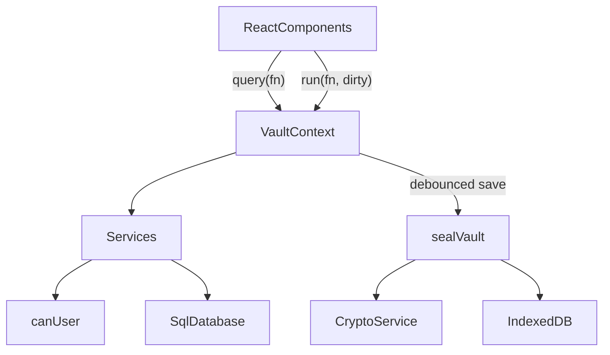

# Developer guide

This guide explains how Moliya is built and how to continue it safely. Read the [README](../README.md) first for the product overview.

## Setup

- Node.js 20.19+ or 22.12+ (CI uses 22). npm comes with it.
- `npm install`
- `npm run dev` starts Vite on port 5173 with the cross-origin isolation headers.
- `npm test` runs unit tests in Node (no browser needed).
- `npx playwright install chromium` once, then `npm run test:e2e`. Playwright starts the dev server itself, or reuses one already running on port 5173 outside CI.
- `npm run build` runs `tsc --noEmit` and then `vite build` into `dist/`. `npm run preview` serves `dist/`.

## Architecture

Everything runs in the browser. There is no backend.



### Encryption

Implemented in `src/crypto/crypto.service.ts`, orchestrated in `src/services/auth.service.ts`.

- **DEK (vault key)**: `generateDek()` creates a random, extractable AES-GCM-256 key. It exists only in memory while unlocked.
- **KEK (personal key)**: `deriveKeyAndVerifier(password, salt)` runs PBKDF2-SHA-256 (200,000 iterations) over a 32-byte random salt and imports the 256 bits as a non-extractable AES-GCM key with `wrapKey`/`unwrapKey` usage. The same bits, hex-encoded, are stored as `users.password_hash` (a verifier). Login does **not** compare it. Login succeeds only if unwrapping and GCM decryption succeed.
- **Wraps**: `wrapDek` and `unwrapDek` use AES-GCM `wrapKey('raw')` with a fresh 12-byte IV.
- **Snapshot**: `sqlite3_js_db_export` gives the database bytes, which are encrypted with `encryptDatabase` (fresh 12-byte IV per save).
- The spec's functions `deriveKey`, `encryptDatabase`, and `decryptDatabase` exist with the requested signatures.

### Storage record

`src/db/storage.ts` keeps one record in IndexedDB database `moliya`, object store `vault`, key `primary`:

```ts
type VaultRecord = {
  id: 'primary'
  version: 1
  kdf: { name: 'PBKDF2'; hash: 'SHA-256'; iterations: number }
  wraps: { userId; email; salt; iv; wrappedDek }[]   // ArrayBuffers, one per person
  payload: { iv; ciphertext }                        // the encrypted SQLite file
  updatedAt: string
}
```

The backup file (`src/services/backup.service.ts`) is the same record as JSON with `format: 'moliya-vault'`, `version: 1`, and base64 fields. Imports are rejected unless `kdf.iterations === 200000`.

### SQLite

`src/db/sqlite.ts` wraps `@sqlite.org/sqlite-wasm` OO1 API in `SqlDatabase`:

- `openEmpty()` and `openBytes(bytes)` (uses `sqlite3_deserialize` with `FREEONCLOSE | RESIZEABLE`).
- `exec`, `query`, `queryOne`, `queryValue` with positional `?` parameters. BigInts are converted to numbers, and blobs are returned as `null` (store binary data as text).
- `withTransaction(fn)` for `BEGIN`/`COMMIT`/`ROLLBACK`.
- `export()` returns the database bytes.

The database is always in memory on the main thread. OPFS is deliberately not used, because it would store plaintext on disk. Vite emits `sqlite3-worker1` and `sqlite3-opfs-async-proxy` assets from the package even though they are unused.

Schema: `src/db/schema.sql` (roles, groups, users, categories, transactions, audit_logs, settings). Seed data: `src/db/seed.ts`. Settings keys: `currency`, `vault_name`.

### Session and saving

`src/context/VaultContext.tsx` owns the unlocked `OpenVault` (`db`, `dek`, `wraps`, `user`, `currency`, `vaultName`) in a ref so it never re-renders or leaks into React state.

- `query(fn)` runs a synchronous read.
- `run(fn, { dirty: true })` runs a write, refreshes the user snapshot, bumps `revision`, and schedules a save.
- Saves are serialized through a promise chain. They are triggered 800 ms after the last change, every 5 seconds while dirty, on `pagehide` and `visibilitychange` to hidden, before lock, and before export. Unload saves are best effort, because browsers may kill the page before IndexedDB finishes.
- Status flows: `checking` → `setup` or `locked` → `ready`. `error` means IndexedDB could not be read.

Components read data with `useMemo(() => query(...), [query, revision, ...])`, so any write re-renders the lists.

### RBAC

`src/rbac/index.ts` defines `Permission`, `permissionsForRole(role)`, and `canUser(user, permission)`.

Permissions are stored in the `roles` table as JSON, and `loadUser` reads them from the database. `syncRolePermissions` (`src/db/seed.ts`) rewrites that JSON from `permissionsForRole` on every unlock, before `loadUser`, so changes to the matrix reach existing vaults and backups without a migration. It only updates the three built-in roles; adding a new role still needs a migration.

Every service function checks `canUser` and, for non-admins, restricts to `user.groupId`. UI hiding (`AppShell` navigation, buttons in `Timeline`) is a convenience, not the guard.

### Services

| File | Responsibility |
| --- | --- |
| `auth.service.ts` | Create vault, unlock, seal, email and password validation, `loadUser` |
| `user.service.ts` | List, create, reset password, update, delete users. Keeps `vault.wraps` in sync |
| `group.service.ts` | List, create, delete groups |
| `finance.service.ts` | Categories, transaction CRUD, validation, dashboard aggregation |
| `settings.service.ts` | Vault name and currency (`updateVaultSettings`, also updates `vault.vaultName` and `vault.currency`), category create, update, and delete. Gated by `MANAGE_SETTINGS` |
| `audit.service.ts` | `writeAudit` (call inside the same transaction as the change) and `listAudit` |
| `backup.service.ts` | Record to and from backup JSON, `noteExport` |

Errors are `AppError` subclasses with a string code (`src/domain/errors.ts`). `src/lib/errors.ts` maps codes to translated messages. Add a case there when you add a code.

### UI

- Routing: `HashRouter` in `src/App.tsx`. `/setup`, `/login`, and `/app/*` are guarded by vault status.
- `AppShell.tsx`: navigation filtered by permission, top bar with the sidebar collapse toggle, and `PeriodProvider` (the shared period for dashboard and ledger). The collapsed state is `data-sidebar` on `app-shell`; desktop shrinks the nav to a 76px icon rail, mobile hides the nav row.
- Pages: `Dashboard.tsx`, `Timeline.tsx` (ledger and form), `AdminPages.tsx` (users, groups, audit, backup), `SettingsPage.tsx` (vault name, currency, categories), and `AuthScreens.tsx` (setup, login).
- Long values: grid and flex children that hold text need `min-w-0`, or they refuse to shrink and overflow. KPI figures use a container query (`@container` on the card, `clamp(…, 9cqi, …)` on the value) so they scale with the card, not the viewport. `formatMoney` drops the fraction for whole amounts.
- Charts: `Charts.tsx` registers only the Chart.js pieces that are used, and picks colors from the resolved theme.
- Styling: Tailwind 4 with design tokens in `src/index.css` (`paper`, `card`, `ink`, `muted`, `line`, `pine`, `clay`, `brass`, `brass-soft`, `on-pine`). Dark mode is the `.dark` class on `<html>`, set by `ThemeContext`.
- i18n: `src/i18n/en.ts` is the source of truth. `Messages = typeof en`, so TypeScript forces `ru`, `uz-Latn`, and `uz-Cyrl` to have the same keys. `t('section.key')` is type-checked.
- Local storage keys: `moliya.locale`, `moliya.theme`, and `moliya.sidebar` (`collapsed` or `expanded`).

## Project layout

```text
.github/workflows/deploy.yml   CI and GitHub Pages deploy
index.html                     loads coi-serviceworker.js before the app
public/coi-serviceworker.js    vendored v0.1.7 (MIT), not bundled
src/
  App.tsx, main.tsx, index.css
  components/                  pages and UI pieces
  context/                     Vault, I18n, Theme, Period providers
  crypto/                      Web Crypto wrappers, byte helpers
  db/                          schema, seed, SQLite wrapper, IndexedDB record
  domain/                      shared types and error classes
  i18n/                        en, ru, uz-Latn, uz-Cyrl dictionaries
  lib/                         dates, money formatting, error messages
  rbac/                        permissions
  services/                    business logic
tests/
  unit/                        Vitest: crypto, rbac, i18n, dates, full vault flow
  e2e/                         Playwright: setup, roles, records, theme, backup
```

## Conventions

- Keep crypto, db, rbac, and services free of React so they stay testable in Node.
- Every write goes through a service that checks permission and group scope, and writes an audit entry in the same transaction.
- Call writes from the UI through `run(..., { dirty: true })`. Never touch `vault.db` directly from a component.
- All user-visible text goes through `t()`. Add the English key first, then the other three.
- Give interactive elements a `data-testid` when tests need them.
- Comments only for constraints the code cannot show.
- Run `npm test`, `npm run build`, and `npm run test:e2e` before pushing. CI runs all three.

## Common tasks

### Add a translated string

1. Add the key to `src/i18n/en.ts`.
2. `npx tsc --noEmit` now fails for the other three files. Add the translations there.
3. `tests/unit/i18n.test.ts` checks that all four locales have identical keys and no empty values.

### Add a page

1. Create the component in `src/components/`.
2. Add a route under `/app` in `src/App.tsx`.
3. Add a navigation entry in `AppShell.tsx` with the permission it needs, and an icon from `lucide-react`.
4. Guard the page itself with `canUser` and the service calls with permission checks.

### Add a service write

```ts
export function renameGroup(vault: OpenVault, groupId: number, name: string): void {
  if (!canUser(vault.user, Permission.MANAGE_GROUPS)) throw new ForbiddenError()
  const trimmed = name.trim()
  if (!trimmed) throw new ValidationError('REQUIRED')
  vault.db.withTransaction(() => {
    vault.db.exec('UPDATE groups SET name = ? WHERE id = ?', [trimmed, groupId])
    writeAudit(vault.db, vault.user.id, 'GROUP_RENAMED', 'group', String(groupId), { name: trimmed })
  })
}
```

Then call it from the UI with `run((vault) => renameGroup(vault, id, name), { dirty: true })`, and add `audit.actions.GROUP_RENAMED` to all four dictionaries.

### Change the schema

There is **no migration system yet**. `applySchema` runs only in `createVault`, so existing vaults keep their old tables. Permission changes for the built-in roles are handled by `syncRolePermissions`, but before changing the schema or adding roles, add migrations that run on unlock, for example with `PRAGMA user_version`:

```ts
const MIGRATIONS: ((db: SqlDatabase) => void)[] = [
  () => {}, // version 1: initial schema
  (db) => db.exec('ALTER TABLE groups ADD COLUMN color TEXT'),
]

export function migrate(db: SqlDatabase): boolean {
  const current = Number(db.queryValue('PRAGMA user_version') ?? 0) || 1
  if (current >= MIGRATIONS.length) return false
  db.withTransaction(() => {
    for (let version = current; version < MIGRATIONS.length; version += 1) MIGRATIONS[version](db)
  })
  db.exec(`PRAGMA user_version = ${MIGRATIONS.length}`)
  return true
}
```

Call it in `unlockVault` after `openBytes`, set `user_version` in `createVault`, and mark the vault dirty when a migration ran. Old backups then upgrade on first unlock.

### Change the storage or backup format

Bump `version` in `VaultRecord` and `BackupFile`, keep reading version 1, and add a unit test that opens a version 1 fixture.

## Tests

- **Unit** (`tests/unit`, Node environment, real `crypto.subtle`, the Node build of sqlite-wasm through `resolve.conditions`):
  - `crypto.service.test.ts`: parameters, key properties, deterministic verifier, AES-GCM roundtrip, tamper rejection, and DEK wrapping with right and wrong passwords.
  - `rbac.test.ts`: the permission matrix, including `canUser(user, 'DELETE_TRANSACTION')`.
  - `i18n.test.ts`: key parity across the four locales.
  - `dates.test.ts`: period presets.
  - `vault.test.ts`: create, record, dashboard totals, add viewer, wrong password, backup roundtrip, viewer scoping, and forbidden write.
  - `settings.test.ts`: vault name and currency surviving seal and unlock, category add, rename, and delete guards, non-admin refusal, and permission sync for an older vault.
- **End to end** (`tests/e2e/vault.spec.ts`, Chromium): first-run setup, adding records, dashboard values and charts, language switch, theme switch, settings and categories, the persisted sidebar toggle, admin creating a Manager and a Viewer, the viewer being read-only, and export then import into a fresh browser context.

Each Playwright test gets a fresh browser context, so IndexedDB starts empty. The warning "localStorage is not available" during unit tests comes from Node and is harmless.

## Known gaps and next steps

Roughly in priority order:

1. **Schema migrations** (see above). Needed before any schema change or new role.
2. **Vault key rotation.** On user removal, password reset, or on demand: generate a new DEK, re-encrypt, and re-wrap for the remaining users. Today a removed person with an old copy can still decrypt new copies.
3. **UI for existing services**: change a user's role or group (`updateUser` exists), rename groups, and let people change their own password.
4. **Cryptographic group isolation**, if groups must be hidden from each other. This needs per-group keys or separate vaults.
5. **Bundle size** (about 750 KB minified): lazy-load Chart.js and the admin pages. Consider loading sqlite-wasm after the login form renders.
6. **Receipts in the database.** Images are stored as data URLs inside SQLite, and the whole database is re-encrypted on every save. Consider a separate encrypted IndexedDB store for attachments.
7. **Exchange rates** or per-currency totals on the dashboard.
8. **CSV export** of the decrypted ledger for spreadsheets.
9. **A separate `IMPORT_VAULT` check.** The permission exists, but the backup page is gated by `EXPORT_VAULT` only.
10. **Content Security Policy.** Add a `<meta http-equiv="Content-Security-Policy">` once inline scripts in `index.html` are moved to files.
11. **Offline support**: a caching service worker that coexists with `coi-serviceworker`.
12. **Multi-device sync.** Out of scope for a serverless design today. Any future sync must merge, not overwrite.
