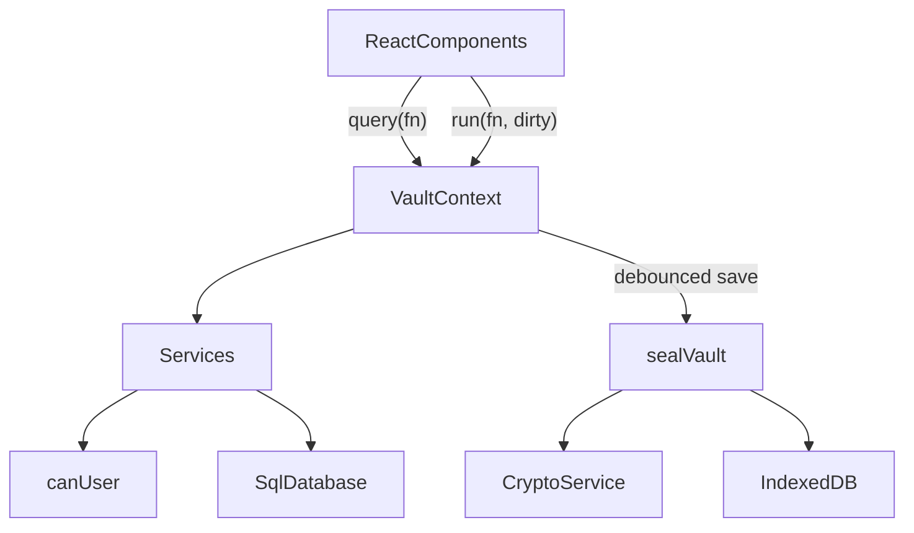

# Developer guide

This guide explains how Moliya is built and how to continue it safely. Read the [README](../README.md) first for the product overview.

## Setup

- Node.js 22.12+ (`.nvmrc` pins the major version CI uses). npm comes with it.
- `npm install`
- `npm run dev` starts Vite on port 5173 with the cross-origin isolation headers.
- `npm run typecheck` runs `tsc --noEmit`. `npm test` runs unit tests in Node (no browser needed).
- `npx playwright install chromium` once, then `npm run test:e2e` (against the dev server) or `npm run test:e2e:preview` (builds, then tests the production bundle on port 4173 with the Content Security Policy active, as CI does).
- `npm run build` runs `tsc --noEmit` and then `vite build` into `dist/`. `npm run preview` serves `dist/`.
- `npm run decrypt -- <file.moliya> --list` runs the standalone recovery tool.

## Architecture

Everything runs in the browser. There is no backend.



### Encryption

Implemented in `src/crypto/crypto.service.ts`, orchestrated in `src/services/auth.service.ts`. The byte-level format is specified in [data-format.md](data-format.md).

- **DEK (vault key)**: `generateDek()` creates a random, extractable AES-GCM-256 key. It exists only in memory while unlocked.
- **KEK (personal key)**: `deriveKeyAndVerifier(password, salt, kdf)` runs PBKDF2 with the wrap's own parameters and imports the 256 bits as a non-extractable AES-GCM key. New wraps use `CURRENT_KDF` (PBKDF2-SHA-256, 600,000 iterations, the OWASP 2023+ figure). `isKdfParams` accepts any hash in `KDF_HASHES` and iterations within `KDF_ITERATION_BOUNDS`, so every parameter set ever written still opens. The same bits, hex-encoded, are stored as `users.password_hash`. Login does **not** compare it; it succeeds only if unwrapping and GCM decryption succeed.
- **Re-wrap on login**: when `kdfNeedsUpgrade(wrap.kdf)`, `unlockVault` wraps the same DEK with a fresh salt and `CURRENT_KDF`, verifies the new wrap, and writes `CREDENTIALS_UPGRADED`. The session is marked `needsSave` and saved immediately.
- **Wraps**: `wrapDek` and `unwrapDek` use AES-GCM `wrapKey('raw')` with a fresh 12-byte IV.
- **Snapshot**: `sqlite3_js_db_export` gives the database bytes, which are encrypted with `encryptDatabase` (fresh 12-byte IV per save).

### Storage record and backups

- `src/db/versions.ts` holds `SCHEMA_VERSION`, `RECORD_VERSION`, and `BACKUP_VERSION`.
- `src/db/envelope.ts` is the only place that reads or writes record and backup layouts. `decodeStoredRecord` and `parseBackupJson` accept every released version (1 and 2), validate lengths and KDF bounds, and throw `FormatTooNewError` for anything newer. `toBackupJson` writes the current version; `storedToBackupJson` re-emits an archived version 1 record as the exact version 1 backup.
- `src/db/storage.ts` is the IndexedDB layer. `writeVault(record, { expectedStamp, archive })` does a compare-and-swap on `updatedAt` and, when asked, stores the replaced record under `archive:<time>:<reason>` in the same transaction (at most `MAX_ARCHIVES`).
- `src/services/backup.service.ts` builds file names and text, records `last_backup_at`, and computes the stale-backup reminder (`BACKUP_STALE_DAYS`).

### SQLite

`src/db/sqlite.ts` wraps `@sqlite.org/sqlite-wasm` OO1 API in `SqlDatabase`:

- `openEmpty()` and `openBytes(bytes)` (uses `sqlite3_deserialize` with `FREEONCLOSE | RESIZEABLE`).
- `exec`, `query`, `queryOne`, `queryValue` with positional `?` parameters. BigInts are converted to numbers, and blobs are returned as `null` (store binary data as text).
- `withTransaction(fn)` for `BEGIN`/`COMMIT`/`ROLLBACK`.
- `export()` returns the database bytes.

The database is always in memory on the main thread. OPFS is deliberately not used, because it would store plaintext on disk. Vite emits `sqlite3-worker1` and `sqlite3-opfs-async-proxy` assets from the package even though they are unused.

Schema: built only by migrations in `src/db/migrations/` (`0001-baseline.sql`, `0002-exact-money.ts`, listed in `index.ts`). `migrate(db, { appVersion })` runs on create, unlock, and therefore import. Seed data: `src/db/seed.ts`. Settings keys: `currency`, `vault_name`, `vault_created_at`, `last_backup_at`.

Money is stored as `transactions.amount_minor` (integer minor units, ISO 4217 exponent from the `currencies` table). `src/lib/money.ts` is the only place that converts: `parseAmount(text, currency)` accepts `.` or `,` as the decimal separator and spaces as grouping, and rejects extra decimals (`AMOUNT_PRECISION`) or amounts over `MAX_AMOUNT_MINOR`. Display uses `formatMoney(minor, …)`, inputs use `minorToDecimal`, charts use `toMajor`. Percentages use `percentOf` (exact, half-even). Never add amounts of different currencies.

The audit log is append-only and hash-chained (`src/db/audit-chain.ts`). `writeAudit` must run inside the same transaction as the change; `auditIntegrity` re-verifies the chain for the Audit page.

### Session and saving

`src/context/VaultContext.tsx` owns the unlocked `OpenVault` (`db`, `dek`, `wraps`, `user`, `currency`, `vaultName`, `createdAt`, `lastBackupAt`) in a ref so it never re-renders or leaks into React state.

- `query(fn)` runs a synchronous read.
- `run(fn, { dirty: true })` runs a write, refreshes the user snapshot, bumps `revision`, and schedules a save.
- Saves are serialized through a promise chain. They are triggered 800 ms after the last change, every 5 seconds while dirty, on `pagehide` and `visibilitychange` to hidden, before lock, and before export. Unload saves are best effort, because browsers may kill the page before IndexedDB finishes.
- Every save is a compare-and-swap against the `updatedAt` the session loaded. A mismatch (another tab, an import, an old cached build) sets save state `conflict` and stops autosave instead of overwriting.
- Unlock takes the Web Lock `moliya-vault-session` (`src/lib/session-lock.ts`); a second tab gets `VAULT_IN_USE`. Lock releases it.
- If unlock migrated the schema or upgraded a record, the first save stores the untouched original as an `upgrade` archive in the same IndexedDB transaction.
- After unlock or setup the app calls `navigator.storage.persist()` (`src/lib/persistence.ts`) so the browser does not evict the vault under storage pressure or, in Safari, after 7 days without a visit.
- Status flows: `checking` → `setup` or `locked` → `ready`. `error` means the stored record could not be read; `bootError` holds the error code (`FORMAT_TOO_NEW`, `RECORD_INVALID`, or a raw message).

Components read data with `useMemo(() => query(...), [query, revision, ...])`, so any write re-renders the lists.

### RBAC

`src/rbac/index.ts` defines `Permission`, `permissionsForRole(role)`, and `canUser(user, permission)`.

Permissions are stored in the `roles` table as JSON, and `loadUser` reads them from the database. `syncRolePermissions` (`src/db/seed.ts`) rewrites that JSON from `permissionsForRole` on every unlock, before `loadUser`, so changes to the matrix reach existing vaults and backups without a migration. It only updates the three built-in roles; adding a new role still needs a migration.

Every service function checks `canUser` and, for non-admins, restricts to `user.groupId`. UI hiding (`AppShell` navigation, buttons in `Timeline`) is a convenience, not the guard.

### Services

| File | Responsibility |
| --- | --- |
| `auth.service.ts` | Create vault, unlock, seal, email and password validation, `loadUser` |
| `user.service.ts` | List, create, reset password, update, delete users. Keeps `vault.wraps` in sync |
| `group.service.ts` | List, create, delete groups |
| `finance.service.ts` | Categories, transaction CRUD, validation, dashboard aggregation |
| `settings.service.ts` | Vault name and currency (`updateVaultSettings`, also updates `vault.vaultName` and `vault.currency`), category create, update, and delete. Gated by `MANAGE_SETTINGS` |
| `audit.service.ts` | `writeAudit` (call inside the same transaction as the change), `listAudit`, `auditIntegrity` |
| `backup.service.ts` | Backup file text and names, `noteExport`, `backupReminder` |
| `export.service.ts` | Plaintext CSV and SQLite exports (gated by `EXPORT_VAULT`, audited) |
| `fx.service.ts` | Exchange-rate snapshot fetch, verification, and cache; converter input parsing. Needs no vault or permission |

Errors are `AppError` subclasses with a string code (`src/domain/errors.ts`). `src/lib/errors.ts` maps codes to translated messages. Add a case there when you add a code.

### Exchange rates

The dashboard panel shows official USD rates for UZS, KRW, and ILS in both directions. It is public reference data, so it lives outside the vault and has no permission check.

```text
fx-rates.yml (cron) → tools/fetch-rates.ts → validate + cross-check → fx-data branch → gh-pages /rates/
browser → ./rates/latest.json (same origin) → parseSnapshot (digest, schema, bounds) → localStorage → panel
```

Why a scheduled job instead of calling the banks from the browser: the Bank of Israel and the ECB's daily XML send no CORS headers, the Bank of Korea API needs a private key, and a direct call would tell every central bank (and any proxy) who uses Moliya and when. The job keeps `connect-src 'self'` in the CSP, gives every user the same audited numbers, and archives the raw upstream bytes.

| Pair | Primary source | Fallbacks |
| --- | --- | --- |
| USD/UZS | [Central Bank of Uzbekistan](https://cbu.uz/en/arkhiv-kursov-valyut/) JSON, official rate | none (a missing rate is carried forward) |
| USD/KRW | [ECB](https://data-api.ecb.europa.eu/) cross: EUR/KRW ÷ EUR/USD | CBU cross: USD/UZS ÷ KRW/UZS (CBU publishes KRW to 2 decimals only) |
| USD/ILS | [Bank of Israel](https://www.boi.org.il/en/economic-roles/financial-markets/exchange-rates/) SDMX, representative rate `RER_USD_ILS` | ECB cross, then CBU cross |

The publisher refuses to write a snapshot (and the job fails) when a response does not parse, a rate is outside `FX_BOUNDS`, the primary and an independent reference disagree by more than 1.5% (ECB/BOI) or 2% (CBU cross, and CBU's implied EUR/USD against the ECB's), or a rate moves more than 10% against the published one without `--allow-large-moves`. A source that is down is replaced by its fallback, or by the previous quote with its old date, and the run is marked degraded. The snapshot format is in [data-format.md](data-format.md#published-exchange-rate-snapshot).

Decimal policy:

- Money and rates never pass through `number`. `src/lib/decimal.ts` is a small BigInt decimal in the style of Java's `BigDecimal` (unscaled integer and scale, `divide` with an explicit scale or precision, `HALF_EVEN` by default). It accepts only strings and bigints. It was chosen over decimal.js, big.js, and bignumber.js to stay dependency-free and to share one implementation between the browser and the Node publisher; the randomized test compares it against exact rational bounds.
- Official rates are kept and shown as published. Cross rates are stored to 12 significant digits (`CROSS_PRECISION`), with the two official legs kept beside them so the client can recompute and verify them.
- Inverse and derived rates are displayed to 6 significant digits (`DISPLAY_PRECISION`).
- The converter computes amount × (numerator ÷ denominator of the official legs) and rounds once, half-even, to the ISO 4217 minor unit (`FX_MINOR_UNITS`: USD 2, UZS 2, KRW 0, ILS 2). It never rounds a rounded rate again. The unrounded value is shown to 20 significant digits.
- `formatDecimal` takes only separators from `Intl.NumberFormat` and groups the digit string itself.
- `tests/unit/fx-exactness.test.ts` fails the build if `parseFloat`, `Number(`, `toFixed`, `Math.round`, and similar appear in the exchange-rate code.

`src/domain/fx.ts`, `src/lib/decimal.ts`, and `src/lib/sha256.ts` are also run by Node through type stripping (`node --experimental-strip-types`), so they import with explicit `.ts` extensions, use `import type` for types, and avoid enums and parameter properties.

KRW and ILS are converter currencies only (`FX_MINOR_UNITS`), not ledger currencies. Adding them to `CURRENCY_MINOR_UNITS` would need a vault migration, because `transactions.currency` references the `currencies` table. A test keeps the two registries in agreement for USD and UZS.

### UI

- Routing: `HashRouter` in `src/App.tsx`. `/setup`, `/login`, and `/app/*` are guarded by vault status. Every page under `/app` is loaded with `React.lazy`, the dashboard loads Chart.js lazily, and `src/db/sqlite.ts` imports sqlite-wasm on first use, so the first screen only needs React.
- Versioning: `tools/build-info.ts` injects `__APP_VERSION__`, `__BUILD_COMMIT__`, and `__BUILD_DATE__` (read through `src/lib/version.ts`) and the build writes `version.json`. `UpdateBanner` polls it in production and offers a reload (locking first) when a new build is deployed. The version shows in the sidebar, on the sign-in screens, and in Settings → About.
- `AppShell.tsx`: navigation filtered by permission, top bar with the sidebar collapse toggle, and `PeriodProvider` (the shared period for dashboard and ledger). The collapsed state is `data-sidebar` on `app-shell`; desktop shrinks the nav to a 65px icon rail, mobile hides the nav row.
- Pages: `Dashboard.tsx`, `Timeline.tsx` (ledger and form), `AdminPages.tsx` (users, groups, audit, backup), `SettingsPage.tsx` (vault name, currency, categories), and `AuthScreens.tsx` (setup, login).
- Long values: grid and flex children that hold text need `min-w-0`, or they refuse to shrink and overflow. KPI figures use a container query (`@container` on the card, `clamp(…, 9cqi, …)` on the value) so they scale with the card, not the viewport. `formatMoney` drops the fraction for whole amounts.
- Charts: `Charts.tsx` registers only the Chart.js pieces that are used, and picks colors from the resolved theme.
- Styling: Tailwind 4 with design tokens in `src/index.css` (`paper`, `card`, `ink`, `muted`, `line`, `pine`, `clay`, `brass`, `brass-soft`, `on-pine`, `pine-ink`, `clay-ink`). `pine`/`clay` are dark green/red fills in both themes; use `text-pine-ink`/`text-clay-ink` for green/red text (lighter in dark mode for AA contrast). Dark mode is the `.dark` class on `<html>`, set by `ThemeContext`.
- i18n: `src/i18n/en.ts` is the source of truth. `Messages = typeof en`, so TypeScript forces `ru`, `uz-Latn`, and `uz-Cyrl` to have the same keys. `t('section.key')` is type-checked.
- Exchange rates: `ExchangeRates.tsx` is lazy-loaded by the dashboard in its own `Suspense`, and a failed chunk renders nothing, so the panel can never block the dashboard.
- Local storage keys: `moliya.locale`, `moliya.theme`, `moliya.sidebar` (`collapsed` or `expanded`), and `moliya.fx.snapshot.v1` (the last verified rates snapshot, public data).

## Project layout

```text
.github/workflows/             ci.yml (checks), deploy.yml (main → Pages), release.yml (tags), codeql.yml, fx-rates.yml (rates)
.github/dependabot.yml         weekly npm and Actions updates
index.html                     loads coi-config.js and coi-serviceworker.js before the app
public/coi-serviceworker.js    vendored v0.1.7 (MIT), not bundled
src/
  App.tsx, main.tsx, index.css
  components/                  pages and UI pieces
  context/                     Vault, I18n, Theme, Period providers
  crypto/                      Web Crypto wrappers, byte helpers
  db/                          versions, envelope, IndexedDB, migrations, audit chain, SQLite wrapper, seed
  domain/                      shared types and error classes; fx.ts (rates, validation, conversion)
  i18n/                        en, ru, uz-Latn, uz-Cyrl dictionaries
  lib/                         money, decimal, dates, version, updates, persistence, session lock, sha256, errors
  rbac/                        permissions
  services/                    business logic
tests/
  fixtures/backups/            golden backups from every release (immutable, SHA-256 pinned)
  fixtures/fx/                 recorded CBU, ECB, and BOI responses and the snapshot they produce
  support/                     fixture helpers shared by tests
  unit/                        Vitest
  e2e/                         Playwright
tools/
  build-info.ts                version, commit, and build date for the bundle
  fetch-rates.ts               exchange-rate publisher (npm run rates:fetch)
  fx-sources.ts                CBU, ECB, and BOI URLs and parsers
  fixtures/<version>/          generators that produced each fixture set
  moliya-decrypt.mjs           dependency-free recovery CLI
```

## Conventions

- Keep crypto, db, rbac, and services free of React so they stay testable in Node.
- Every write goes through a service that checks permission and group scope, and writes an audit entry in the same transaction.
- Call writes from the UI through `run(..., { dirty: true })`. Never touch `vault.db` directly from a component.
- All user-visible text goes through `t()`. Add the English key first, then the other three.
- Give interactive elements a `data-testid` when tests need them.
- Comments only for constraints the code cannot show.
- Run `npm test`, `npm run build`, and `npm run test:e2e` before pushing. CI runs all three.

## Common tasks

### Add a translated string

1. Add the key to `src/i18n/en.ts`.
2. `npx tsc --noEmit` now fails for the other three files. Add the translations there.
3. `tests/unit/i18n.test.ts` checks that all four locales have identical keys and no empty values.

### Add a page

1. Create the component in `src/components/`.
2. Add a route under `/app` in `src/App.tsx`.
3. Add a navigation entry in `AppShell.tsx` with the permission it needs, and an icon from `lucide-react`.
4. Guard the page itself with `canUser` and the service calls with permission checks.

### Add a service write

```ts
export function renameGroup(vault: OpenVault, groupId: number, name: string): void {
  if (!canUser(vault.user, Permission.MANAGE_GROUPS)) throw new ForbiddenError()
  const trimmed = name.trim()
  if (!trimmed) throw new ValidationError('REQUIRED')
  vault.db.withTransaction(() => {
    vault.db.exec('UPDATE groups SET name = ? WHERE id = ?', [trimmed, groupId])
    writeAudit(vault.db, vault.user.id, 'GROUP_RENAMED', 'group', String(groupId), { name: trimmed })
  })
}
```

Then call it from the UI with `run((vault) => renameGroup(vault, id, name), { dirty: true })`, and add `audit.actions.GROUP_RENAMED` to all four dictionaries.

### Change the schema

1. Add `src/db/migrations/000N-short-name.ts` (or `.sql` imported with `?raw`) and append `{ version: N, name, up }` to `MIGRATIONS`. Never edit a released migration.
2. Bump `SCHEMA_VERSION` in `src/db/versions.ts`. `assertMigrationsMatchSchemaVersion` and the migrations test fail if they disagree.
3. Each migration runs in its own transaction with foreign keys off, followed by `PRAGMA foreign_key_check`, `user_version`, and a `schema_migrations` row. Throw to abort: that migration rolls back, the stored encrypted record is never touched (migrations run on the in-memory copy), and the user sees `MIGRATION_FAILED`. `PRAGMA quick_check` runs after the last step.
4. Prefer `CHECK` constraints over `STRICT` tables so older SQLite tools can still read exported files.
5. Add tests in `tests/unit/migrations.test.ts` against the previous version's fixtures, then follow [Changing a format](data-format.md#changing-a-format) for the release fixture.

### Add an exchange-rate pair

1. Add the quote currency to `FX_QUOTES`, `FX_MINOR_UNITS`, `FX_BOUNDS`, and `FX_DIRECTIONS` in `src/domain/fx.ts`, and `fx.currencies` in all four dictionaries.
2. Parse it in `tools/fx-sources.ts` and choose its primary source, fallbacks, and cross-check in `tools/fetch-rates.ts`. Prefer the issuing central bank; check its CORS and licence terms even though the job runs server-side.
3. Record fresh responses with `npm run rates:fetch -- --out <dir>` (the raw bytes land in `<dir>/archive/<date>/`), copy them to `tests/fixtures/fx`, and regenerate `snapshot.json` with `--replay tests/fixtures/fx --now <fetch time>`.
4. Changing the shape of a quote means a new `FX_SCHEMA` and cache key. Old builds reject the new file and keep showing their cached rates as stale.

### Change the storage or backup format

Bump `RECORD_VERSION` or `BACKUP_VERSION`, add a new branch in `src/db/envelope.ts` while keeping every existing one, rename or add a field that older builds will fail on rather than misread, update [data-format.md](data-format.md), and add a fixture from the release.

## Tests

- **Unit** (`tests/unit`, Node environment, real `crypto.subtle`, the Node build of sqlite-wasm through `resolve.conditions`):
  - `fixtures.test.ts`: every golden backup in `tests/fixtures/backups` opens for every person with exact records, totals, and an intact audit chain; survives upgrade, re-seal, and a new backup; and 1.0.0's IndexedDB record re-exports byte for byte. Fails if a fixture changes or a format version has no fixture.
  - `migrations.test.ts`: 1.0.0 detection, float-to-minor conversion, identical schema for upgraded and new databases, append-only audit log, full rollback of a failing migration, refusal of newer schemas.
  - `envelope.test.ts`: version 1 and 2 records and backups, KDF bounds, tamper cases, newer-format refusal.
  - `money.test.ts`: parsing, legacy conversion, formatting, percentages.
  - `archival.test.ts`: SHA-256 against Node, audit tamper detection, CSV and SQLite exports, update detection.
  - `decrypt-cli.test.ts`: the recovery CLI against every fixture.
  - `crypto.service.test.ts`, `rbac.test.ts`, `i18n.test.ts`, `dates.test.ts`, `vault.test.ts`, `settings.test.ts`: primitives, permissions, locale parity, periods, the full vault flow, and settings.
  - `decimal.test.ts`: parsing, arithmetic, half-even ties, and thousands of random divisions checked against exact rational bounds.
  - `fx.test.ts`, `fx.service.test.ts`: snapshot validation and tamper cases, staleness across weekends, conversions to minor units, display rates, cache, and rollback protection.
  - `fx-sources.test.ts`, `fetch-rates.test.ts`: parsers against the recorded responses in `tests/fixtures/fx`, a byte-for-byte reproduction of `snapshot.json`, fallbacks, carry-forward, cross-check and jump failures, and the CLI's files and exit codes.
  - `fx-exactness.test.ts`: no floating-point calls in the exchange-rate code, and `.ts` import specifiers in the modules Node runs.
- **End to end** (Chromium):
  - `vault.spec.ts`: setup, records, dashboard and charts, language and theme, settings and categories, sidebar, roles, and backup export and import.
  - `upgrade.spec.ts`: a real 1.0.0 IndexedDB record upgraded in the browser (records, totals, stored format, archive download), a 1.0.0 backup import, refusal of a newer or damaged record, the single-session lock, and no CSP violations in preview mode.
  - `exchange-rates.spec.ts`: the six directions, the converter, stale badges, error, retry, offline and cached states, tampered snapshots, and a 360px layout, with `rates/latest.json` served by `page.route`.

Each Playwright test gets a fresh browser context, so IndexedDB starts empty. The warning "localStorage is not available" during unit tests comes from Node and is harmless.

## Known gaps and next steps

Roughly in priority order:

1. **Vault key rotation.** On user removal, password reset, or on demand: generate a new DEK, re-encrypt, and re-wrap for the remaining users. Today a removed person with an old copy can still decrypt new copies.
2. **Separate the password verifier from the KEK.** `users.password_hash` equals the KEK bits. Derive the verifier with HKDF (or drop it, since login never compares it) in a future schema migration.
3. **Soft delete and corrections.** Records are hard-deleted; the audit log keeps the full snapshot. Accounting-style reversing entries or a `deleted_at` column would make history visible in the ledger itself.
4. **UI for existing services**: change a user's role or group (`updateUser` exists), rename groups, and let people change their own password.
5. **Cryptographic group isolation**, if groups must be hidden from each other. This needs per-group keys or separate vaults.
6. **Receipts outside the database.** Images are stored as data URLs inside SQLite, and the whole database is re-encrypted on every save.
7. **Mixed-currency totals.** Official rates are now on the dashboard, but totals are still per currency. If conversion is ever needed, store the rate, its date, and its source with each converted figure; never convert silently. KRW and ILS as ledger currencies need a vault migration.
8. **A separate `IMPORT_VAULT` check.** The permission exists, but the backup page is gated by `EXPORT_VAULT` only.
9. **Offline support**: a caching service worker that coexists with `coi-serviceworker`.
10. **Multi-device sync.** Out of scope for a serverless design today. Any future sync must merge, not overwrite.
