# Руководство пользователя Джайби

[English](../user-guide.md) · **Русский** · [Oʻzbekcha](../uz-Latn/user-guide.md) · [Ўзбекча](../uz-Cyrl/user-guide.md)

Джайби — это личная книга учёта для семьи и небольшого бизнеса, которая целиком работает в вашем браузере. Ваши записи, личные сейфы и настройки шифруются на вашем же устройстве и никуда не отправляются. Это руководство шаг за шагом, с картинками, проводит по всем экранам. Администраторы найдут здесь и свои дополнительные задачи: приглашение людей, резервные копии, настройки и журнал аудита. Технические подробности о размещении и восстановлении описывает [руководство администратора](../admin-guide.md).

## Содержание

- [Начало работы](#start)
- [Вход и блокировка](#sign-in)
- [Как здесь всё устроено](#around)
- [Роли: кто что может](#roles)
- [Обзор](#dashboard)
- [Учёт денег](#transactions)
- [Работа с таблицами](#tables)
- [Группы](#groups)
- [Люди и приглашения](#users)
- [Личные сейфы](#safes)
- [Резервные копии и перенос на другое устройство](#backup)
- [Настройки сейфа](#settings)
- [Ваш аккаунт](#account)
- [Журнал аудита](#audit)
- [Проверка состояния](#health)
- [Как пользоваться справкой](#help)
- [Обновления и версии](#updates)
- [Советы по безопасности](#security)
- [Решение проблем](#troubleshooting)
- [Вопросы и ответы](#faq)
- [Словарь](#glossary)

## Начало работы

### Где хранятся ваши данные

Джайби хранит всю книгу учёта в одном зашифрованном файле — **сейфе** — в одном браузере на одном устройстве. Нет ни аккаунта на сервере, ни копии в облаке. Отсюда три следствия, которые стоит знать с самого начала:

- Каждый раз открывайте Джайби в том же браузере на том же устройстве. Другой браузер, другой профиль браузера, приватное окно или другой телефон покажут пустой экран создания сейфа, потому что сейфа там нет.
- Никто не может сбросить за вас мастер-пароль или прочитать ваши данные — даже создатели Джайби.
- **Файл резервной копии** — единственная копия, которая уцелеет, если данные браузера удалят. Администраторам стоит регулярно его скачивать (см. [Резервные копии](#backup)).

Джайби работает в актуальных версиях Chrome, Edge, Firefox и Safari — на компьютерах и телефонах. Откройте его по адресу [https://jaybi.uz](https://jaybi.uz). До версии 1.3.0 Джайби назывался Moliya; старый адрес `kool277.github.io/iqtisod` перенаправляет на jaybi.uz.

### Создание сейфа (первый администратор)

Тот, кто создаёт сейф, становится его первым **администратором**.

1. Откройте Джайби. В правом верхнем углу выберите язык и тему.
2. В разделе **Создайте сейф** заполните поля **Название сейфа** (например, название семьи или бизнеса), **Почта администратора** и **Мастер-пароль**, затем введите тот же пароль ещё раз в поле **Повторите пароль**.
3. В поле **Валюта** выберите валюту, в которой будут считаться итоги. Её можно изменить позже в [настройках сейфа](#settings).
4. Нажмите **Создать зашифрованный сейф**. Шифрование занимает несколько секунд.

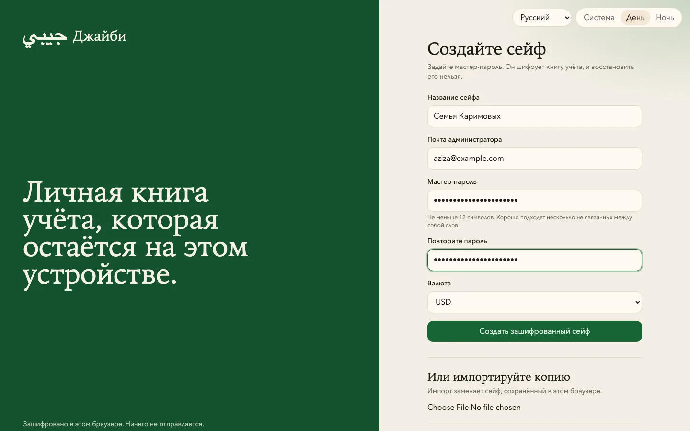

Выбирайте мастер-пароль внимательно: он шифрует сейф, и **восстановить его нельзя**. См. [Как выбрать пароль](#choosing-a-password).

Когда сейф готов, открывается обзор. Он пуст, пока кто-нибудь не внесёт записи.

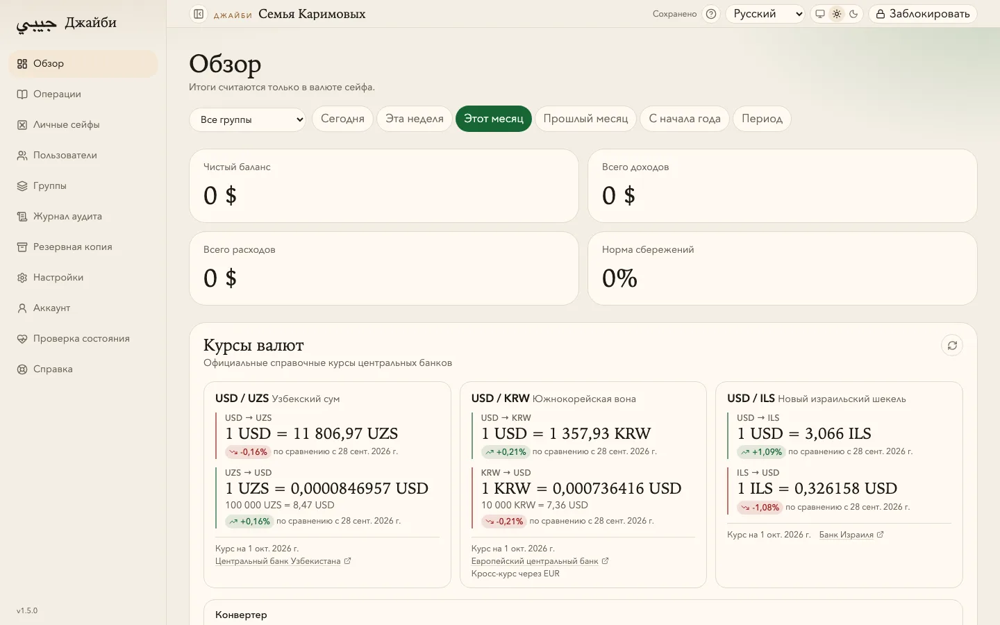

Если у вас уже есть резервная копия с другого устройства, не создавайте новый сейф: воспользуйтесь пунктом **Или импортируйте копию** внизу того же экрана (см. [Перенос на другое устройство](#moving)).

### Вход в сейф по одноразовому коду

Все, кроме первого администратора, присоединяются по **одноразовому коду** от администратора. Код выглядит как `XXXX-XXXX-XXXX-XXXX-XXXX-XXXX-XXXX`, срабатывает один раз, только для вашей почты и только до срока, который выбрал администратор.

1. Откройте Джайби в браузере, где хранится сейф. Если администратор прислал ссылку, откройте её: почта и код подставятся сами.
2. Иначе на экране **Открыть сейф** выберите **Есть одноразовый код? Присоединитесь к сейфу**.
3. Проверьте поля **Ваша почта** и **Одноразовый код**. Заглавные или строчные буквы, пробелы и дефисы не важны.
4. Введите пароль в поле **Придумайте пароль** и ещё раз в поле **Повторите пароль**, затем нажмите **Присоединиться**.

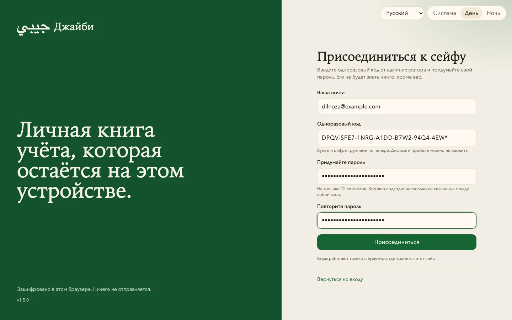

Вы сразу входите в сейф. Ваш пароль не знает никто другой, даже администратор.

Если Джайби пишет «В этом браузере пока нет сейфа», вы не на том устройстве или не в том браузере: код работает только там, где хранится сейф. Если сказано, что срок кода истёк или код не подходит, попросите у администратора новый.

## Вход и блокировка

### Как открыть сейф

1. Откройте Джайби. Вы увидите экран **Открыть сейф**.
2. Заполните поля **Почта** и **Пароль** и нажмите **Открыть**.

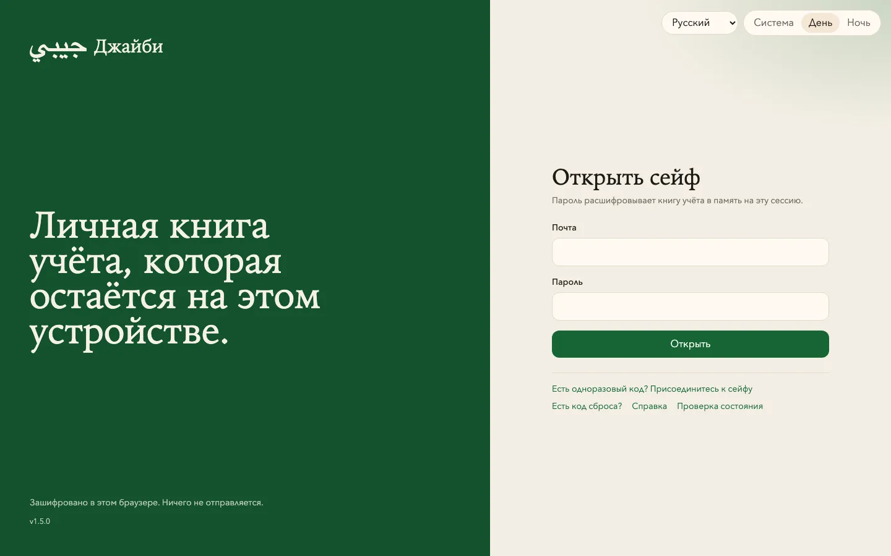

Открытие намеренно занимает немного времени: пароль «растягивается», чтобы подбирать его было медленно. Сообщение «Почта или пароль неверны.» появляется при любой из двух ошибок, поэтому никто не узнает, какие адреса почты существуют.

После пяти неверных попыток для одной почты Джайби показывает **Слишком много попыток. Повторите через** с обратным отсчётом, и с каждой новой ошибкой ожидание растёт — до 15 минут. Обновление страницы его не сокращает. После входа Джайби сообщает, сколько неудачных попыток войти в ваш аккаунт было в этом браузере с вашего прошлого визита. Если это были не вы, смените пароль.

Ссылки под формой доступны всем: **Есть одноразовый код? Присоединитесь к сейфу**, **Есть код сброса?**, **Справка** (это руководство) и **Проверка состояния** — она проверяет браузер, даже если вы не можете войти.

### Второй шаг (проверка при входе)

Если вы включили [проверку при входе](#sign-in-check), после пароля Джайби попросит 6-значный код из приложения-аутентификатора. Введите его в поле **Код** и нажмите **Продолжить**. Здесь подойдёт и код восстановления — один раз. Если ждать больше 5 минут или нажать **Отмена**, вы вернётесь на экран **Открыть сейф**.

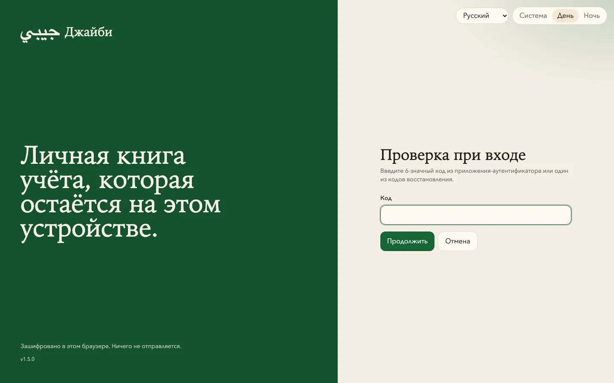

### Забыли пароль? Воспользуйтесь кодом сброса

В Джайби нет письма «забыли пароль», потому что нет сервера. Попросите у администратора **код сброса**, а затем:

1. На экране **Открыть сейф** выберите **Есть код сброса?** (или откройте ссылку от администратора).
2. Заполните поля **Ваша почта** и **Одноразовый код** и дважды введите новый пароль.
3. Нажмите **Задать новый пароль**. Вы войдёте уже с новым паролем.

Код сброса также отключает проверку при входе; включите её снова в разделе [Ваш аккаунт](#account). Если вы пользуетесь личными сейфами, сначала прочитайте [После сброса пароля администратором](#after-reset).

### Блокировка

Нажимайте **Заблокировать** в верхней панели каждый раз, когда отходите. Блокировка, обновление или закрытие вкладки убирают расшифрованные данные из памяти, и следующему человеку придётся войти. Джайби также блокируется сам после 15 минут бездействия; это можно изменить в разделе **Аккаунт → Автоматическая блокировка**. Тогда на экране входа появится сообщение «Сейф заблокирован из-за бездействия.»

Сейф можно открыть только в одной вкладке одновременно. Если Джайби пишет, что сейф уже открыт в другой вкладке или окне, перейдите в ту вкладку или сначала заблокируйте его там.

### Сохранение

Кнопки сохранения для сейфа нет. Надпись рядом с кнопкой справки в верхней панели показывает, что происходит:

- **Сохранено**: всё зашифровано и хранится в этом браузере.
- **Не сохранено** или **Шифруем…**: изменение сохраняется. Обычно это занимает около секунды.
- **Не удалось сохранить**: браузер отказался сохранять данные, например потому что диск заполнен. Не закрывайте вкладку и запустите [проверку состояния](#health).
- **Не сохранено: изменено в другом месте**: сейф изменили в другой вкладке. Заблокируйте сейф, войдите снова и повторите последнее изменение.

## Как здесь всё устроено

Меню слева показывает только то, что разрешает ваша роль. В верхней панели — название сейфа, состояние сохранения, кнопка **?**, которая открывает часть этого руководства о текущей странице, переключатели языка и темы и кнопка **Заблокировать**.

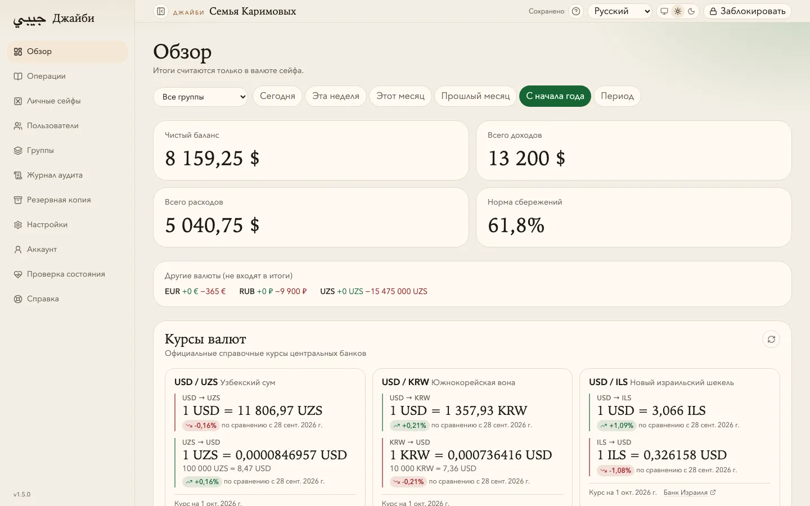

Кнопка у самого левого края верхней панели сворачивает меню до значков; нажмите её ещё раз, чтобы вернуть подписи. Джайби запоминает ваш выбор в этом браузере.

### На телефоне

На телефоне меню превращается в строку вверху, которую можно прокручивать вбок, а страницы выстраиваются в одну колонку. Таблицы превращаются в карточки.

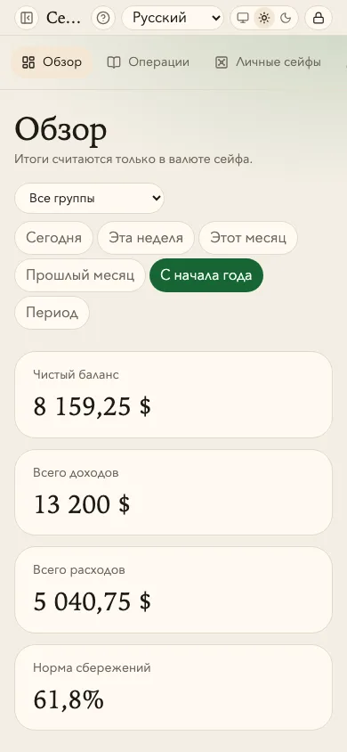

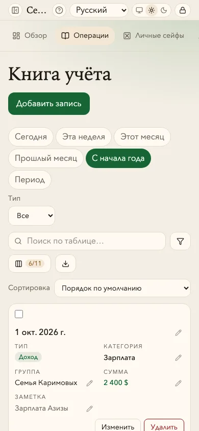

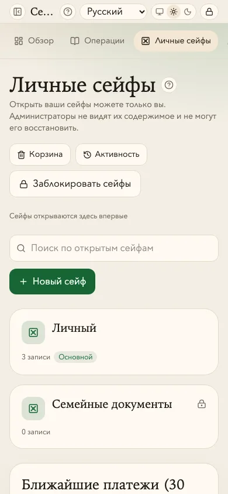

### Язык и тема

Выберите язык в меню языков: Oʻzbekcha, Ўзбекча, Русский или English. Выберите **День**, **Ночь** или **Система**, чтобы тема следовала настройке устройства. Оба выбора запоминаются в этом браузере, и их можно поменять ещё до входа.

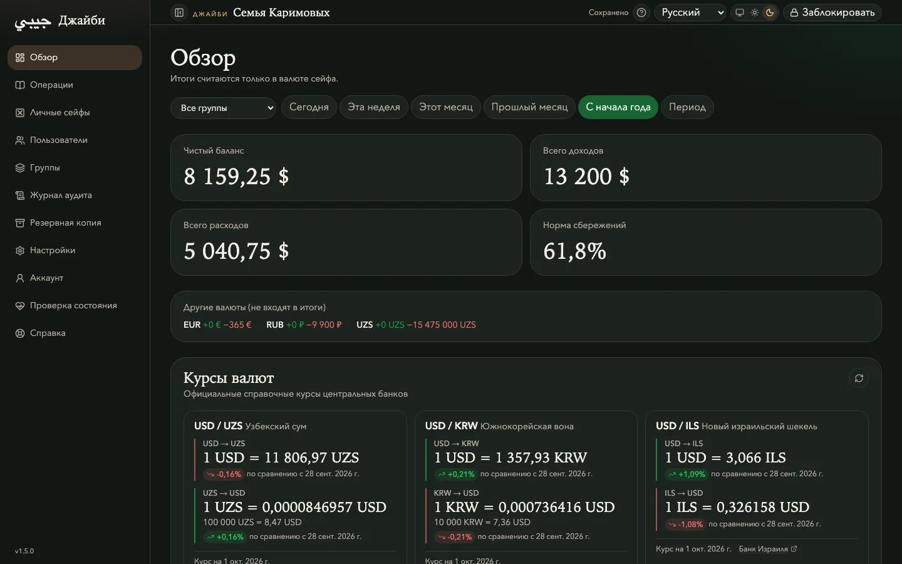

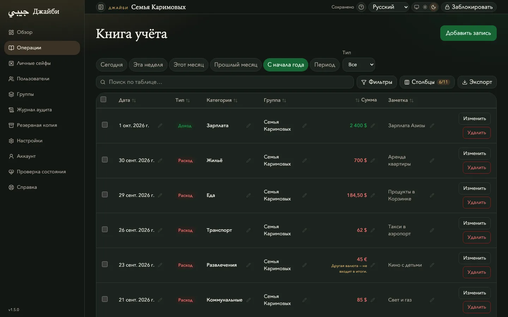

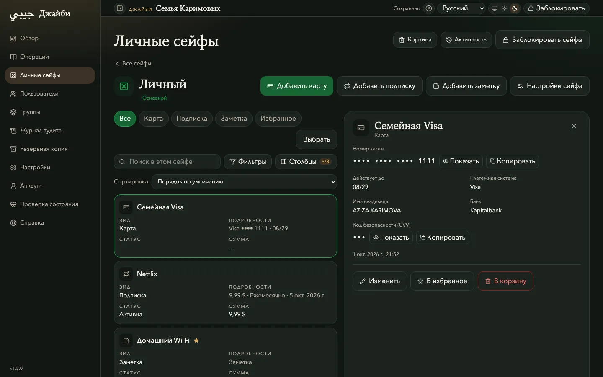

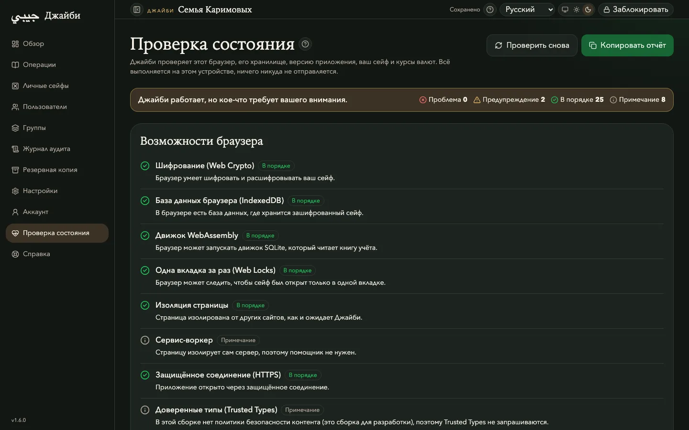

## Роли: кто что может

У каждого человека в сейфе одна роль. Менеджеры и наблюдатели входят в одну **группу** и видят только записи этой группы.

| Что | Администратор | Менеджер | Наблюдатель |
| --- | --- | --- | --- |
| Обзор, группы и книга учёта | Все группы | Своя группа | Своя группа |
| Добавление, изменение и удаление записей | Все группы | Своя группа | Нет |
| Экспорт таблиц и данных | Да | Нет | Нет |
| Люди, приглашения и коды сброса | Да | Нет | Нет |
| Резервная копия, экспорт данных, замена сейфа | Да | Нет | Нет |
| Настройки сейфа и категории | Да | Нет | Нет |
| Журнал аудита | Да | Нет | Нет |
| Личные сейфы, аккаунт, проверка состояния, справка | Да, свои | Да, свои | Да, свои |

Меню наблюдателя короткое: Обзор, Операции, Личные сейфы, Группы, Аккаунт, Проверка состояния и Справка.

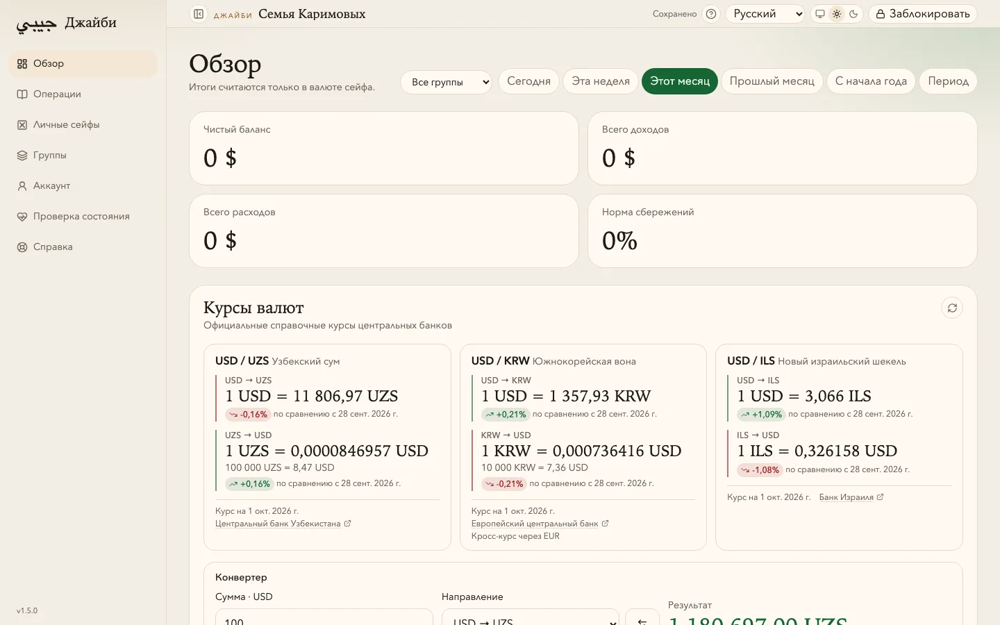

## Обзор

Обзор подводит итоги по деньгам за период и по группе.

[Открыть обзор](https://jaybi.uz/#/app)

### Четыре показателя

- **Чистый баланс**: доходы минус расходы.
- **Всего доходов** и **Всего расходов**.
- **Норма сбережений**: доля доходов, которая остаётся после расходов. Она равна 0%, если доходов нет, и может быть отрицательной, если вы потратили больше, чем заработали.

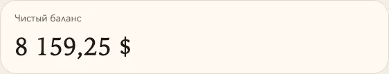

Итоги точны до цента (или тийина) и учитывают только записи в **валюте сейфа**. Записи в других валютах перечислены в блоке **Другие валюты (не входят в итоги)** по каждой валюте, так что ничего не скрыто. Джайби никогда не пересчитывает ваши записи в другую валюту.

### Выбор периода

Обзор, книга учёта и **Группы** используют одни и те же кнопки периода, и выбор переносится между ними: **Сегодня**, **Эта неделя** (с понедельника по воскресенье), **Этот месяц** (по умолчанию), **Прошлый месяц**, **С начала года** и **Период**.

**Период** открывает поля дат **С** и **По**. Если перепутать их местами, Джайби сам поменяет их.

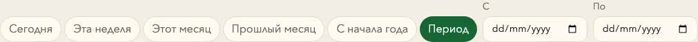

### Выбор группы

Список рядом с кнопками периода выбирает **Все группы** или одну группу. От него зависят показатели, графики и список других валют. Вы видите только группы, в которые входите.

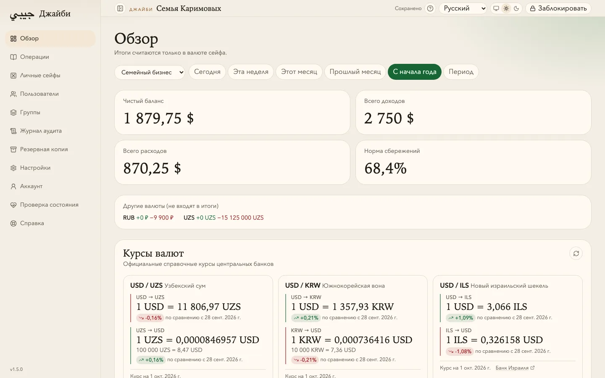

### Графики

Под показателями:

- **Доходы и расходы** сравнивает месяцы периода.
- **Расходы по категориям** показывает, куда ушли деньги.
- **Траты по времени** показывает расходы по дням.
- **Кто потратил** показывает расходы каждого человека в вашей группе; администраторы вместо этого видят **Расходы по группам**.

Если в периоде нет подходящих записей, на графике написано «В этом периоде нет цифр.»

### Курсы валют и конвертер

Панель **Курсы валют** показывает официальные справочные курсы центральных банков для узбекского сума (UZS), южнокорейской воны (KRW) и нового израильского шекеля (ILS) к доллару США в обе стороны: с изменением по сравнению с прошлым курсом, датой курса (**Курс на**) и ссылкой на банк-источник. Значок **Устарел** появляется, если курсу больше 2 рабочих дней.

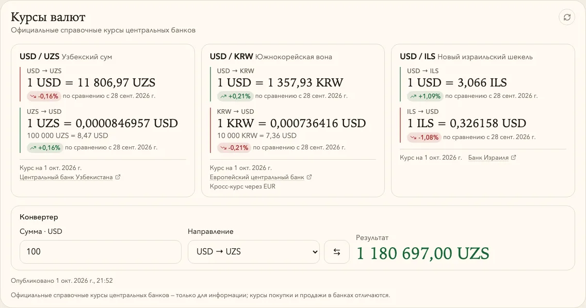

**Конвертер** переводит сумму в другую валюту. Введите сумму, выберите направление или поменяйте его кнопкой ⇄. **Точно** показывает значение без округления.

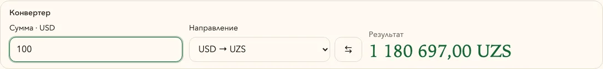

Эти курсы — только для информации; банки покупают и продают валюту по другим курсам. На ваши итоги они никогда не влияют. Курсы сохраняются в браузере, поэтому последние из них видны и без интернета.

## Учёт денег

Менеджеры и администраторы записывают доходы и расходы на странице **Книга учёта** (пункт меню **Операции**). Наблюдатели могут её читать, но не менять.

[Открыть книгу учёта](https://jaybi.uz/#/app/transactions)

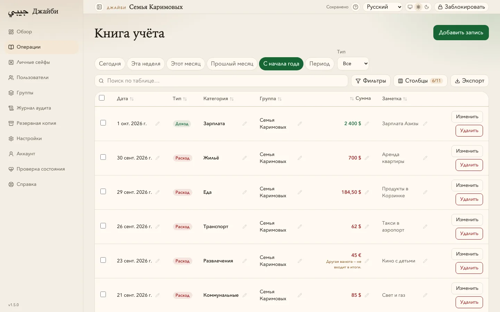

### Добавление записи

1. Нажмите **Добавить запись**.
2. Заполните форму (см. таблицу ниже).
3. Нажмите **Сохранить**.

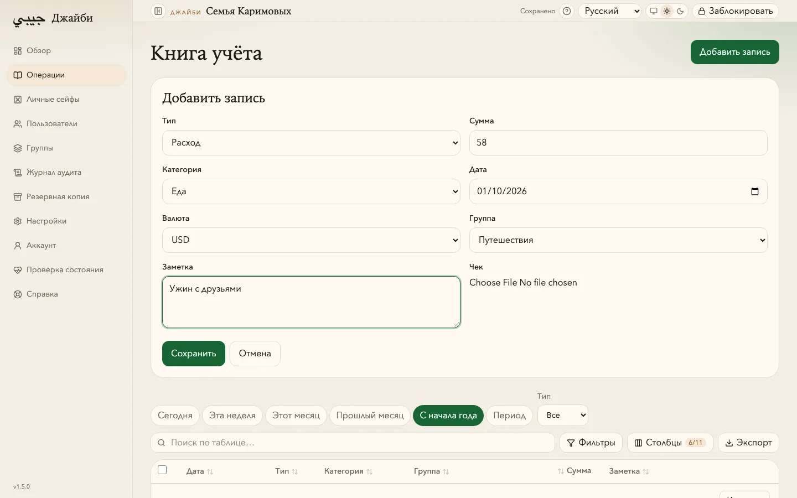

| Поле | Что вводить |
| --- | --- |
| **Тип** | Доход или Расход. Список категорий меняется соответственно. |
| **Сумма** | Число больше нуля, например `1250`, `1250.5` или `1 250,50`. Десятичным разделителем может быть и точка, и запятая. Джайби никогда не округляет: если ввести больше знаков после запятой, чем есть у валюты, он попросит исправить сумму. |
| **Категория** | Например, Зарплата, Еда или Транспорт. Список ведут администраторы в [настройках сейфа](#settings). |
| **Дата** | Сегодняшняя, если вы её не измените. |
| **Валюта** | Валюта сейфа, если вы её не измените. См. [Валюты](#currencies). |
| **Группа** | Показывается, только если вы видите больше одной группы. |
| **Заметка** | Необязательно, до 2 000 символов. |
| **Чек** | Необязательно: изображение PNG, JPEG, WebP или GIF до 1,5 МБ. **Открыть чек** — проверить его; **Убрать чек** — удалить. |

### Изменение и удаление

Чтобы изменить запись целиком, нажмите **Изменить** в её строке, поправьте поля и нажмите **Обновить запись**.

Для быстрой правки нажмите маленький карандаш рядом с датой, категорией, группой, суммой или заметкой, введите новое значение и нажмите Enter (Esc — отмена). Если значение не подходит, причина появится под полем, и ничего не изменится.

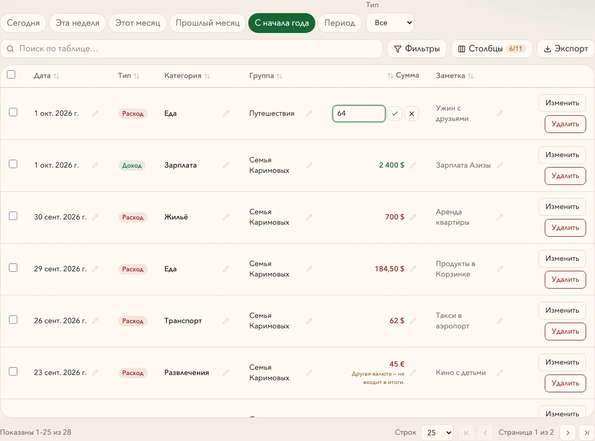

Чтобы удалить запись, нажмите **Удалить** и подтвердите. Чтобы удалить несколько записей, отметьте их и нажмите **Удалить выбранные**. Удаление нельзя отменить, но каждое удаление попадает в журнал аудита администратора.

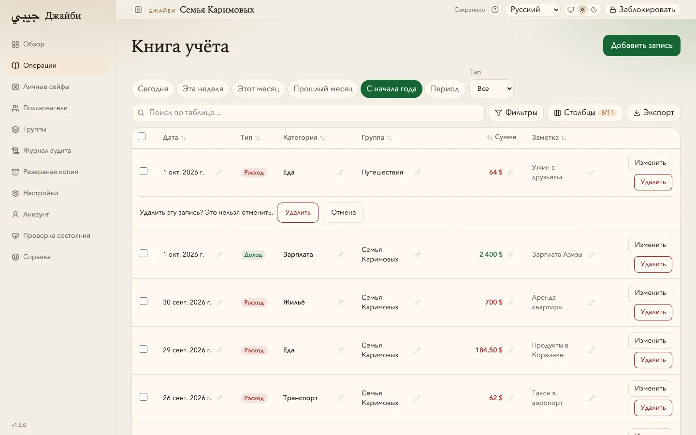

### Валюты

У каждого сейфа одна основная валюта. Итоги и графики учитывают только записи в этой валюте. Запись в другой валюте сохраняется и показывается с пометкой «Другая валюта — не входит в итоги.» На обзоре такие суммы перечислены отдельно. Джайби не пересчитывает суммы из одной валюты в другую.

## Работа с таблицами

Книга учёта, список людей, группы, категории, списки личных сейфов и журнал аудита — это таблицы, и все они работают одинаково.

- **Сортировка**: нажмите на заголовок столбца. Нажмите ещё раз — порядок станет обратным, в третий раз — вернётся исходный. Удерживайте Shift, чтобы сортировать сразу по нескольким столбцам (до трёх). На телефоне используйте **Сортировка** над карточками.
- **Поиск по таблице**: введите любую часть того, что видите. Регистр, диакритика, апострофы и даже алфавит не важны, поэтому `taksi` находит «Такси». Esc очищает поиск.
- **Строк** внизу таблицы: 10, 25, 50, 100 или все, рядом строка вида «Показаны 1–25 из 140».

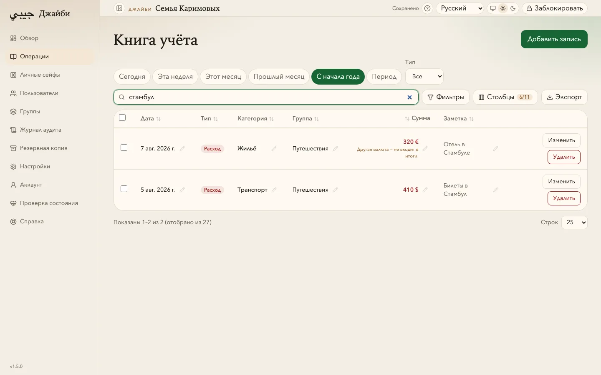

**Фильтры** открывают по фильтру на каждый столбец: текст, список с галочками, диапазон дат «С — По» или диапазон сумм «Мин. — Макс.». На кнопке видно, сколько фильтров включено; **Сбросить поиск и фильтры** выключает их.

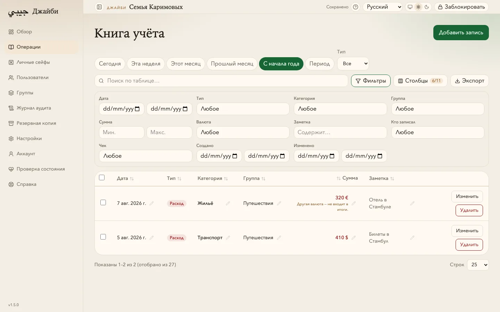

**Столбцы** позволяют показывать и скрывать столбцы, менять их порядок, включать компактные строки или сбрасывать раскладку. Джайби запоминает раскладку каждой таблицы в этом браузере, но никогда не запоминает, что вы искали.

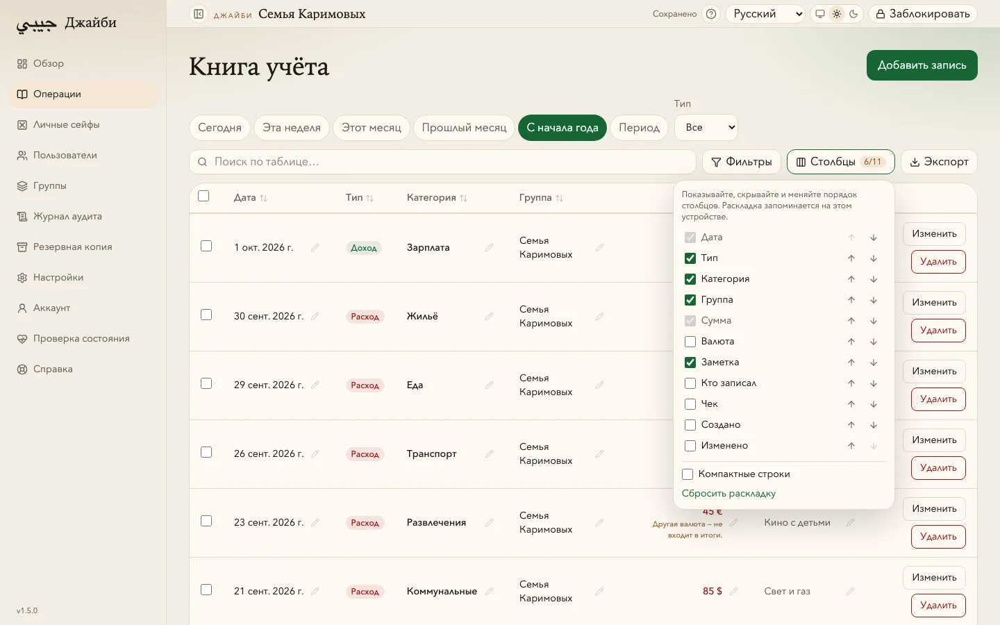

**Экспорт** (только для администраторов) скачивает ровно те строки и столбцы, которые вы видите, в CSV, Excel, PDF или других форматах. Файл не зашифрован, поэтому Джайби сначала просит подтверждение.

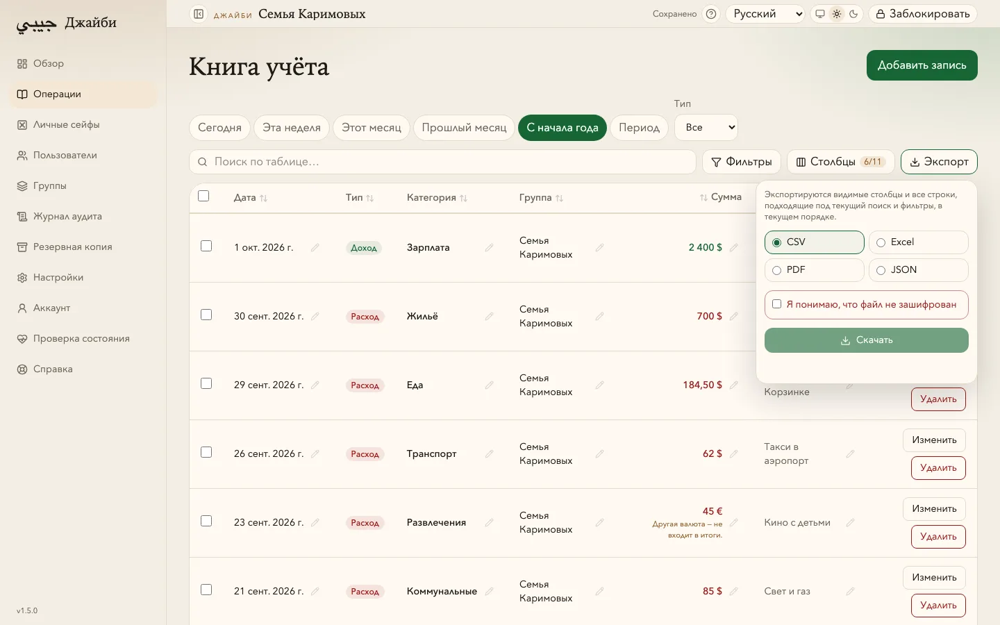

## Группы

**Группа** — это часть сейфа со своими записями и людьми, например семейный бизнес рядом с домашним хозяйством. Каждый видит свою группу; администраторы видят все.

[Открыть группы](https://jaybi.uz/#/app/groups)

**Группы** показывают для каждой группы **Доходы**, **Расходы** и **Итог** за выбранный период, а также число операций и дату последней из них. Каждая валюта — отдельной строкой; суммы в разных валютах никогда не складываются. Если групп две или больше, администраторы видят ещё строку **Все группы** с общими цифрами.

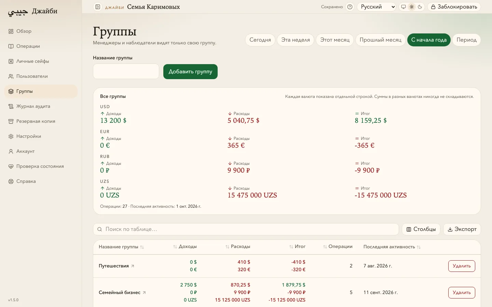

Нажмите на название группы, чтобы открыть книгу учёта только с записями этой группы за тот же период. Фильтр по группе уже установлен; нажмите **Сбросить поиск и фильтры**, чтобы снова увидеть всё.

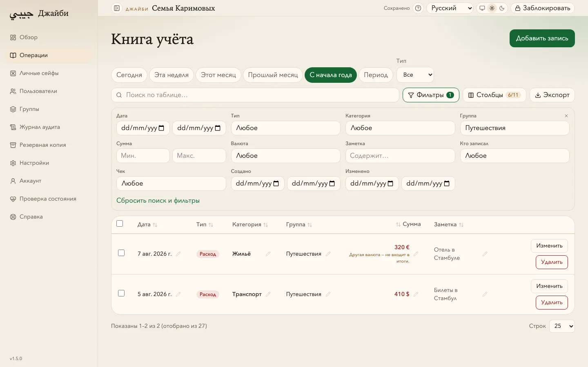

Чтобы добавить группу, администратор вводит **Название группы** и нажимает **Добавить группу**. Удалить группу можно, только если в ней нет ни людей, ни записей.

## Люди и приглашения

Администраторы решают, кто может открывать сейф, на странице **Люди** (пункт меню **Пользователи**). Каждый открывает тот же сейф своим паролем.

[Открыть страницу «Люди»](https://jaybi.uz/#/app/users)

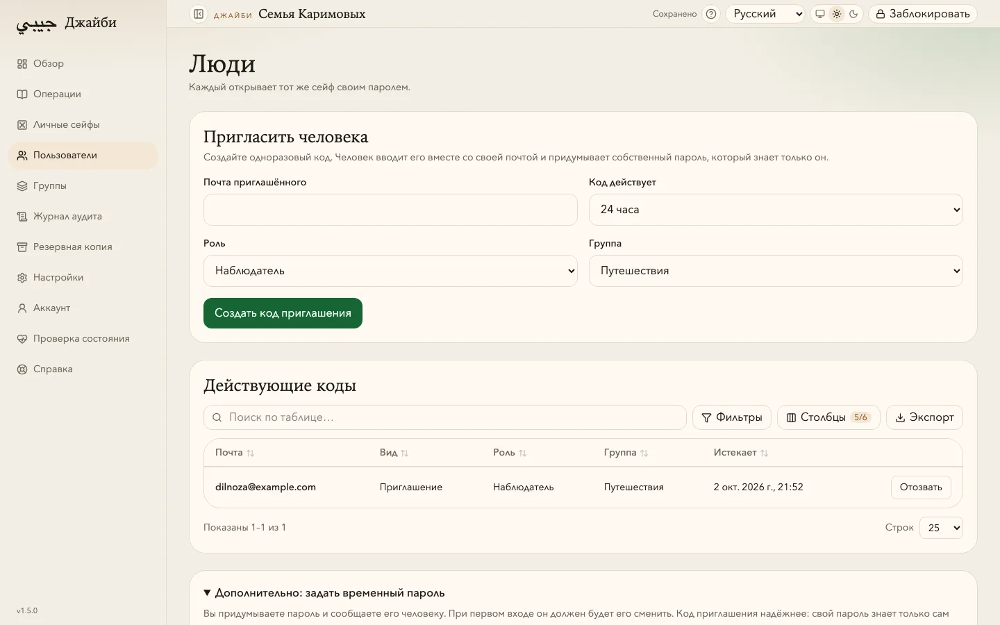

### Как пригласить человека (рекомендуется)

1. В разделе **Пригласить человека** введите адрес в поле **Почта приглашённого**, выберите **Роль** и **Группа**, а в поле **Код действует** — срок действия кода.
2. Нажмите **Создать код приглашения**.
3. Джайби покажет код один раз. Нажмите **Копировать код** или **Копировать ссылку** и передайте его человеку лично или по каналу, которому доверяете, затем нажмите **Готово**.

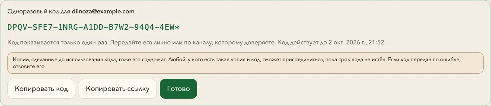

Затем человек [присоединяется по коду](#joining) в этом браузере и сам придумывает пароль. Пока он этого не сделал, код виден в списке **Действующие коды**, где кнопка **Отозвать** отменяет его.

### Добавление человека с временным паролем

В разделе **Дополнительно: задать временный пароль** введите почту, временный пароль, роль и группу и нажмите **Добавить пользователя**. При первом входе человек должен будет сменить пароль. Код приглашения надёжнее: тогда свой пароль знает только сам человек.

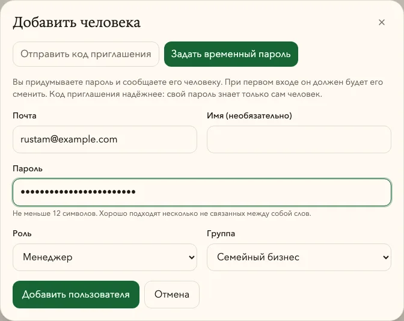

### Сброс пароля другого человека

В строке человека нажмите **Выдать код сброса**, выберите срок действия кода и решите, нужно ли **Сразу отключить текущий пароль** (выберите это, если пароль может знать кто-то ещё). Снова нажмите **Выдать код сброса** и передайте код человеку. **Задать временный пароль** — прежний способ.

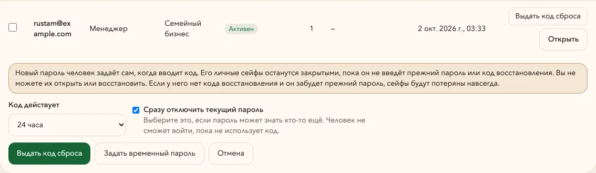

Перед сбросом прочитайте жёлтое предупреждение: личные сейфы человека останутся закрытыми, пока он не введёт прежний пароль или код восстановления. Вы не можете открыть или восстановить чужие сейфы.

В той же строке **Отключить проверку при входе** поможет тому, кто потерял и аутентификатор, и коды восстановления, а **Удалить** убирает человека из сейфа. Удаление человека также навсегда уничтожает его личные сейфы, а человека, у которого ещё есть записи, удалить нельзя. В сейфе всегда остаётся хотя бы один администратор.

### Проверка часов для кодов

Коды не принимаются, если часы этого устройства отстают от самого позднего времени, которое видел сейф, поэтому перевод часов назад не оживит просроченный код. Если из-за неверных часов это время ушло в будущее, исправьте часы, откройте **Проверка часов для кодов**, введите пароль и нажмите **Сбросить на текущее время**.

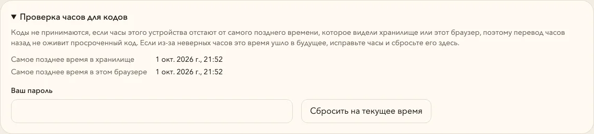

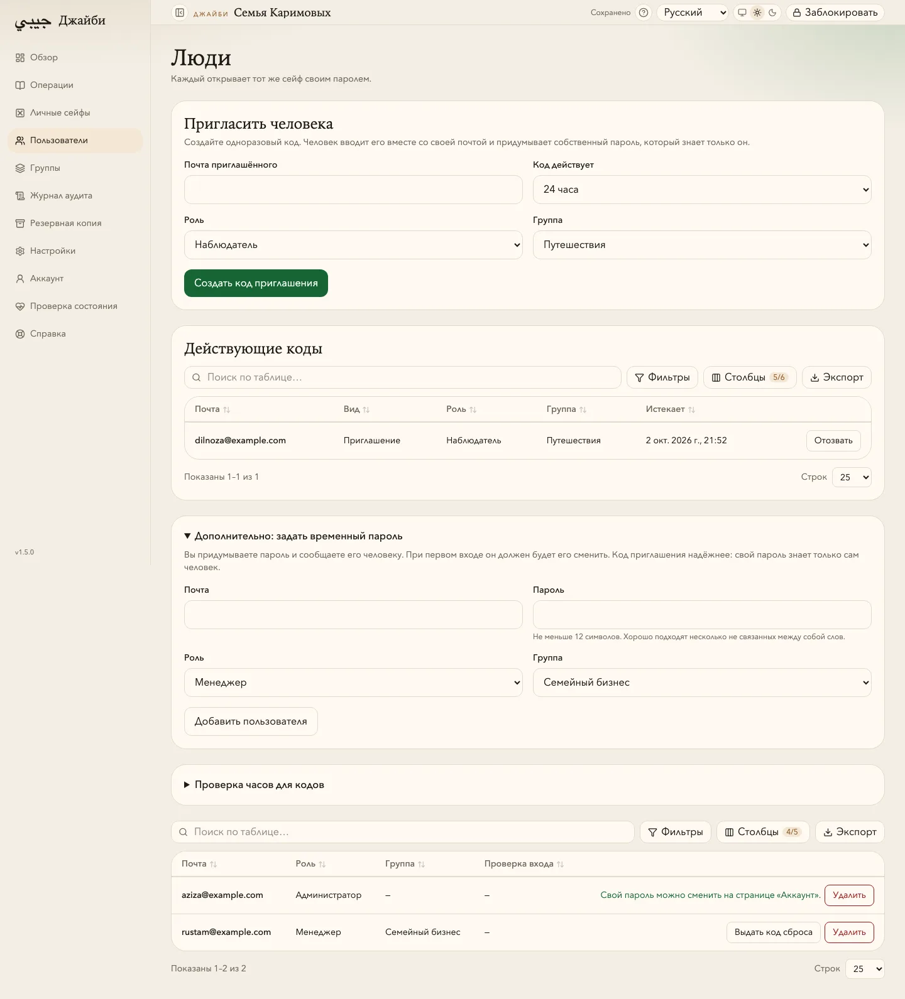

## Личные сейфы

Личный сейф — место для того, что вы храните только для себя: платёжных карт, подписок и заметок. Это не денежный счёт; ничего из него не попадает на обзор или в книгу учёта.

Открыть свои личные сейфы можете только вы. Администраторы не видят ни сами сейфы, ни их названия и не могут открыть или восстановить их — даже с резервной копией. У каждого участника сейфа свои личные сейфы.

[Открыть личные сейфы](https://jaybi.uz/#/app/safes)

### Настройка

1. Откройте **Личные сейфы** и введите пароль в поле **Ваш пароль**.
2. Выберите **Создать код восстановления (рекомендуется)** или **Пока пропустить**.
3. Нажмите **Создать мои сейфы**.

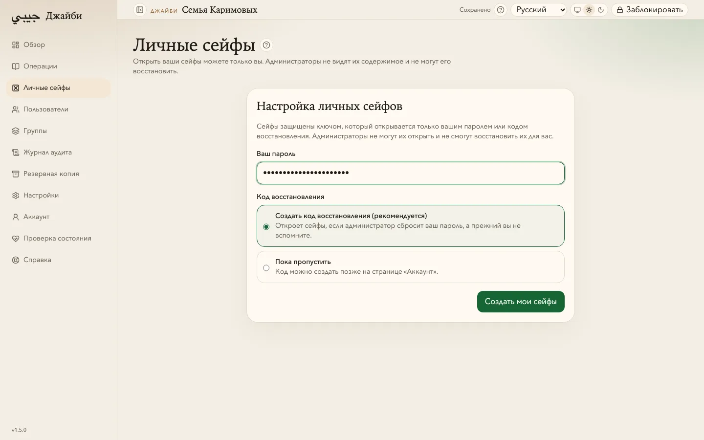

Если вы выбрали код восстановления, Джайби покажет его один раз. Запишите или распечатайте его, храните отдельно от этого устройства и для подтверждения введите его последние 4 символа.

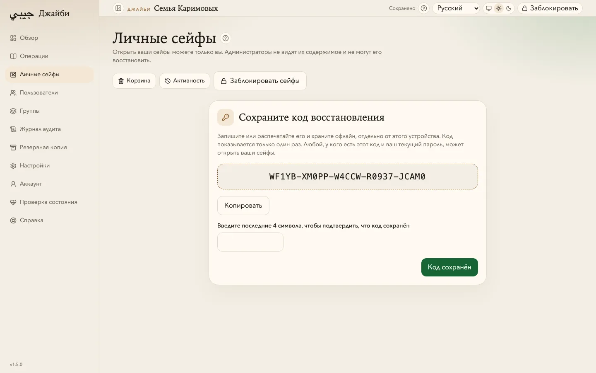

Вы получите один пустой сейф с названием **Личный**.

### Зачем нужен код восстановления

Код восстановления важен в одной ситуации: администратор сбросил ваш пароль, а прежний вы уже не помните. Без кода ваши сейфы будут потеряны навсегда. Создать или заменить его можно позже в разделе **Аккаунт → Код восстановления**. Храните его так же надёжно, как пароль.

### Карты

Откройте сейф и нажмите **Добавить карту**. Введите название, номер карты, имя владельца, срок действия, банк и заметки. Джайби определяет платёжную систему по номеру и проверяет контрольную цифру. **Код безопасности (CVV)** необязателен и спрятан за кнопкой **Добавить код безопасности**; банки не рекомендуют его хранить. Места для PIN-кода нет: никогда нигде не храните PIN-код.

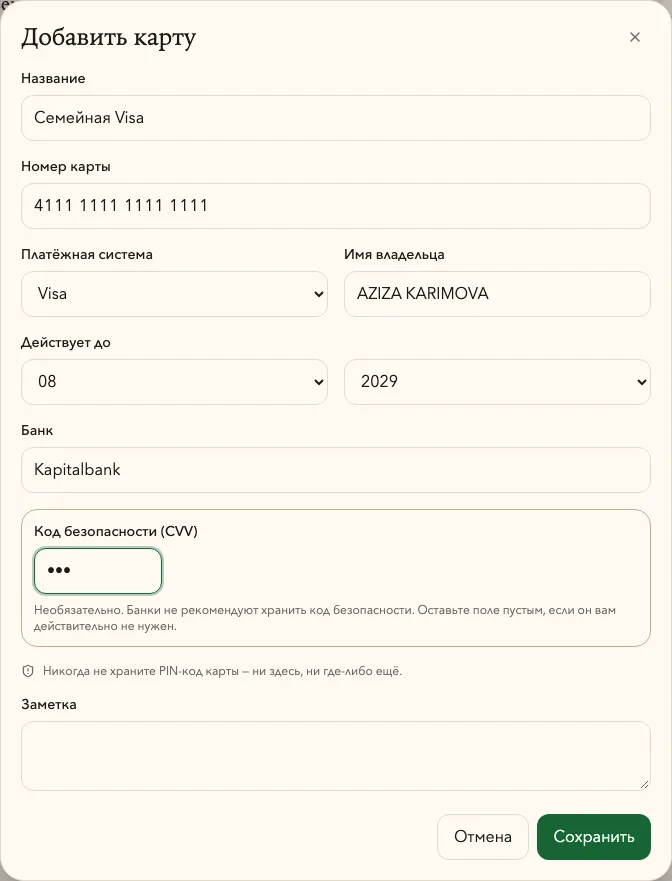

Номера карт показываются только с последними четырьмя цифрами.

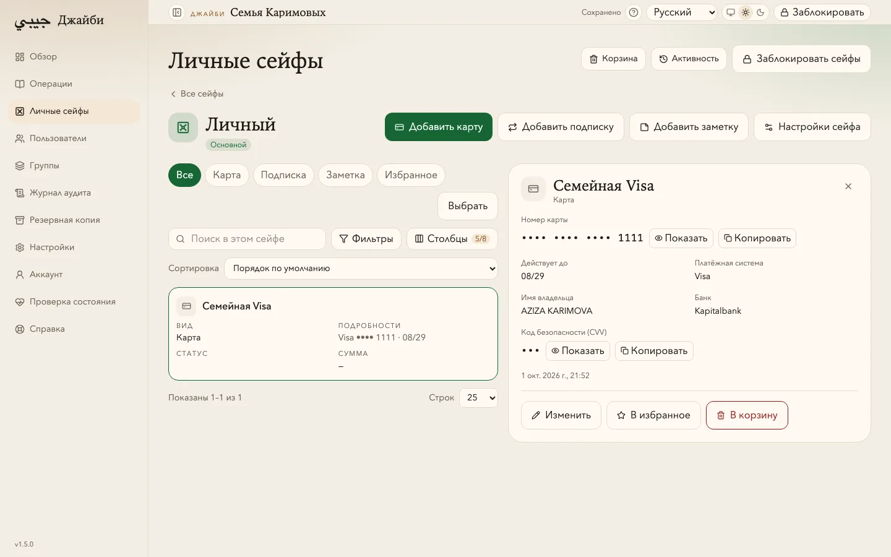

**Показать** и **Копировать** спрашивают пароль, если вы не вводили его в последние 2 минуты. Показанное значение снова скрывается через 15 секунд; скопированное стирается из буфера обмена через 30 секунд. Оба времени можно изменить на странице **Аккаунт**.

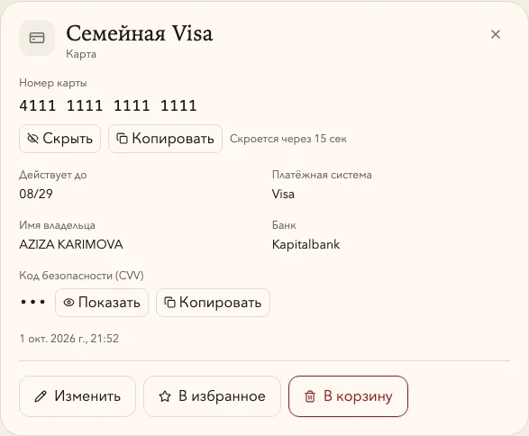

### Подписки

Нажмите **Добавить подписку** и укажите сервис, стоимость и валюту, период оплаты, дату платежа и статус. Можно также указать карту, которой она оплачивается, сайт, аккаунт, напоминание и заметки.

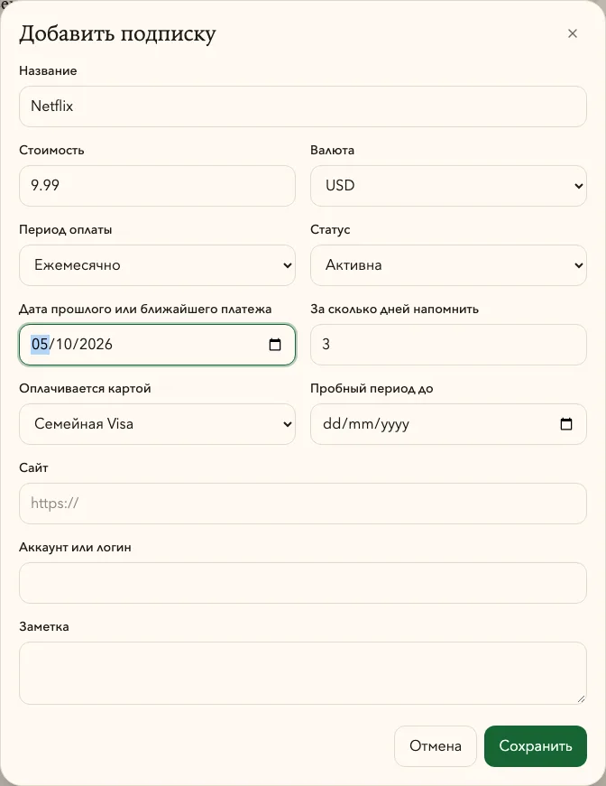

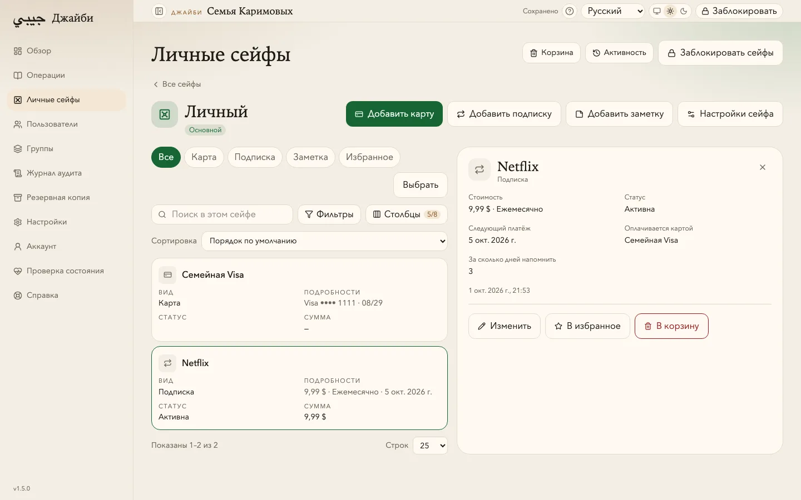

### Заметки

Нажмите **Добавить заметку** для всего остального — до 10 000 символов простого текста, например для пароля от Wi-Fi. То, чем пользуетесь часто, отмечайте кнопкой **В избранное**.

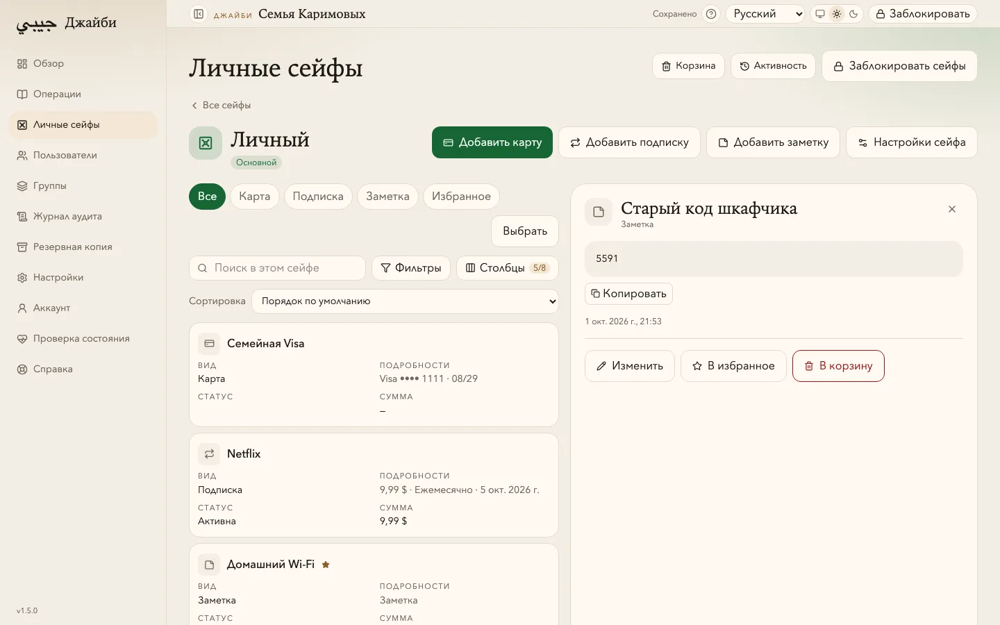

### Больше сейфов

Нажмите **Новый сейф**, чтобы добавить ещё один: с названием, описанием, значком и цветом. Отметьте **Спрашивать пароль при каждом открытии этого сейфа** для сейфа, который должен оставаться закрытым, пока вы сами его не откроете.

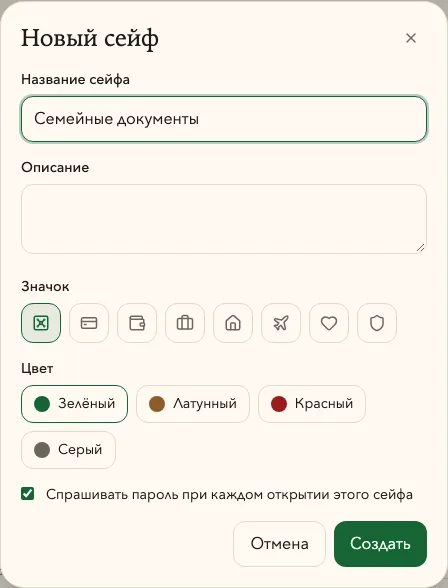

На странице сейфов — список ваших сейфов, сколько стоят активные подписки в месяц и в год, **Ближайшие платежи** на 30 дней вперёд, карты, срок которых скоро истекает, и избранное. **Поиск по открытым сейфам** ищет во всех открытых сейфах.

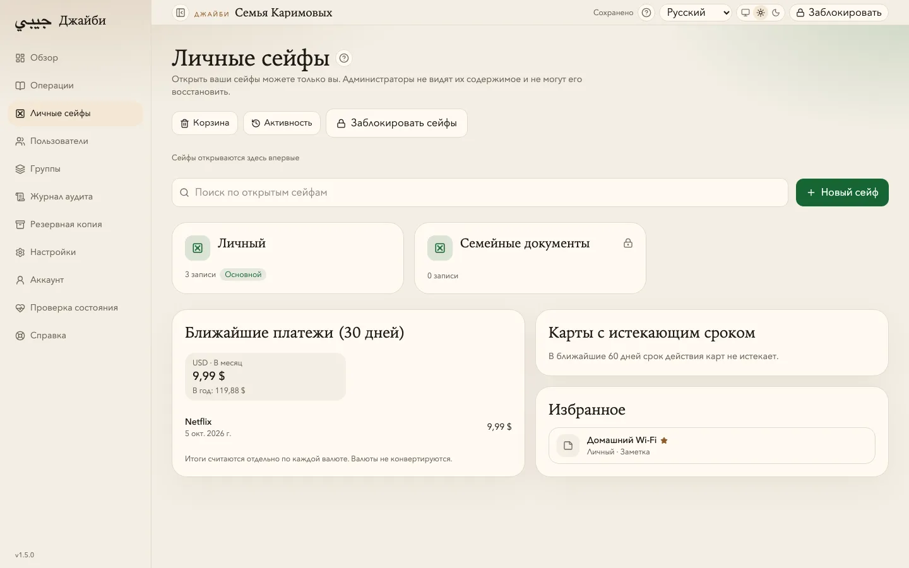

Сейф, который спрашивает пароль, показывает поле пароля вместо содержимого.

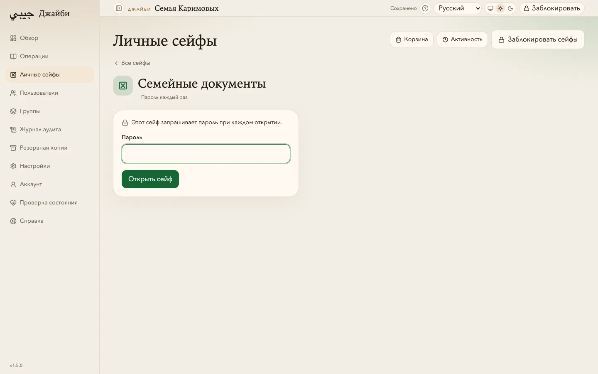

В разделе **Настройки сейфа** можно также сделать сейф основным, отправить его в архив, сменить ключ шифрования или удалить его.

### Открытие и блокировка сейфов

Вход в сейф не открывает личные сейфы. Нажмите **Открыть сейфы** и снова введите пароль. Джайби показывает время, когда было **Предыдущее открытие** ваших сейфов; если вы не узнаёте это время, вашим паролем мог воспользоваться кто-то другой.

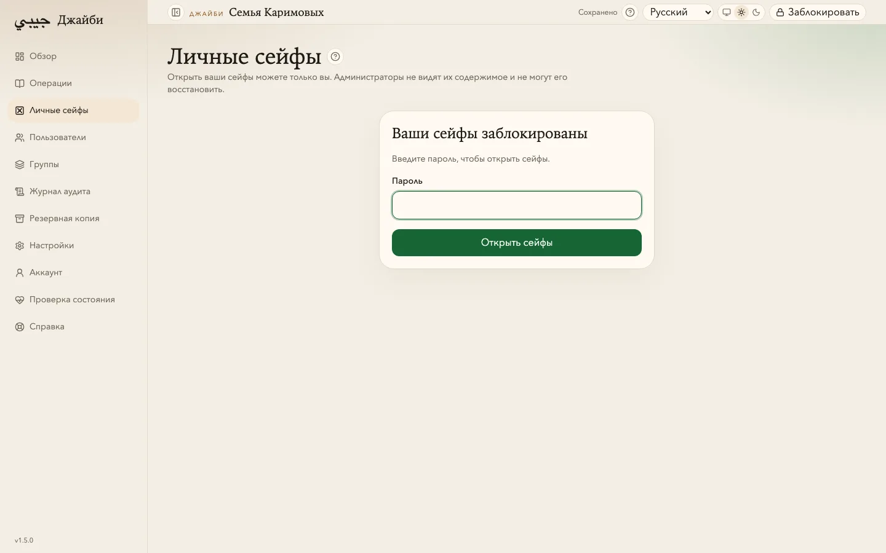

Сейфы остаются открытыми, пока вы работаете, и снова блокируются, когда вы нажимаете **Заблокировать сейфы** или когда блокируется весь сейф.

### Корзина и активность

Удалённые сейфы и записи попадают в раздел **Корзина** и хранятся там 30 дней. **Восстановить** возвращает их; **Удалить навсегда** удаляет сразу.

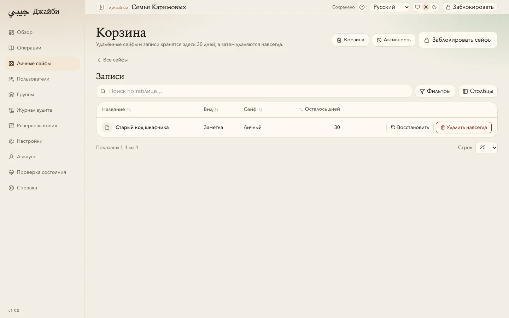

**Активность** показывает, что и когда происходило в ваших сейфах: открытие, добавление, изменение, перемещение, удаление или восстановление. Читать этот список можете только вы.

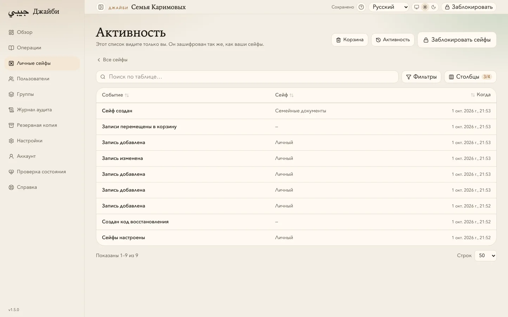

### После сброса пароля администратором

1. Задайте новый пароль с помощью кода сброса (или войдите с временным паролем и придумайте новый).
2. Откройте **Личные сейфы**. Джайби сообщит, что ваш пароль изменился с момента последнего открытия сейфов.
3. Введите **прежний пароль** — тот, который вы сами задали до сброса, — или воспользуйтесь кодом восстановления. Также введите текущий пароль.
4. Ваши сейфы откроются, и с этого момента их будет открывать текущий пароль.

Никогда не вводите временный пароль от администратора как прежний. Если вы не помните ни прежний пароль, ни код восстановления, открыть ваши сейфы не сможет никто; **Аккаунт → Начать заново → Сброс личных сейфов** даст вам новые, пустые сейфы.

## Резервные копии и перенос на другое устройство

Делать резервные копии могут только администраторы. Резервная копия — это зашифрованная копия всего сейфа в одном файле `.moliya`. Она открывается любым паролем, который относится к этому сейфу, и это **единственный** способ всё вернуть, если данные этого браузера пропадут.

[Открыть страницу «Резервная копия»](https://jaybi.uz/#/app/backup)

Если записи есть, а резервной копии ещё нет или последней больше 7 дней, на каждой странице появляется напоминание.

### Как скачать резервную копию

1. Откройте страницу **Резервная копия**.
2. Нажмите **Скачать копию**.
3. Храните файл не на этом устройстве: на флешке, другом компьютере или в облачном хранилище. Он остаётся зашифрованным.

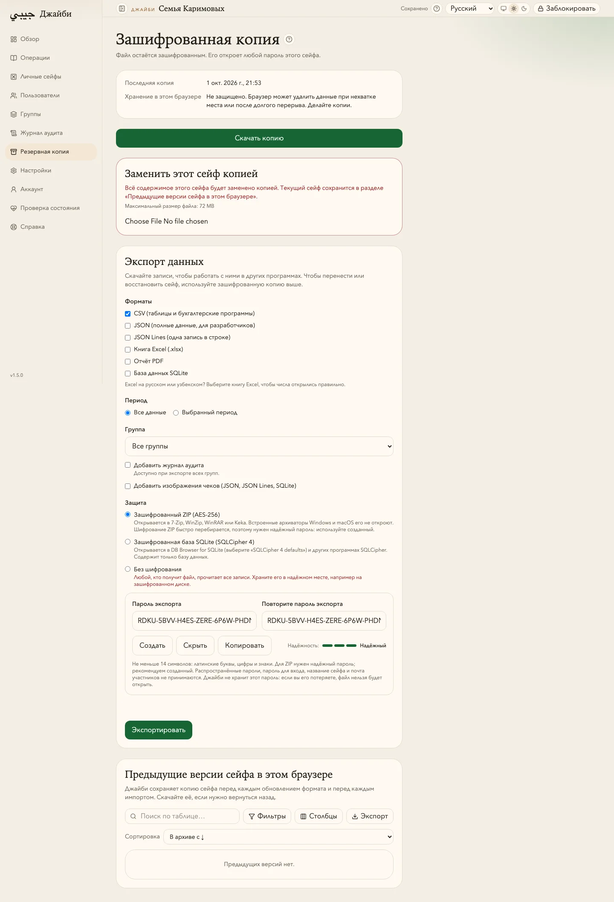

На странице также есть раздел **Хранение в этом браузере**. «Не защищено» значит, что браузер может удалить данные при нехватке места; [проверка состояния](#health) может попросить браузер их сохранить.

**Предыдущие версии сейфа в этом браузере** — копии, которые Джайби сохраняет перед каждым обновлением формата и каждым импортом. Скачайте одну из них, если нужно вернуться назад.

### Экспорт данных для других программ

**Экспорт данных** скачивает ваши записи в CSV, JSON, Excel, отчётом PDF или базой данных SQLite — все данные или за выбранный период, по одной группе или по всем. По умолчанию файл — **Зашифрованный ZIP (AES-256)** с отдельным паролем экспорта; кнопка **Создать** придумает надёжный пароль. Резервная копия нужна для восстановления Джайби, экспорт — для других программ.

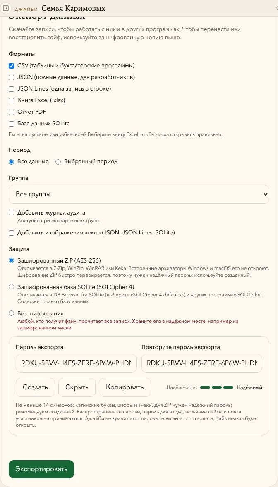

### Восстановление копии в этом браузере

В разделе **Заменить этот сейф копией** выберите файл копии, введите пароль и для подтверждения название сейфа, затем нажмите **Заменить сейф**. Копия текущего сейфа сохранится в разделе **Предыдущие версии сейфа в этом браузере**.

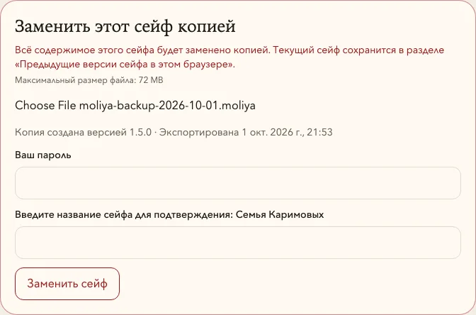

### Перенос на другое устройство

1. На старом устройстве скачайте резервную копию.
2. На новом устройстве откройте [https://jaybi.uz](https://jaybi.uz). Появится экран **Создайте сейф**: не заполняйте его.
3. В разделе **Или импортируйте копию** выберите файл копии и нажмите **Заменить сейф**.
4. Войдите со своими обычными почтой и паролем.

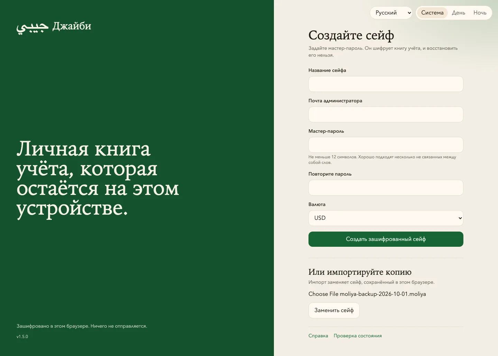

Каждый участник сейфа может войти на новом устройстве своим паролем. Сейф не синхронизируется: после переноса пользуйтесь только новым устройством или перенесите сейф обратно тем же способом.

## Настройки сейфа

Администраторы меняют параметры всего сейфа на странице **Настройки**.

[Открыть настройки](https://jaybi.uz/#/app/settings)

- **Название сейфа** и **Валюта сейфа**, затем **Сохранить настройки**. Итоги учитывают только записи в валюте сейфа.
- **Категории**: добавляйте, переименовывайте и удаляйте категории доходов и расходов, с названием на каждом языке. Если перевод пуст, используется английское название. Категорию, которая используется в записях, удалить нельзя.
- **О версии**: версия приложения, сборка, формат данных и дата создания сейфа. Укажите их, когда сообщаете о проблеме.

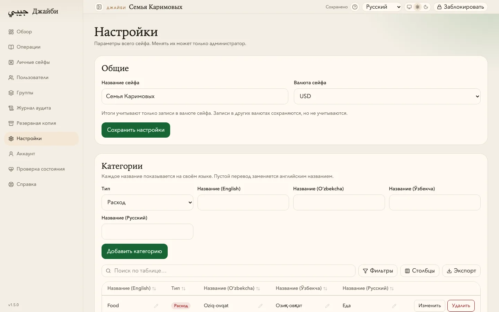

## Ваш аккаунт

У каждого есть страница **Аккаунт** с настройками, которые касаются только его.

[Открыть страницу «Аккаунт»](https://jaybi.uz/#/app/account)

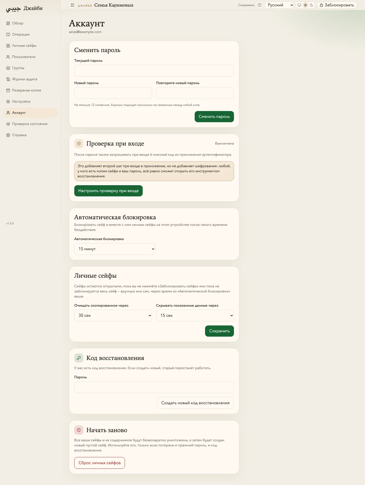

### Смена пароля

Введите **Текущий пароль**, затем **Новый пароль** и **Повторите новый пароль** и нажмите **Сменить пароль**. Личные сейфы и проверка при входе одновременно переходят на новый пароль.

Если ваш пароль задал администратор, Джайби первым делом попросит придумать новый: пока вы этого не сделаете, любая страница ведёт на страницу **Аккаунт**.

### Как выбрать пароль

Новый пароль должен быть длиной от 12 до 256 символов, не должен быть распространённым, не должен составляться из вашей почты или названия сейфа и не должен быть простым шаблоном вроде `qwertyuiop`. Четыре-пять не связанных между собой слов, при желании через пробел, легко запомнить и трудно угадать. Не используйте пароль от другого сайта: именно ваш пароль защищает копии сейфа.

### Проверка при входе (приложение-аутентификатор)

Проверка при входе после пароля запрашивает 6-значный код из приложения-аутентификатора (Google Authenticator, Microsoft Authenticator, Aegis, 1Password и подобных). Она защищает вас, если кто-то узнает ваш пароль и попробует войти в этом браузере. Шифрования она не добавляет.

1. Нажмите **Настроить проверку при входе**.
2. Отсканируйте QR-код приложением или введите в него **Ключ настройки**.
3. Введите **Код из приложения** и **Ваш пароль**, затем нажмите **Подтвердить и включить**.
4. Джайби покажет 10 кодов в блоке **Коды восстановления**. Каждый срабатывает один раз, если вы потеряете телефон. Нажмите **Скачать коды** или запишите их, храните отдельно от этого устройства и нажмите **Коды сохранены**.

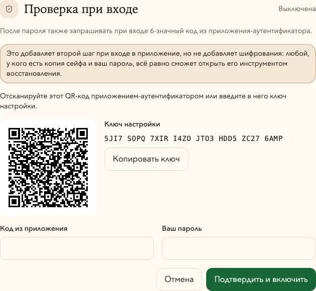

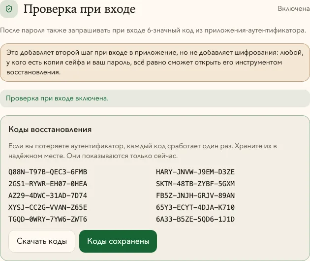

Чтобы отключить проверку, нажмите **Отключить проверку при входе** и введите пароль. Чтобы получить новые коды восстановления, отключите и снова включите проверку.

### Автоматическая блокировка и таймеры сейфов

**Автоматическая блокировка** задаёт, сколько сейф остаётся открытым без действий на этом устройстве: 5 минут, 15 минут (по умолчанию), 30 минут или 1 час. В блоке **Личные сейфы** вы выбираете, сколько скопированное хранится в буфере обмена и сколько показанное остаётся на экране.

## Журнал аудита

**Журнал аудита** показывает, кто, что и когда сделал: добавление, изменение и удаление записей, добавление и удаление людей, сброс паролей, резервные копии, экспорт, настройки и многое другое. Его видят только администраторы. В нём никогда нет сумм, заметок и содержимого личных сейфов.

[Открыть журнал аудита](https://jaybi.uz/#/app/audit)

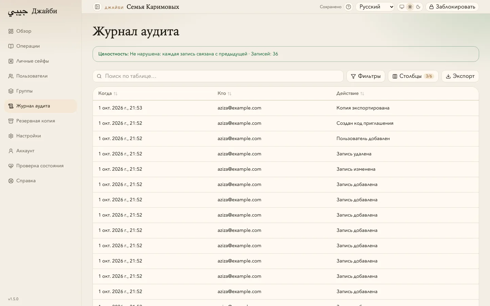

Каждая запись связана с предыдущей. **Целостность** показывает «Не нарушена: каждая запись связана с предыдущей», если вне приложения ничего не менялось. Если записи изменили или удалили, Джайби показывает красную полосу на каждой странице, а проверка состояния сообщает об этом. Если вы ожидали изменение, например после импорта более старой копии, нажмите **Принять журнал как есть**; иначе восстановите недавнюю резервную копию и смените пароли.

## Проверка состояния

**Проверка состояния** смотрит на этот браузер, его хранилище, версию приложения, ваш сейф и курсы валют и простыми словами объясняет, что в порядке, а что требует внимания. Всё выполняется на этом устройстве; ничего никуда не отправляется.

[Запустить проверку состояния](https://jaybi.uz/#/app/health)

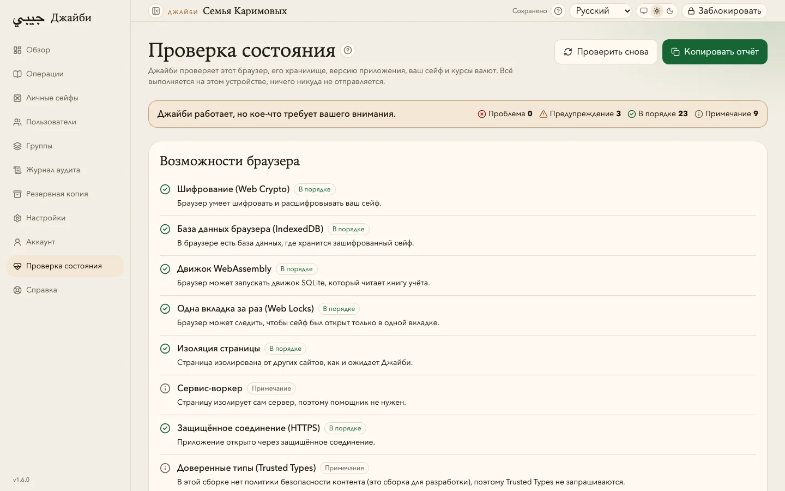

Каждая строка помечена как **В порядке**, **Предупреждение**, **Проблема** или **Примечание**, с коротким пояснением. Строка, требующая внимания, также показывает **Как исправить** и, где это полезно, кнопку вроде **Попросить сохранить данные** или **Открыть страницу «Резервная копия»**.

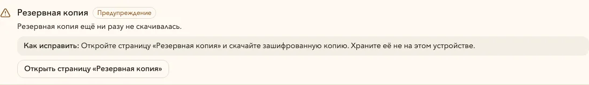

### Что проверяется

| Область | Проверки |
| --- | --- |
| **Возможности браузера** | Шифрование, база данных браузера, WebAssembly, одна вкладка за раз, изоляция страницы, сервис-воркер, защищённое соединение, Trusted Types, файлы cookie и данные сайтов, приватное окно |
| **Хранилище** | Можно ли записывать в хранилище, свободное место, сохраняет ли браузер данные при нехватке места, хранилище небольших настроек, хранится ли здесь сейф |
| **Приложение и версия** | Опубликована ли более новая версия, сборка и соответствуют ли страницы, загружаемые по требованию, запущенной версии |
| **Сейф** | Формат данных, размер сейфа относительно предела 48 МБ, сохранение, возраст резервной копии, предыдущие версии, целостность журнала аудита, часы устройства, ваша проверка при входе, ваш пароль и число людей |
| **Курсы валют** | Актуальны ли курсы и совпадают ли они со своей контрольной суммой |
| **Безопасность** | Политика безопасности контента, работа не внутри другой страницы и адрес |

Строки с пометкой **Только для администратора** видят только администраторы: строки журнала аудита, предыдущие версии и число людей. Администраторы также видят даты резервных копий и отметки времени. Остальные видят более короткий список о браузере и своём аккаунте; строка о резервной копии лишь напоминает, что копии делает администратор.

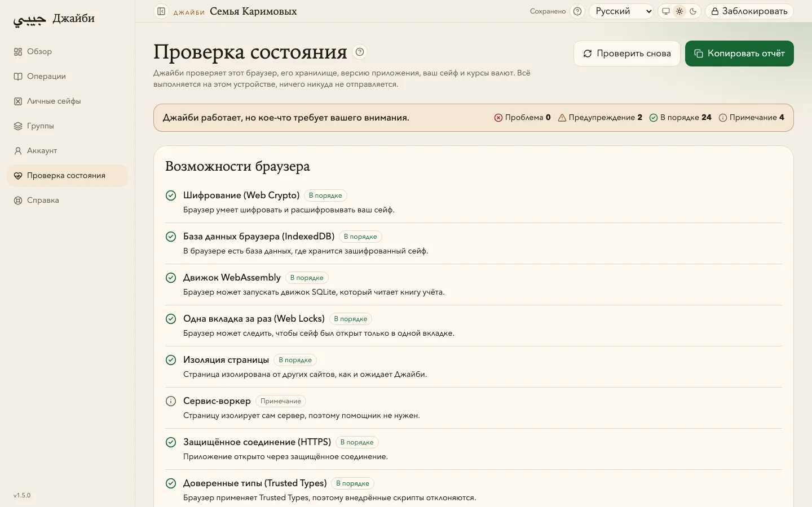

### Как поделиться отчётом

**Копировать отчёт** копирует текстовую сводку, которую можно вставить в сообщение тому, кто вам помогает. В ней указаны версии, размеры, даты и результат каждой проверки, но никогда нет паролей, кодов, почты, имён и сумм. **Проверить снова** повторяет проверки после того, как вы что-то исправили.

### Если не получается войти

Ссылка **Проверка состояния** на экране входа запускает проверки браузера, хранилища и версии без входа. Если Джайби не может даже запуститься, такую же проверку предлагает экран ошибки.

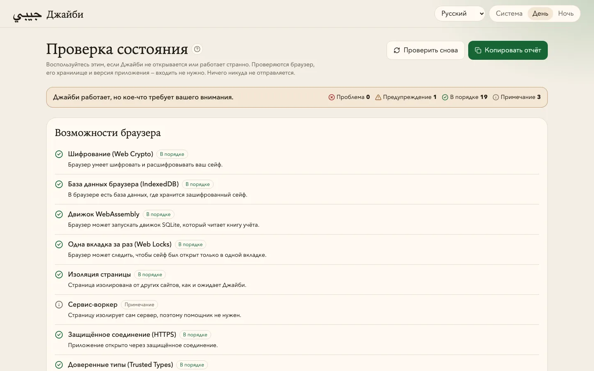

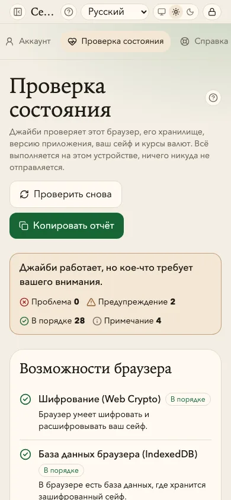

## Как пользоваться справкой

Это руководство встроено и в Джайби. Откройте пункт **Справка** в меню, нажмите кнопку **?** в верхней панели (она открывает часть о текущей странице) или ссылку **Справка** на экране входа. Руководство показывается на выбранном вами языке.

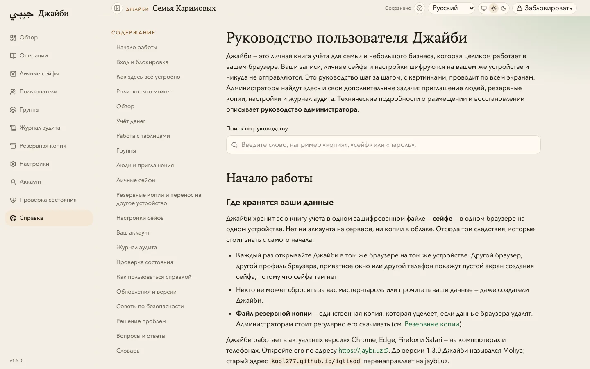

До входа **Справка** открывает то же руководство на отдельной странице со ссылкой обратно на экран входа.

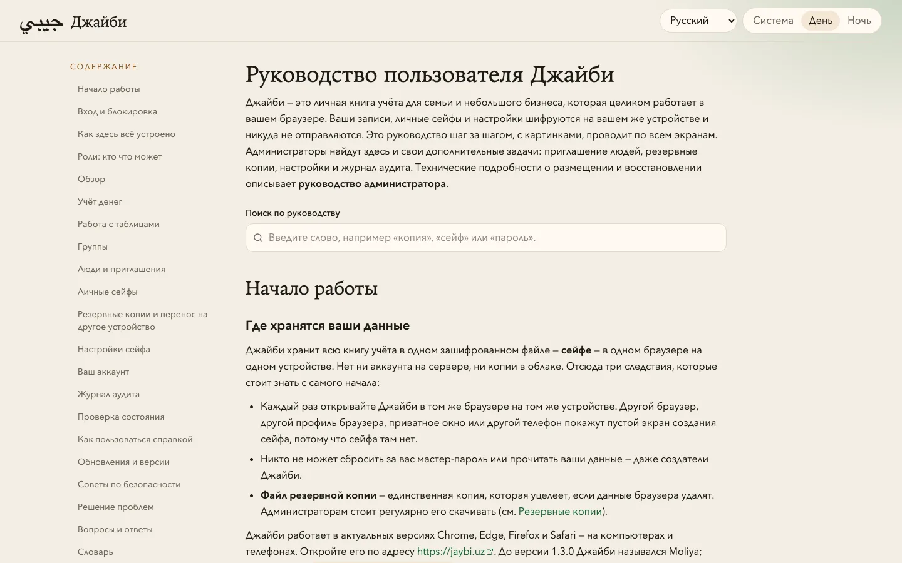

Введите слово в поле **Поиск по руководству**, чтобы показать только те части, где оно встречается. Кнопки **Открыть** ведут прямо на описываемый экран.

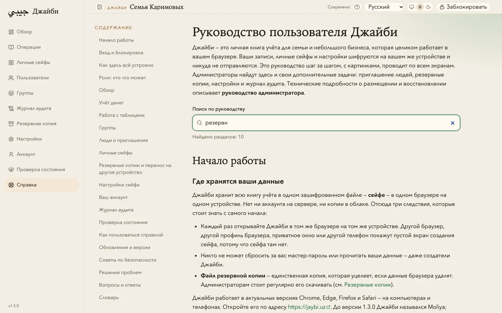

## Обновления и версии

Когда выходит новая версия, появляется полоса с текстом **Доступна новая версия Джайби.** Нажмите **Обновить**, когда будет удобно: ваша работа сохранится, а сейф сначала заблокируется, поэтому потом войдите снова. Первый вход после обновления может занять на несколько секунд больше, пока Джайби обновляет данные. Это происходит один раз.

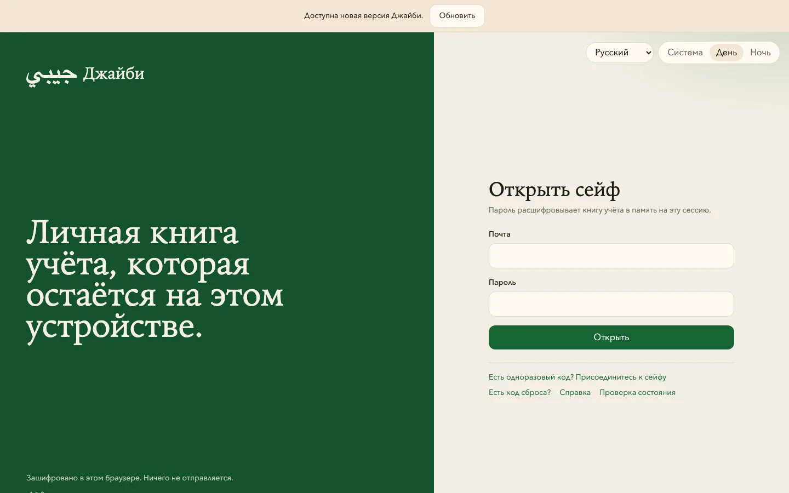

Версия, которой вы пользуетесь, указана внизу меню, на экране входа и в проверке состояния. Укажите её, когда сообщаете о проблеме.

## Советы по безопасности

- Используйте длинный пароль, который больше нигде не используете. Только он защищает копии сейфа.
- Блокируйте сейф, прежде чем отойти от общего устройства, и блокируйте личные сейфы, когда закончили с ними работать.
- Включите проверку при входе и храните коды восстановления отдельно от этого устройства.
- Администраторам: скачивайте резервную копию хотя бы раз в неделю и храните её не на этом устройстве.
- Не очищайте данные браузера для этого сайта: это удалит сейф из браузера.
- Используйте одноразовые коды поскорее и сообщите администратору, если ваш код мог увидеть кто-то другой.
- Создайте код восстановления для личных сейфов и храните его офлайн.
- Всегда проверяйте адрес: официальный — `jaybi.uz`. Джайби отказывается работать внутри страницы другого сайта.
- Никогда не храните PIN-коды карт. CVV храните, только если он действительно нужен.

## Решение проблем

Начните с [проверки состояния](#health): большинство проблем видны там вместе со способом их исправить.

[Запустить проверку состояния](https://jaybi.uz/#/app/health)

| Что вы видите | Что делать |
| --- | --- |
| **Создайте сейф**, хотя сейф у вас есть | Вы в другом браузере, профиле, приватном окне или на другом адресе. Откройте Джайби там, где создавали сейф, или импортируйте резервную копию. Не создавайте новый сейф. |
| «Почта или пароль неверны.» | Проверьте и то, и другое. После нескольких попыток дождитесь конца отсчёта. Если забыли пароль, попросите у администратора код сброса. |
| **Слишком много попыток** | Дождитесь конца обратного отсчёта; обновление страницы не поможет. |
| **Не удалось сохранить** | Браузер отказался сохранять данные. Не закрывайте вкладку, освободите место на диске и запустите проверку состояния. |
| **Не сохранено: изменено в другом месте** | Сейф открыт в другой вкладке. Заблокируйте его, войдите снова и повторите последнее изменение. |
| «уже открыт в другой вкладке или окне» | Перейдите в ту вкладку или заблокируйте сейф там. |
| Код не принимается | Возможно, срок его действия истёк, он уже использован или выдан для другой почты. Попросите новый. Если упоминается проверка часов, исправьте часы устройства. |
| Курсов валют нет или стоит **Устарел** | Проверьте подключение. После праздников банки не публикуют новые курсы. |
| Страница остаётся пустой после обновления | Перезагрузите страницу. |
| Красная полоса о журнале аудита | См. [Журнал аудита](#audit). |
| Сейф почти достиг предельного размера | Удалите большие чеки из старых записей. |

### Страница не найдена

Старая ссылка или ссылка с опечаткой показывает **Страница не найдена**. Нажмите **Перейти к обзору**.

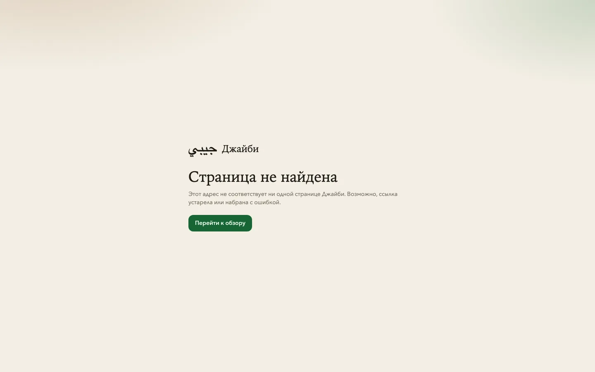

## Вопросы и ответы

**Можно ли пользоваться Джайби на телефоне и на компьютере одновременно?** Нет. Сейф живёт в одном браузере. Его можно перенести с помощью резервной копии, но две копии не синхронизируются.

**Может ли администратор прочитать мои личные сейфы?** Нет. Сейфы зашифрованы ключом, который открывается только вашим паролем или кодом восстановления.

**Я забыл пароль. Его можно восстановить?** Увидеть его не может никто, но администратор может выдать вам код сброса. Если единственный администратор забудет свой пароль, сбросить его не сможет никто, поэтому разумно иметь двух администраторов.

**Отправляет ли Джайби мои данные куда-нибудь?** Нет. Кроме самого приложения, Джайби загружает только публичные курсы валют и номер опубликованной версии.

**Почему некоторые записи не входят в итоги?** Они в другой валюте. Они перечислены в блоке **Другие валюты (не входят в итоги)**.

**Где хранятся резервные копии?** Там, куда вы сохранили скачанный файл. Джайби не хранит копии за вас.

**Заменяет ли проверка при входе надёжный пароль?** Нет. Она только добавляет шаг при входе через приложение.

## Словарь

- **Сейф**: зашифрованный файл с книгой учёта, людьми и их личными сейфами, который хранится в одном браузере.
- **Мастер-пароль**: пароль первого администратора, заданный при создании сейфа.
- **Группа**: часть сейфа со своими записями и людьми.
- **Запись**: один доход или расход в книге учёта.
- **Валюта сейфа**: валюта, в которой считаются итоги и графики.
- **Одноразовый код**: код приглашения или сброса от администратора, который срабатывает один раз и имеет срок действия.
- **Проверка при входе**: 6-значный код из приложения-аутентификатора, который запрашивается после пароля.
- **Коды восстановления**: десять одноразовых кодов, которые заменяют аутентификатор, если вы его потеряете.
- **Личный сейф**: ваше собственное зашифрованное место для карт, подписок и заметок.
- **Код восстановления (сейфы)**: запасной ключ к вашим личным сейфам.
- **Резервная копия**: зашифрованный файл `.moliya` со всем сейфом.
- **Журнал аудита**: связанный список действий у администратора — кто, что и когда сделал.
- **Проверка состояния**: страница, которая проверяет браузер, хранилище, версию, сейф и курсы.
