# Jaybi user guide

**English** · [Русский](ru/user-guide.md) · [Oʻzbekcha](uz-Latn/user-guide.md) · [Ўзбекча](uz-Cyrl/user-guide.md)

Jaybi is a private household and small-business ledger that runs entirely in your browser. Your records, your private safes and your settings are encrypted on your own device and never sent anywhere. This guide walks you through every screen, step by step, with pictures. Admins will also find their extra tasks here: inviting people, backups, settings and the audit log. Technical details for hosting and recovery are in the [admin guide](admin-guide.md).

## Contents

- [Getting started](#start)
- [Signing in and locking](#sign-in)
- [Finding your way around](#around)
- [Roles: who can do what](#roles)
- [The dashboard](#dashboard)
- [Recording money](#transactions)
- [Working with tables](#tables)
- [Groups](#groups)
- [People and invitations](#users)
- [Private safes](#safes)
- [Backups and moving to another device](#backup)
- [Vault settings](#settings)
- [Your account](#account)
- [Audit log](#audit)
- [Health check](#health)
- [Using this help](#help)
- [Updates and versions](#updates)
- [Security tips](#security)
- [Troubleshooting](#troubleshooting)
- [Questions and answers](#faq)
- [Glossary](#glossary)

## Getting started

### Where your data lives

Jaybi keeps the whole ledger in one encrypted file, the **vault**, inside one browser on one device. There is no server account and no cloud copy. This has three consequences you should know from the start:

- Open Jaybi in the same browser, on the same device, every time. Another browser, another browser profile, a private window or another phone shows an empty setup screen, because the vault is not there.
- Nobody can reset the master password for you or read your data for you, not even the people who make Jaybi.
- A **backup file** is the only copy that survives if the browser data is deleted. Admins should download one regularly (see [Backups](#backup)).

Jaybi works in current versions of Chrome, Edge, Firefox and Safari, on computers and phones. Open it at [https://jaybi.uz](https://jaybi.uz). Jaybi was called Moliya before version 1.3.0; the old address `kool277.github.io/iqtisod` forwards to jaybi.uz.

### Creating a vault (the first admin)

The person who creates the vault becomes its first **Admin**.

1. Open Jaybi. Pick your language and theme in the top right corner.
2. Under **Create your vault**, enter the **Vault name** (for example your family or business name), the **Admin email** and a **Master password**, then the same password again under **Confirm password**.
3. Choose the **Currency** that totals should use. You can change it later in [Vault settings](#settings).
4. Choose **Create encrypted vault**. Encrypting takes a few seconds.

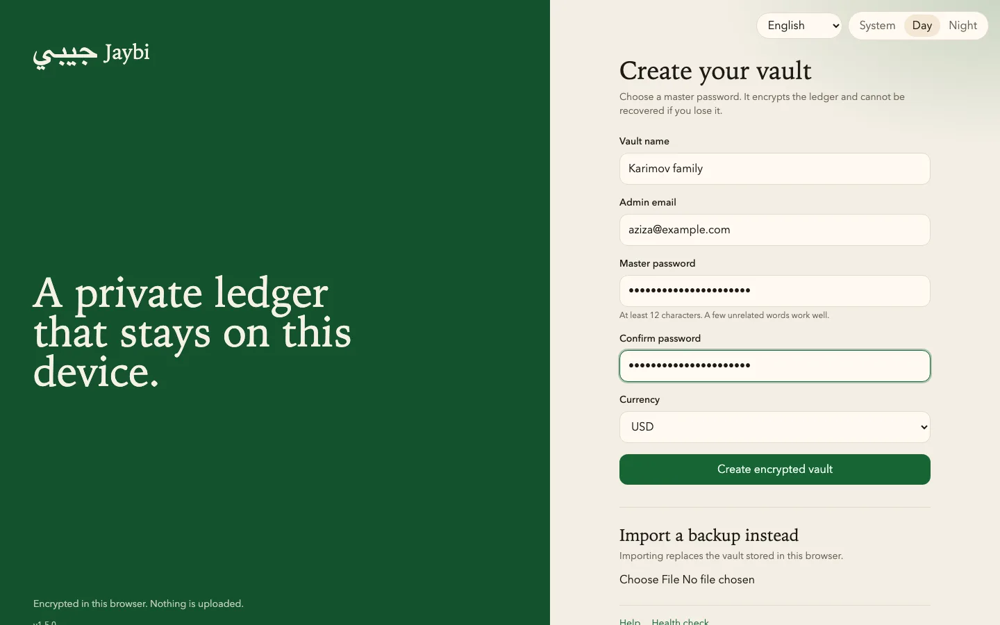

Choose the master password carefully: it encrypts the vault and **cannot be recovered**. See [Choosing a password](#choosing-a-password).

When the vault is ready you land on the dashboard. It is empty until someone records money.

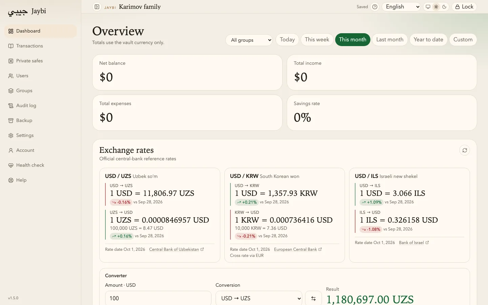

If you already have a backup from another device, do not create a new vault: use **Import a backup instead** at the bottom of the same screen (see [Moving to another device](#moving)).

### Joining a vault with a one-time code

Everyone except the first admin joins with a **one-time code** from an admin. The code looks like `XXXX-XXXX-XXXX-XXXX-XXXX-XXXX-XXXX`, works once, for your email only, and only until the time the admin chose.

1. Open Jaybi in the browser where the vault is stored. If the admin sent you a link, open it: it fills in your email and the code for you.
2. Otherwise, on **Unlock vault**, choose **Have a one-time code? Join the vault**.
3. Check **Your email** and the **One-time code**. Capital or small letters, spaces and dashes do not matter.
4. Enter a password under **Choose a password** and again under **Confirm password**, then choose **Join vault**.

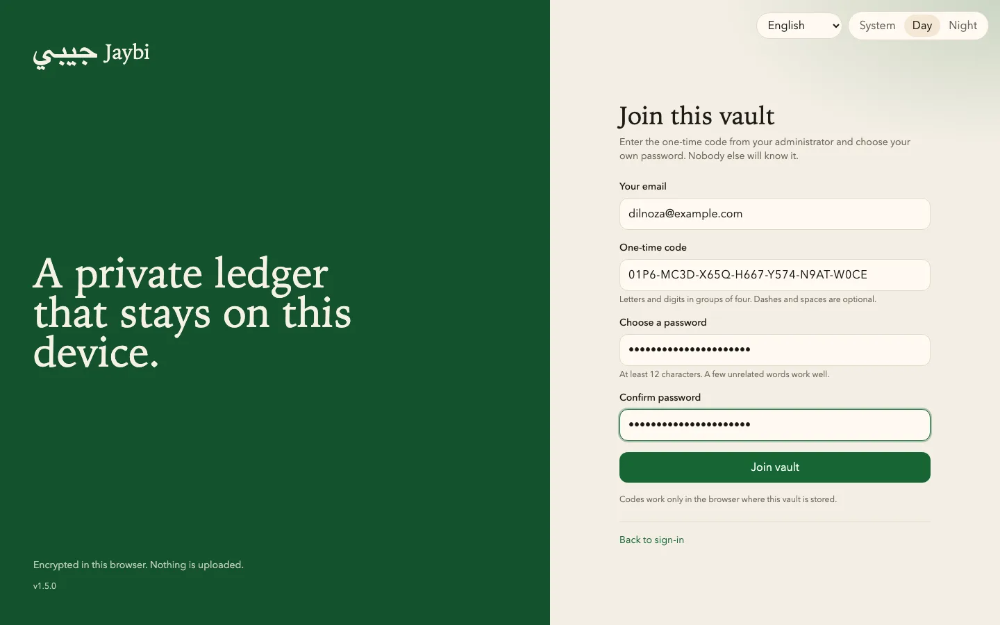

You are signed in straight away. Nobody else, not even the admin, knows your password.

If Jaybi says "There is no vault in this browser yet", you are on the wrong device or browser: a code works only where the vault is stored. If it says the code has expired or does not match, ask the admin for a new one.

## Signing in and locking

### Unlocking the vault

1. Open Jaybi. You see **Unlock vault**.
2. Enter your **Email** and **Password**, then choose **Unlock**.

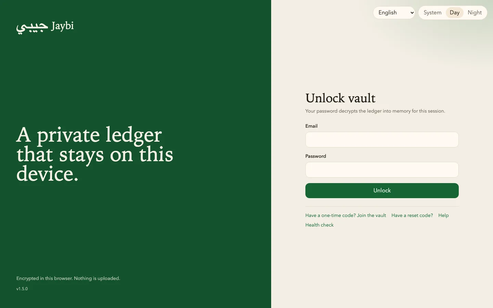

Unlocking takes a moment on purpose: your password is stretched so that guessing it is slow. "Email or password is incorrect" appears for either mistake, so nobody can find out which emails exist.

After five wrong tries for the same email, Jaybi shows **Too many attempts. Try again in** with a countdown, and the wait grows with every further mistake, up to 15 minutes. Refreshing the page does not shorten it. After you sign in, Jaybi tells you how many failed attempts there were for your account in this browser since your last visit. If you did not make them, change your password.

The links under the form are there for everyone: **Have a one-time code? Join the vault**, **Have a reset code?**, **Help** (this guide) and **Health check**, which checks the browser even when you cannot sign in.

### The second step (sign-in check)

If you turned on the [sign-in check](#sign-in-check), Jaybi asks for a 6-digit code from your authenticator app after the password. Type it into **Code** and choose **Continue**. A recovery code works here too, once. If you wait more than 5 minutes or choose **Cancel**, you go back to **Unlock vault**.

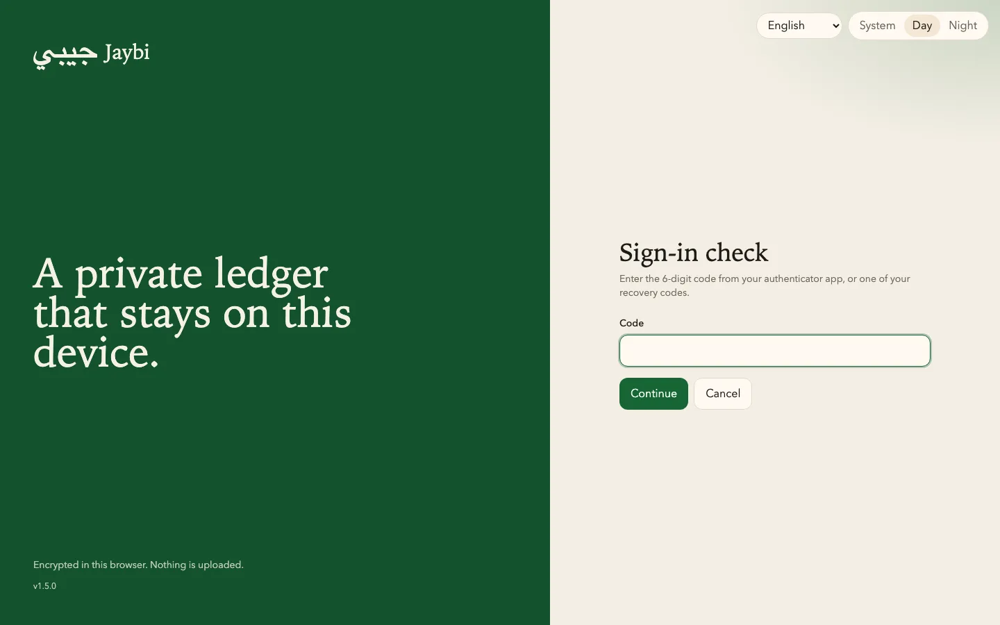

### Forgot your password? Use a reset code

Jaybi has no "forgot password" e-mail, because there is no server. Ask an admin for a **reset code**, then:

1. On **Unlock vault**, choose **Have a reset code?** (or open the link the admin sent).
2. Enter **Your email**, the **One-time code** and your new password twice.
3. Choose **Set new password**. You are signed in with the new password.

A reset code also turns off your sign-in check; turn it on again in [Your account](#account). If you use private safes, read [After an admin resets your password](#after-reset) first.

### Locking

Choose **Lock** in the top bar whenever you step away. Locking, refreshing or closing the tab removes the decrypted data from memory, and the next person must sign in. Jaybi also locks by itself after 15 minutes without activity; change this under **Account → Lock automatically**. The sign-in screen then says "The vault was locked after a period of inactivity."

The vault can be unlocked in only one tab at a time. If Jaybi says it is already unlocked in another tab or window, switch to that tab or lock it there first.

### Saving

There is no save button for the vault. The word next to the help button in the top bar shows what is happening:

- **Saved**: everything is encrypted and stored in this browser.
- **Unsaved** or **Encrypting…**: a change is being stored. This normally takes about a second.
- **Could not save**: the browser refused to store data, for example because the disk is full. Keep the tab open and run the [Health check](#health).
- **Not saved: changed elsewhere**: the vault was changed in another tab. Lock, sign in again and redo your last change.

## Finding your way around

The menu on the left shows only what your role allows. The top bar shows the vault name, the save status, the **?** button that opens the part of this guide about the current page, the language and theme switches, and **Lock**.

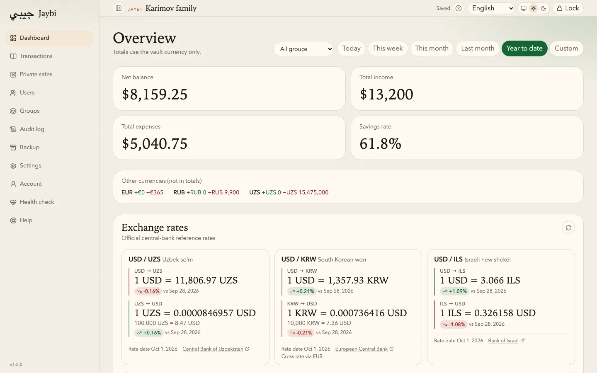

The button at the far left of the top bar collapses the menu to icons; choose it again to bring the labels back. Jaybi remembers your choice in this browser.

### On a phone

On a phone the menu becomes a row along the top that you can scroll sideways, and pages stack into one column. Tables turn into cards.

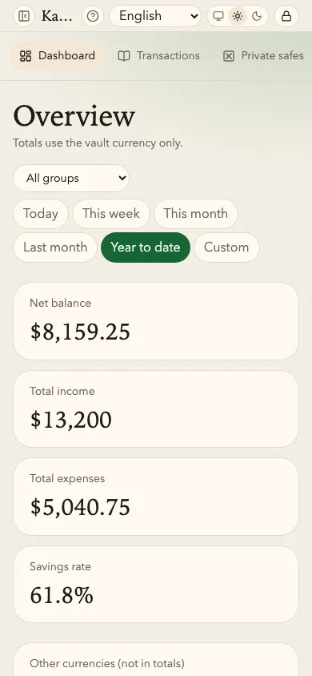

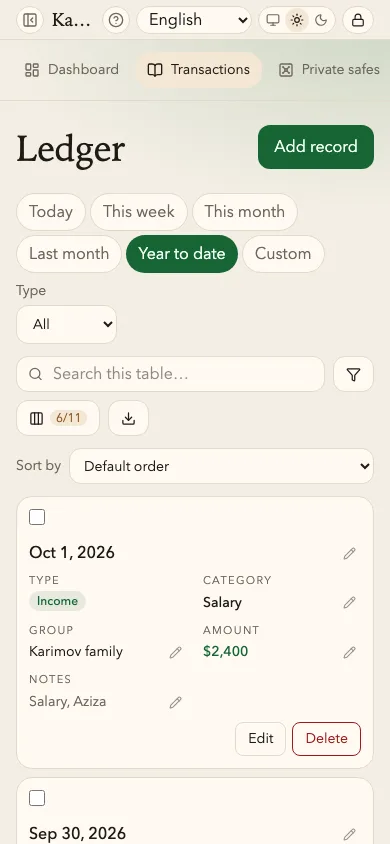

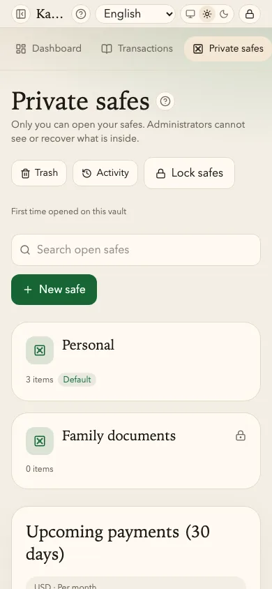

### Language and theme

Pick a language from the language menu: Oʻzbekcha, Ўзбекча, Русский or English. Pick **Day**, **Night**, or **System** to follow your device. Both choices are remembered in this browser, and you can change them before signing in too.

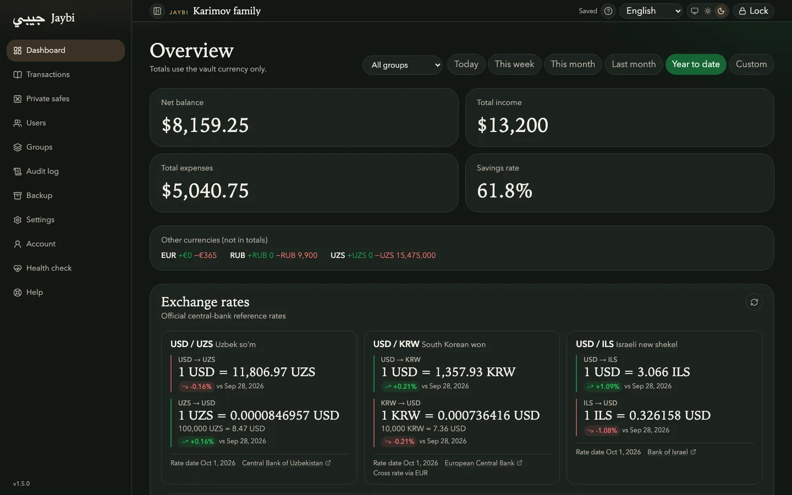

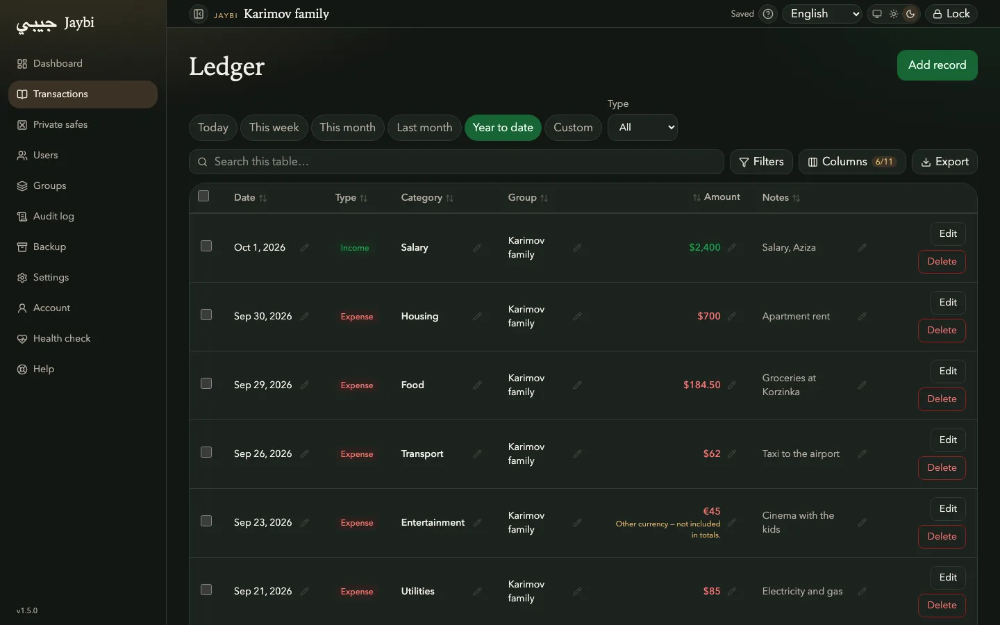

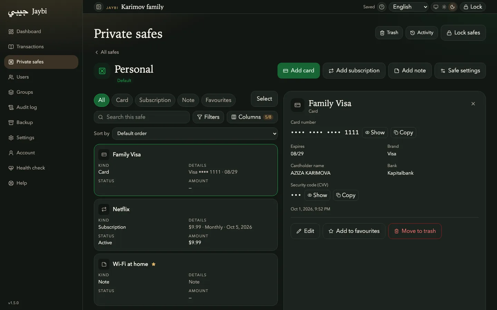

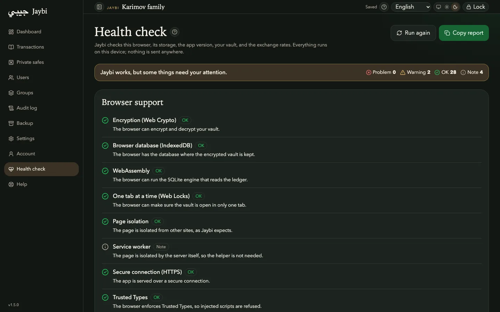

## Roles: who can do what

Every person in a vault has one role. Managers and Viewers belong to one **group** and only see that group's records.

| What | Admin | Manager | Viewer |
| --- | --- | --- | --- |
| Dashboard, Groups and Ledger | All groups | Own group | Own group |
| Add, edit and delete records | All groups | Own group | No |
| Export tables and data | Yes | No | No |
| People, invitations and reset codes | Yes | No | No |
| Backup, export data, replace the vault | Yes | No | No |
| Vault settings and categories | Yes | No | No |
| Audit log | Yes | No | No |
| Private safes, Account, Health check, Help | Yes, own | Yes, own | Yes, own |

A Viewer's menu is short: Dashboard, Transactions, Private safes, Groups, Account, Health check and Help.

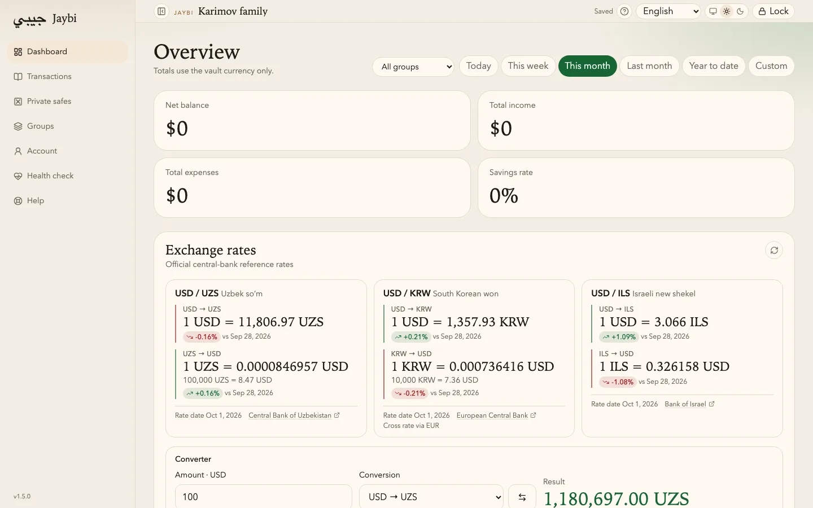

## The dashboard

The dashboard sums up money for a period and a group.

[Open the dashboard](https://jaybi.uz/#/app)

### The four figures

- **Net balance**: income minus expenses.
- **Total income** and **Total expenses**.
- **Savings rate**: the share of income left after expenses. It is 0% when there is no income and can be negative when you spent more than you earned.

Totals are exact to the cent (or tiyin) and count only records in the **vault currency**. Records in other currencies are listed under **Other currencies (not in totals)**, per currency, so nothing is hidden. Jaybi never converts your records.

### Choosing a period

The dashboard, the ledger and **Groups** share the same period buttons, and your choice carries over between them: **Today**, **This week** (Monday to Sunday), **This month** (the default), **Last month**, **Year to date**, and **Custom**.

**Custom** opens **From** and **To** date fields. If you enter them backwards, Jaybi swaps them.

### Choosing a group

The list next to the period buttons picks **All groups** or one group. It changes the figures, the charts and the other-currency list. You only see groups you belong to.

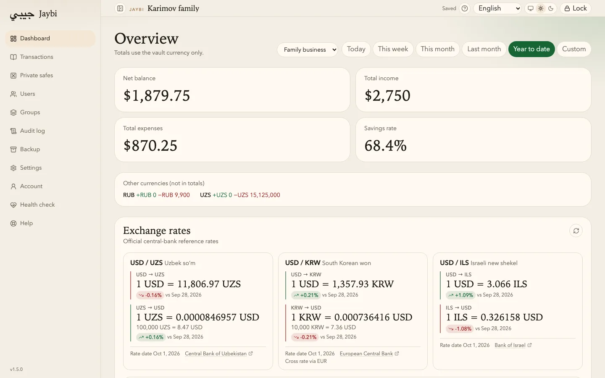

### Charts

Below the figures:

- **Income and expenses** compares each month in the period.
- **Expenses by category** shows where the money went.
- **Spending over time** shows daily expense totals.
- **Who spent** shows expenses per person in your group; admins see **Spending by group** instead.

A chart says "No figures in this range" when the period has no matching records.

### Exchange rates and the converter

The **Exchange rates** panel shows official central-bank reference rates for the Uzbek soʻm (UZS), the South Korean won (KRW) and the Israeli new shekel (ILS) against the US dollar, in both directions, with the change since the previous rate, the **Rate date** and a link to the source bank. A **Stale** badge appears when a rate is more than 2 business days old.

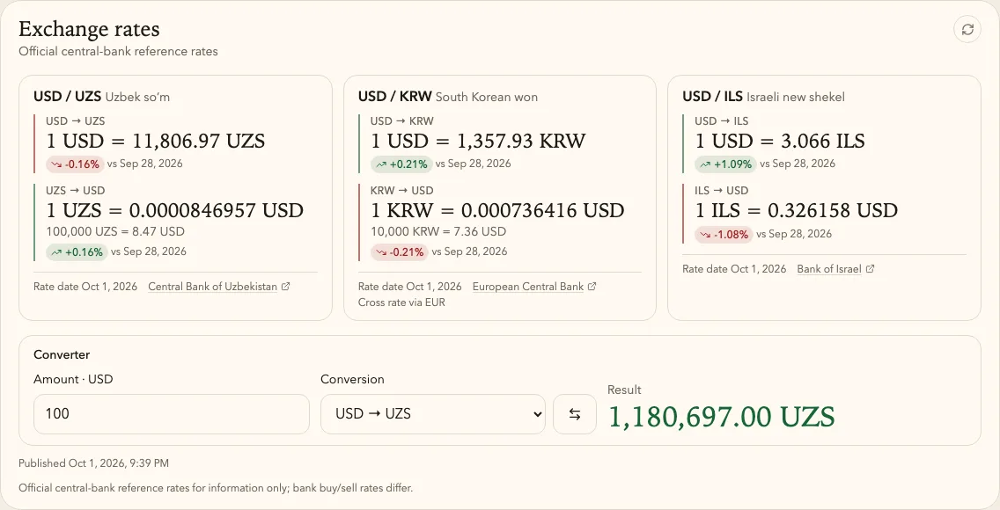

The **Converter** turns an amount into the other currency. Type the amount, choose the direction, or use ⇄ to swap it. **Exact** shows the unrounded value.

These rates are for information only; banks buy and sell at different rates. They never change your totals. Rates are saved in the browser, so the last ones still show when you are offline.

## Recording money

Managers and Admins record income and expenses on the **Ledger** page (menu item **Transactions**). Viewers can read it but not change it.

[Open the ledger](https://jaybi.uz/#/app/transactions)

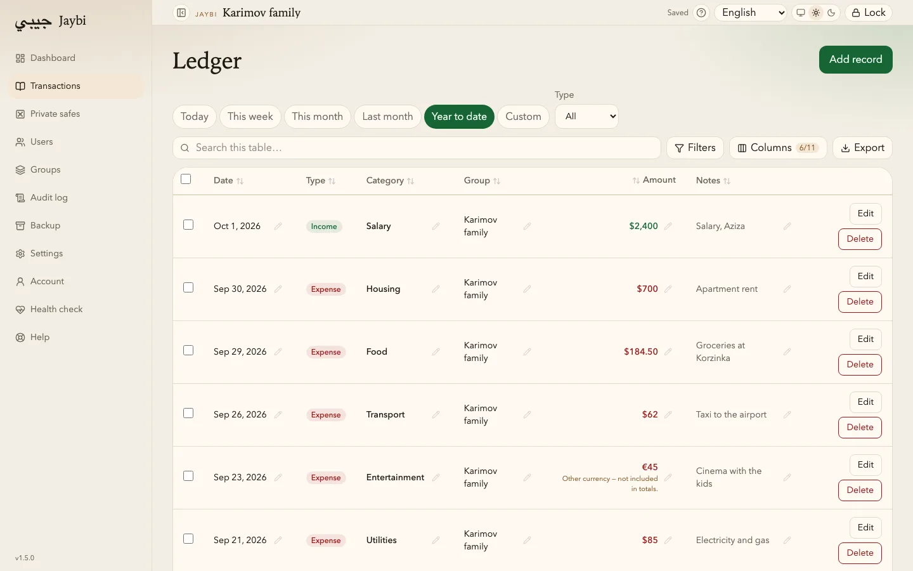

### Adding a record

1. Choose **Add record**.
2. Fill in the form (see the table below).
3. Choose **Save**.

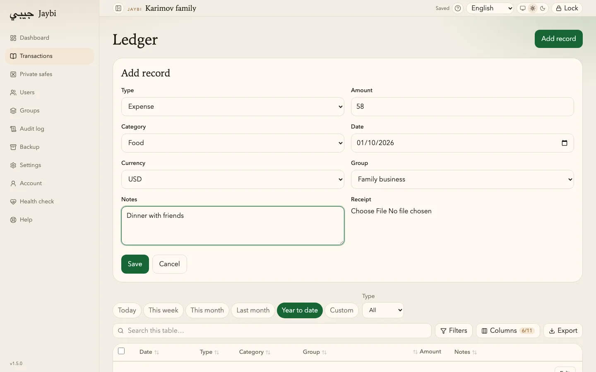

| Field | What to enter |
| --- | --- |
| **Type** | Income or Expense. The category list changes to match. |
| **Amount** | A number above zero, for example `1250`, `1250.5` or `1 250,50`. A dot or a comma both work as the decimal mark. Jaybi never rounds: if you type more decimals than the currency has, it asks you to fix the amount. |
| **Category** | For example Salary, Food or Transport. Admins manage the list in [Vault settings](#settings). |
| **Date** | Today unless you change it. |
| **Currency** | The vault currency unless you change it. See [Currencies](#currencies). |
| **Group** | Only shown if you can see more than one group. |
| **Notes** | Optional, up to 2,000 characters. |
| **Receipt** | Optional PNG, JPEG, WebP or GIF image up to 1.5 MB. **View receipt** checks it; **Remove receipt** drops it. |

### Changing and deleting

To change a whole record, choose **Edit** on its row, adjust the fields and choose **Update record**.

For a quick fix, choose the small pencil next to a date, category, group, amount or note, type the new value and press Enter (Esc cancels). If the value is not accepted, the reason shows under the field and nothing changes.

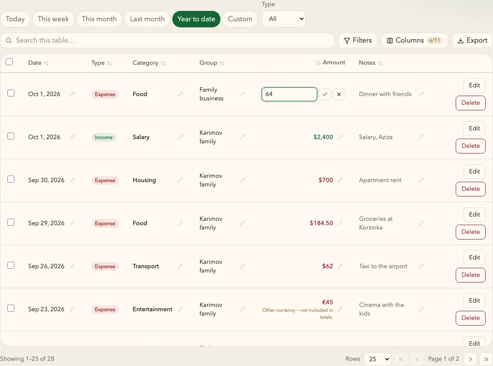

To delete, choose **Delete** and confirm. To delete several records, tick them and choose **Delete selected**. Deleting cannot be undone, but every deletion is written to the admin's audit log.

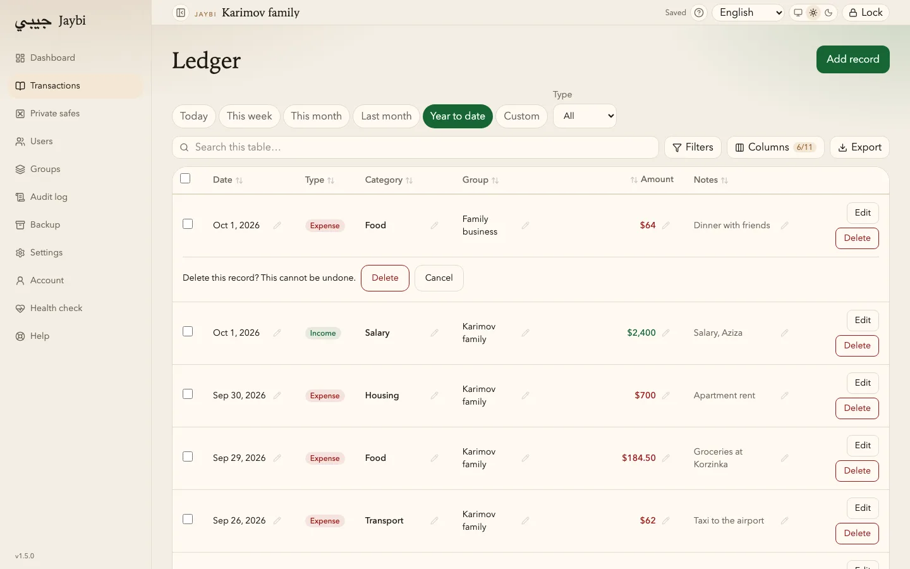

### Currencies

Each vault has one main currency. Totals and charts only count records in that currency. A record in another currency is saved and listed with the note "Other currency — not included in totals." The dashboard lists those amounts separately. Jaybi does not convert between currencies.

## Working with tables

The ledger, the people list, the groups, the categories, the private-safe lists and the audit log are tables that all work the same way.

- **Sort**: choose a column heading. Choose it again for the other direction, and a third time for the original order. Hold Shift to sort by up to three columns. On a phone, use **Sort by** above the cards.
- **Search this table**: type any part of what you see. Case, accents, apostrophes and even the alphabet do not matter, so `taksi` finds "Такси". Esc clears the search.
- **Rows** at the bottom: 10, 25, 50, 100 or all, with a line such as "Showing 1–25 of 140".

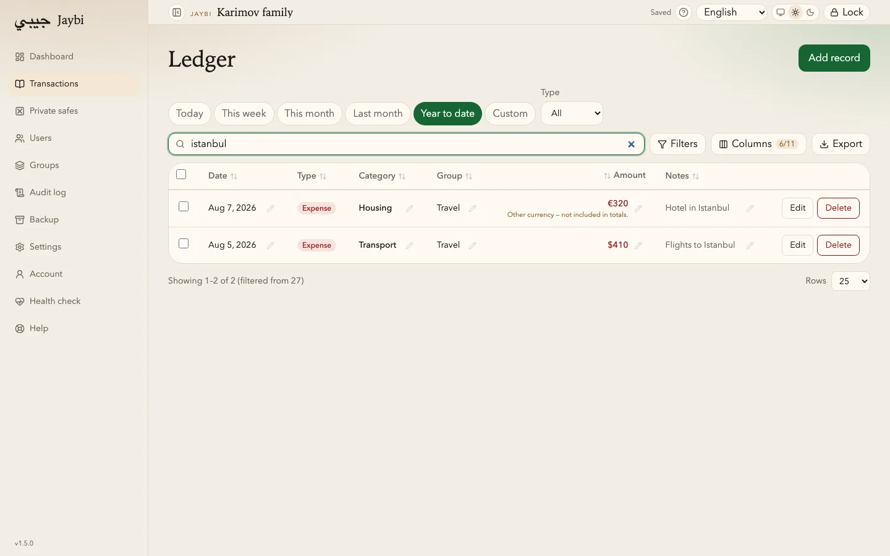

**Filters** opens one filter per column: text, a list to tick, a From–To date range or a Min–Max amount. The button shows how many filters are on; **Clear filters** turns them off.

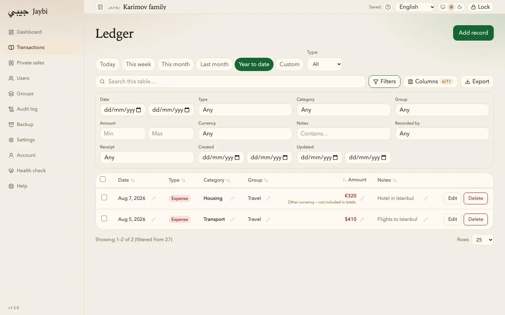

**Columns** lets you show or hide columns, move them, choose compact rows, or reset the layout. Jaybi remembers the layout for each table in this browser, but never what you searched for.

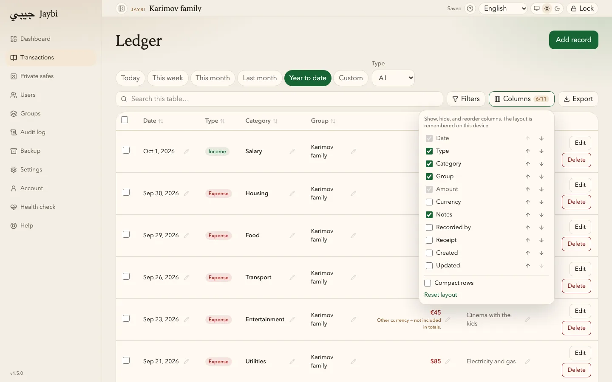

**Export** (admins only) downloads exactly the rows and columns you see, as CSV, Excel, PDF or other formats. Because the file is not encrypted, Jaybi asks you to confirm first.

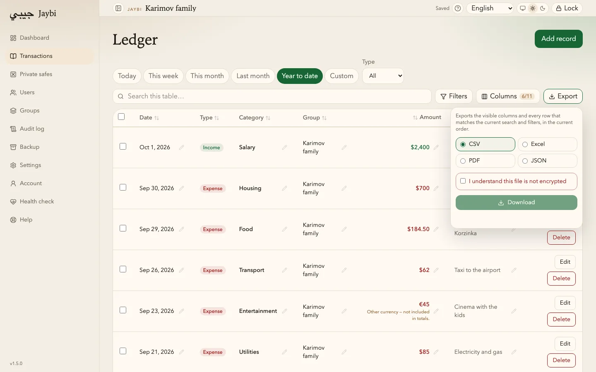

## Groups

A **group** is a part of the vault with its own records and people, for example a family business beside the household. Everyone sees their own group; admins see all of them.

[Open Groups](https://jaybi.uz/#/app/groups)

**Groups** shows each group's **Income**, **Expenses** and **Net** for the selected period, with the number of transactions and the date of the latest one. Each currency gets its own line; currencies are never added together. With two or more groups, admins also see an **All groups** line with the combined figures.

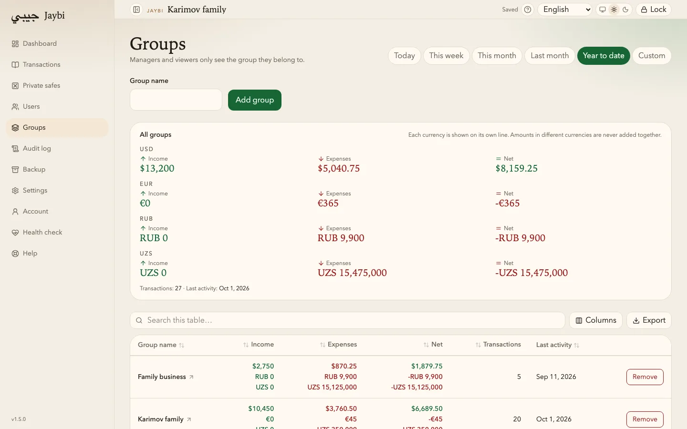

Choose a group's name to open the ledger with only that group's records for the same period. The group filter is already set; choose **Clear filters** to see everything again.

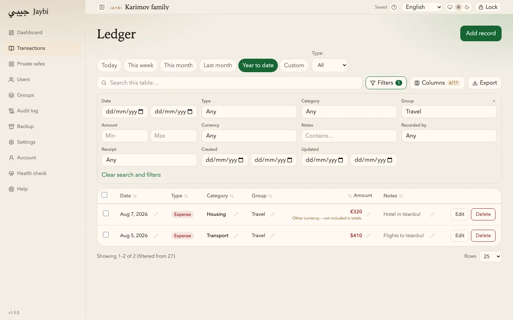

Admins add a group by typing its **Group name** and choosing **Add group**. A group can be removed only when it has no people and no records.

## People and invitations

Admins manage who can open the vault on the **People** page (menu item **Users**). Each person unlocks the same vault with their own password. Managers see the page too, read-only, for the people in their own group.

[Open People](https://jaybi.uz/#/app/users)

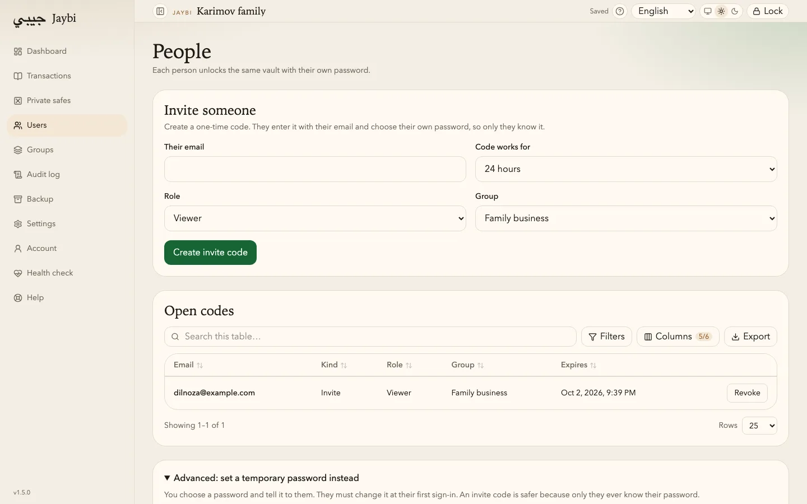

### The overview

**Overview** at the top counts the people in the vault and how many of the 256 places are used, including places held for open codes. It shows how many active people have a sign-in check and who **Needs attention**: people who must change their password, cannot sign in, have no group, are suspended, or still have an older password copy. It also lists recent sign-ins and open codes with their expiry, and two small charts show people by role and by group. Nothing secret appears here: no codes, passwords or keys.

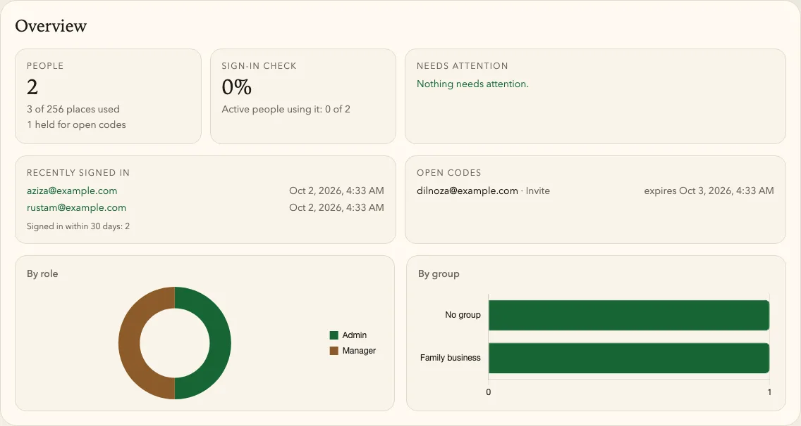

### Inviting someone (recommended)

1. Choose **Add user**. **Send an invite code** is already selected.
2. Enter **Their email**, choose how long the **Code works for**, then the **Role** and the **Group**.
3. Choose **Create invite code**.
4. Jaybi shows the code once. Choose **Copy code** or **Copy link** and give it to the person in person or over a channel you trust, then choose **Done**.

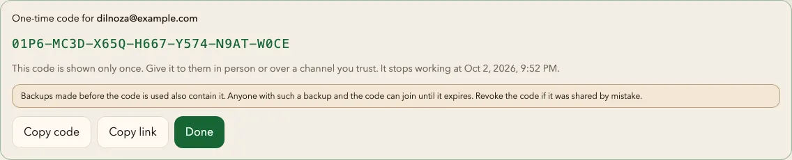

The person then [joins with the code](#joining) in this browser and chooses their own password. Until they do, the code is listed under **Open codes**, where **Revoke** cancels it.

### Adding someone with a temporary password

Choose **Add user**, then **Set a temporary password**. Enter the email, a name if you like, a temporary password, the role and the group, and choose **Add user**. The person must replace the password at their first sign-in. An invite code is safer, because then only they ever know their password.

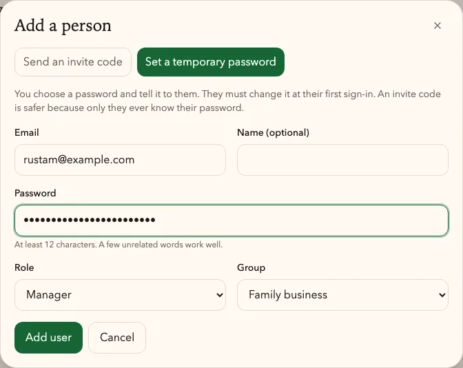

### A person's page

Choose a person's email in the list, or **Open** on their row. Their page shows the profile, role and group, when they were added and last signed in, whether they have a sign-in check or must change their password, the records they entered in each currency, and, for admins, their recent entries in the audit log.

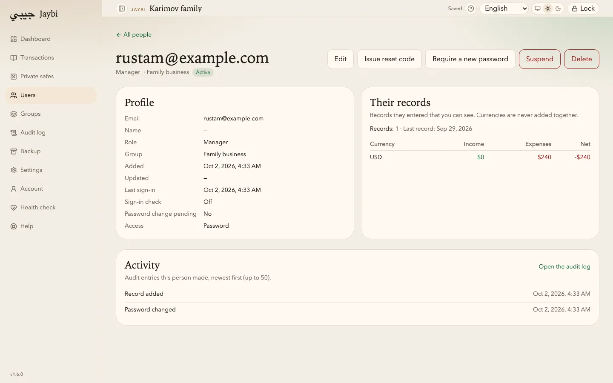

From there an admin can:

- **Edit** the name, email, role and group. After an email change the person signs in with the new email and their current password. Revoke any open code for them first.
- **Issue reset code**, as described [below](#reset-for-someone).
- **Turn off sign-in check** for someone who lost both their authenticator and their recovery codes.
- **Require a new password**: they must choose one at their next sign-in and can do nothing else until then.
- **Suspend**: they cannot sign in until you **Reactivate** them, and their records, private safes and history stay. Reactivating gives them a reset code. A copy of the vault file saved before the suspension still opens with their old password, because the vault key does not change.
- **Delete**: type their email to confirm. If they entered records, move them to another person or keep them under this person as a former member. Deleting destroys their private safes for good. The audit log keeps their name either way.

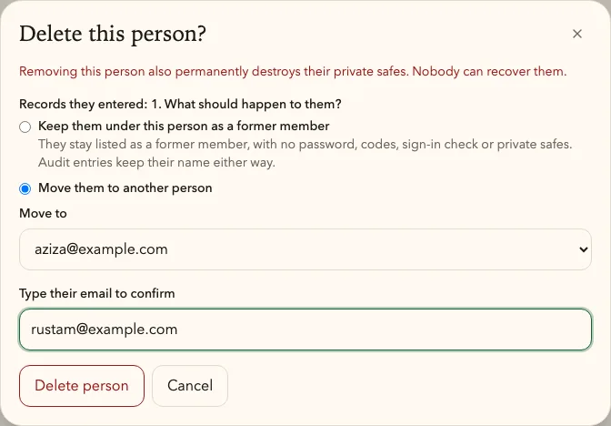

You cannot suspend or delete yourself, and the vault always keeps at least one active admin. Every change is written to the audit log.

### Changing several people at once

Tick people in the list, choose a new **Role**, a new **Group** or both, choose **Apply to selected** and confirm. Each person's change is written to the audit log on its own. Former members are left out.

### Resetting someone's password

On the person's row or their page, choose **Issue reset code**, choose how long the code works, and decide whether to **Stop their current password from working now** (choose this if someone else may know it). Choose **Issue reset code** again and give them the code. **Set a temporary password instead** on the row is the older way.

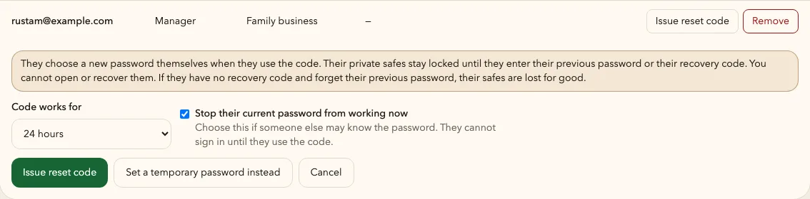

Read the yellow note before you reset: their private safes stay locked until they enter their previous password or their recovery code. You cannot open or recover anyone's safes.

### Clock check for codes

Codes are refused when this device's clock is behind the latest time the vault has seen, so turning the clock back cannot revive an expired code. If a wrong clock pushed that time into the future, correct the clock, open **Clock check for codes**, enter your password and choose **Reset to the current time**.

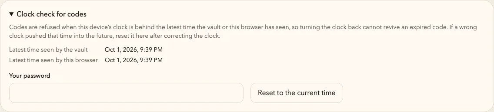

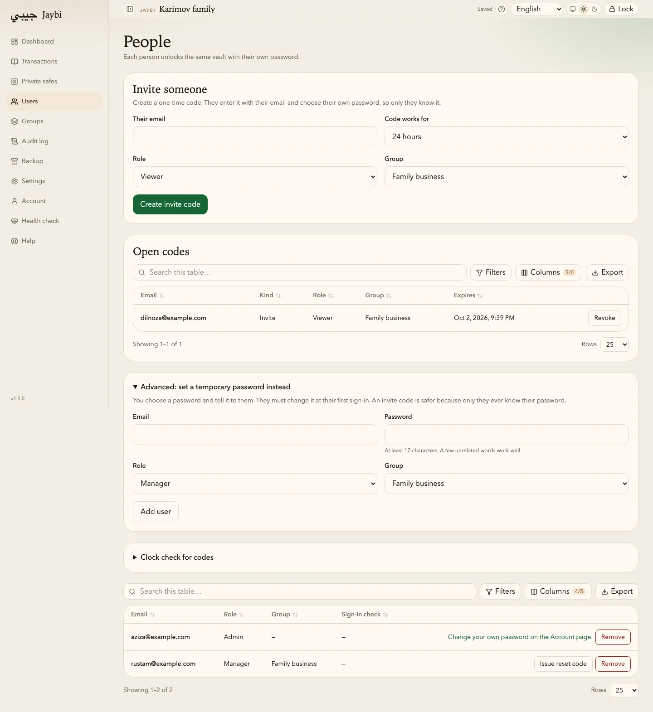

## Private safes

A private safe is where you keep things for yourself: payment cards, subscriptions and notes. It is not a money account; nothing in it appears on the dashboard or in the ledger.

Only you can open your safes. Admins cannot see them, cannot see their names, and cannot open or recover them, even with a backup. Everyone in the vault has their own safes.

[Open Private safes](https://jaybi.uz/#/app/safes)

### Setting up

1. Open **Private safes** and enter **Your password**.
2. Choose **Create a recovery code (recommended)** or **Skip for now**.
3. Choose **Create my safes**.

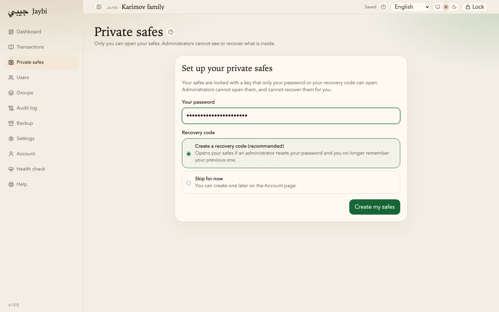

If you chose a recovery code, Jaybi shows it once. Write it down or print it, keep it away from this device, and type its last 4 characters to confirm.

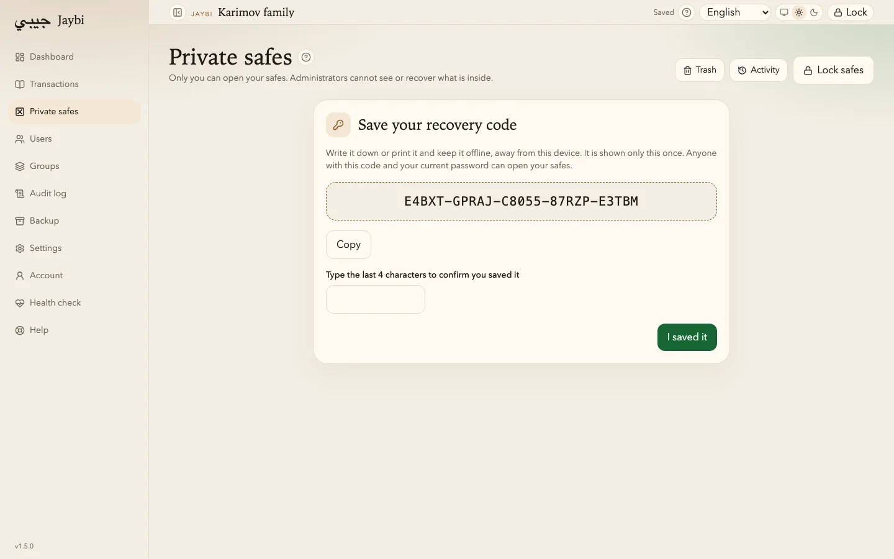

You get one empty safe called **Personal**.

### Why the recovery code matters

The recovery code matters in one situation: an admin resets your password and you no longer remember your previous one. Without the code your safes are then lost for good. You can create or replace it later under **Account → Recovery code**. Keep it as private as your password.

### Cards

Open a safe and choose **Add card**. Enter a title, the card number, the cardholder name, the expiry, the bank and notes. Jaybi detects the brand from the number and checks the check digit. The **security code (CVV)** is optional and hidden behind **Add security code**; banks advise against keeping it. There is no place for a PIN: never store a PIN anywhere.

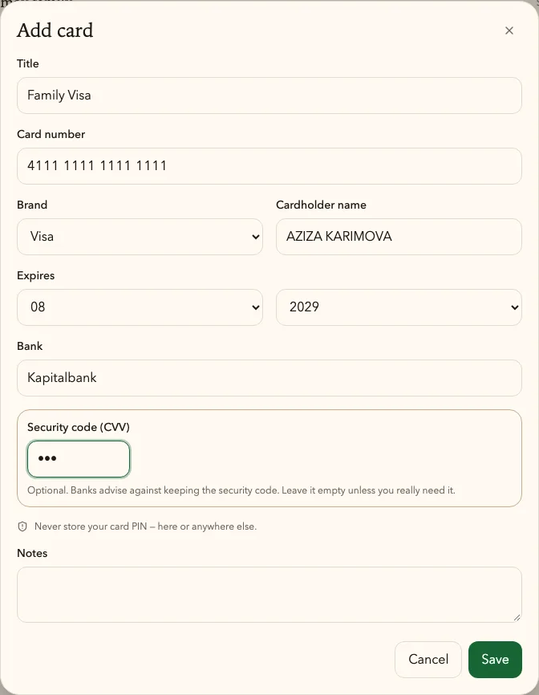

Card numbers are shown with only the last four digits.

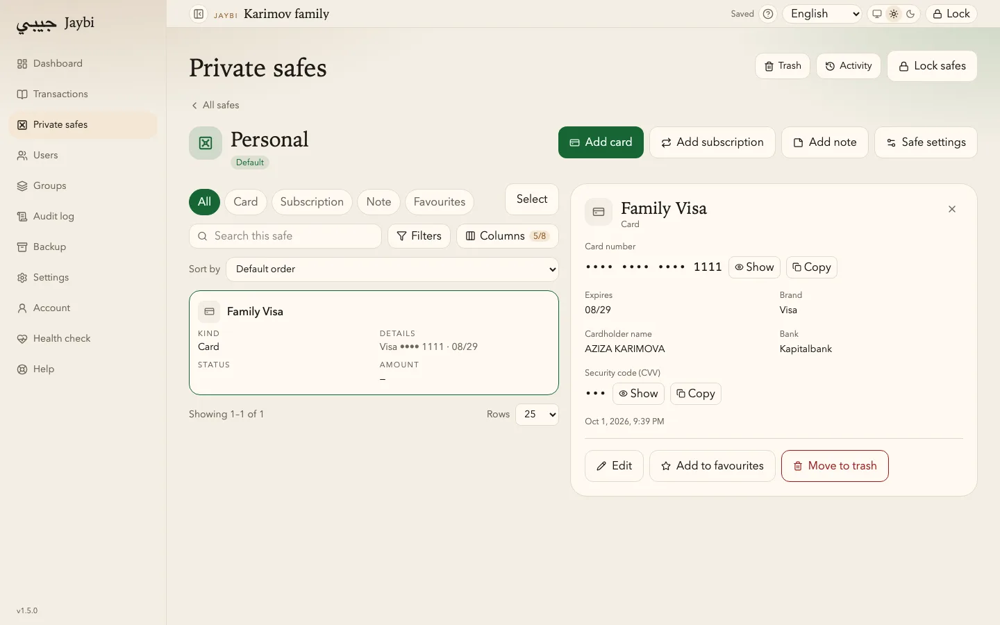

**Show** and **Copy** ask for your password unless you entered it in the last 2 minutes. A shown value hides again after 15 seconds; a copied value is cleared from the clipboard after 30 seconds. You can change both times in **Account**.

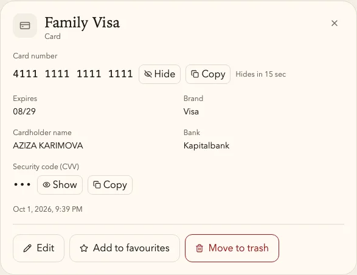

### Subscriptions

Choose **Add subscription** and enter the service, the price and currency, the billing cycle, a payment date and the status. You can also link the card it is paid with, the website, the account, a reminder and notes.

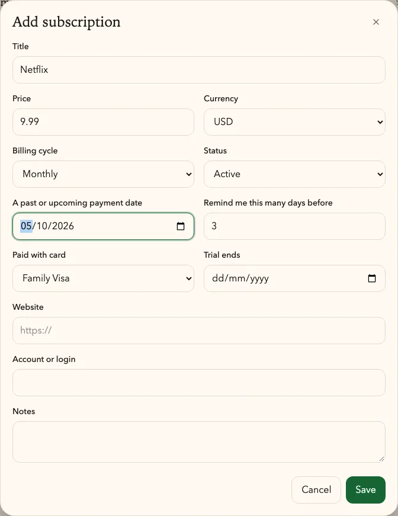

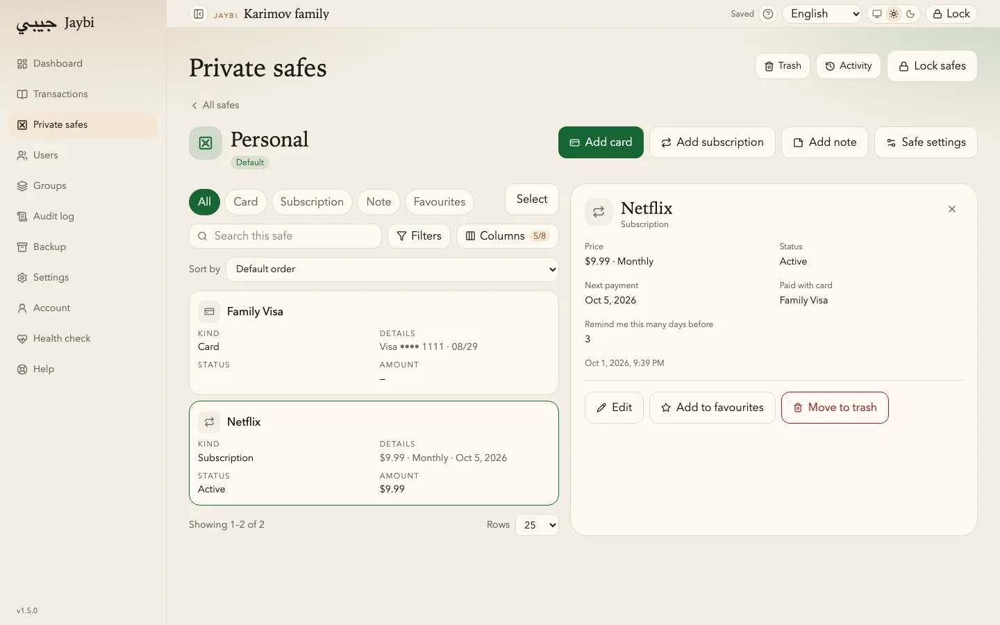

### Notes

Choose **Add note** for anything else, up to 10,000 characters of plain text, for example a Wi-Fi password. Mark items you use often with **Add to favourites**.

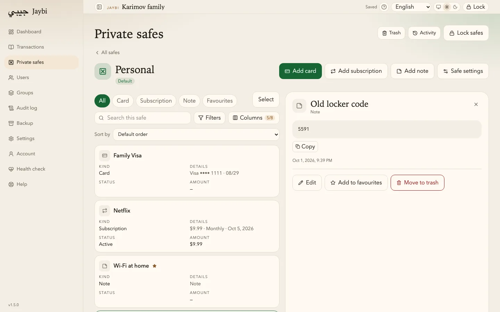

### More safes

Choose **New safe** to add one, with a name, a description, an icon and a colour. Tick **Ask for my password every time this safe is opened** for a safe that should stay closed until you ask.

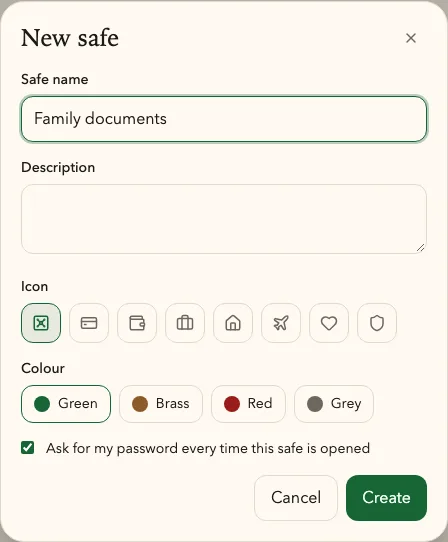

The safes page lists your safes, what your active subscriptions cost per month and per year, **Upcoming payments** for the next 30 days, cards that expire soon, and your favourites. **Search open safes** searches every open safe.

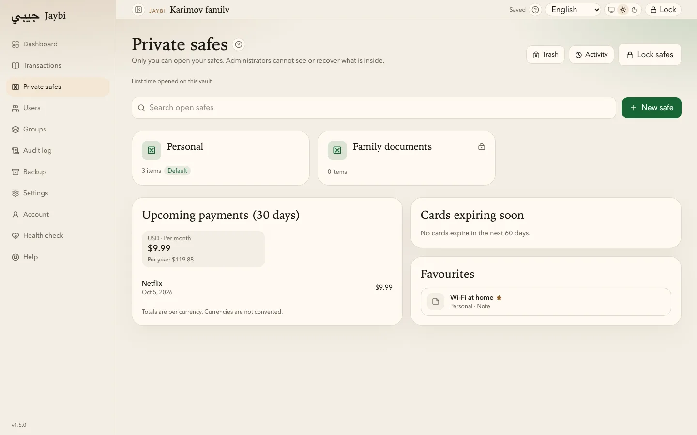

A safe that asks for the password shows a password field instead of its contents.

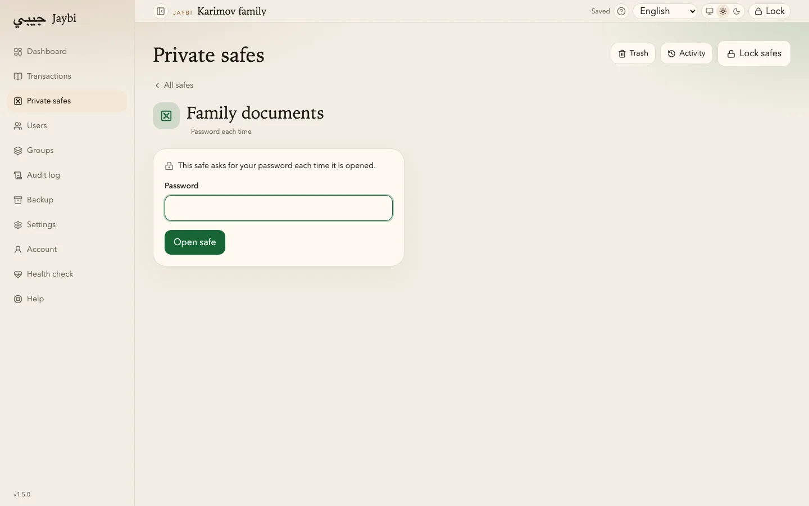

In **Safe settings** you can also make a safe the default, archive it, change its encryption key or delete it.

### Opening and locking safes

Signing in does not open your safes. Choose **Open safes** and enter your password again. Jaybi shows when your safes were **Previously opened**; if you do not recognise that time, someone else may have used your password.

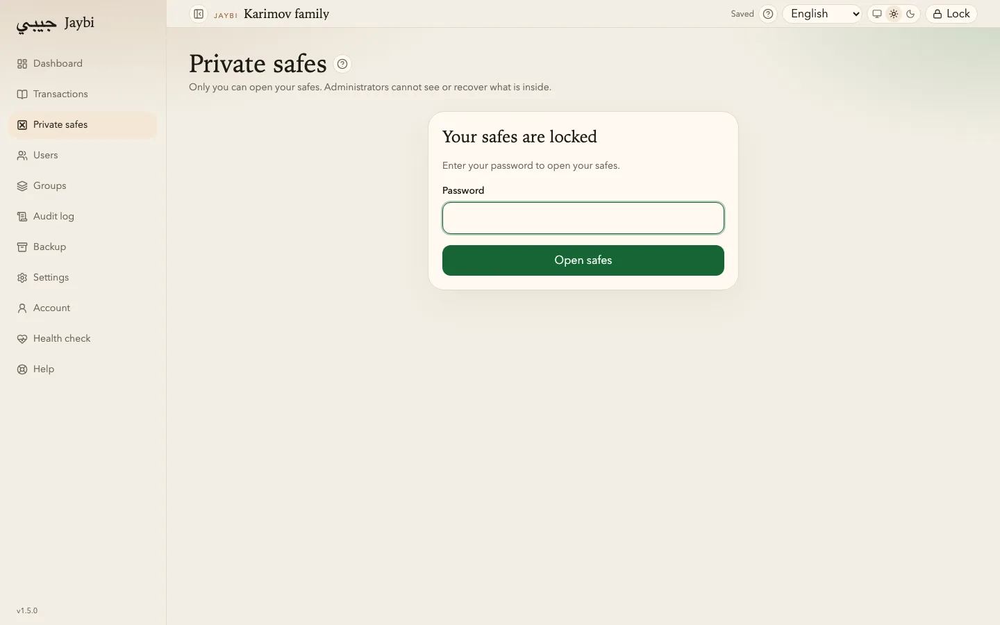

Safes stay open while you work and lock again when you choose **Lock safes** or when the vault locks.

### Trash and Activity

Deleted safes and items go to **Trash** for 30 days. **Restore** brings them back; **Delete permanently** removes them at once.

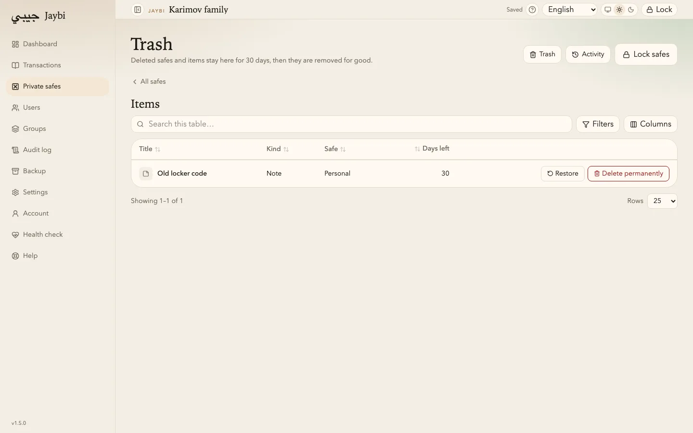

**Activity** lists what happened in your safes and when: opened, added, changed, moved, deleted or restored. Only you can read it.

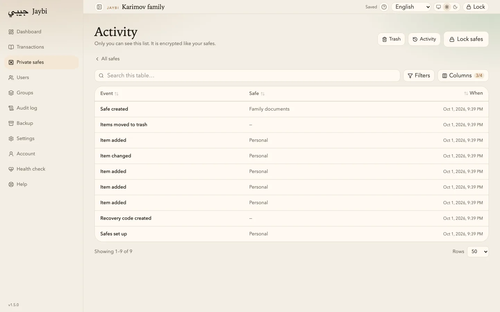

### After an admin resets your password

1. Set your new password with the reset code (or sign in with the temporary password and choose a new one).
2. Open **Private safes**. Jaybi says your password changed since you last opened them.
3. Enter your **previous password**, the one you chose yourself before the reset, or choose to use your recovery code. Also enter your current password.
4. Your safes open, and from now on your current password opens them.

Never type a temporary password from the admin as your previous password. If you remember neither your previous password nor your recovery code, nobody can open your safes; **Account → Start over → Reset private safes** gives you new, empty ones.

## Backups and moving to another device

Only admins can make backups. A backup is an encrypted copy of the whole vault in one `.moliya` file. It opens with any password that belongs to the vault, and it is the **only** way back if this browser's data is lost.

[Open Backup](https://jaybi.uz/#/app/backup)

When there are records and no backup yet, or the last one is more than 7 days old, a reminder appears on every page.

### Downloading a backup

1. Open **Backup**.
2. Choose **Download backup**.
3. Keep the file somewhere other than this device: a USB stick, another computer, or cloud storage. It stays encrypted.

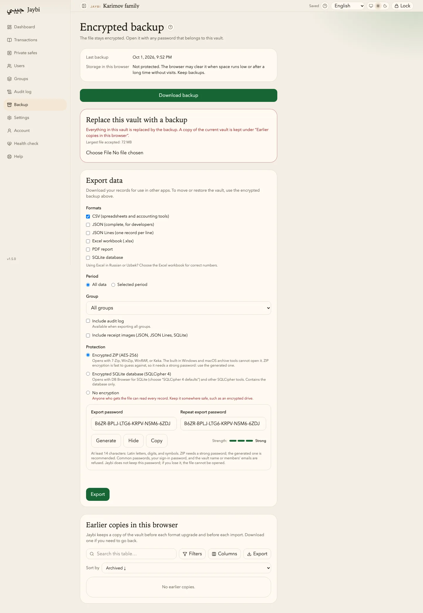

The page also shows **Storage in this browser**. "Not protected" means the browser may clear the data when space runs low; the [Health check](#health) can ask the browser to keep it.

**Earlier copies in this browser** lists the copies Jaybi keeps before each format upgrade and each import. Download one if you need to go back.

### Exporting data for other apps

**Export data** downloads your records as CSV, JSON, Excel, a PDF report or a SQLite database, for all data or the selected period, for one group or all. By default the file is an **Encrypted ZIP (AES-256)** with a separate export password; use **Generate** for a strong one. A backup is for restoring Jaybi; an export is for other programs.

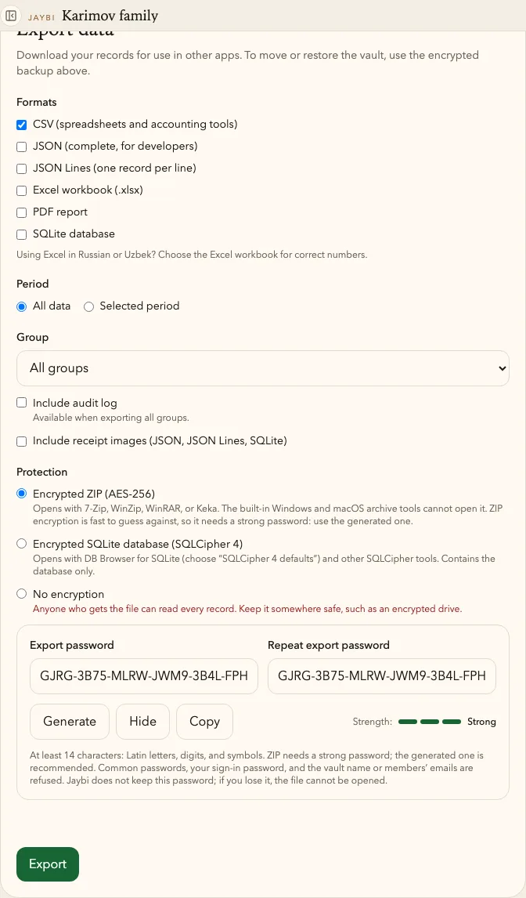

### Restoring a backup in this browser

Under **Replace this vault with a backup**, choose the backup file, enter your password and type the vault name to confirm, then choose **Replace vault**. A copy of the current vault is kept under **Earlier copies in this browser**.

Under the file picker, Jaybi shows the **Largest backup this device can restore** and what limits it: free storage in this browser, this device's memory, or the most any browser can open. Every device restores backups of at least 72 MB. If a backup is larger, Jaybi says so before reading it and suggests what to do: free up disk space or let Jaybi keep its data on the [Health check](#health) page, close other tabs and apps, or restore it on a computer with more memory. The same applies on the setup screen of a new device.

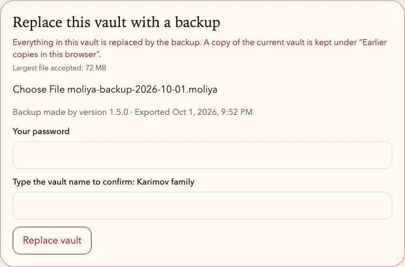

### Moving to another device

1. On the old device, download a backup.
2. On the new device, open [https://jaybi.uz](https://jaybi.uz). It shows **Create your vault**: do not fill it in.
3. Under **Import a backup instead**, choose the backup file and choose **Replace vault**.
4. Sign in with your usual email and password.

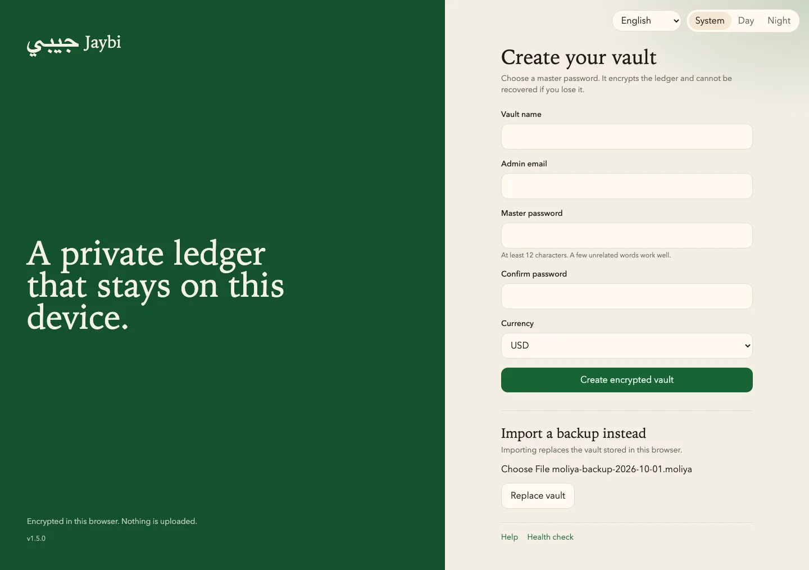

Everyone in the vault can sign in on the new device with their own password. The vault is not synchronised: after moving, use only the new device, or move it back the same way.

## Vault settings

Admins change options for the whole vault on **Settings**.

[Open Settings](https://jaybi.uz/#/app/settings)

- **Vault name** and **Vault currency**, then **Save settings**. Totals only count records in the vault currency.
- **Categories**: add, rename or remove income and expense categories, with a name in each language. A blank translation uses the English name. A category that records use cannot be removed.
- **About this version**: the app version, build, data format and when the vault was created. Mention these when you report a problem.

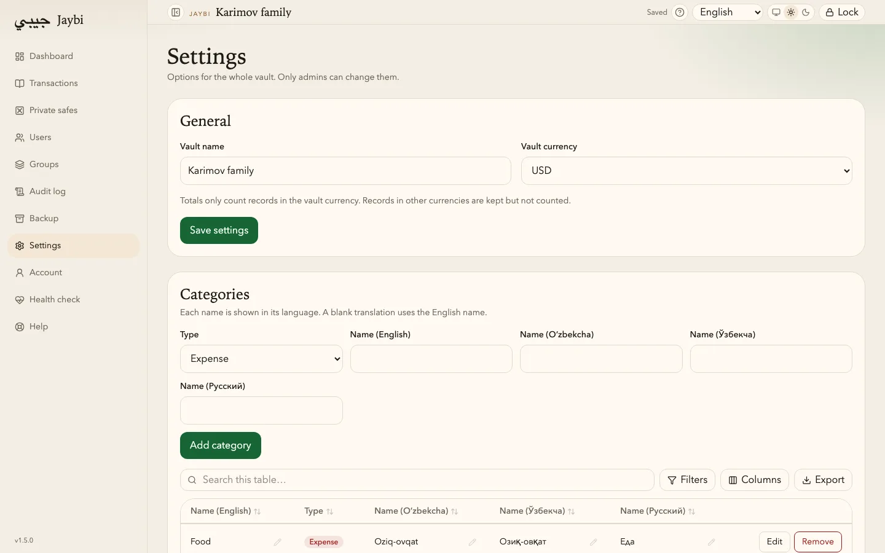

## Your account

Everyone has an **Account** page with settings that apply only to them.

[Open Account](https://jaybi.uz/#/app/account)

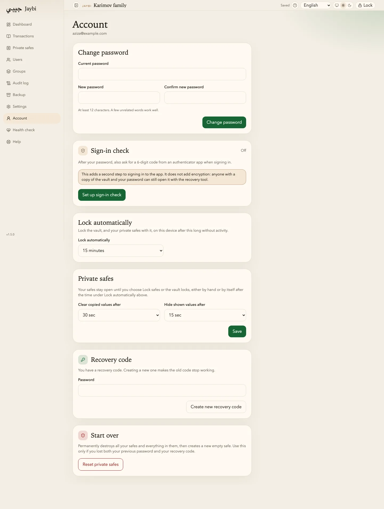

### Changing your password

Enter the **Current password**, then the **New password** and **Confirm new password**, and choose **Change password**. Your private safes and sign-in check move to the new password at the same time.

If an admin chose your password, Jaybi asks you to choose a new one before anything else: every page leads to **Account** until you do.

### Choosing a password

A new password must be 12 to 256 characters, must not be a common password, must not be built from your email or the vault name, and must not be a simple pattern such as `qwertyuiop`. Four or five unrelated words, with spaces if you like, are easy to remember and hard to guess. Do not reuse a password from another site: your password is what protects copies of the vault.

### Sign-in check (authenticator app)

The sign-in check asks for a 6-digit code from an authenticator app (Google Authenticator, Microsoft Authenticator, Aegis, 1Password and similar) after your password. It protects you if someone learns your password and tries it in this browser. It does not add encryption.

1. Choose **Set up sign-in check**.
2. Scan the QR code with your app, or type the **Setup key**.
3. Enter the **Code from the app** and **Your password**, then choose **Confirm and turn on**.
4. Jaybi shows 10 **Recovery codes**. Each works once if you lose your phone. Choose **Download codes** or write them down, keep them away from this device, and choose **I have saved these codes**.

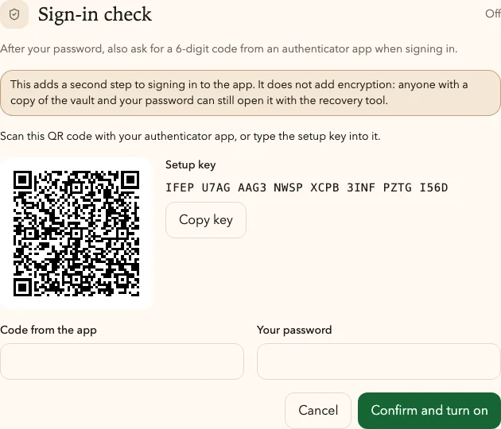

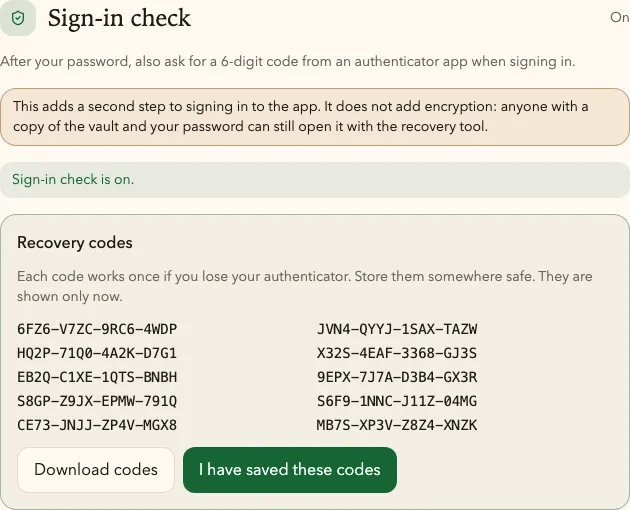

To turn it off, choose **Turn off sign-in check** and enter your password. To get new recovery codes, turn it off and on again.

### Lock automatically and safe timers

**Lock automatically** sets how long the vault stays open without activity on this device: 5 minutes, 15 minutes (the default), 30 minutes or 1 hour. Under **Private safes** you choose how long copied values stay in the clipboard and how long shown values stay visible.

## Audit log

The **Audit log** lists who did what and when: records added, changed and deleted, people added or removed, password resets, backups, exports, settings and more. Only admins see it. It never shows amounts, notes or private-safe contents.

[Open the audit log](https://jaybi.uz/#/app/audit)

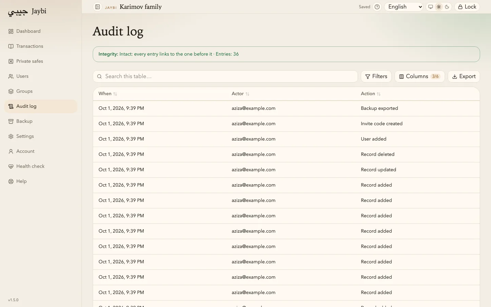

Every entry is linked to the one before it. **Integrity** says "Intact: every entry links to the one before it" when nothing was changed outside the app. If entries were changed or removed, Jaybi shows a red bar on every page and the Health check reports it. If you expected the change, for example after importing an older backup, choose **Accept the log as it is**; otherwise restore a recent backup and change passwords.

## Health check

The **Health check** looks at this browser, its storage, the app version, your vault and the exchange rates, and explains in plain words what is fine and what needs attention. Everything runs on this device; nothing is sent anywhere.

[Run the health check](https://jaybi.uz/#/app/health)

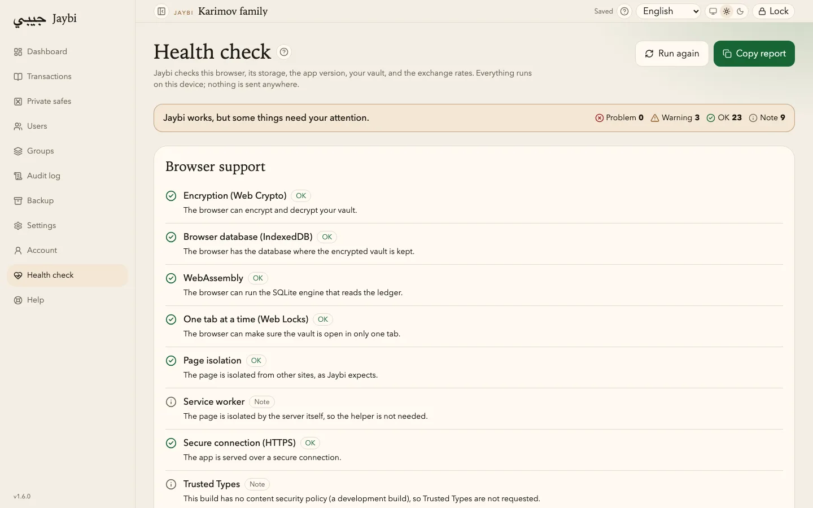

Each row is marked **OK**, **Warning**, **Problem** or **Note**, with a short explanation. A row that needs attention also shows **How to fix** and, where it helps, a button such as **Ask to keep data** or **Open Backup**.

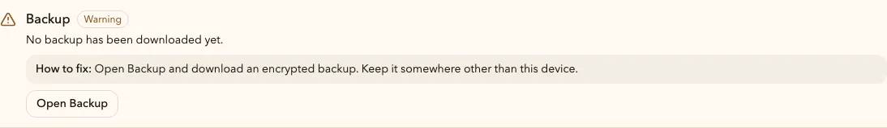

### What it checks

| Area | Checks |
| --- | --- |
| **Browser support** | Encryption, the browser database, WebAssembly, one tab at a time, page isolation, the service worker, a secure connection, Trusted Types, cookies and site data, private window |
| **Storage** | Whether storage can be written, free space, whether the browser keeps the data when space runs low, small settings storage, whether a vault is stored here, the largest vault this device can hold |
| **App and version** | Whether a newer version is published, the build, and whether pages loaded on demand match the running version |
| **Vault** | Data format, vault size against this device's limit (at least 48 MB), saving, backup age, earlier copies, audit log integrity, the device clock, your sign-in check, your password, and the number of people |
| **Exchange rates** | Whether rates are current and match their checksum |
| **Security** | The content security policy, not running inside another page, and the address |

Rows marked **Admin only** appear only for admins: the audit log rows, the earlier copies, the number of people, and **People hygiene**, which warns when someone cannot sign in, a code has expired, or an older password copy is left; it only ever shows counts. Admins also see backup dates and the clock marks. Everyone else sees a shorter list about the browser and their own account; the backup row just reminds them that backups are made by an admin.

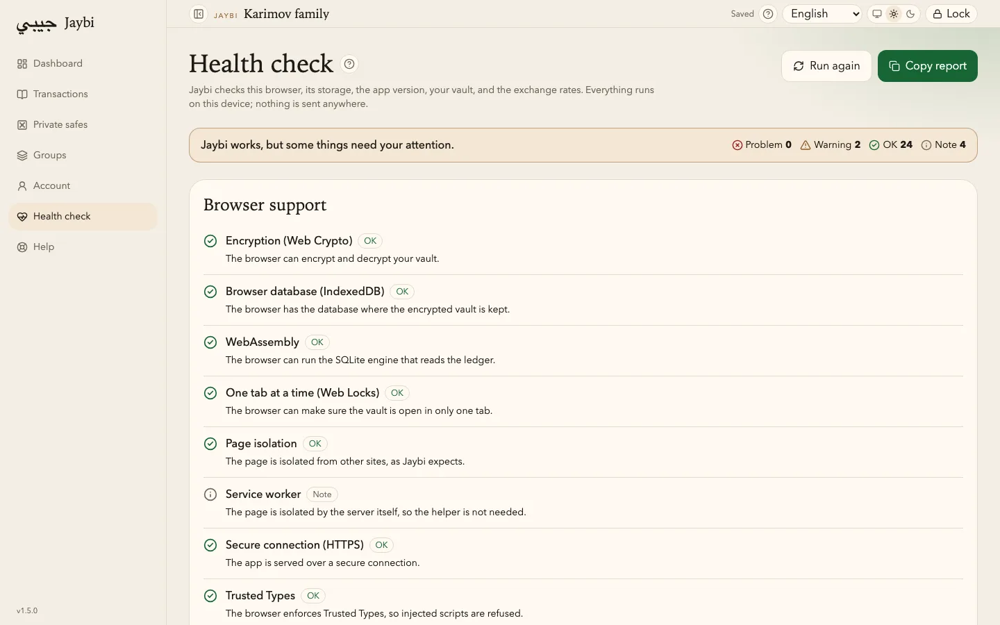

### Sharing a report

**Copy report** copies a plain-text summary to paste into a message to whoever helps you. It lists versions, sizes, dates and the result of each check, and never includes passwords, codes, emails, names or amounts. **Run again** repeats the checks after you fixed something.

### When you cannot sign in

The **Health check** link on the sign-in screen runs the browser, storage and version checks without signing in. If Jaybi cannot even start, the error screen offers the same check.

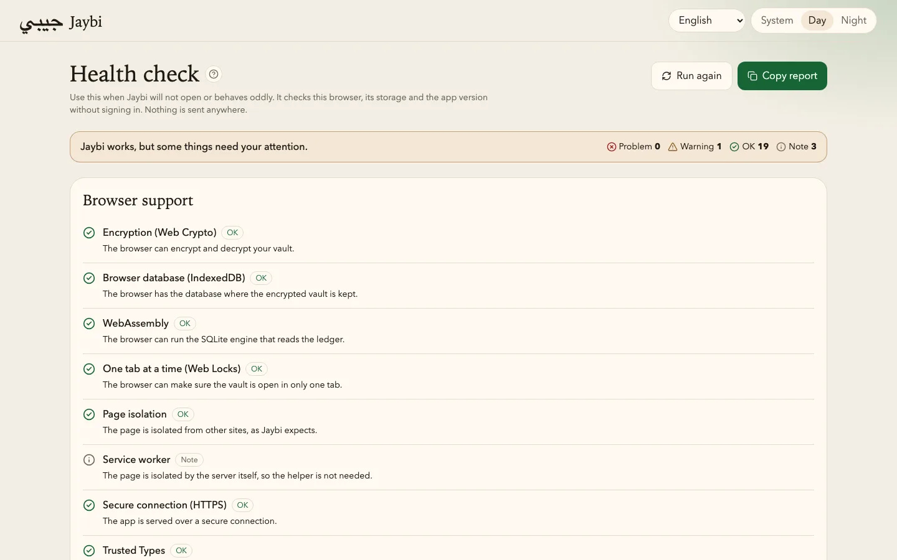

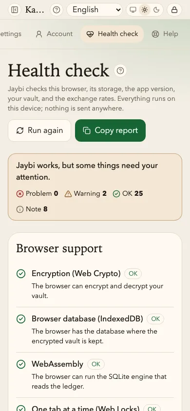

## Using this help

This guide is also built into Jaybi. Open **Help** in the menu, the **?** button in the top bar (it opens the part about the current page), or **Help** on the sign-in screen. The guide follows the language you picked.

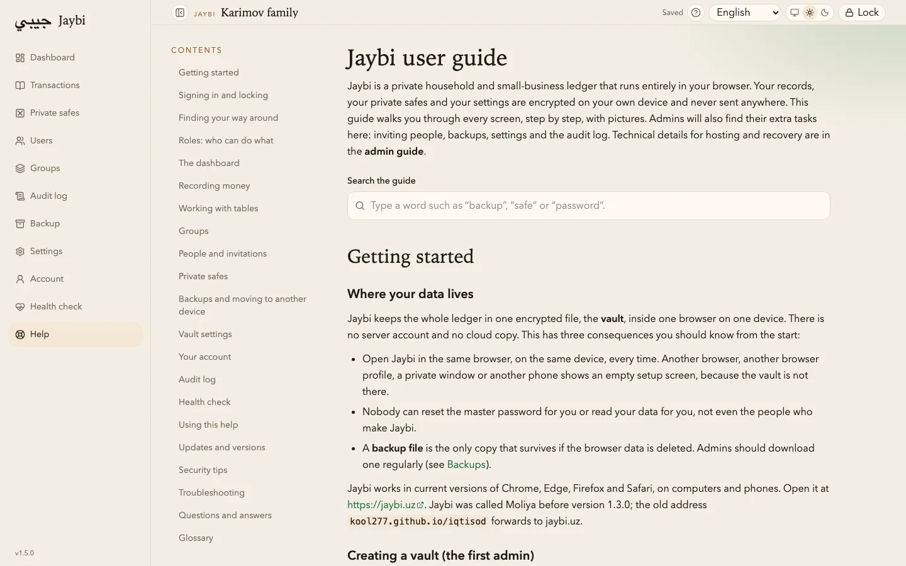

Before signing in, **Help** opens the same guide on its own page, with a link back to the sign-in screen.

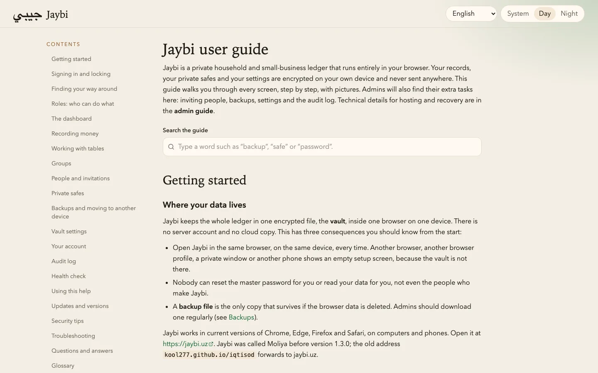

Type a word into **Search the guide** to show only the parts that mention it. The **Open** buttons take you straight to the screen being described.

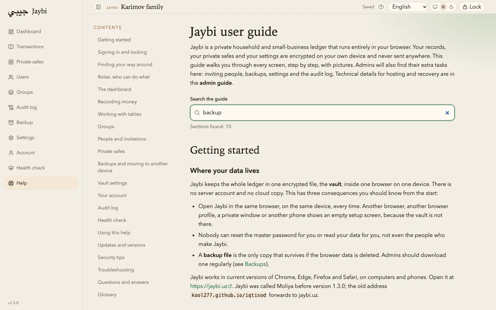

## Updates and versions

When a new version of Jaybi is published, a bar says **A new version of Jaybi is available.** Choose **Reload** when convenient: your work is saved and the vault is locked first, so sign in again afterwards. The first sign-in after an update can take a few seconds longer while Jaybi upgrades the data. This happens once.

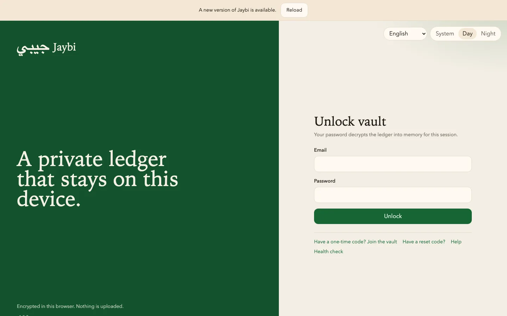

The version you are using is shown at the bottom of the menu, on the sign-in screen and on the Health check. Mention it when you report a problem.

## Security tips

- Use a long password that you use nowhere else. It is the only thing protecting copies of the vault.
- Lock the vault before leaving a shared device, and lock your safes when you are done with them.
- Turn on the sign-in check and keep the recovery codes away from this device.
- Admins: download a backup at least weekly and keep it off this device.
- Do not clear this site's browsing data: that deletes the vault from the browser.
- Use one-time codes soon, and tell the admin if someone else may have seen yours.
- Create a recovery code for your private safes and keep it offline.
- Always check the address: the official one is `jaybi.uz`. Jaybi refuses to run inside another site's page.
- Never store card PINs. Keep the CVV only if you really need it.

## Troubleshooting

Start with the [Health check](#health): most problems show up there with a fix.

[Run the health check](https://jaybi.uz/#/app/health)

| What you see | What to do |
| --- | --- |
| **Create your vault** although you have a vault | You are in another browser, profile, private window or address. Open Jaybi where you created the vault, or import a backup. Do not create a new vault. |
| "Email or password is incorrect" | Check both. After several tries, wait for the countdown. If you forgot the password, ask an admin for a reset code. |
| **Too many attempts** | Wait for the countdown to finish; refreshing does not help. |
| **Could not save** | The browser refused to store data. Keep the tab open, free disk space, then run the Health check. |
| **Not saved: changed elsewhere** | The vault is open in another tab. Lock, sign in again and redo your last change. |
| "already unlocked in another tab or window" | Switch to that tab or lock it there. |
| A code is refused | It may have expired, been used, or be for another email. Ask for a new one. If the clock check is mentioned, correct the device clock. |
| Exchange rates are missing or **Stale** | Check the connection. After holidays the banks publish no new rates. |
| A page stays blank after an update | Reload the page. |
| A red bar about the audit log | See [Audit log](#audit). |
| The vault is close to its size limit | Remove large receipts from old records. |

### Page not found

An old or mistyped link shows **Page not found**. Choose **Go to the dashboard**.

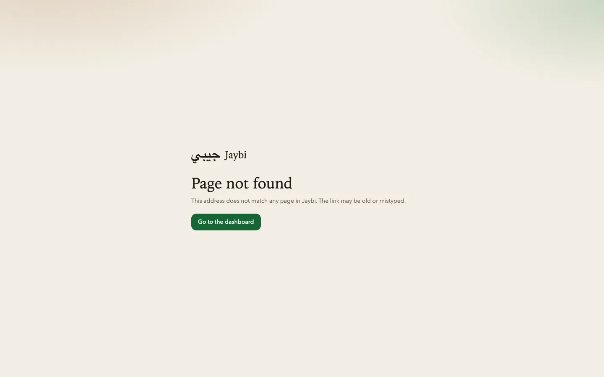

## Questions and answers

**Can I use Jaybi on my phone and my computer at the same time?** No. The vault lives in one browser. You can move it with a backup, but the two copies are not synchronised.

**Can the admin read my private safes?** No. Safes are encrypted with a key only your password or your recovery code opens.

**I forgot my password. Can anyone recover it?** Nobody can see it, but an admin can give you a reset code. If the only admin forgets their password, nobody can reset it for them, so it is wise to have two admins.

**Does Jaybi send my data anywhere?** No. Apart from the app itself, Jaybi only loads the public exchange rates and the published version number.

**Why are some records not in the totals?** They are in another currency. They are listed under **Other currencies (not in totals)**.

**Where are backups stored?** Wherever you save the downloaded file. Jaybi does not keep backups for you.

**Does the sign-in check replace a strong password?** No. It only adds a step when signing in through the app.

## Glossary

- **Vault**: the encrypted file that holds the ledger, the people and their private safes, stored in one browser.
- **Master password**: the first admin's password, chosen when the vault was created.
- **Group**: a part of the vault with its own records and people.
- **Record**: one income or expense entry in the ledger.
- **Vault currency**: the currency that totals and charts count.
- **One-time code**: an invite or reset code from an admin that works once and expires.
- **Sign-in check**: a 6-digit code from an authenticator app asked after the password.
- **Recovery codes**: ten single-use codes that replace the authenticator if you lose it.
- **Private safe**: your own encrypted place for cards, subscriptions and notes.
- **Recovery code (safes)**: the backup key for your private safes.
- **Backup**: an encrypted `.moliya` file with the whole vault.
- **Audit log**: the admin's linked list of who did what and when.
- **Health check**: the page that checks the browser, storage, version, vault and rates.
