# Жайби: фойдаланувчи қўлланмаси

[English](../user-guide.md) · [Русский](../ru/user-guide.md) · [Oʻzbekcha](../uz-Latn/user-guide.md) · **Ўзбекча**

Жайби — бутунлай браузерингизда ишлайдиган, оила ва кичик бизнес учун шахсий молия дафтари. Ёзувларингиз, шахсий сейфларингиз ва созламаларингиз ўз қурилмангизда шифрланади ва ҳеч қаерга юборилмайди. Бу қўлланма ҳар бир экранни расмлар билан, қадамма-қадам тушунтиради. Администраторлар ҳам ўз қўшимча вазифаларини шу ерда топади: одамларни таклиф қилиш, захира нусхалар, созламалар ва аудит журнали. Жойлаштириш ва тиклаш бўйича техник тафсилотлар учун қаранг: [администратор қўлланмаси](../admin-guide.md).

## Мундарижа

- [Бошлаш](#start)
- [Кириш ва қулфлаш](#sign-in)
- [Иловада йўл топиш](#around)
- [Роллар: ким нима қила олади](#roles)
- [Бошқарув саҳифаси](#dashboard)
- [Пулни ёзиб бориш](#transactions)
- [Жадваллар билан ишлаш](#tables)
- [Гуруҳлар](#groups)
- [Одамлар ва таклифлар](#users)
- [Шахсий сейфлар](#safes)
- [Захира нусхалар ва бошқа қурилмага кўчиш](#backup)
- [Сейф созламалари](#settings)
- [Ҳисобингиз](#account)
- [Аудит журнали](#audit)
- [Ҳолат текшируви](#health)
- [Ушбу ёрдамдан фойдаланиш](#help)
- [Янгиланишлар ва версиялар](#updates)
- [Хавфсизлик бўйича маслаҳатлар](#security)
- [Муаммоларни ҳал қилиш](#troubleshooting)
- [Савол ва жавоблар](#faq)
- [Атамалар луғати](#glossary)

## Бошлаш

### Маълумотларингиз қаерда сақланади

Жайби бутун дафтарни битта шифрланган файлда — **сейф**да — битта қурилмадаги битта браузер ичида сақлайди. Серверда ҳисоб ҳам, булутда нусха ҳам йўқ. Бунинг учта оқибатини бошиданоқ билиб қўйинг:

- Жайби иловасини ҳар доим бир хил браузерда, бир хил қурилмада очинг. Бошқа браузер, бошқа браузер профили, махфий ойна ёки бошқа телефон бўш созлаш экранини кўрсатади, чунки сейф у ерда йўқ.
- Асосий паролни сиз учун ҳеч ким янгилай олмайди ва маълумотларингизни сиз учун ҳеч ким ўқий олмайди, ҳатто Жайби яратувчилари ҳам.
- Браузер маълумотлари ўчирилса, фақат **захира нусха файли** сақланиб қолади. Администраторлар уни мунтазам юклаб олиб туриши керак ([Захира нусхалар](#backup) бўлимига қаранг).

Жайби компьютер ва телефонлардаги Chrome, Edge, Firefox ва Safari браузерларининг жорий версияларида ишлайди. Уни [https://jaybi.uz](https://jaybi.uz) манзилида очинг. 1.3.0 версиясигача Жайби иловаси Moliya деб аталган; эски `kool277.github.io/iqtisod` манзили jaybi.uz манзилига йўналтиради.

### Сейф яратиш (биринчи администратор)

Сейфни яратган одам унинг биринчи **Администратор**и бўлади.

1. Жайби иловасини очинг. Юқори ўнг бурчакда тил ва мавзуни танланг.
2. **Сейф яратинг** бўлимида **Сейф номи** (масалан, оилангиз ёки бизнесингиз номи), **Администратор почтаси** ва **Асосий парол**ни киритинг, сўнг ўша паролни **Паролни тасдиқланг** майдонига яна киритинг.
3. Жами суммалар ҳисобланадиган **Валюта**ни танланг. Уни кейинроқ [Сейф созламалари](#settings) бўлимида ўзгартиришингиз мумкин.
4. **Шифрланган сейф яратиш** тугмасини босинг. Шифрлаш бир неча сония давом этади.

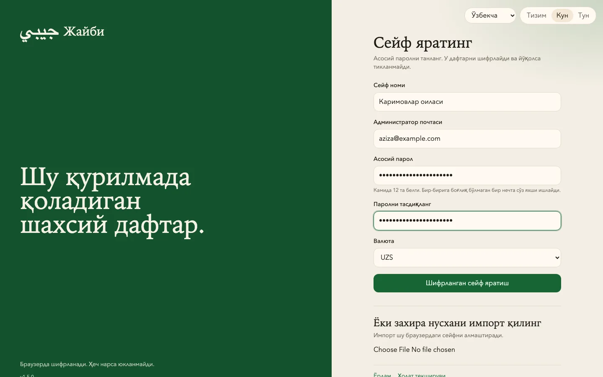

Асосий паролни эҳтиёткорлик билан танланг: у сейфни шифрлайди ва **уни тиклаб бўлмайди**. [Парол танлаш](#choosing-a-password) бўлимига қаранг.

Сейф тайёр бўлгач, бошқарув саҳифаси очилади. Кимдир пул ёзмагунча у бўш туради.

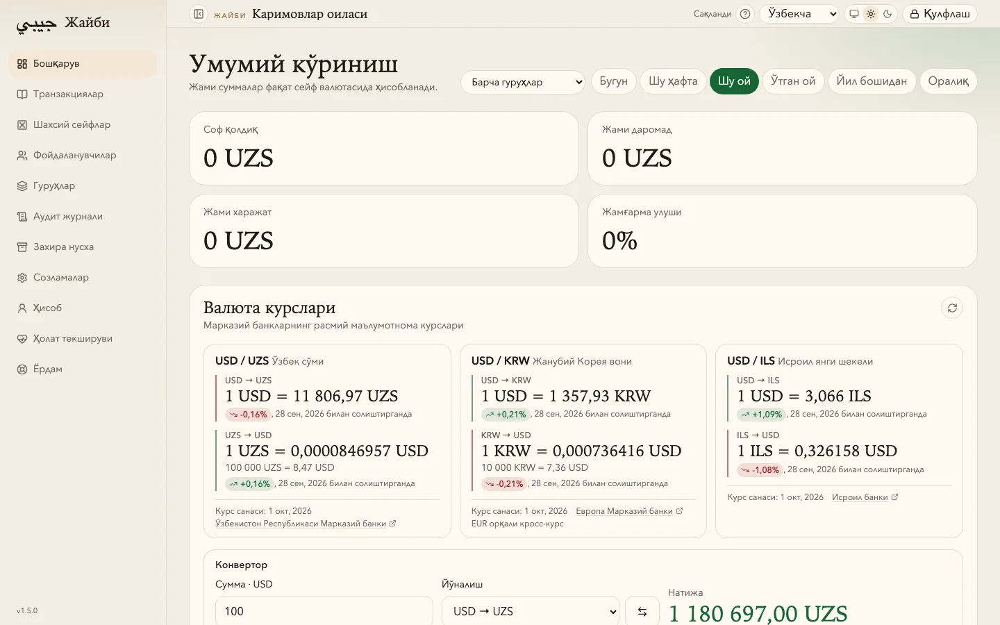

Агар бошқа қурилмада олинган захира нусхангиз бўлса, янги сейф яратманг: шу экраннинг пастидаги **Ёки захира нусхани импорт қилинг** бандидан фойдаланинг ([Бошқа қурилмага кўчиш](#moving) бўлимига қаранг).

### Бир марталик код билан сейфга қўшилиш

Биринчи администратордан бошқа ҳамма администратор берган **бир марталик код** билан қўшилади. Код `XXXX-XXXX-XXXX-XXXX-XXXX-XXXX-XXXX` кўринишида бўлади ва бир марта, фақат сизнинг почтангиз учун ҳамда фақат администратор танлаган вақтгача ишлайди.

1. Жайби иловасини сейф сақланган браузерда очинг. Агар администратор ҳавола юборган бўлса, уни очинг: почтангиз ва код ўзи тўлдирилади.
2. Акс ҳолда, **Сейфни очиш** экранида **Бир марталик кодингиз борми? Сейфга қўшилинг** ҳаволасини босинг.
3. **Почтангиз** ва **Бир марталик код**ни текширинг. Катта-кичик ҳарфлар, бўш жойлар ва чизиқчаларнинг аҳамияти йўқ.
4. **Парол танланг** майдонига парол киритинг ва уни **Паролни тасдиқланг** майдонига яна киритинг, сўнг **Сейфга қўшилиш** тугмасини босинг.

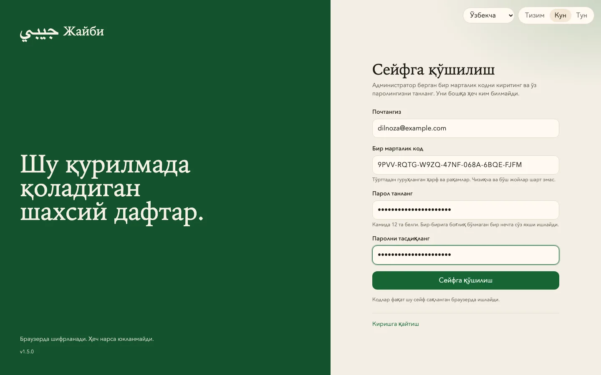

Сиз дарҳол тизимга кирасиз. Паролингизни бошқа ҳеч ким, ҳатто администратор ҳам билмайди.

Агар Жайби «Бу браузерда ҳали сейф йўқ» деса, сиз нотўғри қурилма ёки браузердасиз: код фақат сейф сақланган жойда ишлайди. Агар коднинг муддати тугагани ёки у мос келмаслиги айтилса, администратордан янги код сўранг.

## Кириш ва қулфлаш

### Сейфни очиш

1. Жайби иловасини очинг. **Сейфни очиш** экрани кўринади.
2. **Почта** ва **Парол**ни киритинг, сўнг **Очиш** тугмасини босинг.

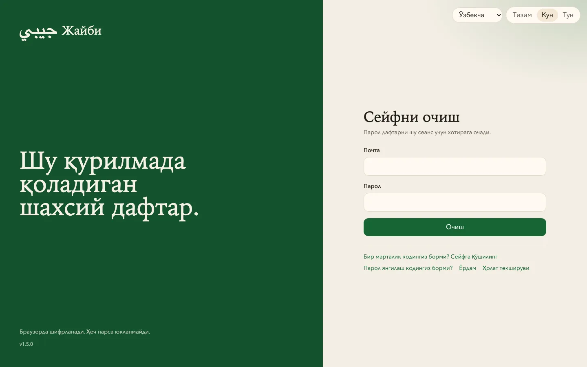

Сейфни очиш атайлаб бироз вақт олади: паролни тахмин қилиш секин бўлиши учун у махсус тарзда «чўзилади». «Почта ёки парол нотўғри» хабари иккала хатода ҳам бир хил чиқади, шунинг учун ҳеч ким қайси почталар мавжудлигини билиб ололмайди.

Бир почта учун беш марта нотўғри уринишдан кейин Жайби тескари санаш билан **Уринишлар жуда кўп. Қайта уринишгача:** хабарини кўрсатади, ҳар бир кейинги хатода эса кутиш вақти 15 дақиқагача ортиб боради. Саҳифани янгилаш уни қисқартирмайди. Киргандан кейин Жайби охирги ташрифингиздан бери шу браузерда ҳисобингизга нечта муваффақиятсиз уриниш бўлганини айтади. Агар уларни сиз қилмаган бўлсангиз, паролингизни ўзгартиринг.

Форма остидаги ҳаволалар ҳамма учун: **Бир марталик кодингиз борми? Сейфга қўшилинг**, **Парол янгилаш кодингиз борми?**, **Ёрдам** (шу қўлланма) ва **Ҳолат текшируви** — у тизимга кира олмаганингизда ҳам браузерни текширади.

### Иккинчи қадам (кириш текшируви)

Агар [кириш текшируви](#sign-in-check)ни ёққан бўлсангиз, Жайби паролдан кейин аутентификатор иловангиздаги 6 хонали кодни сўрайди. Уни **Код** майдонига киритинг ва **Давом этиш** тугмасини босинг. Бу ерда тиклаш коди ҳам бир марта ишлайди. 5 дақиқадан кўп кутсангиз ёки **Бекор қилиш** тугмасини боссангиз, **Сейфни очиш** экранига қайтасиз.

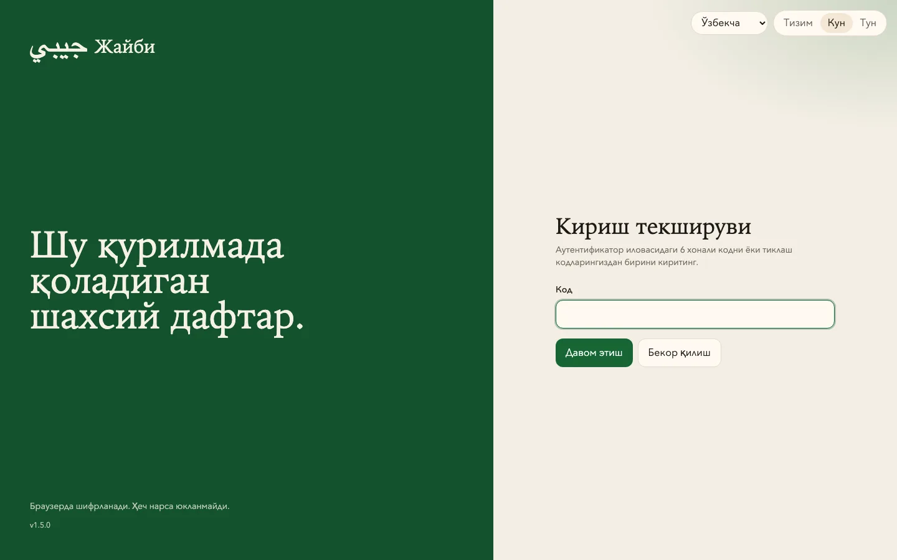

### Паролни унутдингизми? Парол янгилаш кодидан фойдаланинг

Жайби «паролни унутдим» хатини юбормайди, чунки сервер йўқ. Администратордан **парол янгилаш коди**ни сўранг, сўнг:

1. **Сейфни очиш** экранида **Парол янгилаш кодингиз борми?** ҳаволасини босинг (ёки администратор юборган ҳаволани очинг).
2. **Почтангиз**, **Бир марталик код** ва янги паролингизни икки марта киритинг.
3. **Янги паролни ўрнатиш** тугмасини босинг. Сиз янги парол билан тизимга кирасиз.

Парол янгилаш коди кириш текширувингизни ҳам ўчиради; уни [Ҳисобингиз](#account) бўлимида қайта ёқинг. Агар шахсий сейфлардан фойдалансангиз, аввал [Администратор паролингизни янгилагандан кейин](#after-reset) бўлимини ўқинг.

### Қулфлаш

Жойингиздан турганингизда юқори панелдаги **Қулфлаш** тугмасини босинг. Қулфлаш, саҳифани янгилаш ёки варақни ёпиш дешифрланган маълумотларни хотирадан ўчиради ва кейинги одам қайта кириши керак бўлади. Жайби 15 дақиқа фаоллик бўлмаганда ҳам ўзи қулфланади; буни **Ҳисоб → Автоматик қулфлаш** бўлимида ўзгартиринг. Шунда кириш экранида «Фаоллик бўлмагани учун сейф қулфланди.» деган ёзув чиқади.

Сейфни бир вақтда фақат битта варақда очиш мумкин. Агар Жайби сейф бошқа варақ ёки ойнада аллақачон очиқлигини айтса, ўша варақга ўтинг ёки аввал уни у ерда қулфланг.

### Сақлаш

Сейф учун сақлаш тугмаси йўқ. Юқори панелдаги ёрдам тугмаси ёнидаги сўз нима бўлаётганини кўрсатади:

- **Сақланди**: ҳамма нарса шифрланган ва шу браузерда сақланган.
- **Сақланмаган** ёки **Шифрланмоқда…**: ўзгариш сақланмоқда. Одатда бу тахминан бир сония олади.
- **Сақлаб бўлмади**: браузер маълумотларни сақлашни рад этди, масалан, диск тўлгани учун. Варақни ёпманг ва [Ҳолат текшируви](#health)ни ишга туширинг.
- **Сақланмади: бошқа жойда ўзгартирилган**: сейф бошқа варақда ўзгартирилган. Қулфланг, қайта киринг ва охирги ўзгаришингизни такрорланг.

## Иловада йўл топиш

Чапдаги менюда фақат ролингиз рухсат берган бўлимлар кўринади. Юқори панелда сейф номи, сақлаш ҳолати, шу қўлланманинг жорий саҳифага оид қисмини очадиган **?** тугмаси, тил ва мавзу алмаштиргичлари ҳамда **Қулфлаш** тугмаси бор.

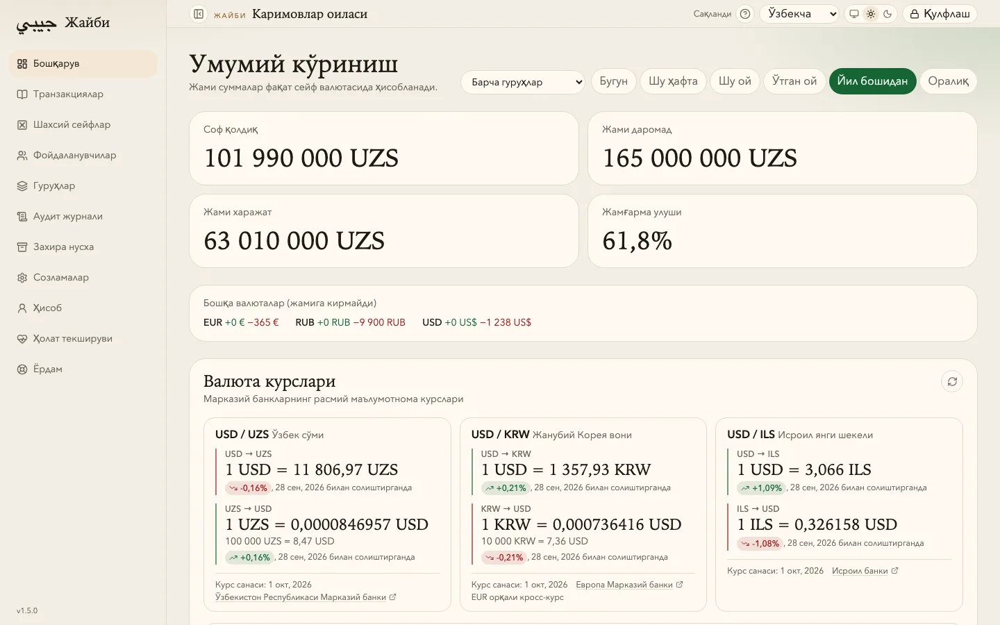

Юқори панелнинг энг чапидаги тугма менюни фақат белгиларгача йиғади; ёзувларни қайтариш учун уни яна босинг. Жайби танловингизни шу браузерда эслаб қолади.

### Телефонда

Телефонда меню юқоридаги, ён томонга суриладиган қаторга айланади, саҳифалар эса битта устунга тизилади. Жадваллар карточкаларга айланади.

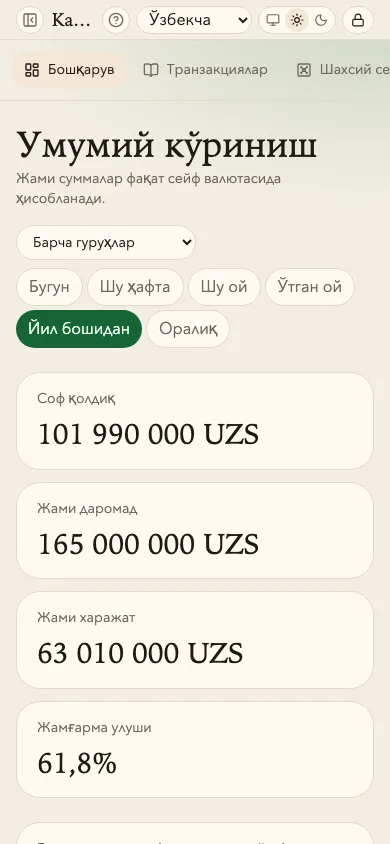

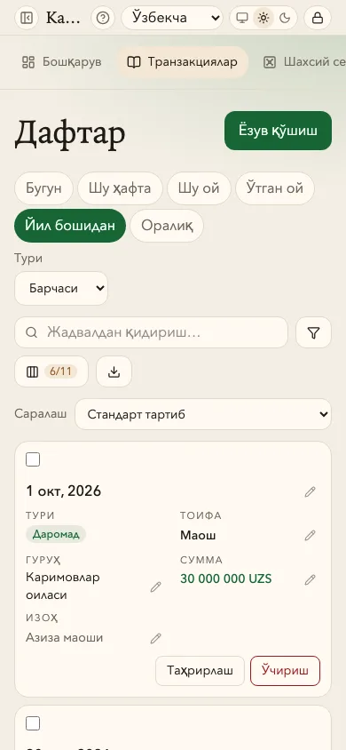

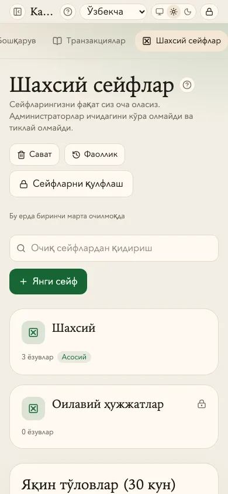

### Тил ва мавзу

Тил менюсидан тилни танланг: Oʻzbekcha, Ўзбекча, Русский ёки English. **Кун**, **Тун** ёки қурилмангизга мослашиш учун **Тизим**ни танланг. Иккала танлов ҳам шу браузерда эслаб қолинади, уларни тизимга киришдан олдин ҳам ўзгартириш мумкин.

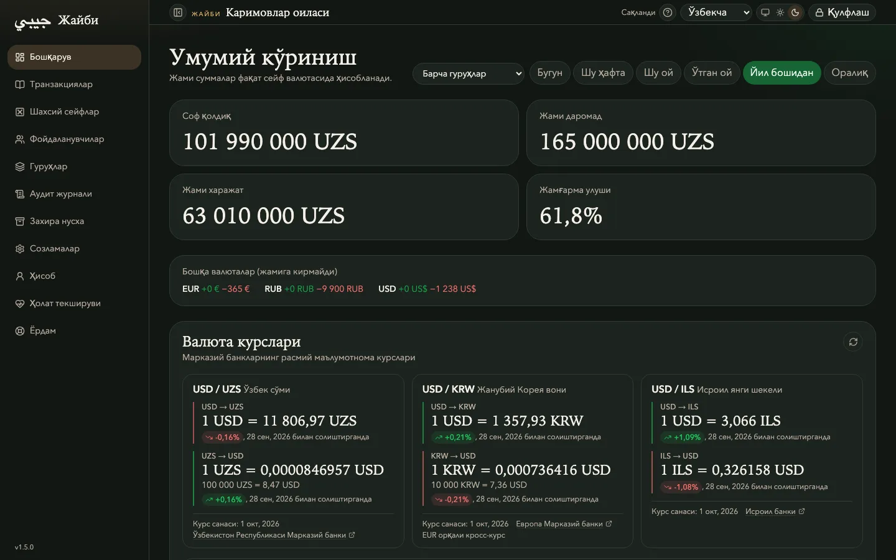

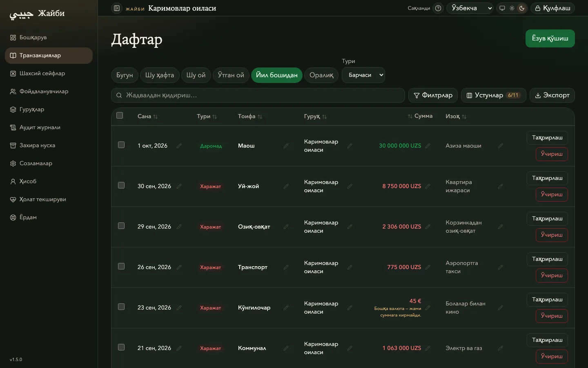

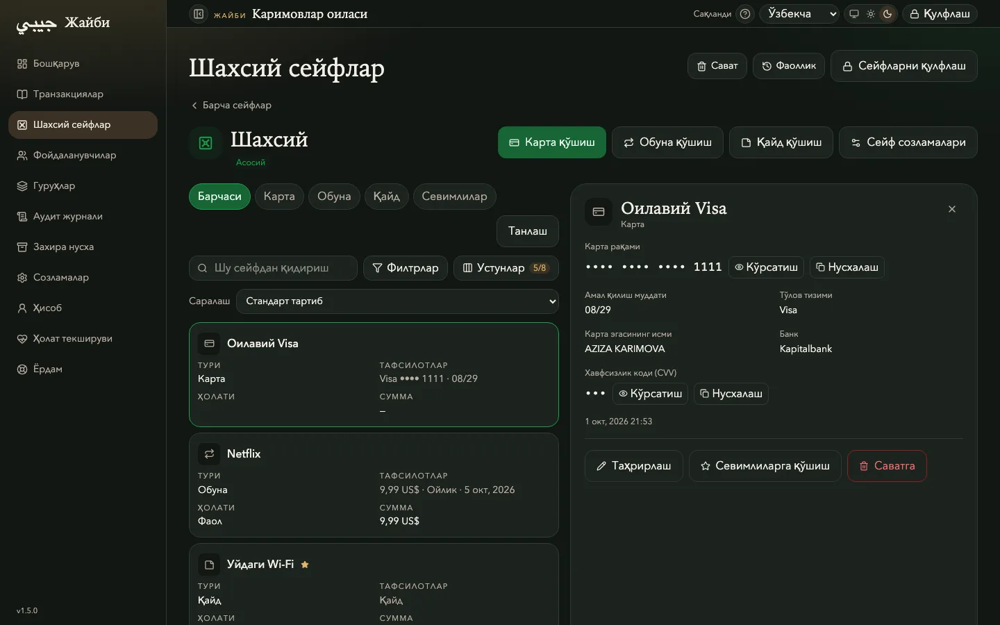

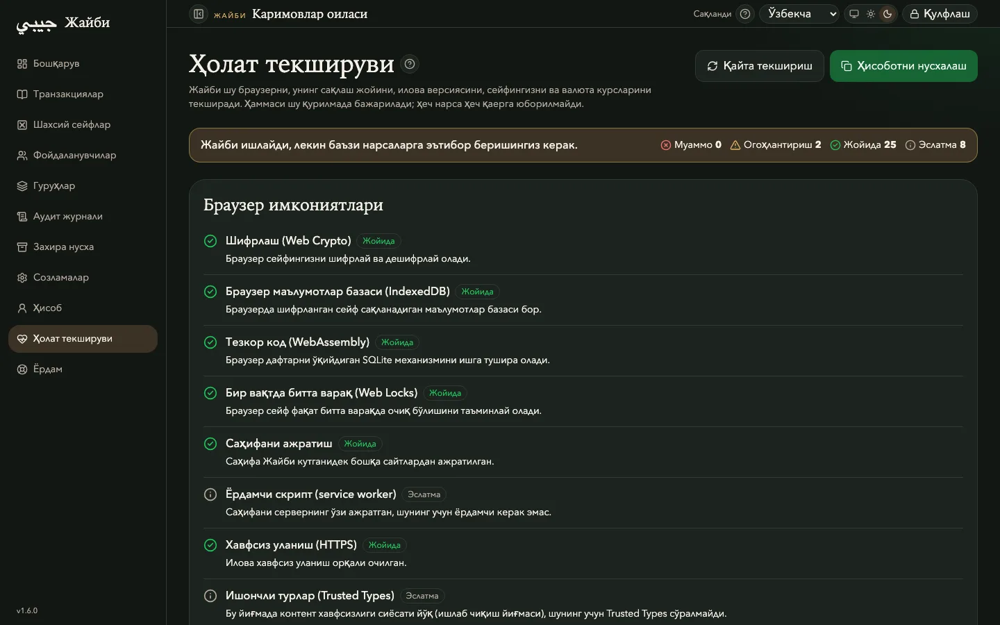

## Роллар: ким нима қила олади

Сейфдаги ҳар бир одамнинг битта роли бор. Менежер ва Кузатувчилар битта **гуруҳ**га тегишли бўлади ва фақат шу гуруҳ ёзувларини кўради.

| Нима | Администратор | Менежер | Кузатувчи |
| --- | --- | --- | --- |
| Бошқарув, Гуруҳлар ва Дафтар | Барча гуруҳлар | Ўз гуруҳи | Ўз гуруҳи |
| Ёзувларни қўшиш, таҳрирлаш ва ўчириш | Барча гуруҳлар | Ўз гуруҳи | Йўқ |
| Жадваллар ва маълумотларни экспорт қилиш | Ҳа | Йўқ | Йўқ |
| Одамлар, таклифлар ва парол янгилаш кодлари | Ҳа | Йўқ | Йўқ |
| Захира нусха, маълумотлар экспорти, сейфни алмаштириш | Ҳа | Йўқ | Йўқ |
| Сейф созламалари ва тоифалар | Ҳа | Йўқ | Йўқ |
| Аудит журнали | Ҳа | Йўқ | Йўқ |
| Шахсий сейфлар, Ҳисоб, Ҳолат текшируви, Ёрдам | Ҳа, ўзиники | Ҳа, ўзиники | Ҳа, ўзиники |

Кузатувчининг менюси қисқа: Бошқарув, Транзакциялар, Шахсий сейфлар, Гуруҳлар, Ҳисоб, Ҳолат текшируви ва Ёрдам.

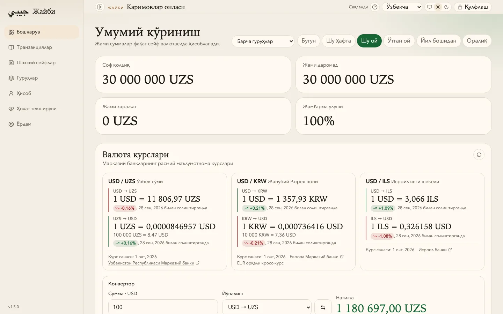

## Бошқарув саҳифаси

Бошқарув саҳифаси танланган давр ва гуруҳ бўйича пулни жамлаб кўрсатади.

[Бошқарув саҳифасини очиш](https://jaybi.uz/#/app)

### Тўртта кўрсаткич

- **Соф қолдиқ**: даромаддан харажатлар айирмаси.
- **Жами даромад** ва **Жами харажат**.
- **Жамғарма улуши**: харажатлардан кейин қолган даромад улуши. Даромад бўлмаса, у 0% бўлади, топганингиздан кўп сарфлаган бўлсангиз эса манфий бўлиши мумкин.

Жами суммалар центгача (ёки тийингача) аниқ ва фақат **сейф валютаси**даги ёзувларни ҳисоблайди. Бошқа валютадаги ёзувлар **Бошқа валюталар (жамига кирмайди)** бўлимида ҳар бир валюта бўйича алоҳида кўрсатилади, шунинг учун ҳеч нарса яширилмайди. Жайби ёзувларингизни ҳеч қачон бошқа валютага ўгирмайди.

### Даврни танлаш

Бошқарув саҳифаси, дафтар ва **Гуруҳлар** бир хил давр тугмаларидан фойдаланади ва танловингиз улар орасида сақланиб қолади: **Бугун**, **Шу ҳафта** (душанбадан якшанбагача), **Шу ой** (стандарт), **Ўтган ой**, **Йил бошидан** ва **Оралиқ**.

**Оралиқ** **Дан** ва **Гача** сана майдонларини очади. Агар уларни тескари киритсангиз, Жайби уларнинг ўрнини алмаштиради.

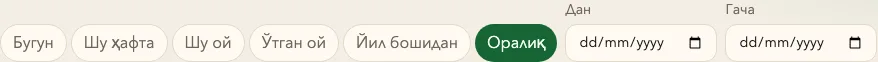

### Гуруҳни танлаш

Давр тугмалари ёнидаги рўйхатдан **Барча гуруҳлар** ёки битта гуруҳни танлайсиз. У кўрсаткичлар, диаграммалар ва бошқа валюталар рўйхатини ўзгартиради. Сиз фақат ўзингиз аъзо бўлган гуруҳларни кўрасиз.

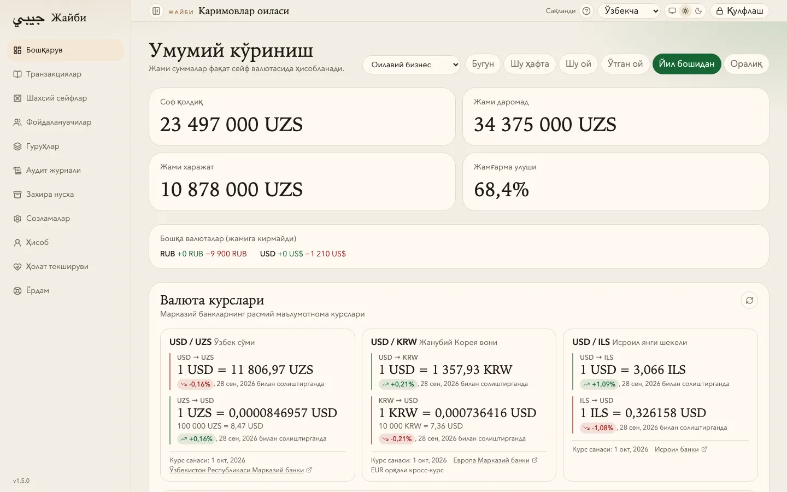

### Диаграммалар

Кўрсаткичлар остида:

- **Даромад ва харажат** даврдаги ҳар бир ойни солиштиради.
- **Харажатлар тоифа бўйича** пул қаерга кетганини кўрсатади.
- **Харажатлар вақт бўйича** кунлик харажатлар йиғиндисини кўрсатади.
- **Ким сарфлади** гуруҳингиздаги ҳар бир одамнинг харажатини кўрсатади; администраторлар унинг ўрнига **Харажатлар гуруҳ бўйича** диаграммасини кўради.

Даврда мос ёзувлар бўлмаса, диаграммада «Бу оралиқда рақамлар йўқ» деган ёзув чиқади.

### Валюта курслари ва конвертор

**Валюта курслари** панели ўзбек сўми (UZS), Жанубий Корея вони (KRW) ва Исроил янги шекелининг (ILS) АҚШ долларига нисбатан марказий банклар эълон қилган расмий маълумотнома курсларини икки йўналишда кўрсатади: олдинги курсга нисбатан ўзгариш, **Курс санаси** ва манба банкка ҳавола билан. Курс 2 иш кунидан эски бўлса, **Эскирган** белгиси пайдо бўлади.

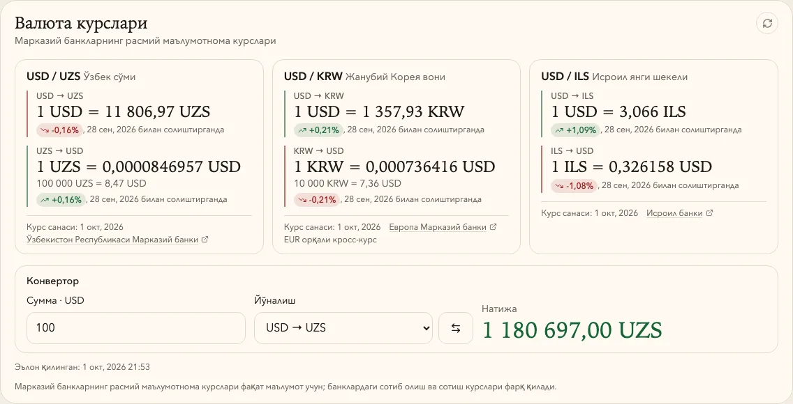

**Конвертор** суммани бошқа валютага ўгиради. Суммани киритинг, йўналишни танланг ёки уни алмаштириш учун ⇄ тугмасидан фойдаланинг. **Аниқ** яхлитланмаган қийматни кўрсатади.

Бу курслар фақат маълумот учун; банклар бошқа курсларда сотиб олади ва сотади. Улар жами суммаларингизни ҳеч қачон ўзгартирмайди. Курслар браузерда сақланади, шунинг учун интернет алоқаси бўлмаганда ҳам охирги курслар кўриниб туради.

## Пулни ёзиб бориш

Менежер ва Администраторлар даромад ва харажатларни **Дафтар** саҳифасида (**Транзакциялар** менюси) ёзиб боради. Кузатувчилар уни ўқий олади, лекин ўзгартира олмайди.

[Дафтарни очиш](https://jaybi.uz/#/app/transactions)

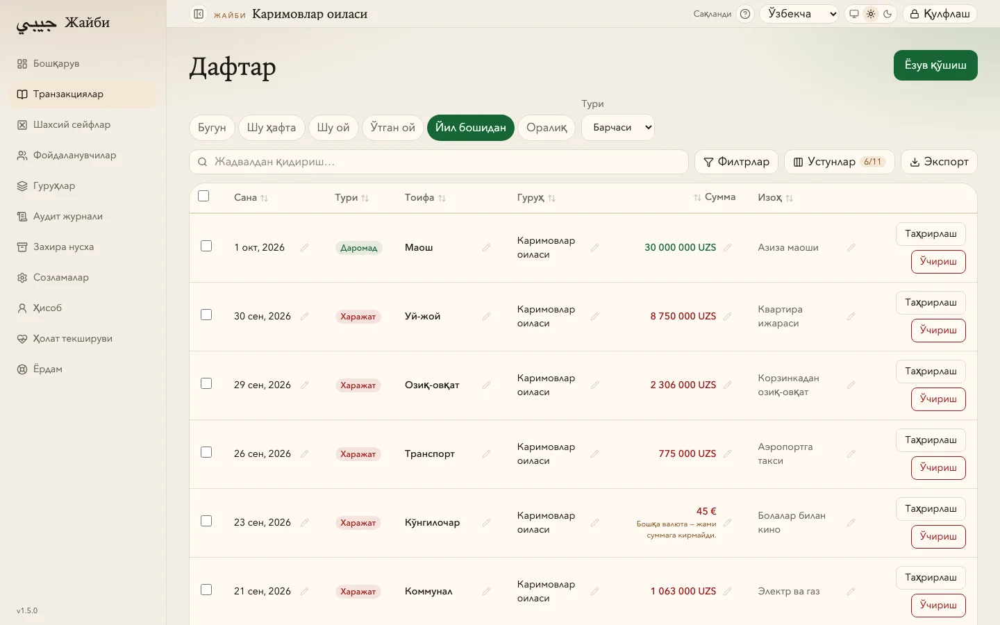

### Ёзув қўшиш

1. **Ёзув қўшиш** тугмасини босинг.
2. Формани тўлдиринг (қуйидаги жадвалга қаранг).
3. **Сақлаш** тугмасини босинг.

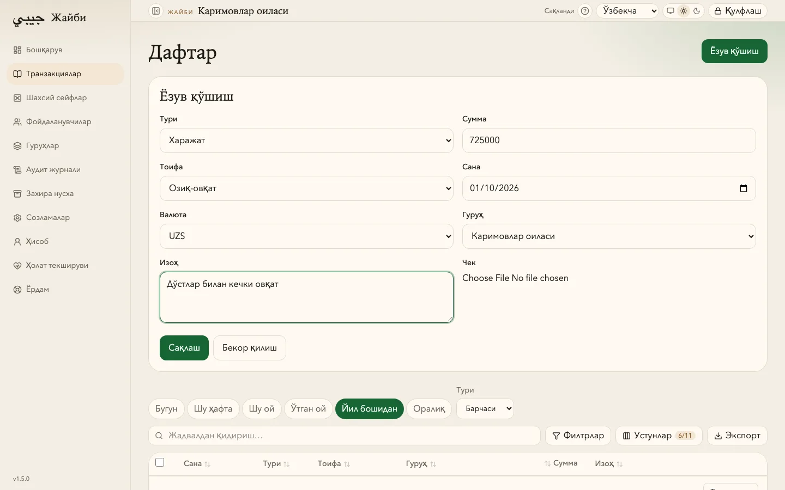

| Майдон | Нима киритилади |
| --- | --- |
| **Тури** | Даромад ёки Харажат. Тоифалар рўйхати шунга мос ўзгаради. |
| **Сумма** | Нолдан катта сон, масалан, `1250`, `1250.5` ёки `1 250,50`. Каср белгиси сифатида нуқта ҳам, вергул ҳам ишлайди. Жайби ҳеч қачон яхлитламайди: валютадагидан кўпроқ каср рақам киритсангиз, суммани тузатишни сўрайди. |
| **Тоифа** | Масалан, Маош, Озиқ-овқат ёки Транспорт. Рўйхатни администраторлар [Сейф созламалари](#settings) бўлимида бошқаради. |
| **Сана** | Ўзгартирмасангиз, бугунги сана. |
| **Валюта** | Ўзгартирмасангиз, сейф валютаси. [Валюталар](#currencies) бўлимига қаранг. |
| **Гуруҳ** | Фақат биттадан ортиқ гуруҳни кўра олсангиз кўрсатилади. |
| **Изоҳ** | Ихтиёрий, 2 000 тагача белги. |
| **Чек** | Ихтиёрий, 1,5 MB гача бўлган PNG, JPEG, WebP ёки GIF расм. **Чекни кўриш** уни текширишга, **Чекни олиб ташлаш** уни олиб ташлашга ёрдам беради. |

### Ўзгартириш ва ўчириш

Бутун ёзувни ўзгартириш учун унинг қаторидаги **Таҳрирлаш** тугмасини босинг, майдонларни тузатинг ва **Ёзувни янгилаш** тугмасини босинг.

Тез тузатиш учун сана, тоифа, гуруҳ, сумма ёки изоҳ ёнидаги кичик қаламчани босинг, янги қийматни киритинг ва Enter тугмасини босинг (Esc бекор қилади). Қиймат қабул қилинмаса, сабаби майдон остида кўрсатилади ва ҳеч нарса ўзгармайди.

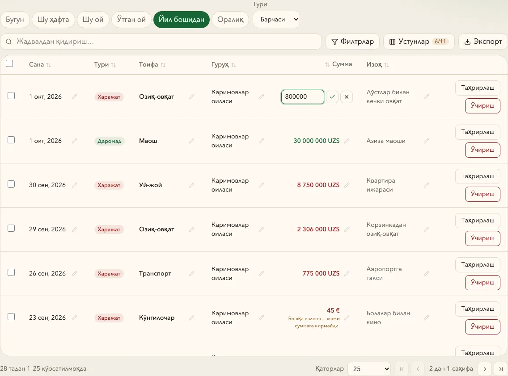

Ўчириш учун **Ўчириш** тугмасини босинг ва тасдиқланг. Бир нечта ёзувни ўчириш учун уларни белгиланг ва **Танланганларни ўчириш** тугмасини босинг. Ўчиришни қайтариб бўлмайди, лекин ҳар бир ўчириш администраторнинг аудит журналига ёзилади.

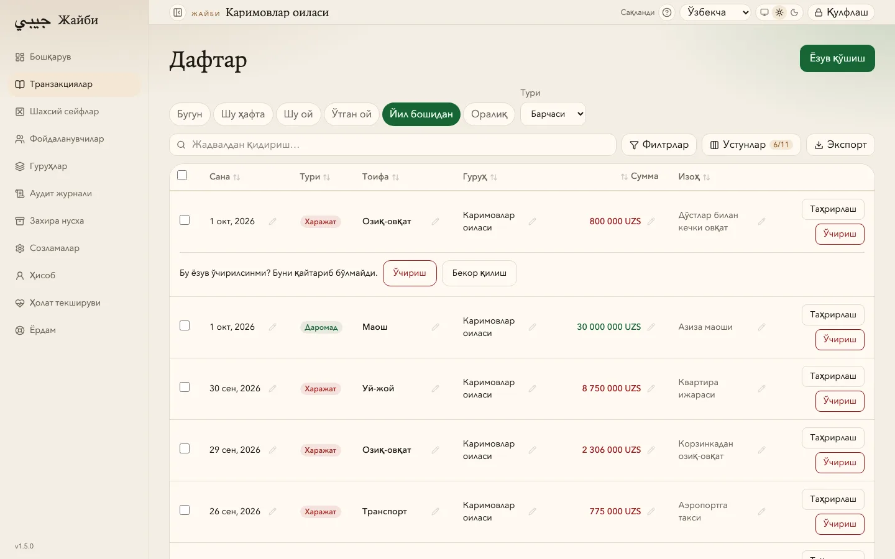

### Валюталар

Ҳар бир сейфнинг битта асосий валютаси бор. Жами суммалар ва диаграммалар фақат шу валютадаги ёзувларни ҳисоблайди. Бошқа валютадаги ёзув сақланади ва рўйхатда «Бошқа валюта — жами суммага кирмайди.» деган изоҳ билан кўрсатилади. Бошқарув саҳифаси бу суммаларни алоҳида кўрсатади. Жайби валюталарни бир-бирига ўгирмайди.

## Жадваллар билан ишлаш

Дафтар, одамлар рўйхати, гуруҳлар, тоифалар, шахсий сейф рўйхатлари ва аудит журнали — буларнинг барчаси бир хил ишлайдиган жадваллар.

- **Саралаш**: устун сарлавҳасини босинг. Тескари тартиб учун уни яна босинг, асл тартибга қайтиш учун учинчи марта босинг. Учтагача устун бўйича саралаш учун Shift тугмасини босиб туринг. Телефонда карточкалар устидаги **Саралаш** тугмасидан фойдаланинг.
- **Жадвалдан қидириш**: кўриб турганингизнинг исталган қисмини киритинг. Катта-кичик ҳарфлар, урғу белгилари, тутуқ белгилари ва ҳатто алифбонинг аҳамияти йўқ, шунинг учун `taksi` «Такси»ни топади. Esc қидирувни тозалайди.
- Пастдаги **Қаторлар**: 10, 25, 50, 100 ёки ҳаммаси, «140 тадан 1–25 кўрсатилмоқда» каби сатр билан.

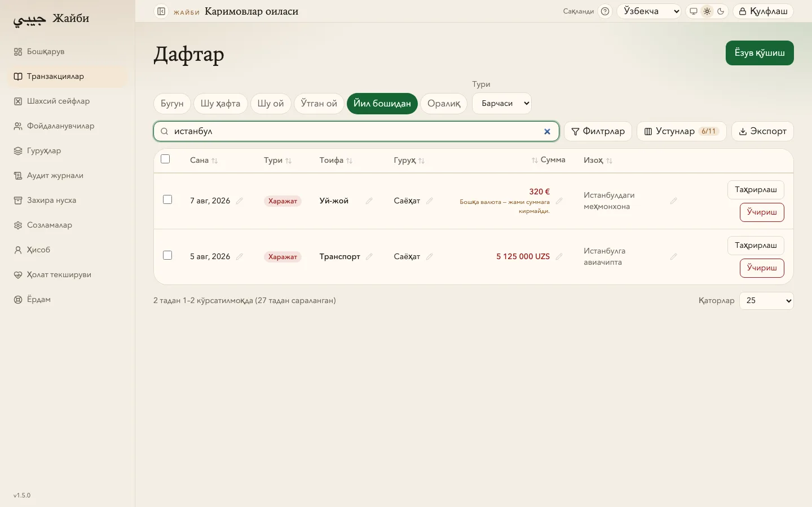

**Филтрлар** ҳар бир устун учун биттадан филтр очади: матн, белгилаш учун рўйхат, Дан–Гача сана оралиғи ёки Мин.–Макс. сумма. Тугмада нечта филтр ёқилгани кўрсатилади; **Қидирув ва филтрларни тозалаш** уларни ўчиради.

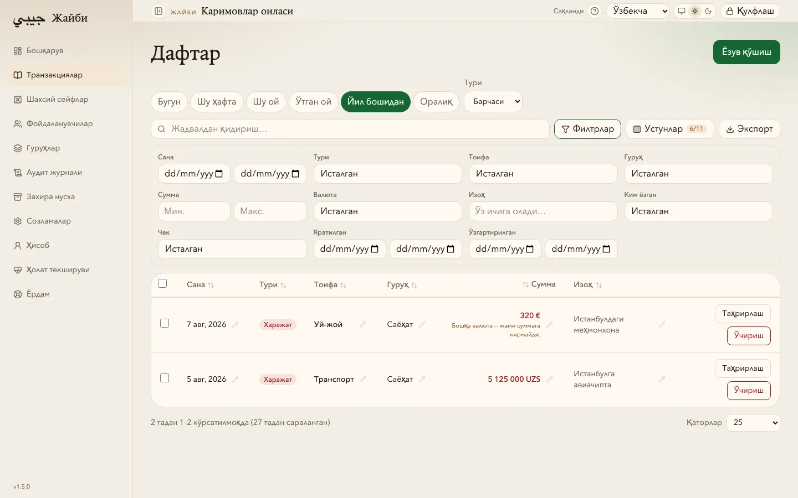

**Устунлар** устунларни кўрсатиш ёки яшириш, уларнинг ўрнини алмаштириш, ихчам қаторларни танлаш ёки кўринишни тиклаш имконини беради. Жайби ҳар бир жадвалнинг кўринишини шу браузерда эслаб қолади, лекин нимани қидирганингизни ҳеч қачон эсламайди.

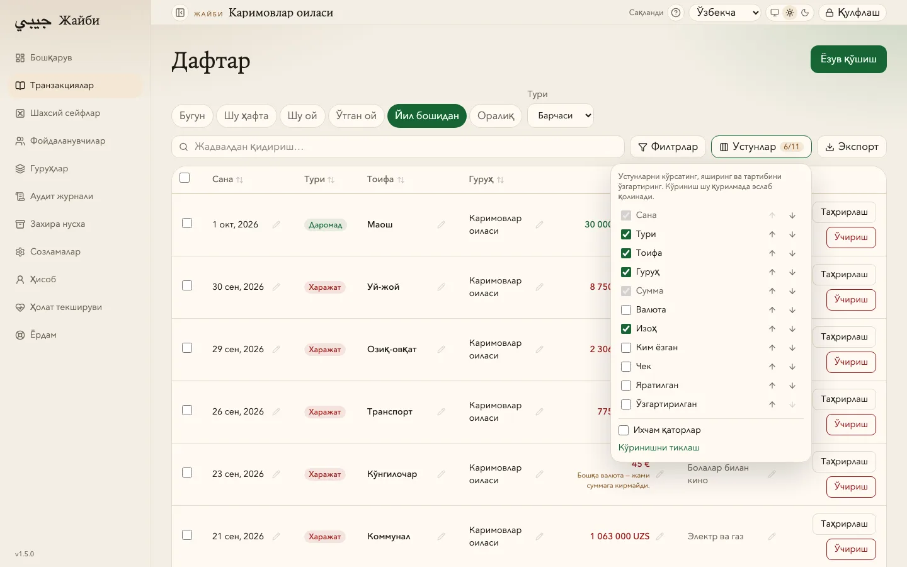

**Экспорт** (фақат администраторлар учун) айнан кўриб турган қатор ва устунларингизни CSV, Excel, PDF ёки бошқа форматларда юклаб беради. Файл шифрланмагани учун Жайби аввал тасдиқлашингизни сўрайди.

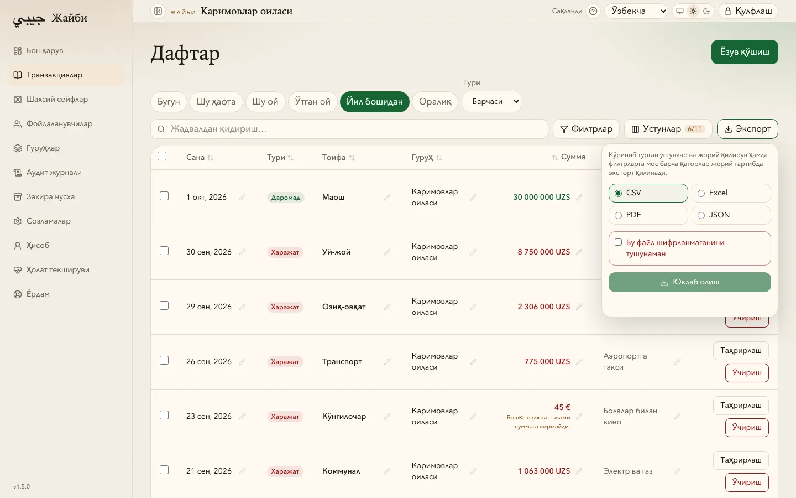

## Гуруҳлар

**Гуруҳ** — сейфнинг ўз ёзувлари ва одамлари бор қисми, масалан, уй хўжалиги ёнидаги оилавий бизнес. Ҳар ким ўз гуруҳини кўради; администраторлар ҳаммасини кўради.

[Гуруҳларни очиш](https://jaybi.uz/#/app/groups)

**Гуруҳлар** саҳифаси танланган давр учун ҳар бир гуруҳнинг **Даромад**, **Харажат** ва **Соф натижа** кўрсаткичларини транзакциялар сони ва охирги транзакция санаси билан кўрсатади. Ҳар бир валюта алоҳида қаторда бўлади; валюталар ҳеч қачон бир-бирига қўшилмайди. Икки ва ундан ортиқ гуруҳ бўлса, администраторлар умумий кўрсаткичлар билан **Барча гуруҳлар** қаторини ҳам кўради.

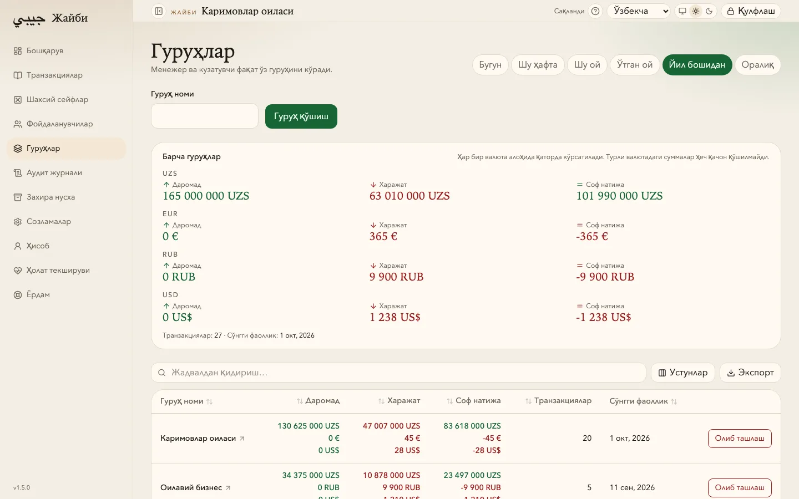

Гуруҳ номини боссангиз, дафтар шу гуруҳнинг ўша даврдаги ёзувлари билан очилади. Гуруҳ филтри аллақачон ўрнатилган бўлади; ҳаммасини яна кўриш учун **Қидирув ва филтрларни тозалаш** тугмасини босинг.

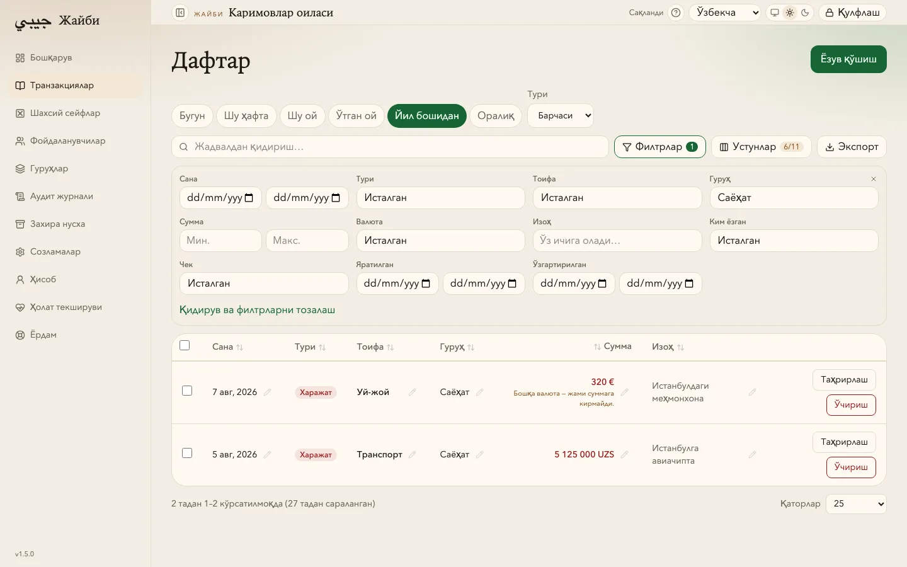

Администраторлар гуруҳни **Гуруҳ номи**ни киритиб, **Гуруҳ қўшиш** тугмасини босиш орқали қўшади. Гуруҳни фақат унда одамлар ва ёзувлар бўлмаганда олиб ташлаш мумкин.

## Одамлар ва таклифлар

Сейфни ким оча олишини администраторлар **Одамлар** саҳифасида (**Фойдаланувчилар** менюси) бошқаради. Ҳар ким бир хил сейфни ўз пароли билан очади. Менежерлар ҳам бу саҳифани кўради, лекин фақат ўқиш учун ва фақат ўз гуруҳидаги одамларни.

[Одамлар саҳифасини очиш](https://jaybi.uz/#/app/users)

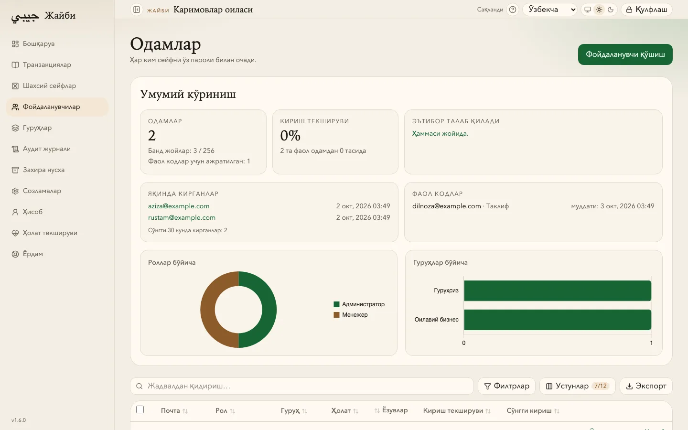

### Умумий кўриниш

Юқоридаги **Умумий кўриниш** сейфда нечта одам борлигини ва 256 та жойдан нечтаси бандлигини, жумладан фаол кодлар учун ажратилган жойларни кўрсатади. Унда нечта фаол одамда кириш текшируви ёқилгани ва ким **Эътибор талаб қилади**: паролини ўзгартириши керак, кира олмайди, гуруҳи йўқ, тўхтатилган ёки ҳали эски парол нусхаси бор одамлар. Шунингдек, яқинда кирганлар, фаол кодлар ва уларнинг муддати ҳамда иккита кичик график — роллар ва гуруҳлар бўйича одамлар кўринади. Бу ерда ҳеч қандай махфий нарса йўқ: кодлар, пароллар ва калитлар кўрсатилмайди.

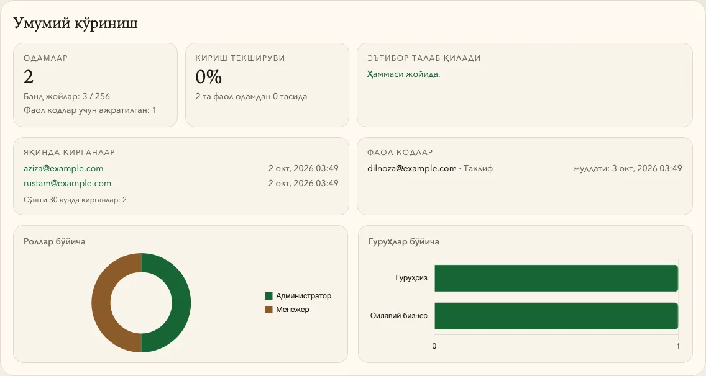

### Одамни таклиф қилиш (тавсия этилади)

1. **Фойдаланувчи қўшиш** тугмасини босинг. **Таклиф кодини юбориш** аллақачон танланган.
2. **Унинг почтаси**ни киритинг, коднинг **Амал қилиш муддати**ни, сўнг **Рол** ва **Гуруҳ**ни танланг.
3. **Таклиф кодини яратиш** тугмасини босинг.
4. Жайби кодни бир марта кўрсатади. **Кодни нусхалаш** ёки **Ҳаволани нусхалаш** тугмасини босинг ва уни одамга шахсан ёки ишончли канал орқали беринг, сўнг **Тайёр** тугмасини босинг.

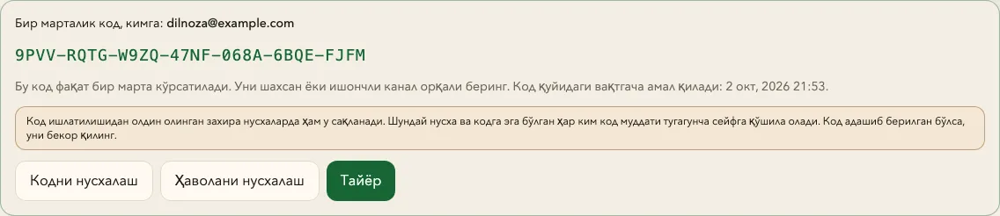

Сўнг у одам шу браузерда [код билан қўшилади](#joining) ва ўз паролини танлайди. У буни қилмагунча код **Фаол кодлар** рўйхатида туради, у ердаги **Бекор қилиш** тугмаси кодни бекор қилади.

### Одамни вақтинчалик парол билан қўшиш

**Фойдаланувчи қўшиш**, сўнг **Вақтинчалик парол ўрнатиш** тугмасини босинг. Почта, хоҳласангиз исм, вақтинчалик парол, рол ва гуруҳни киритинг ва **Фойдаланувчи қўшиш** тугмасини босинг. У одам биринчи киришда паролни алмаштириши керак. Таклиф коди хавфсизроқ, чунки бунда паролни фақат унинг ўзи билади.

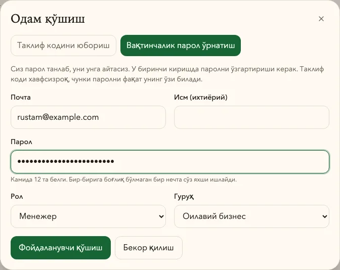

### Одамнинг саҳифаси

Рўйхатда одамнинг почтасини ёки унинг қаторидаги **Очиш** тугмасини босинг. Унинг саҳифасида профил, рол ва гуруҳ, қачон қўшилгани ва охирги марта қачон киргани, кириш текшируви ёқилганми ва паролини ўзгартириши керакми, ҳар бир валютада киритган ёзувлари, администраторлар учун эса аудит журналидаги сўнгги ёзувлари кўринади.

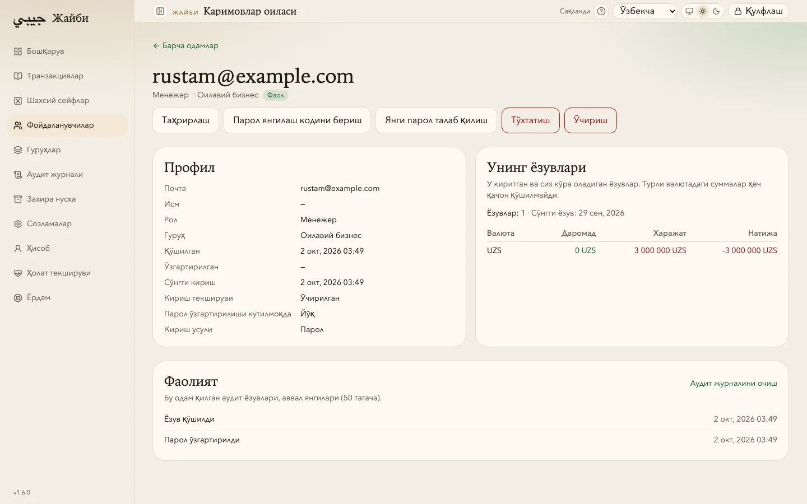

Бу ердан администратор қуйидагиларни қила олади:

- **Таҳрирлаш**: исм, почта, рол ва гуруҳни ўзгартириш. Почта ўзгаргандан кейин одам янги почта ва жорий пароли билан киради. Аввал унга берилган фаол кодни бекор қилинг.
- **Парол янгилаш кодини бериш**, [қуйида](#reset-for-someone) айтилганидек.
- **Кириш текширувини ўчириш** — аутентификаторини ҳам, тиклаш кодларини ҳам йўқотган одам учун.
- **Янги парол талаб қилиш**: кейинги киришда у янги парол танлаши керак бўлади ва унгача бошқа ҳеч нарса қила олмайди.
- **Тўхтатиш**: сиз уни **Қайта фаоллаштириш**ингизгача у кира олмайди, ёзувлари, шахсий сейфлари ва тарихи эса сақланади. Қайта фаоллаштирилганда у парол янгилаш кодини олади. Тўхтатишдан олдин сақланган сейф файли нусхаси унинг эски пароли билан очилаверади, чунки сейф калити ўзгармайди.
- **Ўчириш**: тасдиқлаш учун унинг почтасини ёзинг. Агар у ёзувлар киритган бўлса, уларни бошқа одамга ўтказинг ёки собиқ аъзо сифатида шу одам номида қолдиринг. Ўчириш унинг шахсий сейфларини бутунлай йўқ қилади. Аудит журналида исми ҳар қандай ҳолатда сақланади.

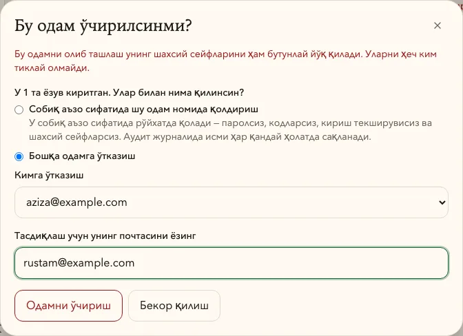

Ўзингизни тўхтата ёки ўчира олмайсиз, сейфда эса доим камида битта фаол администратор қолади. Ҳар бир ўзгариш аудит журналига ёзилади.

### Бир нечта одамни бирданига ўзгартириш

Рўйхатда одамларни белгиланг, янги **Рол**, янги **Гуруҳ** ёки иккаласини танланг, **Танланганларга қўллаш** тугмасини босинг ва тасдиқланг. Ҳар бир одамнинг ўзгариши аудит журналига алоҳида ёзилади. Собиқ аъзолар ўтказиб юборилади.

### Бировнинг паролини янгилаш

Одамнинг қаторида ёки саҳифасида **Парол янгилаш кодини бериш** тугмасини босинг, код қанча вақт ишлашини танланг ва **Унинг жорий паролини ҳозироқ бекор қилиш** бандини белгилаш керакми-йўқми, ҳал қилинг (паролни бошқа кимдир билиши мумкин бўлса, шуни танланг). Яна **Парол янгилаш кодини бериш** тугмасини босинг ва кодни унга беринг. Қатордаги **Ўрнига вақтинчалик парол ўрнатиш** — эскироқ усул.

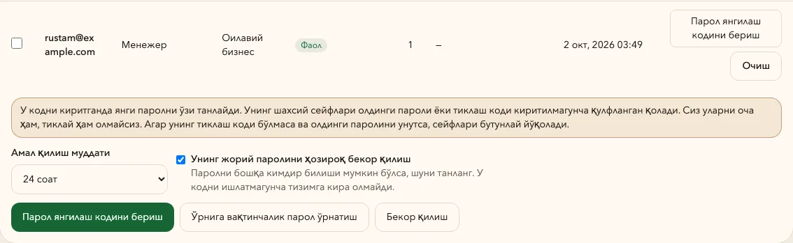

Паролни янгилашдан олдин сариқ изоҳни ўқинг: унинг шахсий сейфлари у олдинги паролини ёки тиклаш кодини киритмагунча қулфланган қолади. Сиз бировнинг сейфларини оча ҳам, тиклай ҳам олмайсиз.

### Кодлар учун соат текшируви

Агар бу қурилманинг соати сейф кўрган энг сўнгги вақтдан орқада бўлса, кодлар рад этилади, шунинг учун соатни орқага суриш муддати ўтган кодни қайта тирилтирмайди. Агар нотўғри соат бу вақтни келажакка суриб юборган бўлса, соатни тўғриланг, **Кодлар учун соат текшируви** бўлимини очинг, паролингизни киритинг ва **Жорий вақтга қайтариш** тугмасини босинг.

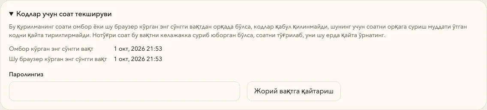

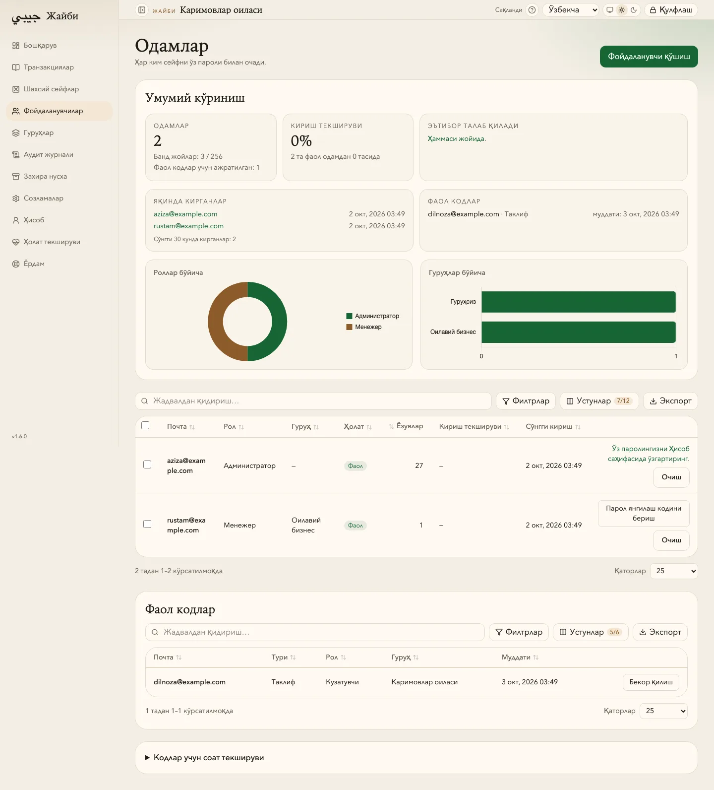

## Шахсий сейфлар

Шахсий сейф — ўзингизга тегишли нарсаларни сақлайдиган жой: тўлов карталари, обуналар ва қайдлар. Бу пул ҳисоби эмас; ундаги ҳеч нарса бошқарув саҳифасида ёки дафтарда кўринмайди.

Сейфларингизни фақат сиз оча оласиз. Администраторлар уларни кўра олмайди, номларини ҳам кўрмайди ва ҳатто захира нусха билан ҳам уларни оча ёки тиклай олмайди. Сейфдаги ҳар бир одамнинг ўз шахсий сейфлари бор.

[Шахсий сейфларни очиш](https://jaybi.uz/#/app/safes)

### Созлаш

1. **Шахсий сейфлар** бўлимини очинг ва **Паролингиз**ни киритинг.
2. **Тиклаш кодини яратиш (тавсия этилади)** ёки **Ҳозирча ўтказиб юбориш**ни танланг.
3. **Сейфларимни яратиш** тугмасини босинг.

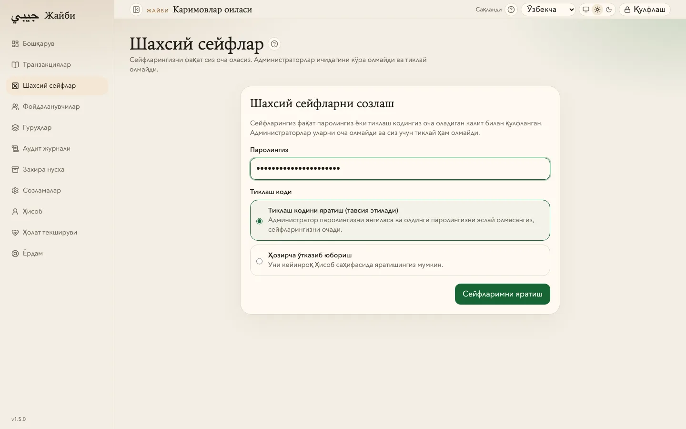

Агар тиклаш кодини танлаган бўлсангиз, Жайби уни бир марта кўрсатади. Уни ёзиб олинг ёки чоп этинг, шу қурилмадан узоқда сақланг ва тасдиқлаш учун унинг охирги 4 белгисини киритинг.

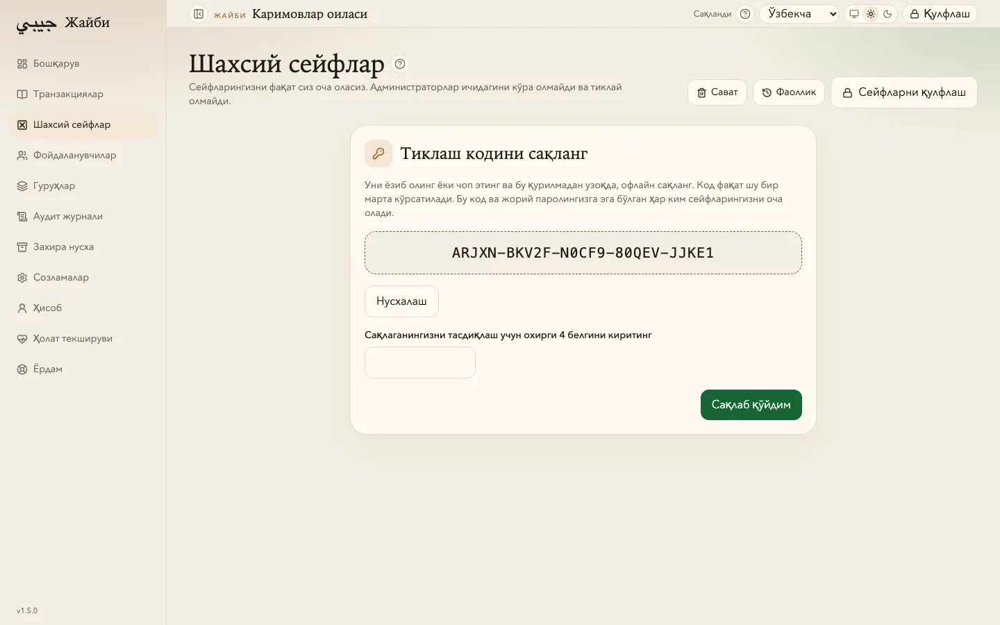

Сизда **Шахсий** номли битта бўш сейф пайдо бўлади.

### Тиклаш коди нега муҳим

Тиклаш коди битта ҳолатда муҳим: администратор паролингизни янгилайди, сиз эса олдинги паролингизни эслай олмайсиз. Бундай пайтда код бўлмаса, сейфларингиз бутунлай йўқолади. Уни кейинроқ **Ҳисоб → Тиклаш коди** бўлимида яратишингиз ёки алмаштиришингиз мумкин. Уни паролингиз каби сир сақланг.

### Карталар

Сейфни очинг ва **Карта қўшиш** тугмасини босинг. Номи, карта рақами, карта эгасининг исми, амал қилиш муддати, банк ва изоҳни киритинг. Жайби тўлов тизимини рақамдан аниқлайди ва назорат рақамини текширади. **Хавфсизлик коди (CVV)** ихтиёрий ва **Хавфсизлик кодини қўшиш** тугмаси ортида яширинган; банклар уни сақламасликни маслаҳат беради. PIN-код учун жой йўқ: PIN-кодни ҳеч қачон ҳеч қаерда сақламанг.

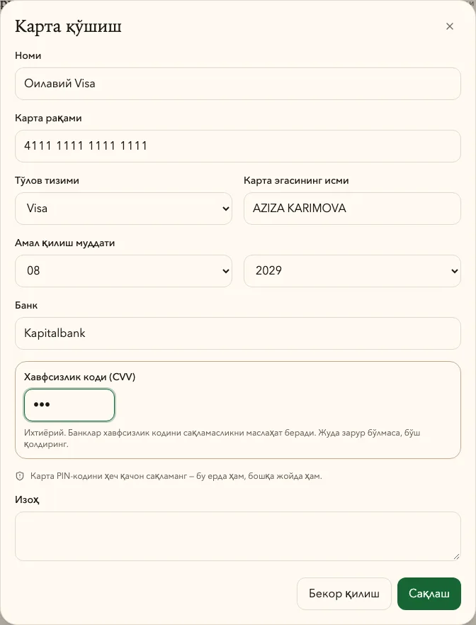

Карта рақамлари фақат охирги тўртта рақами билан кўрсатилади.

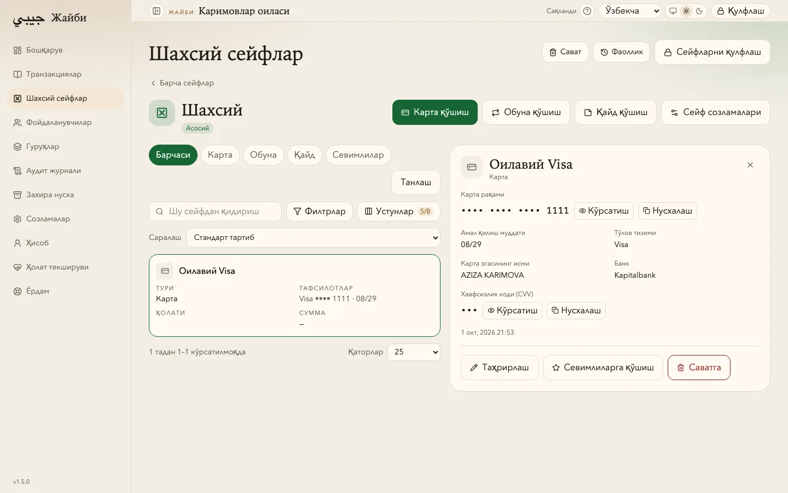

**Кўрсатиш** ва **Нусхалаш** тугмалари, агар сўнгги 2 дақиқада паролингизни киритмаган бўлсангиз, уни сўрайди. Кўрсатилган қиймат 15 сониядан кейин яна яширинади; нусхаланган қиймат 30 сониядан кейин буфердан тозаланади. Иккала вақтни ҳам **Ҳисоб** саҳифасида ўзгартиришингиз мумкин.

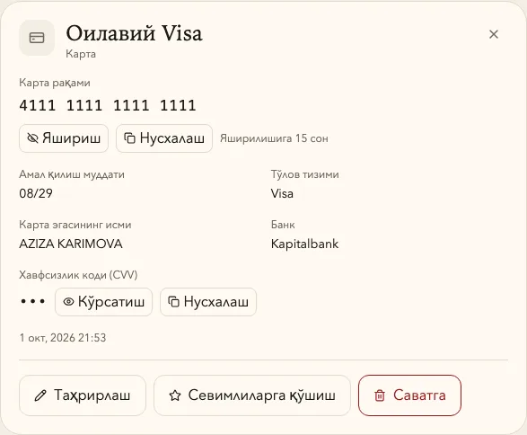

### Обуналар

**Обуна қўшиш** тугмасини босинг ва хизмат, нарх ва валюта, тўлов даври, тўлов санаси ва ҳолатни киритинг. Шунингдек, тўлов қилинадиган картани, сайтни, ҳисобни, эслатмани ва изоҳни қўшишингиз мумкин.

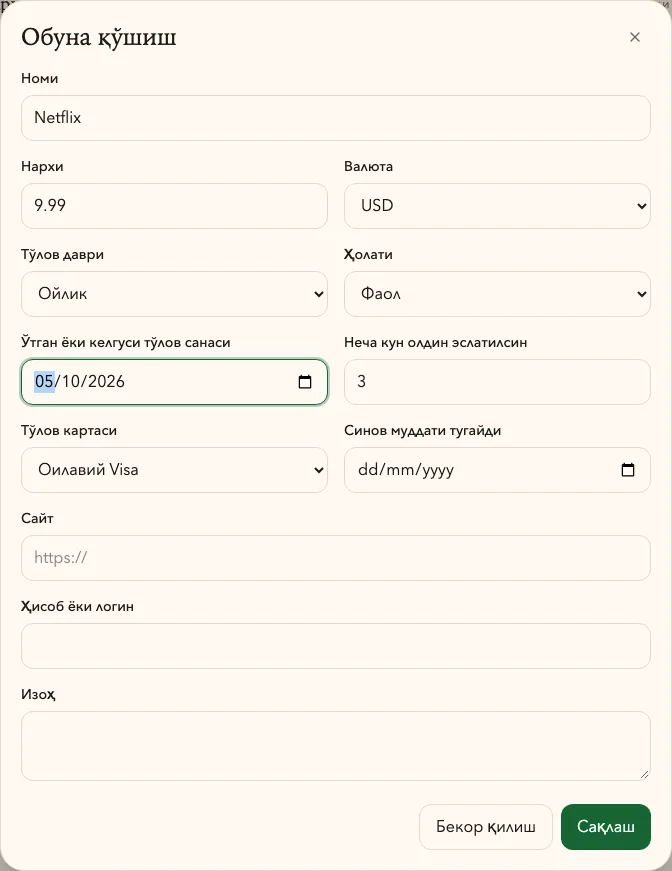

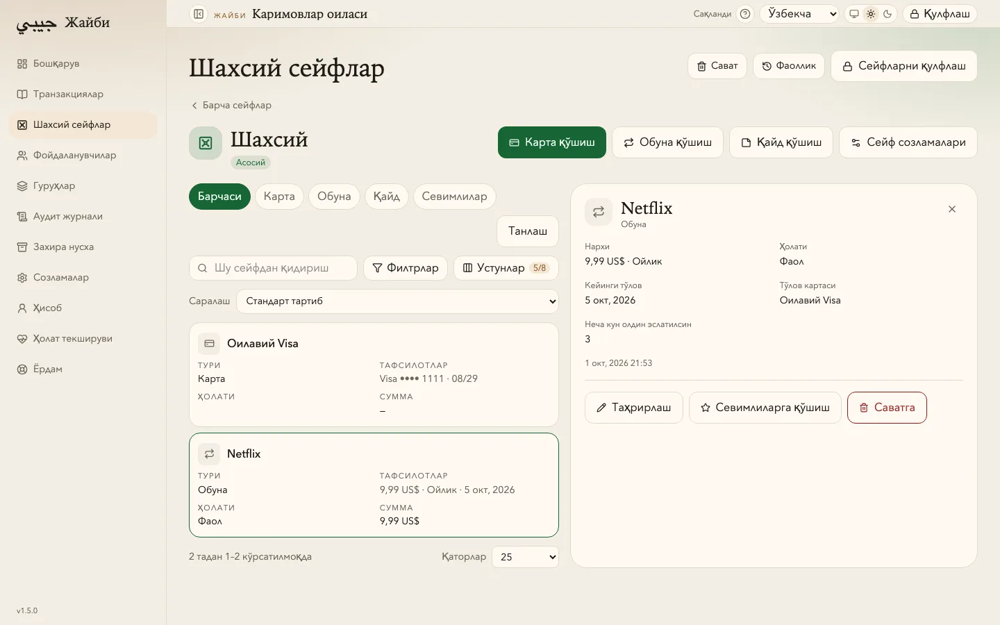

### Қайдлар

Бошқа ҳар қандай нарса учун **Қайд қўшиш** тугмасидан фойдаланинг: 10 000 тагача белгили оддий матн, масалан, Wi-Fi пароли. Тез-тез ишлатадиган нарсаларни **Севимлиларга қўшиш** билан белгиланг.

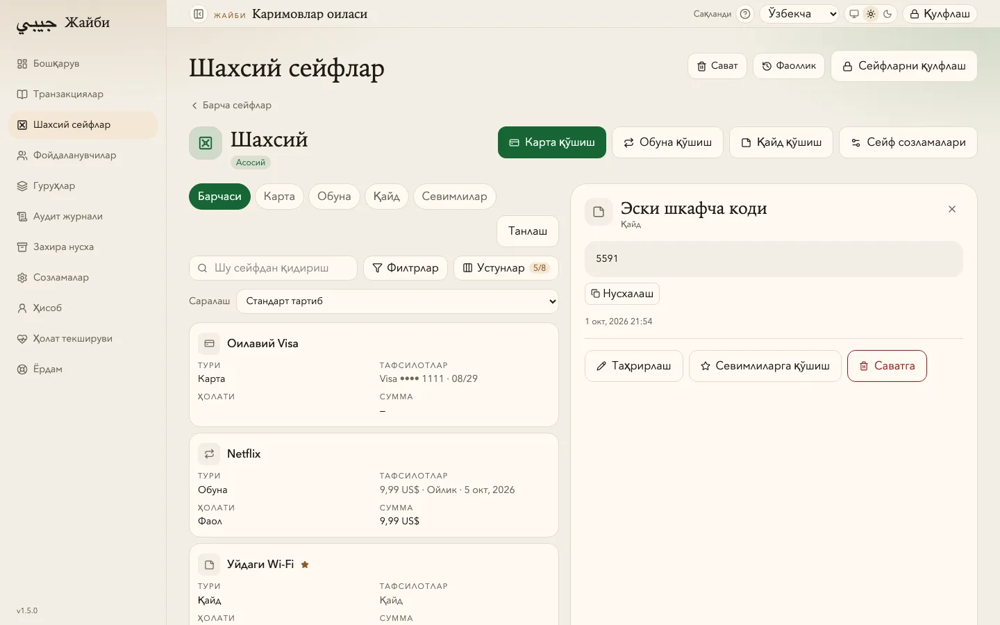

### Кўпроқ сейфлар

Янги сейф қўшиш учун **Янги сейф** тугмасини босинг ва унинг номи, тавсифи, белгиси ва рангини танланг. Ўзингиз сўрамагунча ёпиқ туриши керак бўлган сейф учун **Бу сейф ҳар сафар очилганда паролим сўралсин** бандини белгиланг.

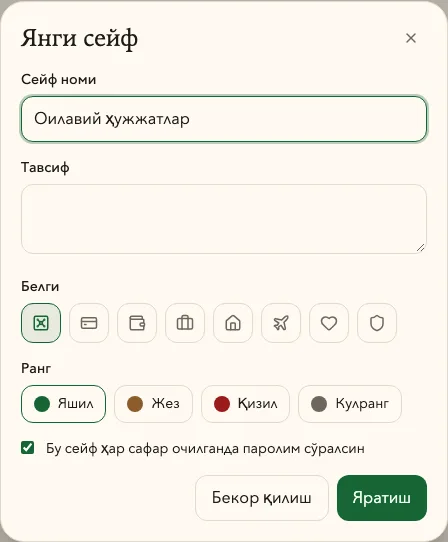

Сейфлар саҳифасида сейфларингиз, фаол обуналарингиз ойига ва йилига қанча туриши, **Яқин тўловлар (30 кун)** рўйхати, муддати яқинда тугайдиган карталар ва севимлиларингиз кўрсатилади. **Очиқ сейфлардан қидириш** барча очиқ сейфлардан қидиради.

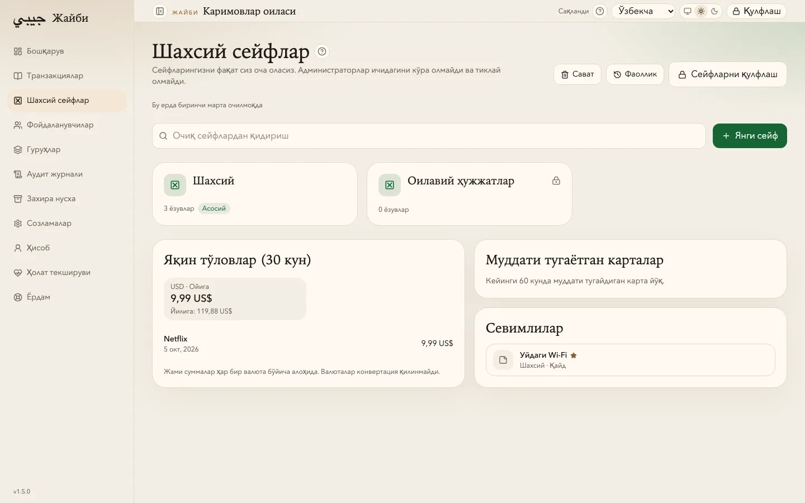

Парол сўрайдиган сейф ичидагилар ўрнига парол майдонини кўрсатади.

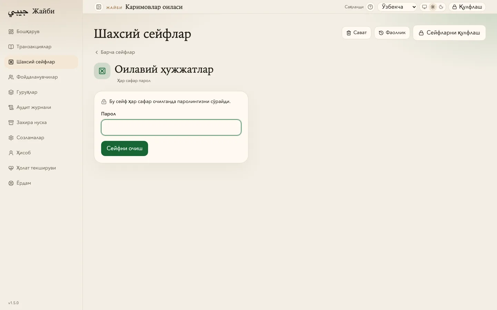

**Сейф созламалари**да сейфни асосий қилиш, архивлаш, унинг шифрлаш калитини алмаштириш ёки уни ўчириш ҳам мумкин.

### Сейфларни очиш ва қулфлаш

Тизимга кириш сейфларингизни очмайди. **Сейфларни очиш** тугмасини босинг ва паролингизни яна киритинг. Жайби сейфларингиз охирги марта қачон очилганини кўрсатади (**Олдинги очилиш**); агар бу вақтни танимасангиз, паролингиздан бошқа кимдир фойдаланган бўлиши мумкин.

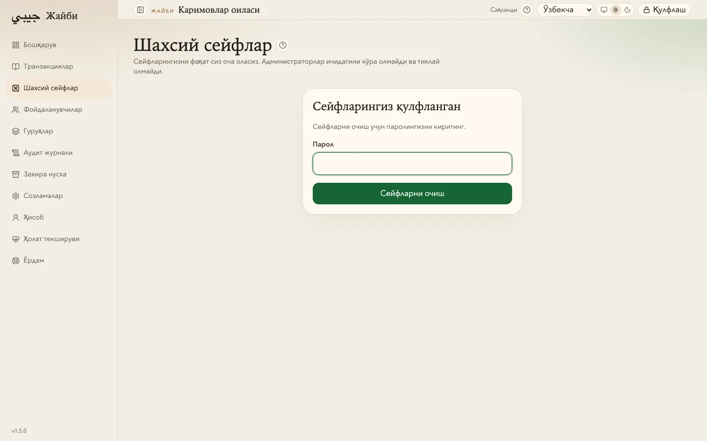

Сейфлар сиз ишлаётганда очиқ қолади ва **Сейфларни қулфлаш** тугмасини босганингизда ёки бутун сейф қулфланганда яна қулфланади.

### Сават ва Фаоллик

Ўчирилган сейфлар ва ёзувлар 30 кунга **Сават**га тушади. **Тиклаш** уларни қайтаради; **Бутунлай ўчириш** уларни дарҳол йўқ қилади.

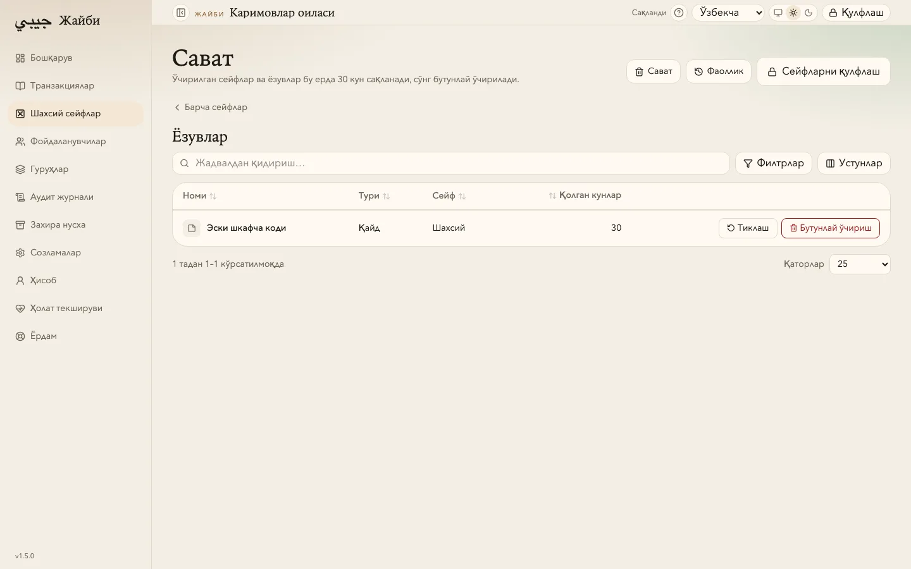

**Фаоллик** сейфларингизда нима ва қачон бўлганини кўрсатади: очилди, қўшилди, ўзгартирилди, кўчирилди, ўчирилди ёки тикланди. Уни фақат сиз ўқий оласиз.

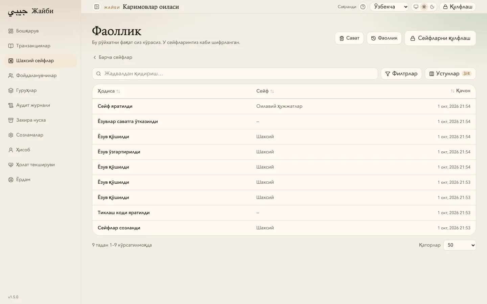

### Администратор паролингизни янгилагандан кейин

1. Парол янгилаш коди билан янги паролингизни ўрнатинг (ёки вақтинчалик парол билан кириб, янгисини танланг).
2. **Шахсий сейфлар** бўлимини очинг. Жайби сейфларни охирги марта очганингиздан бери паролингиз ўзгарганини айтади.
3. **Олдинги парол**ингизни — янгилашдан олдин ўзингиз танлаган паролни — киритинг ёки тиклаш кодидан фойдаланишни танланг. Жорий паролингизни ҳам киритинг.
4. Сейфларингиз очилади ва бундан буён уларни жорий паролингиз очади.

Администратор берган вақтинчалик паролни ҳеч қачон олдинги парол сифатида киритманг. Агар олдинги паролингизни ҳам, тиклаш кодингизни ҳам эслай олмасангиз, сейфларингизни ҳеч ким оча олмайди; **Ҳисоб → Қайтадан бошлаш → Шахсий сейфларни нолдан бошлаш** сизга янги, бўш сейфлар беради.

## Захира нусхалар ва бошқа қурилмага кўчиш

Захира нусхани фақат администраторлар олади. Захира нусха — бутун сейфнинг битта `.moliya` файлидаги шифрланган нусхаси. У сейфга тегишли исталган парол билан очилади ва шу браузер маълумотлари йўқолса, қайтишнинг **ягона** йўли шу.

[«Захира нусха» саҳифасини очиш](https://jaybi.uz/#/app/backup)

Ёзувлар бўлиб, ҳали захира нусха олинмаган бўлса ёки охиргиси 7 кундан эски бўлса, ҳар бир саҳифада эслатма пайдо бўлади.

### Захира нусхани юклаб олиш

1. **Захира нусха** бўлимини очинг.
2. **Нусхани юклаб олиш** тугмасини босинг.
3. Файлни шу қурилмадан бошқа жойда сақланг: флешкада, бошқа компьютерда ёки булутли хотирада. У шифрланган ҳолда қолади.

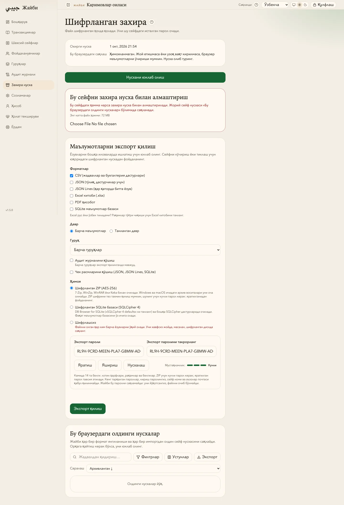

Саҳифада **Бу браузердаги сақлаш** ҳолати ҳам кўрсатилади. «Ҳимояланмаган» ёзуви жой етишмаганда браузер маълумотларни ўчириши мумкинлигини билдиради; [Ҳолат текшируви](#health) браузердан уларни сақлаб қолишни сўраши мумкин.

**Бу браузердаги олдинги нусхалар** рўйхатида Жайби ҳар бир формат янгиланиши ва ҳар бир импортдан олдин сақлаб қўядиган нусхалар бор. Орқага қайтиш керак бўлса, улардан бирини юклаб олинг.

### Маълумотларни бошқа иловалар учун экспорт қилиш

**Маълумотларни экспорт қилиш** ёзувларингизни CSV, JSON, Excel, PDF ҳисобот ёки SQLite маълумотлар базаси кўринишида, барча маълумотлар ёки танланган давр учун, битта ёки барча гуруҳлар бўйича юклаб беради. Стандарт ҳолатда файл алоҳида экспорт пароли билан **Шифрланган ZIP (AES-256)** бўлади; кучли парол учун **Яратиш** тугмасидан фойдаланинг. Захира нусха Жайби иловасини тиклаш учун, экспорт эса бошқа дастурлар учун керак.

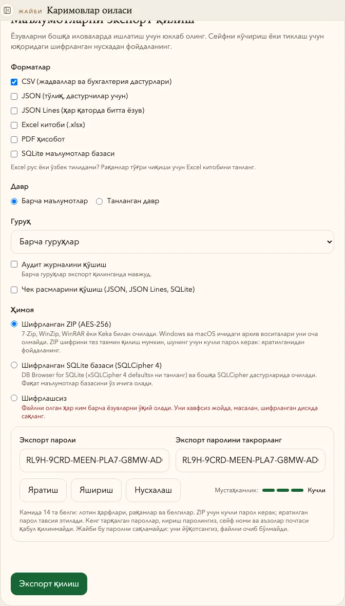

### Шу браузерда захира нусхани тиклаш

**Бу сейфни захира нусха билан алмаштириш** бўлимида захира файлни танланг, паролингизни киритинг ва тасдиқлаш учун сейф номини ёзинг, сўнг **Сейфни алмаштириш** тугмасини босинг. Жорий сейфнинг нусхаси **Бу браузердаги олдинги нусхалар** бўлимида сақланади.

Файл танлаш майдони остида Жайби **Бу қурилмада тиклаш мумкин бўлган энг катта захира нусха** ҳажмини ва уни нима чеклашини кўрсатади: браузердаги бўш жой, қурилма хотираси ёки ҳар қандай браузер очиши мумкин бўлган энг катта ҳажм. 72 MB гача бўлган захира нусхалар исталган қурилмада тикланади. Нусха каттароқ бўлса, Жайби буни файлни ўқишдан олдин айтади ва нима қилишни маслаҳат беради: дискда жой бўшатиш ёки [«Ҳолат текшируви»](#health) саҳифасида Жайби маълумотларини сақлашга рухсат бериш, бошқа варақлар ва иловаларни ёпиш ёки нусхани хотираси каттароқ компьютерда тиклаш. Янги қурилмадаги сейф яратиш экранида ҳам шундай.

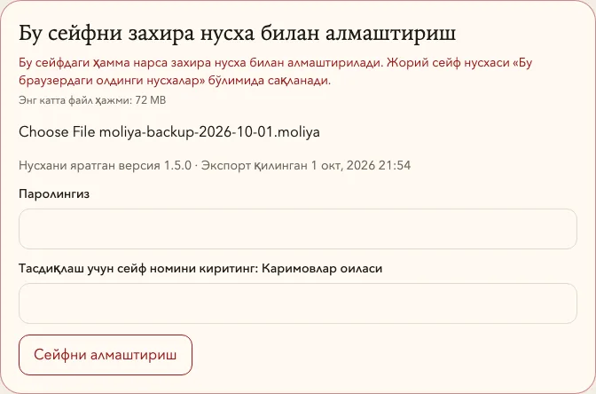

### Бошқа қурилмага кўчиш

1. Эски қурилмада захира нусхани юклаб олинг.
2. Янги қурилмада [https://jaybi.uz](https://jaybi.uz) манзилини очинг. У **Сейф яратинг** экранини кўрсатади: уни тўлдирманг.
3. **Ёки захира нусхани импорт қилинг** бўлимида захира файлни танланг ва **Сейфни алмаштириш** тугмасини босинг.
4. Одатдаги почта ва паролингиз билан киринг.

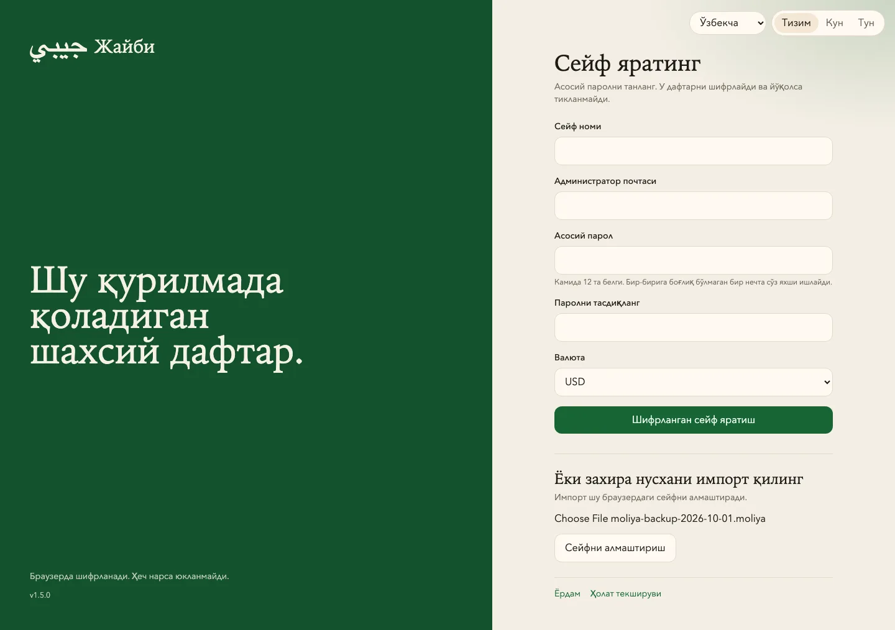

Сейфдаги ҳар ким янги қурилмада ўз пароли билан кира олади. Сейф синхронлашмайди: кўчгандан кейин фақат янги қурилмадан фойдаланинг ёки уни худди шу йўл билан қайтариб кўчиринг.

## Сейф созламалари

Администраторлар бутун сейф учун параметрларни **Созламалар** саҳифасида ўзгартиради.

[Созламаларни очиш](https://jaybi.uz/#/app/settings)

- **Сейф номи** ва **Сейф валютаси**, сўнг **Созламаларни сақлаш**. Жами суммалар фақат сейф валютасидаги ёзувларни ҳисоблайди.
- **Тоифалар**: даромад ва харажат тоифаларини ҳар бир тилдаги номи билан қўшинг, қайта номланг ёки олиб ташланг. Бўш таржима ўрнига инглизча ном ишлатилади. Ёзувларда ишлатилган тоифани олиб ташлаб бўлмайди.
- **Версия ҳақида**: илова версияси, йиғма, маълумотлар формати ва сейф қачон яратилгани. Муаммо ҳақида хабар берганда шуларни кўрсатинг.

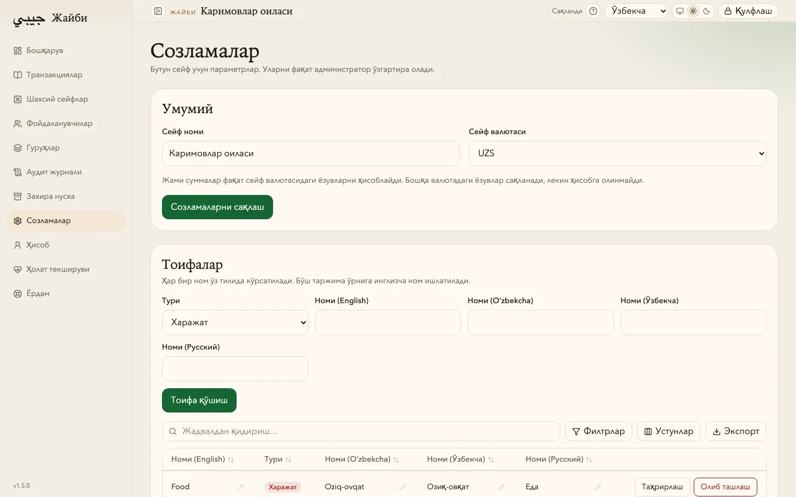

## Ҳисобингиз

Ҳар кимда фақат ўзига тегишли созламалар жойлашган **Ҳисоб** саҳифаси бор.

[«Ҳисоб» саҳифасини очиш](https://jaybi.uz/#/app/account)

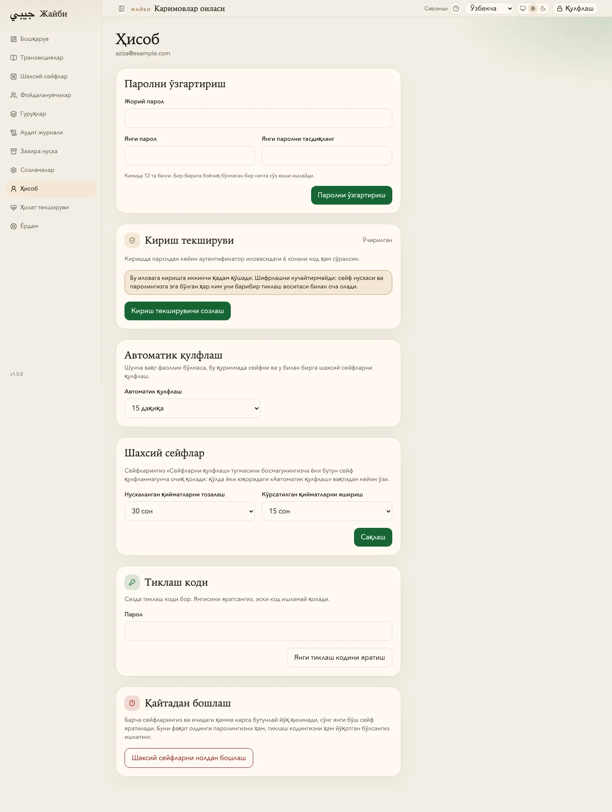

### Паролни ўзгартириш

**Жорий парол**ни, сўнг **Янги парол** ва **Янги паролни тасдиқланг** майдонларини тўлдиринг ва **Паролни ўзгартириш** тугмасини босинг. Шахсий сейфларингиз ва кириш текширувингиз ҳам шу заҳоти янги паролга ўтади.

Агар паролингизни администратор танлаган бўлса, Жайби ҳар нарсадан олдин янгисини танлашингизни сўрайди: буни қилмагунингизча ҳар бир саҳифа **Ҳисоб** саҳифасига олиб боради.

### Парол танлаш

Янги парол 12 дан 256 гача белгидан иборат бўлиши, кенг тарқалган парол бўлмаслиги, почтангиз ёки сейф номидан тузилмаслиги ва `qwertyuiop` каби оддий кетма-кетлик бўлмаслиги керак. Бир-бирига боғлиқ бўлмаган тўрт-беш сўз, хоҳласангиз бўш жой билан, эслаб қолишга осон ва топишга қийин. Бошқа сайтдаги паролни қайта ишлатманг: сейф нусхаларини айнан паролингиз ҳимоя қилади.

### Кириш текшируви (аутентификатор иловаси)

Кириш текшируви паролингиздан кейин аутентификатор иловасидаги (Google Authenticator, Microsoft Authenticator, Aegis, 1Password ва шу кабилар) 6 хонали кодни сўрайди. Агар кимдир паролингизни билиб олиб, уни шу браузерда синаб кўрса, у сизни ҳимоя қилади. Шифрлашни эса кучайтирмайди.

1. **Кириш текширувини созлаш** тугмасини босинг.
2. QR кодни иловангиз билан сканерланг ёки **Созлаш калити**ни қўлда киритинг.
3. **Иловадаги код** ва **Паролингиз**ни киритинг, сўнг **Тасдиқлаш ва ёқиш** тугмасини босинг.
4. Жайби 10 та кодни **Тиклаш кодлари** сарлавҳаси остида кўрсатади. Телефонингизни йўқотсангиз, ҳар бири бир марта ишлайди. **Кодларни юклаб олиш** тугмасини босинг ёки уларни ёзиб олинг, шу қурилмадан узоқда сақланг ва **Кодларни сақлаб қўйдим** тугмасини босинг.

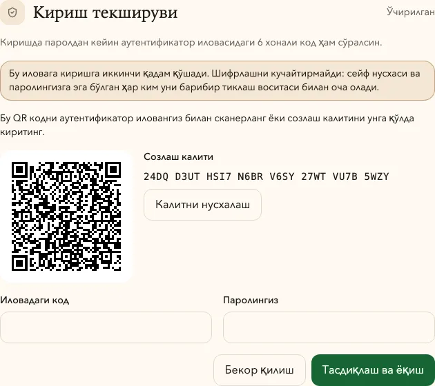

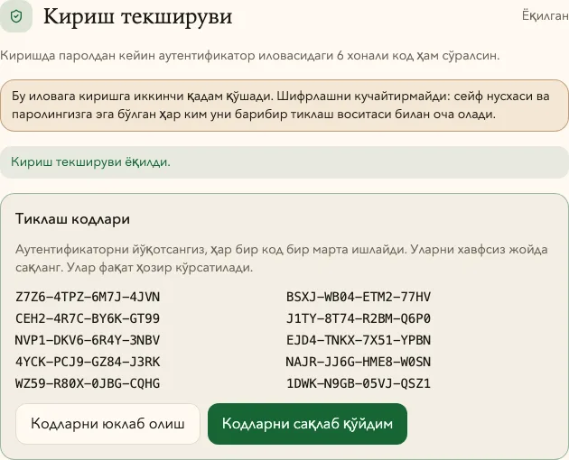

Уни ўчириш учун **Кириш текширувини ўчириш** тугмасини босинг ва паролингизни киритинг. Янги тиклаш кодларини олиш учун уни ўчириб, қайта ёқинг.

### Автоматик қулфлаш ва сейф таймерлари

**Автоматик қулфлаш** бу қурилмада фаоллик бўлмаганда сейф қанча вақт очиқ туришини белгилайди: 5 дақиқа, 15 дақиқа (стандарт), 30 дақиқа ёки 1 соат. **Шахсий сейфлар** бўлимида нусхаланган қийматлар буферда қанча қолиши ва кўрсатилган қийматлар қанча кўриниб туришини танлайсиз.

## Аудит журнали

**Аудит журнали** ким нима ва қачон қилганини кўрсатади: қўшилган, ўзгартирилган ва ўчирилган ёзувлар, қўшилган ёки олиб ташланган одамлар, парол янгиланишлари, захира нусхалар, экспортлар, созламалар ва бошқалар. Уни фақат администраторлар кўради. Унда суммалар, изоҳлар ёки шахсий сейфлар ичидагилар ҳеч қачон кўрсатилмайди.

[Аудит журналини очиш](https://jaybi.uz/#/app/audit)

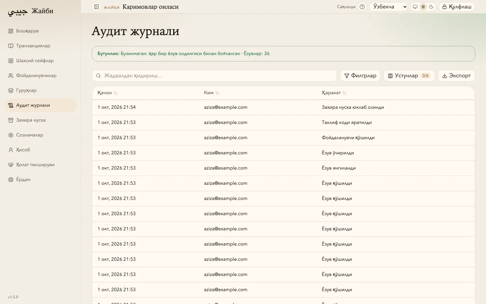

Ҳар бир ёзув олдингиси билан боғланган. Иловадан ташқарида ҳеч нарса ўзгартирилмаган бўлса, **Бутунлик** сатрида «Бузилмаган: ҳар бир ёзув олдингиси билан боғланган» деб ёзилади. Агар ёзувлар ўзгартирилган ёки ўчирилган бўлса, Жайби ҳар бир саҳифада қизил панел кўрсатади ва Ҳолат текшируви бу ҳақда хабар беради. Агар бу ўзгариш кутилган бўлса, масалан, эскироқ захира нусхани импорт қилгандан кейин, **Журнални борича қабул қилиш** тугмасини босинг; акс ҳолда яқиндаги захира нусхани тикланг ва паролларни ўзгартиринг.

## Ҳолат текшируви

**Ҳолат текшируви** шу браузерни, унинг сақлаш жойини, илова версиясини, сейфингизни ва валюта курсларини текширади ҳамда нима жойида ва нимага эътибор бериш кераклигини оддий сўзлар билан тушунтиради. Ҳаммаси шу қурилмада бажарилади; ҳеч нарса ҳеч қаерга юборилмайди.

[Ҳолат текширувини ўтказиш](https://jaybi.uz/#/app/health)

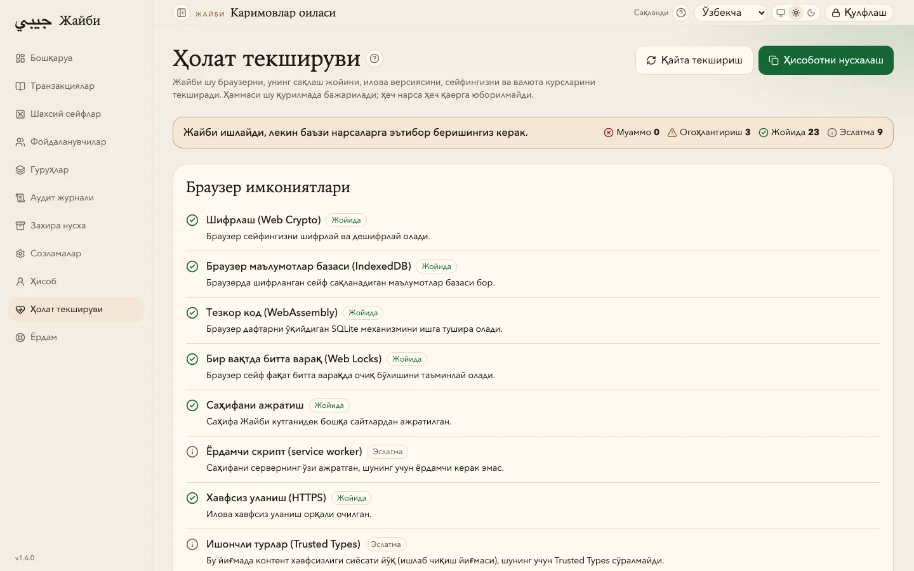

Ҳар бир қатор қисқа изоҳ билан **Жойида**, **Огоҳлантириш**, **Муаммо** ёки **Эслатма** деб белгиланади. Эътибор талаб қиладиган қаторда **Қандай тузатиш мумкин** бўлими ва, фойдали бўлса, **Маълумотларни сақлашни сўраш** ёки **«Захира нусха» саҳифасини очиш** каби тугма ҳам бўлади.

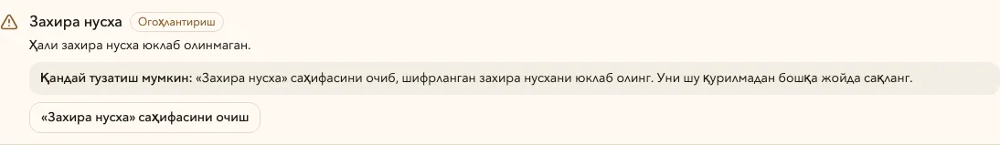

### Нималар текширилади

| Соҳа | Текширувлар |
| --- | --- |
| **Браузер имкониятлари** | Шифрлаш, браузер маълумотлар базаси, WebAssembly, бир вақтда битта варақ, саҳифани ажратиш, ёрдамчи скрипт (service worker), хавфсиз уланиш, Trusted Types, cookie ва сайт маълумотлари, махфий ойна |
| **Сақлаш жойи** | Сақлаш жойига ёзиш мумкинлиги, бўш жой, жой етишмаганда браузер маълумотларни сақлаб қолиши, кичик созламалар хотираси, бу ерда сейф сақланганлиги, бу қурилмадаги энг катта сейф |
| **Илова ва версия** | Янгироқ версия эълон қилинганлиги, йиғма ва керак бўлганда юкланадиган саҳифалар ишлаётган версияга мослиги |
| **Сейф** | Маълумотлар формати, бу қурилма чегарасига нисбатан сейф ҳажми (камида 48 MB), сақлаш, захира нусха қанча эскилиги, олдинги нусхалар, аудит журнали бутунлиги, қурилма соати, кириш текширувингиз, паролингиз ва одамлар сони |
| **Валюта курслари** | Курслар жорийлиги ва назорат йиғиндисига мослиги |
| **Хавфсизлик** | Контент хавфсизлиги сиёсати, бошқа саҳифа ичида ишламаслик ва манзил |

**Фақат администратор учун** деб белгиланган қаторлар фақат администраторларга кўринади: аудит журнали қаторлари, олдинги нусхалар, одамлар сони ва **Ҳисоблар тартиби** — бу қатор кимдир кира олмаса, код муддати тугаган бўлса ёки эски парол нусхаси қолган бўлса огоҳлантиради; унда фақат сонлар кўрсатилади. Администраторлар захира нусха саналарини ва соат белгиларини ҳам кўради. Бошқалар браузер ва ўз ҳисоби ҳақидаги қисқароқ рўйхатни кўради; захира нусха қатори уларга захира нусхаларни администратор олишини эслатади, холос.

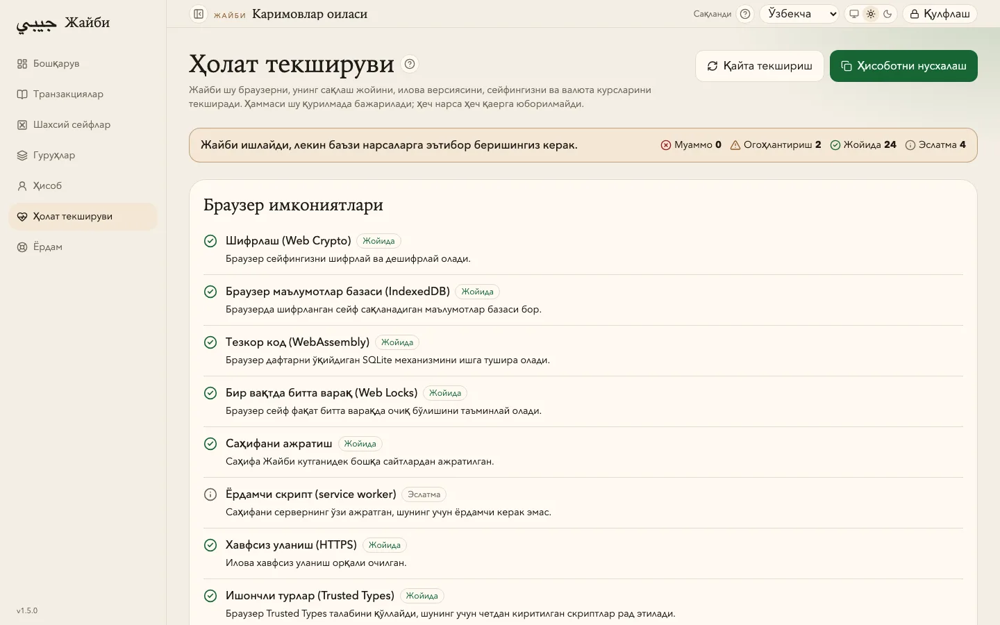

### Ҳисобот юбориш

**Ҳисоботни нусхалаш** сизга ёрдам бераётган одамга ёзадиган хабарингизга қўйиш учун оддий матнли хулосани нусхалайди. Унда версиялар, ҳажмлар, саналар ва ҳар бир текширув натижаси бўлади; пароллар, кодлар, почта манзиллари, исмлар ёки суммалар ҳеч қачон киритилмайди. **Қайта текшириш** бирор нарсани тузатганингиздан кейин текширувларни такрорлайди.

### Тизимга кира олмаганингизда

Кириш экранидаги **Ҳолат текшируви** ҳаволаси тизимга кирмасдан браузер, сақлаш жойи ва версия текширувларини ўтказади. Агар Жайби умуман ишга тушмаса, хато экрани ҳам шу текширувни таклиф қилади.

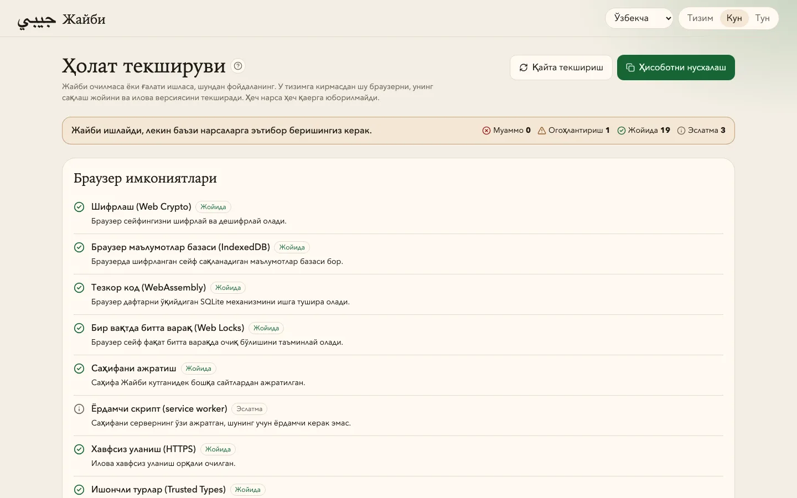

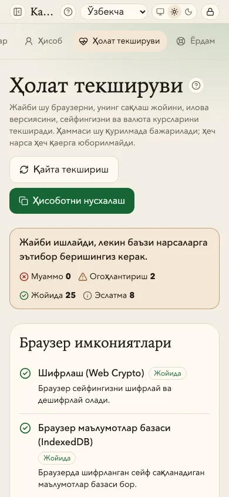

## Ушбу ёрдамдан фойдаланиш

Бу қўлланма Жайби ичига ҳам ўрнатилган. Менюдаги **Ёрдам** бўлимини, юқори панелдаги **?** тугмасини (у жорий саҳифага оид қисмни очади) ёки кириш экранидаги **Ёрдам** ҳаволасини очинг. Қўлланма сиз танлаган тилда кўрсатилади.

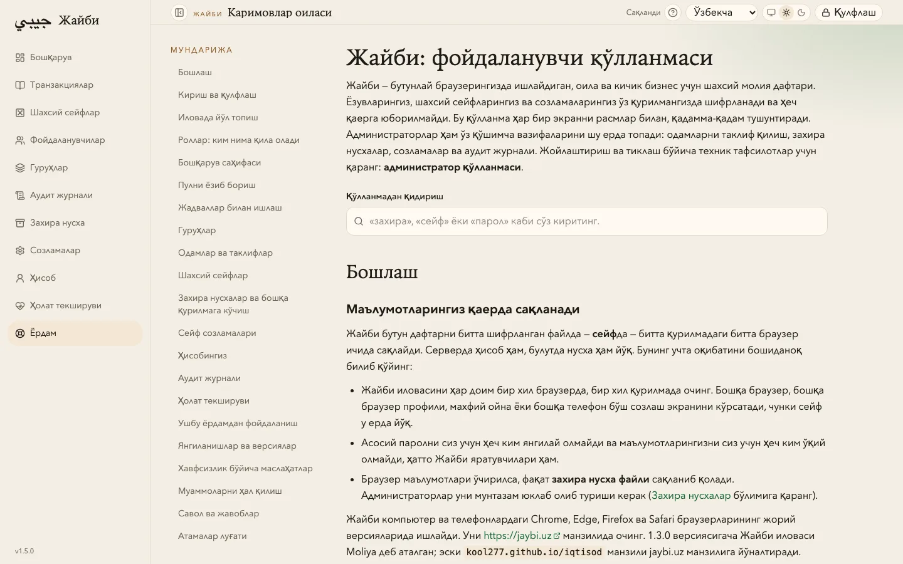

Тизимга киришдан олдин **Ёрдам** ўша қўлланмани алоҳида саҳифада, кириш экранига қайтиш ҳаволаси билан очади.

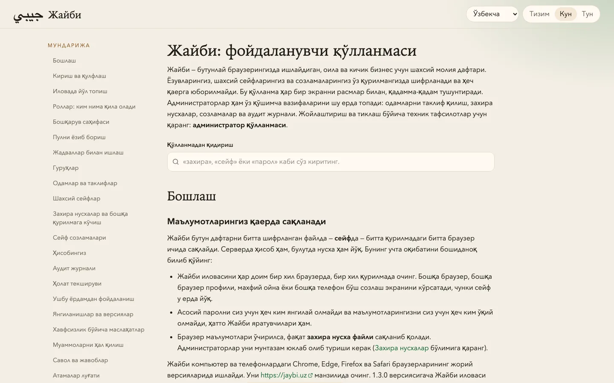

**Қўлланмадан қидириш** майдонига сўз киритсангиз, фақат шу сўз учрайдиган қисмлар кўрсатилади. **Очиш** тугмалари сизни тасвирланаётган экранга тўғридан-тўғри олиб боради.

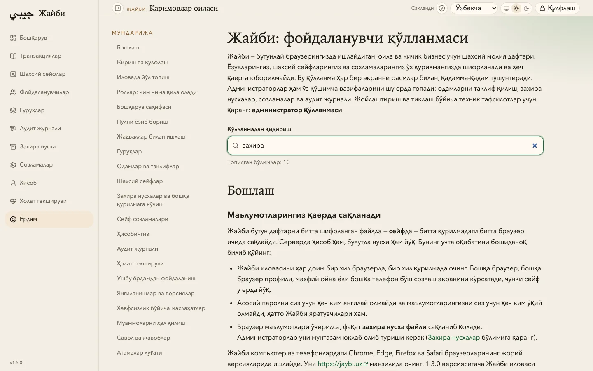

## Янгиланишлар ва версиялар

Жайби иловасининг янги версияси чиққанда, **Жайбининг янги версияси чиқди.** деган панел пайдо бўлади. Қулай пайтда **Янгилаш** тугмасини босинг: ишингиз сақланади ва аввал сейф қулфланади, шунинг учун кейин қайта киринг. Янгиланишдан кейинги биринчи кириш бир неча сония узоқроқ давом этиши мумкин, чунки Жайби маълумотларни янгилайди. Бу бир марта бўлади.

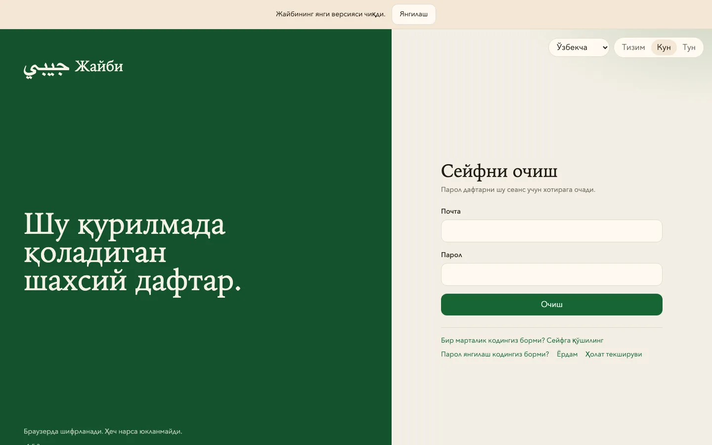

Фойдаланаётган версиянгиз меню пастида, кириш экранида ва Ҳолат текширувида кўрсатилади. Муаммо ҳақида хабар берганда уни кўрсатинг.

## Хавфсизлик бўйича маслаҳатлар

- Бошқа ҳеч қаерда ишлатилмайдиган узун паролдан фойдаланинг. Сейф нусхаларини ҳимоя қиладиган ягона нарса шу.
- Умумий қурилмадан кетишдан олдин сейфни қулфланг, шахсий сейфларингиз билан ишлаб бўлгач, уларни ҳам қулфланг.
- Кириш текширувини ёқинг ва тиклаш кодларини шу қурилмадан узоқда сақланг.
- Администраторлар: камида ҳафтада бир марта захира нусха юклаб олинг ва уни шу қурилмадан ташқарида сақланг.
- Шу сайтнинг браузер маълумотларини тозаламанг: бу сейфни браузердан ўчириб юборади.
- Бир марталик кодлардан тезроқ фойдаланинг ва кодингизни бошқа кимдир кўрган бўлиши мумкин бўлса, администраторга айтинг.
- Шахсий сейфларингиз учун тиклаш кодини яратинг ва уни офлайн сақланг.
- Манзилни ҳар доим текширинг: расмий манзил — `jaybi.uz`. Жайби бошқа сайт саҳифаси ичида ишламайди.
- Карта PIN-кодларини ҳеч қачон сақламанг. CVV ни фақат жуда зарур бўлсагина сақланг.

## Муаммоларни ҳал қилиш

[Ҳолат текшируви](#health)дан бошланг: кўпчилик муаммолар у ерда тузатиш йўли билан кўрсатилади.

[Ҳолат текширувини ўтказиш](https://jaybi.uz/#/app/health)

| Нима кўряпсиз | Нима қилиш керак |
| --- | --- |
| Сейфингиз бор бўлса ҳам **Сейф яратинг** экрани | Сиз бошқа браузер, профил, махфий ойна ёки манзилдасиз. Жайби иловасини сейфни яратган жойингизда очинг ёки захира нусхани импорт қилинг. Янги сейф яратманг. |
| «Почта ёки парол нотўғри» | Иккаласини ҳам текширинг. Бир неча уринишдан кейин тескари санаш тугашини кутинг. Паролни унутган бўлсангиз, администратордан парол янгилаш кодини сўранг. |
| **Уринишлар жуда кўп** | Тескари санаш тугашини кутинг; саҳифани янгилаш ёрдам бермайди. |
| **Сақлаб бўлмади** | Браузер маълумотларни сақлашни рад этди. Варақни ёпманг, дискда жой бўшатинг, сўнг Ҳолат текширувини ўтказинг. |
| **Сақланмади: бошқа жойда ўзгартирилган** | Сейф бошқа варақда очиқ. Қулфланг, қайта киринг ва охирги ўзгаришингизни такрорланг. |
| «бошқа варақ ёки ойнада аллақачон очиқ» | Ўша варақга ўтинг ёки уни у ерда қулфланг. |
| Код рад этилди | Унинг муддати тугаган, у ишлатилган ёки бошқа почта учун бўлиши мумкин. Янгисини сўранг. Агар соат текшируви тилга олинса, қурилма соатини тўғриланг. |
| Валюта курслари йўқ ёки **Эскирган** | Интернет алоқасини текширинг. Байрамлардан кейин банклар янги курс эълон қилмайди. |
| Янгиланишдан кейин саҳифа бўш қолди | Саҳифани қайта юкланг. |
| Аудит журнали ҳақида қизил панел | [Аудит журнали](#audit) бўлимига қаранг. |
| Сейф ҳажми чегарасига яқинлашди | Эски ёзувлардаги катта чекларни олиб ташланг. |

### Саҳифа топилмади

Эски ёки хато ёзилган ҳавола **Саҳифа топилмади** экранини очади. **Бошқарув саҳифасига ўтиш** тугмасини босинг.

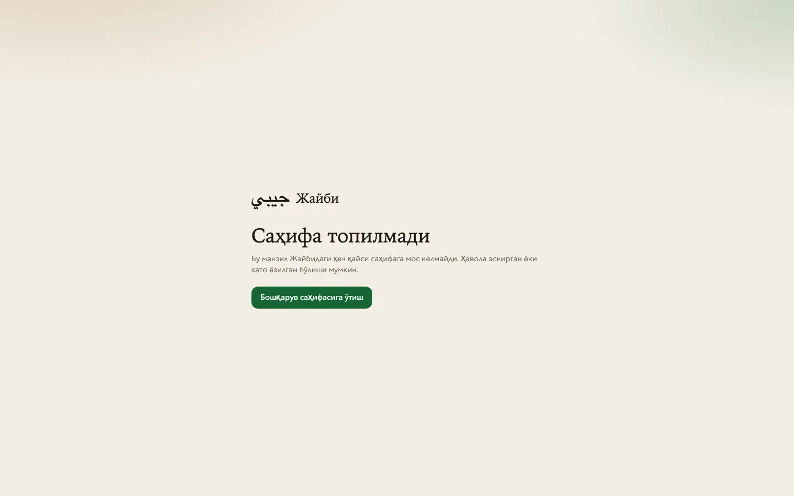

## Савол ва жавоблар

**Жайби иловасидан телефонимда ва компьютеримда бир вақтда фойдалана оламанми?** Йўқ. Сейф битта браузерда сақланади. Уни захира нусха орқали кўчиришингиз мумкин, лекин икки нусха бир-бири билан синхронлашмайди.

**Администратор шахсий сейфларимни ўқий оладими?** Йўқ. Сейфлар фақат паролингиз ёки тиклаш кодингиз оча оладиган калит билан шифрланган.

**Паролимни унутдим. Уни кимдир тиклай оладими?** Уни ҳеч ким кўра олмайди, лекин администратор сизга парол янгилаш кодини бера олади. Агар ягона администратор ўз паролини унутса, уни унинг учун ҳеч ким янгилай олмайди, шунинг учун иккита администратор бўлгани маъқул.

**Жайби маълумотларимни бирор жойга юборадими?** Йўқ. Илованинг ўзидан ташқари Жайби фақат очиқ валюта курсларини ва эълон қилинган версия рақамини юклайди.

**Нега баъзи ёзувлар жами суммага кирмаган?** Улар бошқа валютада. Улар **Бошқа валюталар (жамига кирмайди)** бўлимида кўрсатилган.

**Захира нусхалар қаерда сақланади?** Юклаб олинган файлни қаерга сақласангиз, ўша ерда. Жайби сиз учун захира нусха сақламайди.

**Кириш текшируви кучли паролнинг ўрнини босадими?** Йўқ. У фақат илова орқали киришда битта қўшимча қадам қўшади.

## Атамалар луғати

- **Сейф**: дафтар, одамлар ва уларнинг шахсий сейфлари жойлашган, битта браузерда сақланадиган шифрланган файл.
- **Асосий парол**: сейф яратилганда танланган биринчи администратор пароли.
- **Гуруҳ**: сейфнинг ўз ёзувлари ва одамлари бор қисми.
- **Ёзув**: дафтардаги битта даромад ёки харажат.
- **Сейф валютаси**: жами суммалар ва диаграммалар ҳисобга оладиган валюта.
- **Бир марталик код**: администратор берадиган, бир марта ишлайдиган ва муддати тугайдиган таклиф ёки парол янгилаш коди.
- **Кириш текшируви**: паролдан кейин сўраладиган, аутентификатор иловасидаги 6 хонали код.
- **Тиклаш кодлари**: аутентификаторни йўқотсангиз, унинг ўрнини босадиган ўнта бир марталик код.
- **Шахсий сейф**: карталар, обуналар ва қайдлар учун ўзингизнинг шифрланган жойингиз.
- **Тиклаш коди (сейфлар)**: шахсий сейфларингизнинг захира калити.
- **Захира нусха**: бутун сейф жойлашган шифрланган `.moliya` файл.
- **Аудит журнали**: ким нима ва қачон қилганини кўрсатадиган, ёзувлари ўзаро боғланган администратор рўйхати.
- **Ҳолат текшируви**: браузер, сақлаш жойи, версия, сейф ва курсларни текширадиган саҳифа.
