# Jaybi foydalanuvchi qoʻllanmasi

[English](../user-guide.md) · [Русский](../ru/user-guide.md) · **Oʻzbekcha** · [Ўзбекча](../uz-Cyrl/user-guide.md)

Jaybi — butunlay brauzeringizda ishlaydigan, oila va kichik biznes uchun shaxsiy daftar. Yozuvlaringiz, shaxsiy seyflaringiz va sozlamalaringiz oʻz qurilmangizda shifrlanadi va hech qayerga yuborilmaydi. Bu qoʻllanma sizni har bir ekran boʻylab qadamma-qadam, rasmlar bilan olib oʻtadi. Administratorlar bu yerda oʻzlarining qoʻshimcha vazifalarini ham topadi: odamlarni taklif qilish, zaxira nusxalar, sozlamalar va audit jurnali. Joylashtirish va tiklash boʻyicha texnik tafsilotlar alohida qoʻllanmada: [administrator qoʻllanmasi](../admin-guide.md).

## Mundarija

- [Boshlash](#start)
- [Kirish va qulflash](#sign-in)
- [Ilovada yoʻl topish](#around)
- [Rollar: kim nima qila oladi](#roles)
- [Boshqaruv sahifasi](#dashboard)
- [Pulni yozib borish](#transactions)
- [Jadvallar bilan ishlash](#tables)
- [Guruhlar](#groups)
- [Odamlar va takliflar](#users)
- [Shaxsiy seyflar](#safes)
- [Zaxira nusxalar va boshqa qurilmaga koʻchish](#backup)
- [Seyf sozlamalari](#settings)
- [Hisobingiz](#account)
- [Audit jurnali](#audit)
- [Holat tekshiruvi](#health)
- [Bu yordamdan foydalanish](#help)
- [Yangilanishlar va versiyalar](#updates)
- [Xavfsizlik boʻyicha maslahatlar](#security)
- [Muammolarni hal qilish](#troubleshooting)
- [Savol va javoblar](#faq)
- [Atamalar lugʻati](#glossary)

## Boshlash

### Maʼlumotlaringiz qayerda saqlanadi

Jaybi butun daftarni bitta shifrlangan faylda — **seyf** ichida — bitta qurilmadagi bitta brauzerda saqlaydi. Serverdagi hisob ham, bulutdagi nusxa ham yoʻq. Buning boshidanoq bilishingiz kerak boʻlgan uchta oqibati bor:

- Jaybini har safar oʻsha brauzerda, oʻsha qurilmada oching. Boshqa brauzer, boshqa brauzer profili, maxfiy oyna yoki boshqa telefon boʻsh sozlash ekranini koʻrsatadi, chunki seyf u yerda yoʻq.
- Asosiy parolni siz uchun hech kim tiklay olmaydi va maʼlumotlaringizni siz uchun hech kim oʻqiy olmaydi, hatto Jaybini yaratganlar ham.
- Brauzer maʼlumotlari oʻchirilsa, saqlanib qoladigan yagona nusxa — **zaxira nusxa fayli**. Administratorlar uni muntazam yuklab olishi kerak ([Zaxira nusxalar](#backup) boʻlimiga qarang).

Jaybi kompyuter va telefonlarda Chrome, Edge, Firefox va Safari brauzerlarining joriy versiyalarida ishlaydi. Uni [https://jaybi.uz](https://jaybi.uz) manzilida oching. 1.3.0 versiyasigacha Jaybi Moliya deb atalgan; eski `kool277.github.io/iqtisod` manzili jaybi.uz saytiga yoʻnaltiradi.

### Seyf yaratish (birinchi administrator)

Seyfni yaratgan odam uning birinchi **Administrator**i boʻladi.

1. Jaybini oching. Yuqori oʻng burchakda til va mavzuni tanlang.
2. **Seyf yarating** ostida **Seyf nomi**ni (masalan, oilangiz yoki biznesingiz nomi), **Administrator pochtasi**ni va **Asosiy parol**ni kiriting, soʻng **Parolni tasdiqlang** maydoniga oʻsha parolni yana yozing.
3. Jami summalar hisoblanadigan **Valyuta**ni tanlang. Uni keyinroq [Seyf sozlamalari](#settings) boʻlimida oʻzgartirishingiz mumkin.
4. **Shifrlangan seyf yaratish** tugmasini bosing. Shifrlash bir necha soniya davom etadi.

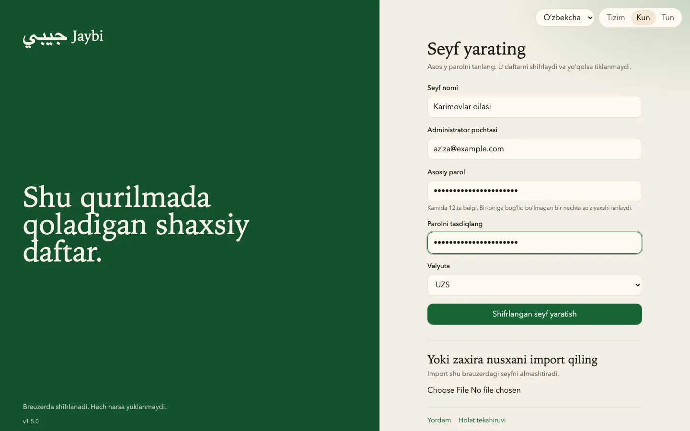

Asosiy parolni ehtiyotkorlik bilan tanlang: u seyfni shifrlaydi va **uni tiklab boʻlmaydi**. [Parol tanlash](#choosing-a-password) boʻlimiga qarang.

Seyf tayyor boʻlgach, boshqaruv sahifasiga tushasiz. Kimdir pul harakatini yozmaguncha u boʻsh turadi.

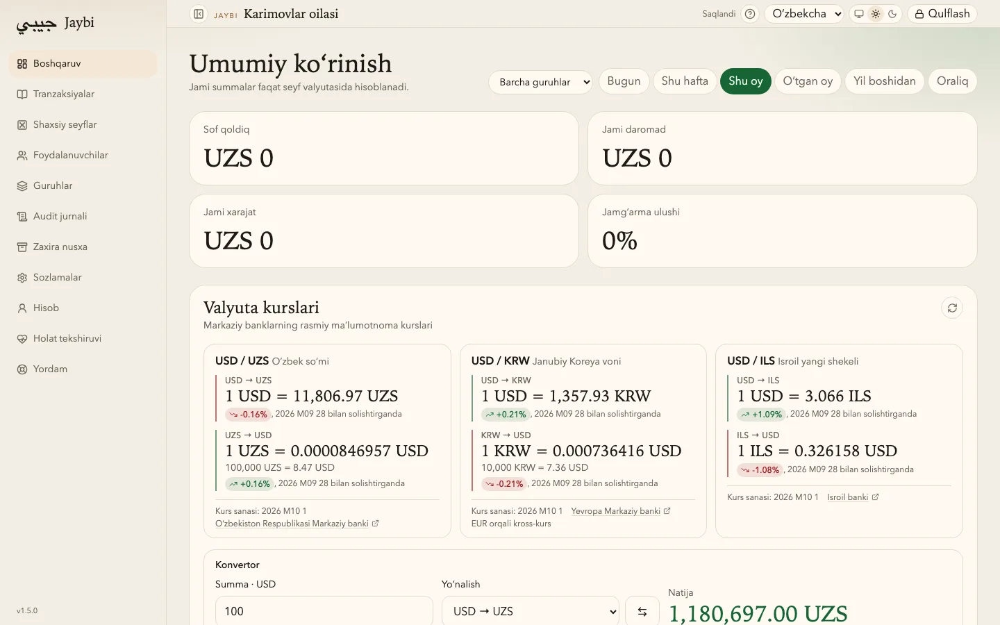

Agar boshqa qurilmadan olingan zaxira nusxangiz boʻlsa, yangi seyf yaratmang: oʻsha ekranning pastidagi **Yoki zaxira nusxani import qiling** bandidan foydalaning ([Boshqa qurilmaga koʻchish](#moving) boʻlimiga qarang).

### Bir martalik kod bilan seyfga qoʻshilish

Birinchi administratordan boshqa hamma administrator bergan **bir martalik kod** bilan qoʻshiladi. Kod `XXXX-XXXX-XXXX-XXXX-XXXX-XXXX-XXXX` koʻrinishida boʻladi va bir marta, faqat sizning pochtangiz uchun hamda faqat administrator tanlagan vaqtgacha ishlaydi.

1. Jaybini seyf saqlangan brauzerda oching. Administrator sizga havola yuborgan boʻlsa, uni oching: u pochtangiz va kodni oʻzi toʻldiradi.
2. Aks holda **Seyfni ochish** ekranida **Bir martalik kodingiz bormi? Seyfga qoʻshiling** havolasini bosing.
3. **Pochtangiz** va **Bir martalik kod** maydonlarini tekshiring. Katta-kichik harflar, boʻsh joylar va chiziqchalarning ahamiyati yoʻq.
4. **Parol tanlang** maydoniga parol kiriting va uni **Parolni tasdiqlang** maydoniga yana yozing, soʻng **Seyfga qoʻshilish** tugmasini bosing.

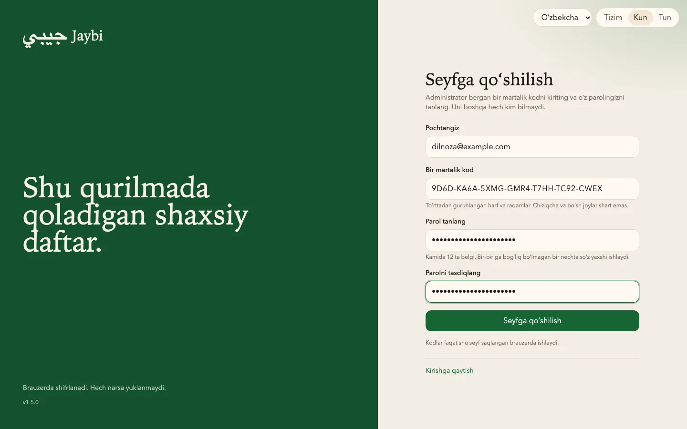

Siz darhol tizimga kirasiz. Parolingizni boshqa hech kim, hatto administrator ham bilmaydi.

Agar Jaybi «Bu brauzerda hali seyf yoʻq» desa, siz notoʻgʻri qurilma yoki brauzerdasiz: kod faqat seyf saqlangan joyda ishlaydi. Agar kod muddati tugagan yoki mos kelmayapti desa, administratordan yangisini soʻrang.

## Kirish va qulflash

### Seyfni ochish

1. Jaybini oching. **Seyfni ochish** ekrani chiqadi.
2. **Pochta** va **Parol**ni kiriting, soʻng **Ochish** tugmasini bosing.

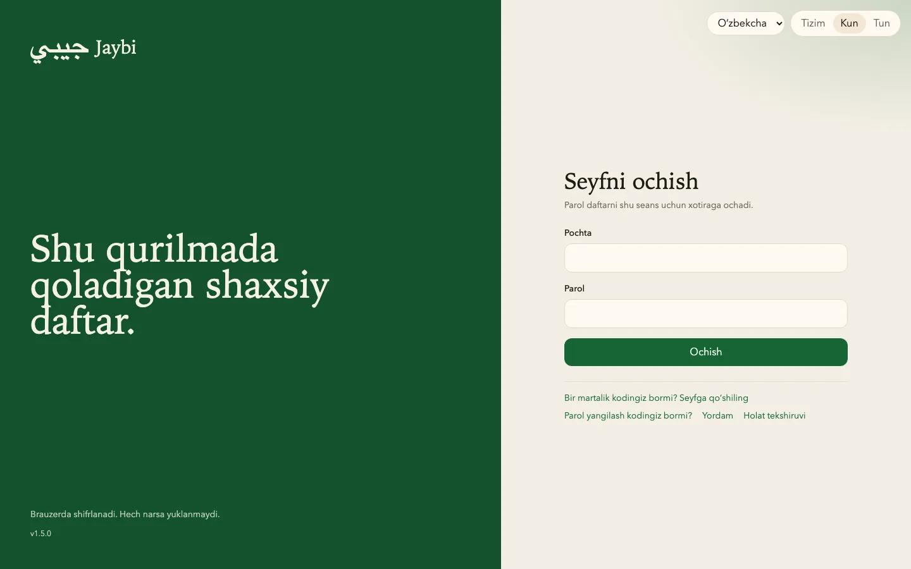

Ochish ataylab biroz vaqt oladi: parolingiz uni taxmin qilish sekin boʻlishi uchun maxsus «choʻziladi». «Pochta yoki parol notoʻgʻri» xabari ikkala xato uchun ham bir xil chiqadi, shuning uchun qaysi pochtalar mavjudligini hech kim bila olmaydi.

Bir pochta uchun beshta notoʻgʻri urinishdan keyin Jaybi teskari sanoq bilan **Urinishlar juda koʻp. Qayta urinishgacha:** xabarini koʻrsatadi va har bir keyingi xatoda kutish vaqti 15 daqiqagacha oshib boradi. Sahifani yangilash uni qisqartirmaydi. Tizimga kirganingizdan soʻng Jaybi oxirgi tashrifingizdan beri shu brauzerda hisobingizga nechta muvaffaqiyatsiz urinish boʻlganini aytadi. Agar ularni siz qilmagan boʻlsangiz, parolingizni oʻzgartiring.

Shakl ostidagi havolalar hamma uchun: **Bir martalik kodingiz bormi? Seyfga qoʻshiling**, **Parol yangilash kodingiz bormi?**, **Yordam** (shu qoʻllanma) va **Holat tekshiruvi** — u tizimga kira olmaganingizda ham brauzerni tekshiradi.

### Ikkinchi qadam (kirish tekshiruvi)

Agar [kirish tekshiruvi](#sign-in-check)ni yoqqan boʻlsangiz, Jaybi paroldan keyin autentifikator ilovangizdagi 6 xonali kodni soʻraydi. Uni **Kod** maydoniga yozing va **Davom etish** tugmasini bosing. Bu yerda tiklash kodi ham bir marta ishlaydi. 5 daqiqadan koʻproq kutsangiz yoki **Bekor qilish** tugmasini bossangiz, **Seyfni ochish** ekraniga qaytasiz.

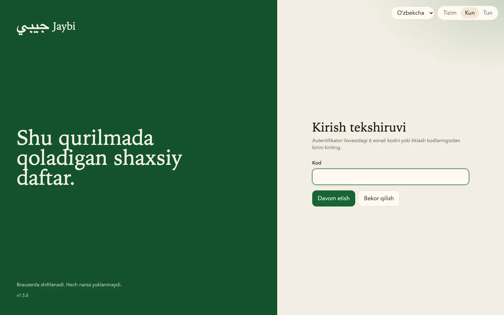

### Parolni unutdingizmi? Parol yangilash kodidan foydalaning

Jaybida «parolni unutdim» xati yoʻq, chunki server yoʻq. Administratordan **parol yangilash kodi**ni soʻrang, soʻng:

1. **Seyfni ochish** ekranida **Parol yangilash kodingiz bormi?** havolasini bosing (yoki administrator yuborgan havolani oching).
2. **Pochtangiz**, **Bir martalik kod** va yangi parolingizni ikki marta kiriting.
3. **Yangi parolni oʻrnatish** tugmasini bosing. Siz yangi parol bilan tizimga kirasiz.

Parol yangilash kodi kirish tekshiruvingizni ham oʻchiradi; uni [Hisobingiz](#account) boʻlimida qayta yoqing. Shaxsiy seyflardan foydalansangiz, avval [Administrator parolingizni yangilagandan keyin](#after-reset) boʻlimini oʻqing.

### Qulflash

Joyingizdan turganingizda har safar yuqori paneldagi **Qulflash** tugmasini bosing. Qulflash, sahifani yangilash yoki varaqni yopish deshifrlangan maʼlumotlarni xotiradan oʻchiradi va keyingi odam tizimga qayta kirishi kerak boʻladi. 15 daqiqa faollik boʻlmasa, Jaybi oʻzi ham qulflanadi; buni **Hisob → Avtomatik qulflash** boʻlimida oʻzgartiring. Shunda kirish ekranida «Faollik boʻlmagani uchun seyf qulflandi.» degan yozuv chiqadi.

Seyf bir vaqtda faqat bitta varaqda ochiq boʻlishi mumkin. Agar Jaybi u boshqa varaq yoki oynada allaqachon ochiq desa, oʻsha varaqqa oʻting yoki avval u yerda qulflang.

### Saqlash

Seyf uchun saqlash tugmasi yoʻq. Yuqori paneldagi yordam tugmasi yonidagi soʻz nima boʻlayotganini koʻrsatadi:

- **Saqlandi**: hamma narsa shifrlangan va shu brauzerda saqlangan.
- **Saqlanmagan** yoki **Shifrlanmoqda…**: oʻzgarish saqlanmoqda. Odatda bu bir soniyacha davom etadi.
- **Saqlab boʻlmadi**: brauzer maʼlumotlarni saqlashni rad etdi, masalan, disk toʻlgani uchun. Varaqni ochiq qoldiring va [Holat tekshiruvi](#health)ni oʻtkazing.
- **Saqlanmadi: boshqa joyda oʻzgartirilgan**: seyf boshqa varaqda oʻzgartirilgan. Qulflang, qayta kiring va oxirgi oʻzgarishingizni takrorlang.

## Ilovada yoʻl topish

Chapdagi menyu faqat rolingiz ruxsat bergan narsalarni koʻrsatadi. Yuqori panelda seyf nomi, saqlash holati, shu qoʻllanmaning joriy sahifaga oid qismini ochadigan **?** tugmasi, til va mavzu almashtirgichlari hamda **Qulflash** tugmasi bor.

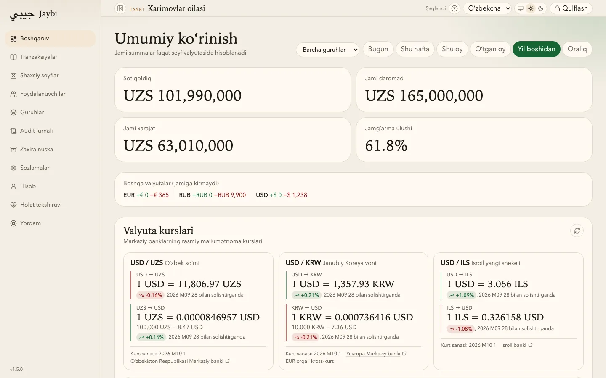

Yuqori panelning eng chap chetidagi tugma menyuni faqat belgilar qolguncha yigʻadi; nomlarni qaytarish uchun uni yana bosing. Jaybi tanlovingizni shu brauzerda eslab qoladi.

### Telefonda

Telefonda menyu tepada yonga surib koʻriladigan qatorga aylanadi, sahifalar esa bitta ustunga terilib joylashadi. Jadvallar kartochkalarga aylanadi.

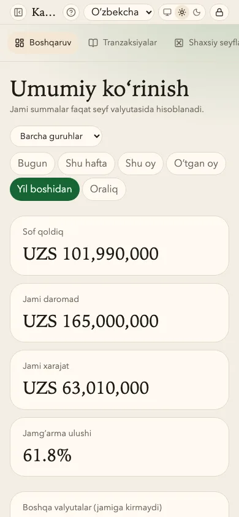

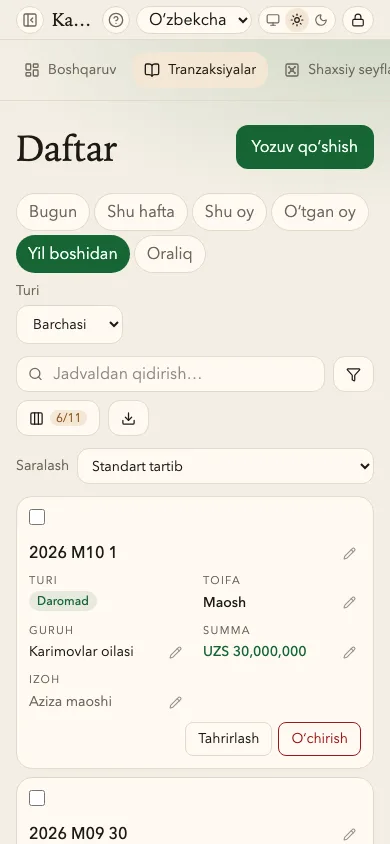

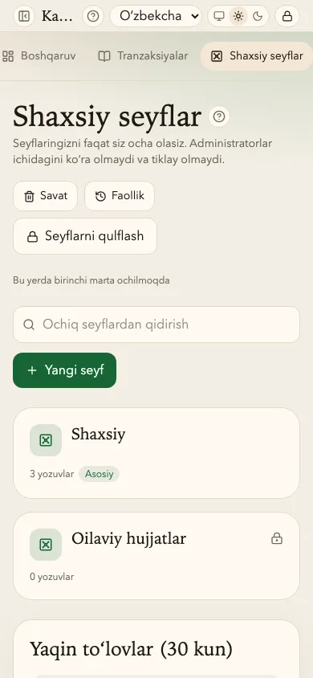

### Til va mavzu

Til menyusidan tilni tanlang: Oʻzbekcha, Ўзбекча, Русский yoki English. **Kun**, **Tun** yoki qurilmangizga moslashadigan **Tizim** mavzusini tanlang. Ikkala tanlov ham shu brauzerda eslab qolinadi va ularni tizimga kirishdan oldin ham oʻzgartirish mumkin.

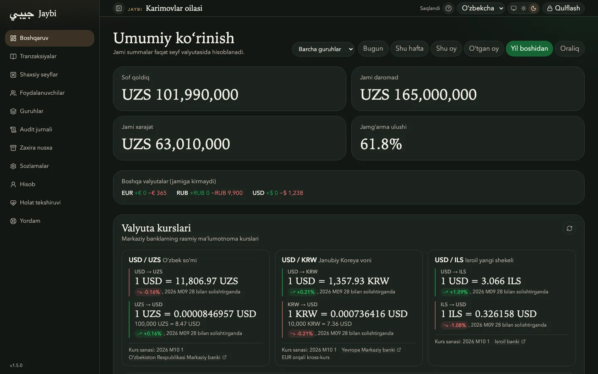

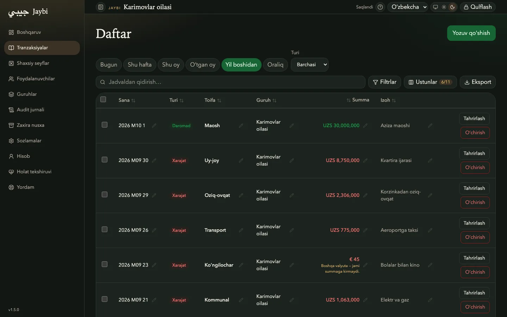

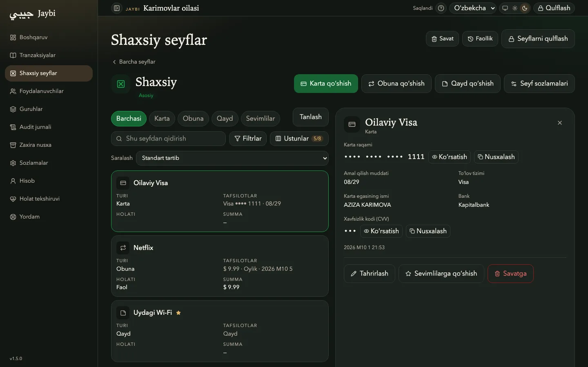

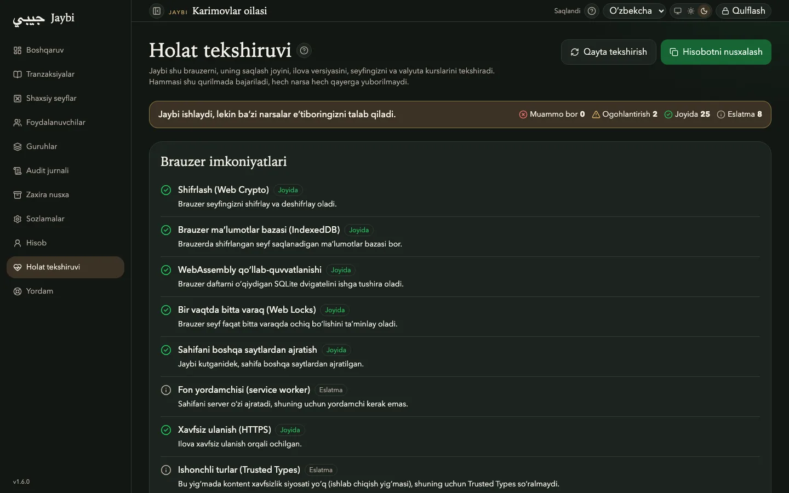

## Rollar: kim nima qila oladi

Seyfdagi har bir odamning bitta roli bor. Menejer va kuzatuvchilar bitta **guruh**ga tegishli boʻladi va faqat oʻsha guruh yozuvlarini koʻradi.

| Nima | Administrator | Menejer | Kuzatuvchi |
| --- | --- | --- | --- |
| Boshqaruv, Guruhlar va Daftar | Barcha guruhlar | Oʻz guruhi | Oʻz guruhi |
| Yozuv qoʻshish, tahrirlash va oʻchirish | Barcha guruhlar | Oʻz guruhi | Yoʻq |
| Jadval va maʼlumotlarni eksport qilish | Ha | Yoʻq | Yoʻq |
| Odamlar, takliflar va parol yangilash kodlari | Ha | Yoʻq | Yoʻq |
| Zaxira nusxa, maʼlumotlar eksporti, seyfni almashtirish | Ha | Yoʻq | Yoʻq |
| Seyf sozlamalari va toifalar | Ha | Yoʻq | Yoʻq |
| Audit jurnali | Ha | Yoʻq | Yoʻq |
| Shaxsiy seyflar, Hisob, Holat tekshiruvi, Yordam | Ha, oʻziniki | Ha, oʻziniki | Ha, oʻziniki |

Kuzatuvchining menyusi qisqa: Boshqaruv, Tranzaksiyalar, Shaxsiy seyflar, Guruhlar, Hisob, Holat tekshiruvi va Yordam.

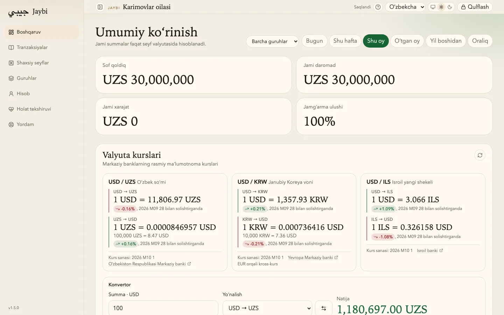

## Boshqaruv sahifasi

Boshqaruv sahifasi tanlangan davr va guruh boʻyicha pul harakatini jamlab koʻrsatadi.

[Boshqaruv sahifasini ochish](https://jaybi.uz/#/app)

### Toʻrtta koʻrsatkich

- **Sof qoldiq**: daromad minus xarajat.
- **Jami daromad** va **Jami xarajat**.
- **Jamgʻarma ulushi**: xarajatlardan keyin qolgan daromad ulushi. Daromad boʻlmasa, u 0% boʻladi, topganingizdan koʻproq sarflagan boʻlsangiz esa manfiy boʻlishi mumkin.

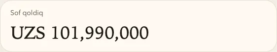

Jami summalar sentgacha (yoki tiyingacha) aniq va faqat **seyf valyutasi**dagi yozuvlarni hisoblaydi. Boshqa valyutadagi yozuvlar **Boshqa valyutalar (jamiga kirmaydi)** ostida har bir valyuta boʻyicha alohida koʻrsatiladi, shuning uchun hech narsa yashirilmaydi. Jaybi yozuvlaringizni hech qachon konvertatsiya qilmaydi.

### Davrni tanlash

Boshqaruv sahifasi, daftar va **Guruhlar** bir xil davr tugmalaridan foydalanadi va tanlovingiz ular orasida saqlanib qoladi: **Bugun**, **Shu hafta** (dushanbadan yakshanbagacha), **Shu oy** (odatiy), **Oʻtgan oy**, **Yil boshidan** va **Oraliq**.

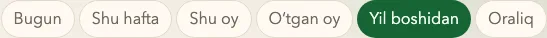

**Oraliq** tugmasi **Dan** va **Gacha** sana maydonlarini ochadi. Ularni teskari kiritsangiz, Jaybi ularning oʻrnini almashtiradi.

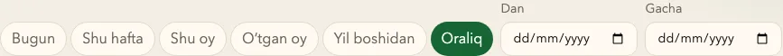

### Guruhni tanlash

Davr tugmalari yonidagi roʻyxatdan **Barcha guruhlar** yoki bitta guruh tanlanadi. U koʻrsatkichlarni, diagrammalarni va boshqa valyutalar roʻyxatini oʻzgartiradi. Siz faqat oʻzingiz aʼzo boʻlgan guruhlarni koʻrasiz.

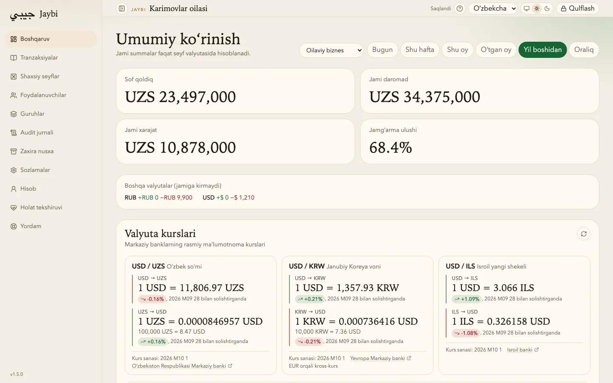

### Diagrammalar

Koʻrsatkichlar ostida:

- **Daromad va xarajat** davrdagi har bir oyni solishtiradi.
- **Xarajatlar toifa boʻyicha** pul qayerga ketganini koʻrsatadi.
- **Xarajatlar vaqt boʻyicha** kunlik xarajat summalarini koʻrsatadi.
- **Kim sarfladi** guruhingizdagi har bir odamning xarajatlarini koʻrsatadi; administratorlar uning oʻrniga **Xarajatlar guruh boʻyicha** diagrammasini koʻradi.

Davrda mos yozuvlar boʻlmasa, diagrammada «Bu oraliqda raqamlar yoʻq» yozuvi chiqadi.

### Valyuta kurslari va konvertor

**Valyuta kurslari** paneli oʻzbek soʻmi (UZS), Janubiy Koreya voni (KRW) va Isroil yangi shekelining (ILS) AQSH dollariga nisbatan markaziy banklar eʼlon qilgan rasmiy maʼlumotnoma kurslarini ikkala yoʻnalishda koʻrsatadi: oldingi kursdan beri oʻzgarish, **Kurs sanasi** va manba bankka havola bilan. Kurs 2 ish kunidan eski boʻlsa, **Eskirgan** belgisi chiqadi.

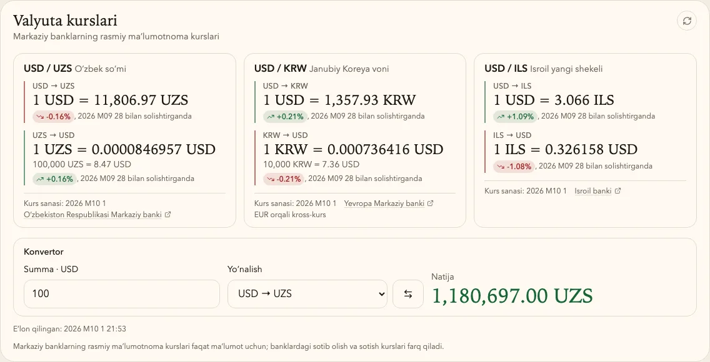

**Konvertor** summani boshqa valyutaga oʻtkazadi. Summani yozing, yoʻnalishni tanlang yoki uni almashtirish uchun ⇄ tugmasidan foydalaning. **Aniq** yaxlitlanmagan qiymatni koʻrsatadi.

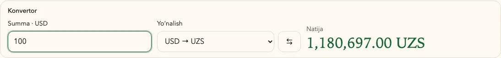

Bu kurslar faqat maʼlumot uchun; banklar boshqa kurslarda sotib oladi va sotadi. Ular jami summalaringizni hech qachon oʻzgartirmaydi. Kurslar brauzerda saqlanadi, shuning uchun internet boʻlmaganda ham oxirgi kurslar koʻrinib turadi.

## Pulni yozib borish

Menejer va administratorlar daromad va xarajatlarni **Daftar** sahifasida (**Tranzaksiyalar** menyu bandi) yozib boradi. Kuzatuvchilar uni oʻqiy oladi, lekin oʻzgartira olmaydi.

[Daftarni ochish](https://jaybi.uz/#/app/transactions)

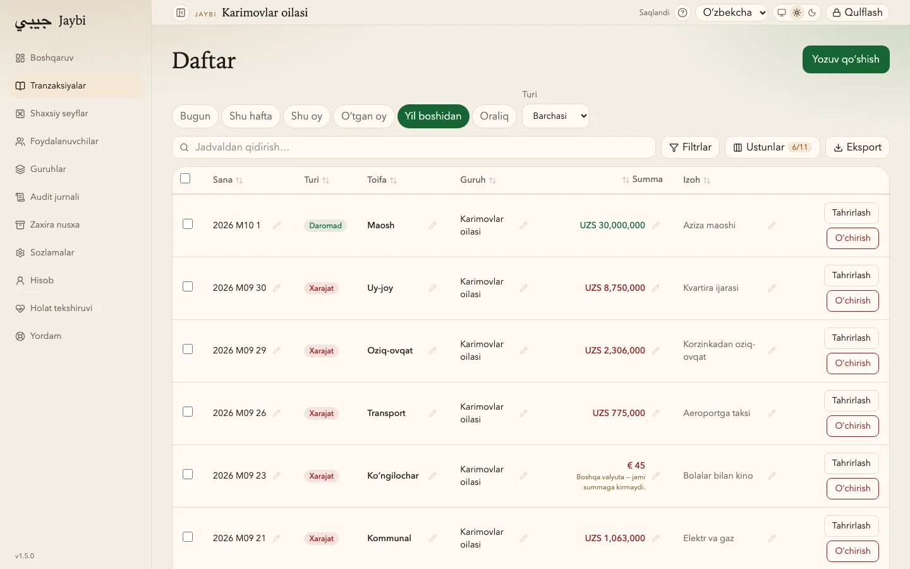

### Yozuv qoʻshish

1. **Yozuv qoʻshish** tugmasini bosing.
2. Shaklni toʻldiring (quyidagi jadvalga qarang).
3. **Saqlash** tugmasini bosing.

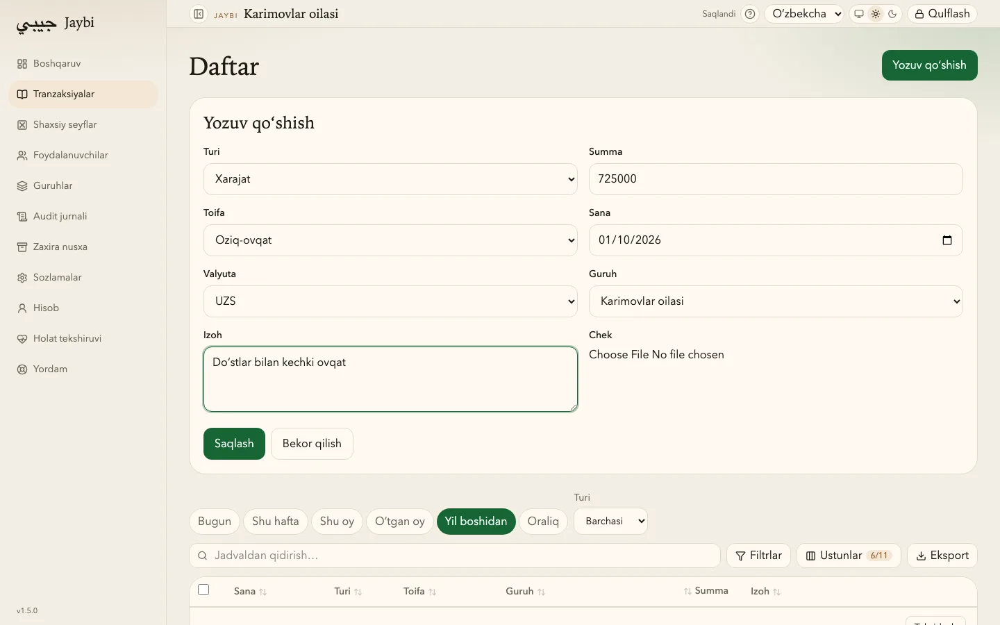

| Maydon | Nima kiritiladi |
| --- | --- |
| **Turi** | Daromad yoki Xarajat. Toifalar roʻyxati shunga mos oʻzgaradi. |
| **Summa** | Noldan katta son, masalan, `1250`, `1250.5` yoki `1 250,50`. Kasr belgisi sifatida nuqta ham, vergul ham ishlaydi. Jaybi hech qachon yaxlitlamaydi: valyutada boridan koʻproq kasr raqami yozsangiz, summani tuzatishni soʻraydi. |
| **Toifa** | Masalan, Maosh, Oziq-ovqat yoki Transport. Roʻyxatni administratorlar [Seyf sozlamalari](#settings) boʻlimida boshqaradi. |
| **Sana** | Oʻzgartirmasangiz, bugungi sana. |
| **Valyuta** | Oʻzgartirmasangiz, seyf valyutasi. [Valyutalar](#currencies) boʻlimiga qarang. |
| **Guruh** | Faqat bir nechta guruhni koʻra olsangiz chiqadi. |
| **Izoh** | Ixtiyoriy, 2 000 tagacha belgi. |
| **Chek** | Ixtiyoriy, 1,5 MB gacha PNG, JPEG, WebP yoki GIF rasm. **Chekni koʻrish** uni tekshirishga, **Chekni olib tashlash** esa olib tashlashga yordam beradi. |

### Oʻzgartirish va oʻchirish

Butun yozuvni oʻzgartirish uchun uning qatoridagi **Tahrirlash** tugmasini bosing, maydonlarni toʻgʻrilang va **Yozuvni yangilash** tugmasini bosing.

Tezkor tuzatish uchun sana, toifa, guruh, summa yoki izoh yonidagi kichik qalamchani bosing, yangi qiymatni yozing va Enter tugmasini bosing (Esc bekor qiladi). Qiymat qabul qilinmasa, sababi maydon ostida chiqadi va hech narsa oʻzgarmaydi.

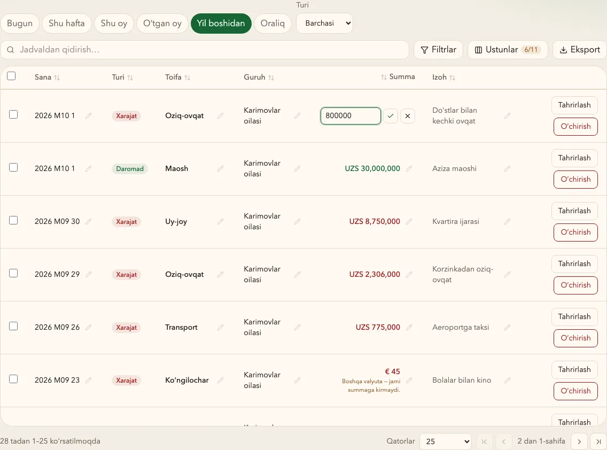

Oʻchirish uchun **Oʻchirish** tugmasini bosing va tasdiqlang. Bir nechta yozuvni oʻchirish uchun ularni belgilang va **Tanlanganlarni oʻchirish** tugmasini bosing. Oʻchirishni qaytarib boʻlmaydi, lekin har bir oʻchirish administratorning audit jurnaliga yoziladi.

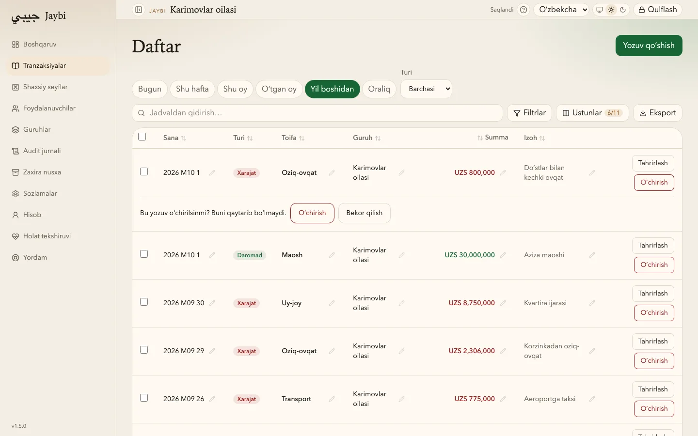

### Valyutalar

Har bir seyfning bitta asosiy valyutasi bor. Jami summalar va diagrammalar faqat shu valyutadagi yozuvlarni hisoblaydi. Boshqa valyutadagi yozuv saqlanadi va «Boshqa valyuta — jami summaga kirmaydi.» degan izoh bilan roʻyxatda koʻrsatiladi. Boshqaruv sahifasi bu summalarni alohida koʻrsatadi. Jaybi valyutalarni bir-biriga konvertatsiya qilmaydi.

## Jadvallar bilan ishlash

Daftar, odamlar roʻyxati, guruhlar, toifalar, shaxsiy seyf roʻyxatlari va audit jurnali — bularning barchasi bir xil ishlaydigan jadvallar.

- **Saralash**: ustun sarlavhasini bosing. Teskari tartib uchun uni yana bosing, asl tartibga qaytish uchun uchinchi marta bosing. Uchtagacha ustun boʻyicha saralash uchun Shift tugmasini bosib turing. Telefonda kartochkalar ustidagi **Saralash** tugmasidan foydalaning.
- **Jadvaldan qidirish**: koʻrib turgan narsangizning istalgan qismini yozing. Katta-kichik harflar, urgʻu belgilari, apostroflar va hatto alifbo ham ahamiyatsiz, shuning uchun `taksi` soʻzi «Такси»ni ham topadi. Esc qidiruvni tozalaydi.
- Pastdagi **Qatorlar**: 10, 25, 50, 100 yoki hammasi, yonida «140 tadan 1–25 koʻrsatilmoqda» kabi satr bilan.

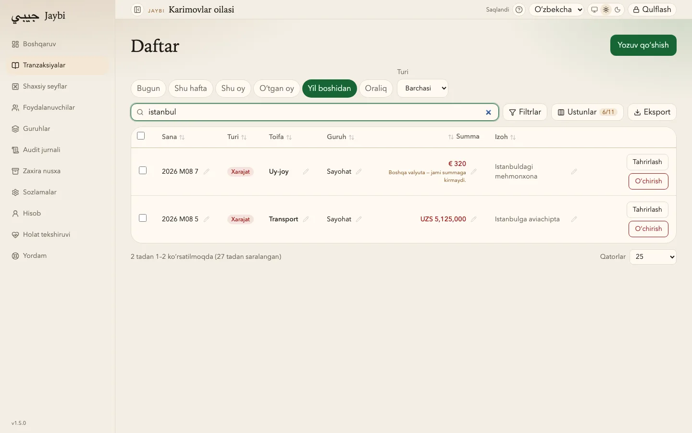

**Filtrlar** har bir ustun uchun bitta filtr ochadi: matn, belgilanadigan roʻyxat, Dan–Gacha sana oraligʻi yoki Min.–Maks. summa. Tugmada nechta filtr yoqilgani koʻrinadi; **Qidiruv va filtrlarni tozalash** ularni oʻchiradi.

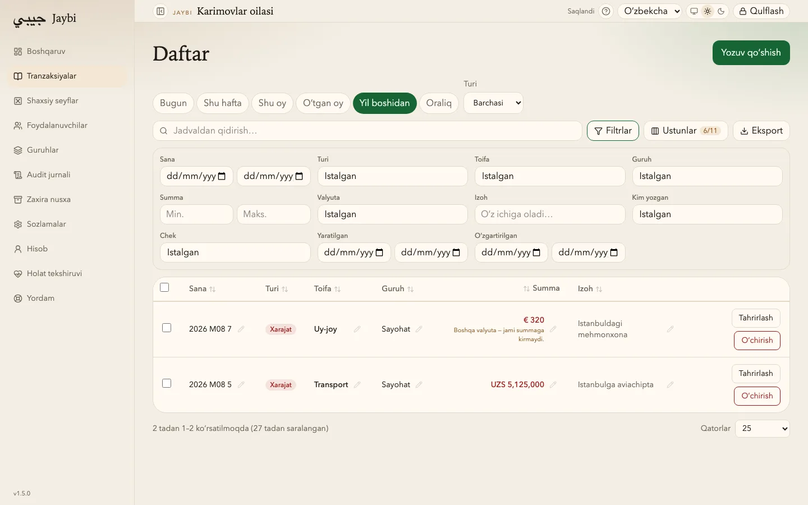

**Ustunlar** orqali ustunlarni koʻrsatish yoki yashirish, ularning oʻrnini almashtirish, ixcham qatorlarni tanlash yoki koʻrinishni tiklash mumkin. Jaybi har bir jadval koʻrinishini shu brauzerda eslab qoladi, lekin nimani qidirganingizni hech qachon eslab qolmaydi.

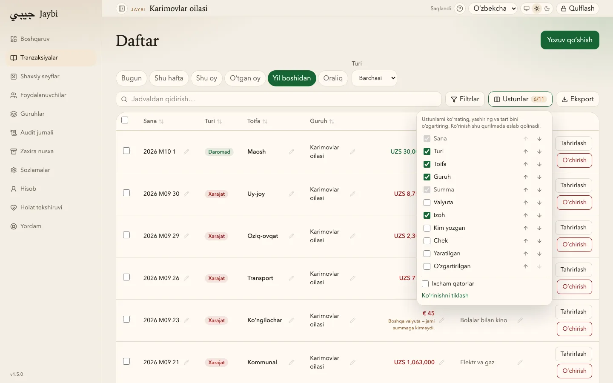

**Eksport** (faqat administratorlar uchun) aynan koʻrib turgan qator va ustunlaringizni CSV, Excel, PDF yoki boshqa formatlarda yuklab beradi. Fayl shifrlanmagani uchun Jaybi avval tasdiqlashingizni soʻraydi.

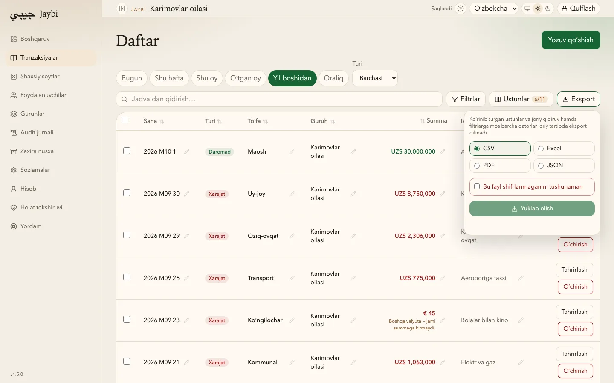

## Guruhlar

**Guruh** — seyfning oʻz yozuvlari va odamlari bor qismi, masalan, uy xoʻjaligi yonidagi oilaviy biznes. Har kim oʻz guruhini koʻradi; administratorlar hammasini koʻradi.

[Guruhlarni ochish](https://jaybi.uz/#/app/groups)

**Guruhlar** sahifasi tanlangan davr uchun har bir guruhning **Daromad**, **Xarajat** va **Sof natija** koʻrsatkichlarini tranzaksiyalar soni va eng soʻnggisining sanasi bilan birga koʻrsatadi. Har bir valyuta alohida qatorda boʻladi; valyutalar hech qachon bir-biriga qoʻshilmaydi. Ikki yoki undan ortiq guruh boʻlsa, administratorlar umumiy koʻrsatkichlar bilan **Barcha guruhlar** qatorini ham koʻradi.

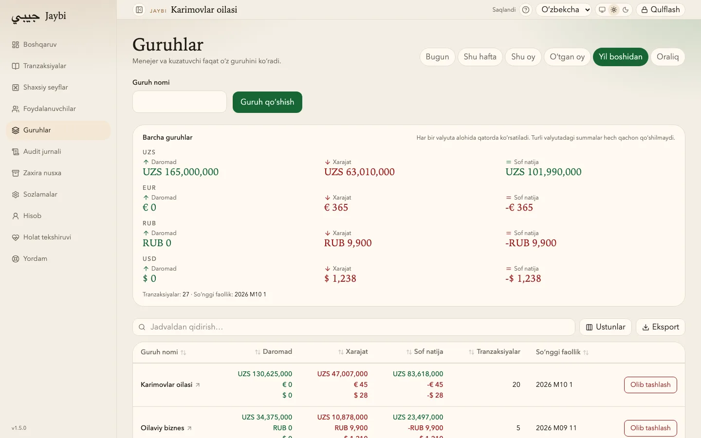

Guruh nomini bossangiz, daftar oʻsha davr uchun faqat shu guruh yozuvlari bilan ochiladi. Guruh filtri allaqachon oʻrnatilgan boʻladi; hammasini qayta koʻrish uchun **Qidiruv va filtrlarni tozalash** tugmasini bosing.

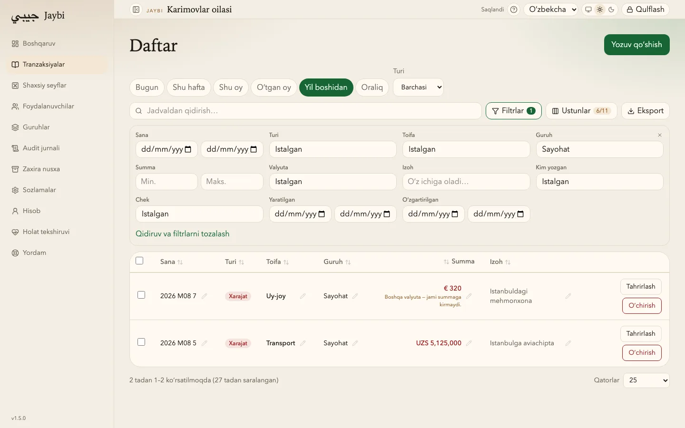

Administratorlar guruhni **Guruh nomi**ni yozib, **Guruh qoʻshish** tugmasini bosish orqali qoʻshadi. Guruhni faqat unda odamlar ham, yozuvlar ham boʻlmaganda olib tashlash mumkin.

## Odamlar va takliflar

Administratorlar seyfni kim ocha olishini **Odamlar** sahifasida (**Foydalanuvchilar** menyu bandi) boshqaradi. Har bir odam oʻsha bitta seyfni oʻz paroli bilan ochadi. Menejerlar ham bu sahifani koʻradi, lekin faqat oʻqish uchun va faqat oʻz guruhidagi odamlarni.

[Odamlar sahifasini ochish](https://jaybi.uz/#/app/users)

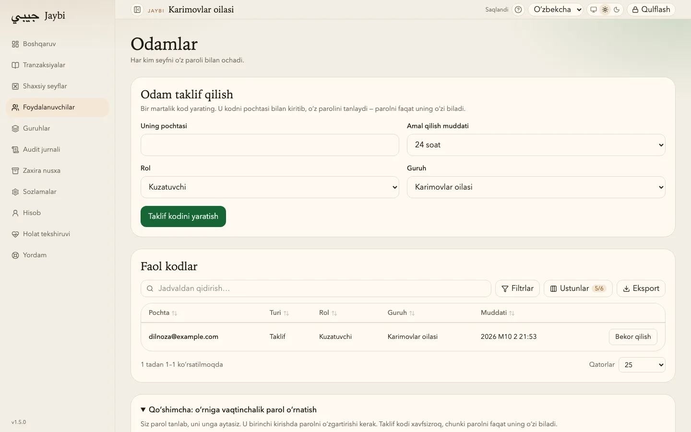

### Umumiy koʻrinish

Tepadagi **Umumiy koʻrinish** seyfda nechta odam borligini va 256 ta joydan nechtasi bandligini, jumladan faol kodlar uchun ajratilgan joylarni koʻrsatadi. Unda nechta faol odamda kirish tekshiruvi yoqilgani va kim **Eʼtibor talab qiladi**: parolini oʻzgartirishi kerak, kira olmaydi, guruhi yoʻq, toʻxtatilgan yoki hali eski parol nusxasi bor odamlar. Shuningdek, yaqinda kirganlar, faol kodlar va ularning muddati hamda ikkita kichik grafik — rollar va guruhlar boʻyicha odamlar koʻrinadi. Bu yerda hech qanday maxfiy narsa yoʻq: kodlar, parollar va kalitlar koʻrsatilmaydi.

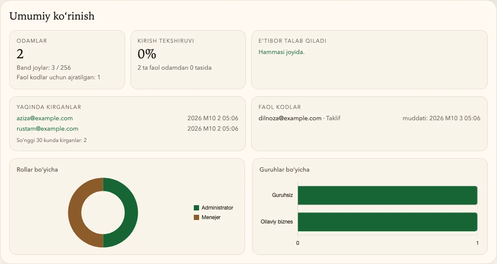

### Odamni taklif qilish (tavsiya etiladi)

1. **Foydalanuvchi qoʻshish** tugmasini bosing. **Taklif kodini yuborish** allaqachon tanlangan.
2. **Uning pochtasi**ni kiriting, kod qancha vaqt ishlashini **Amal qilish muddati** maydonida, soʻng **Rol** va **Guruh**ni tanlang.
3. **Taklif kodini yaratish** tugmasini bosing.
4. Jaybi kodni bir marta koʻrsatadi. **Kodni nusxalash** yoki **Havolani nusxalash** tugmasini bosing va kodni odamga shaxsan yoki ishonchli kanal orqali bering, soʻng **Tayyor** tugmasini bosing.

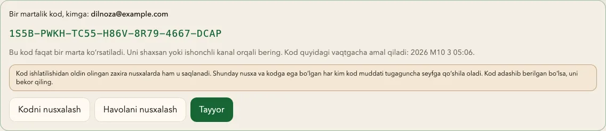

Shundan soʻng odam shu brauzerda [kod bilan qoʻshiladi](#joining) va oʻz parolini tanlaydi. U shunday qilmaguncha kod **Faol kodlar** roʻyxatida turadi, u yerda **Bekor qilish** tugmasi kodni bekor qiladi.

### Odamni vaqtinchalik parol bilan qoʻshish

**Foydalanuvchi qoʻshish**, soʻng **Vaqtinchalik parol oʻrnatish** tugmasini bosing. Pochta, xohlasangiz ism, vaqtinchalik parol, rol va guruhni kiriting va **Foydalanuvchi qoʻshish** tugmasini bosing. Odam birinchi kirishda parolni almashtirishi kerak. Taklif kodi xavfsizroq, chunki unda parolni faqat uning oʻzi biladi.

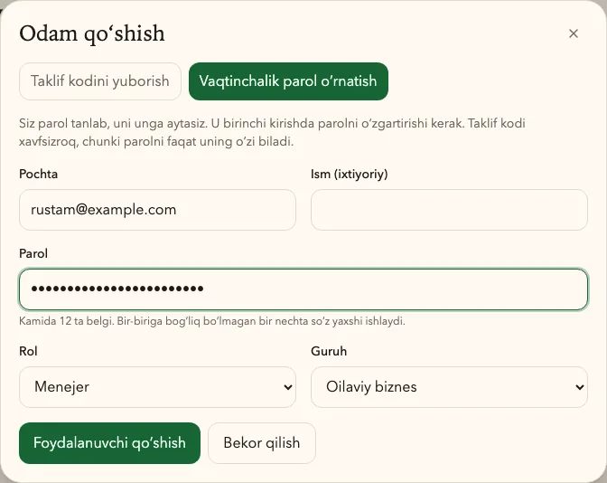

### Odamning sahifasi

Roʻyxatda odamning pochtasini yoki uning qatoridagi **Ochish** tugmasini bosing. Uning sahifasida profil, rol va guruh, qachon qoʻshilgani va oxirgi marta qachon kirgani, kirish tekshiruvi yoqilganmi va parolini oʻzgartirishi kerakmi, har bir valyutada kiritgan yozuvlari, administratorlar uchun esa audit jurnalidagi soʻnggi yozuvlari koʻrinadi.

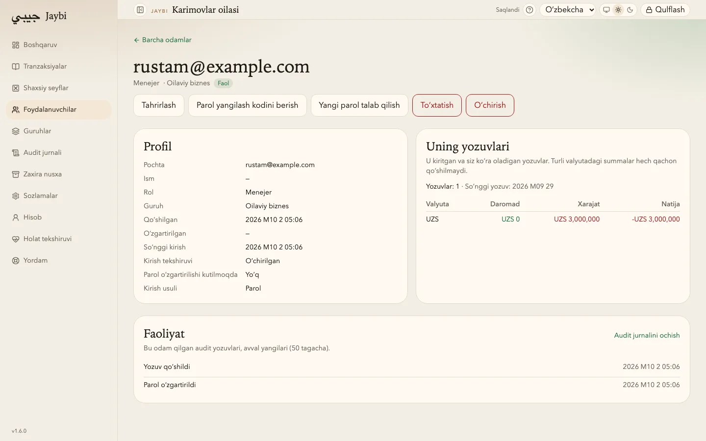

Bu yerdan administrator quyidagilarni qila oladi:

- **Tahrirlash**: ism, pochta, rol va guruhni oʻzgartirish. Pochta oʻzgargandan keyin odam yangi pochta va joriy paroli bilan kiradi. Avval unga berilgan faol kodni bekor qiling.
- **Parol yangilash kodini berish**, [quyida](#reset-for-someone) aytilganidek.
- **Kirish tekshiruvini oʻchirish** — autentifikatorini ham, tiklash kodlarini ham yoʻqotgan odam uchun.
- **Yangi parol talab qilish**: keyingi kirishda u yangi parol tanlashi kerak boʻladi va ungacha boshqa hech narsa qila olmaydi.
- **Toʻxtatish**: siz uni **Qayta faollashtirish**ingizgacha u kira olmaydi, yozuvlari, shaxsiy seyflari va tarixi esa saqlanadi. Qayta faollashtirilganda u parol yangilash kodini oladi. Toʻxtatishdan oldin saqlangan seyf fayli nusxasi uning eski paroli bilan ochilaveradi, chunki seyf kaliti oʻzgarmaydi.
- **Oʻchirish**: tasdiqlash uchun uning pochtasini yozing. Agar u yozuvlar kiritgan boʻlsa, ularni boshqa odamga oʻtkazing yoki sobiq aʼzo sifatida shu odam nomida qoldiring. Oʻchirish uning shaxsiy seyflarini butunlay yoʻq qiladi. Audit jurnalida ismi har qanday holatda saqlanadi.

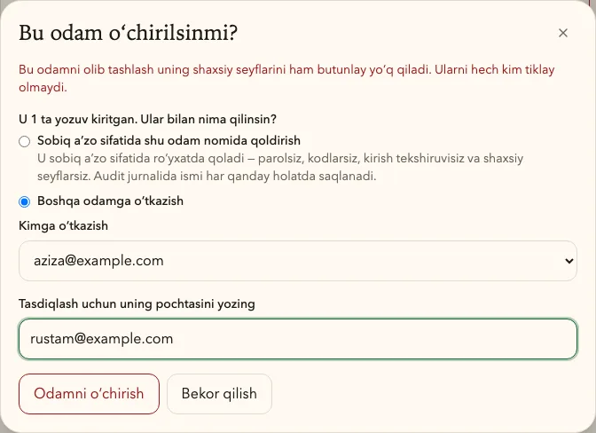

Oʻzingizni toʻxtata yoki oʻchira olmaysiz, seyfda esa doim kamida bitta faol administrator qoladi. Har bir oʻzgarish audit jurnaliga yoziladi.

### Bir nechta odamni birdaniga oʻzgartirish

Roʻyxatda odamlarni belgilang, yangi **Rol**, yangi **Guruh** yoki ikkalasini tanlang, **Tanlanganlarga qoʻllash** tugmasini bosing va tasdiqlang. Har bir odamning oʻzgarishi audit jurnaliga alohida yoziladi. Sobiq aʼzolar oʻtkazib yuboriladi.

### Boshqa odamning parolini yangilash

Odamning qatorida yoki sahifasida **Parol yangilash kodini berish** tugmasini bosing, kod qancha vaqt ishlashini tanlang va **Uning joriy parolini hoziroq bekor qilish** kerakmi-yoʻqmi, hal qiling (parolni boshqa kimdir bilishi mumkin boʻlsa, shuni tanlang). **Parol yangilash kodini berish** tugmasini yana bosing va kodni unga bering. Qatordagi **Oʻrniga vaqtinchalik parol oʻrnatish** — eskiroq usul.

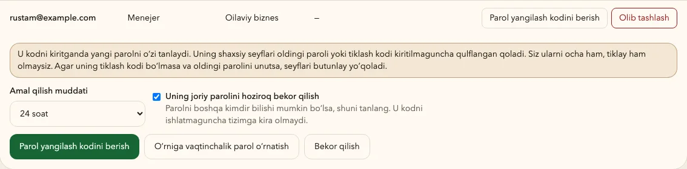

Parolni yangilashdan oldin sariq ogohlantirishni oʻqing: uning shaxsiy seyflari oldingi paroli yoki tiklash kodi kiritilmaguncha qulflangan qoladi. Siz hech kimning seyflarini ocha ham, tiklay ham olmaysiz.

### Kodlar uchun soat tekshiruvi

Agar bu qurilmaning soati seyf koʻrgan eng soʻnggi vaqtdan orqada boʻlsa, kodlar rad etiladi, shuning uchun soatni orqaga surish muddati oʻtgan kodni qayta tiriltirmaydi. Agar notoʻgʻri soat bu vaqtni kelajakka surib yuborgan boʻlsa, soatni toʻgʻrilang, **Kodlar uchun soat tekshiruvi**ni oching, parolingizni kiriting va **Joriy vaqtga qaytarish** tugmasini bosing.

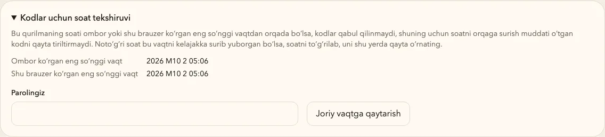

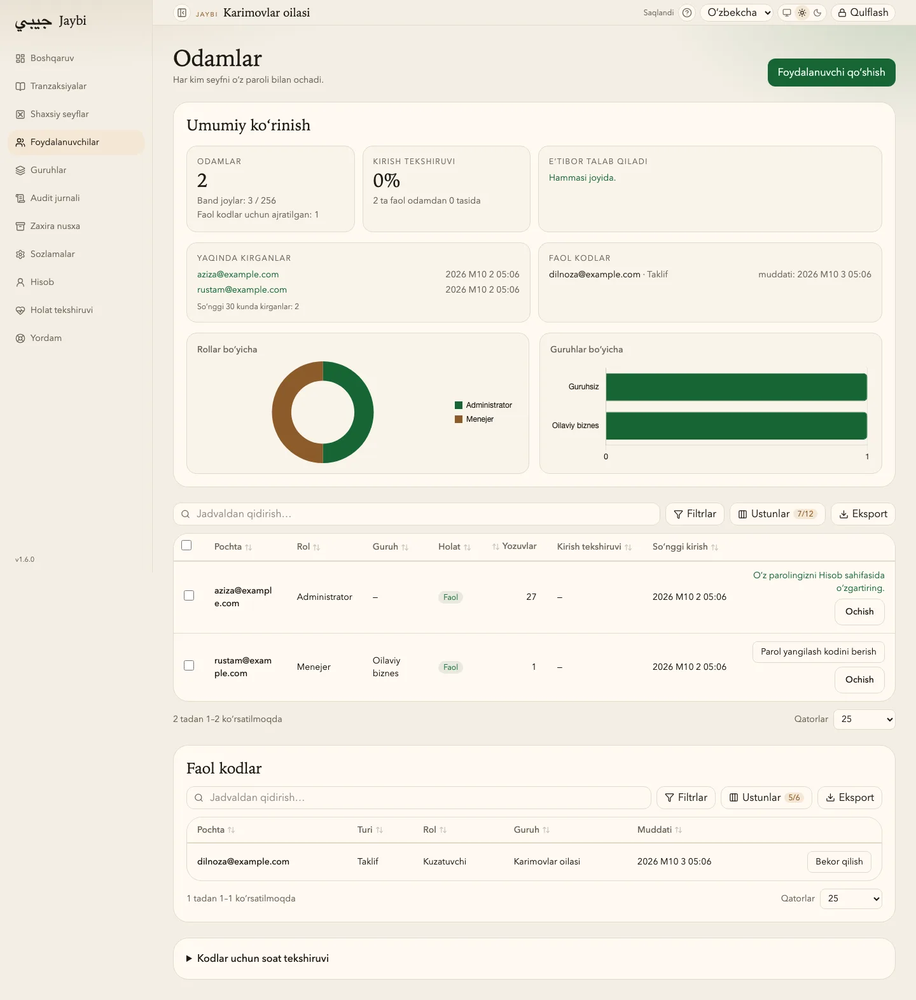

## Shaxsiy seyflar

Shaxsiy seyf — faqat oʻzingiz uchun saqlaydigan narsalaringiz joyi: toʻlov kartalari, obunalar va qaydlar. Bu pul hisobi emas; undagi hech narsa boshqaruv sahifasida yoki daftarda koʻrinmaydi.

Seyflaringizni faqat siz ocha olasiz. Administratorlar ularni ham, ularning nomlarini ham koʻra olmaydi va hatto zaxira nusxa bilan ham ularni ocha yoki tiklay olmaydi. Seyfdan foydalanadigan har bir odamning oʻz shaxsiy seyflari bor.

[Shaxsiy seyflarni ochish](https://jaybi.uz/#/app/safes)

### Sozlash

1. **Shaxsiy seyflar** boʻlimini oching va **Parolingiz** maydoniga parolingizni kiriting.
2. **Tiklash kodini yaratish (tavsiya etiladi)** yoki **Hozircha oʻtkazib yuborish** variantini tanlang.
3. **Seyflarimni yaratish** tugmasini bosing.

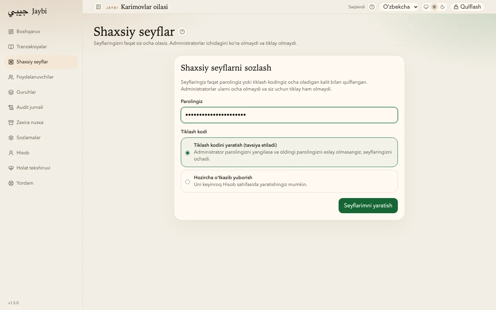

Tiklash kodini tanlagan boʻlsangiz, Jaybi uni bir marta koʻrsatadi. Uni yozib oling yoki chop eting, bu qurilmadan uzoqda saqlang va tasdiqlash uchun uning oxirgi 4 belgisini kiriting.

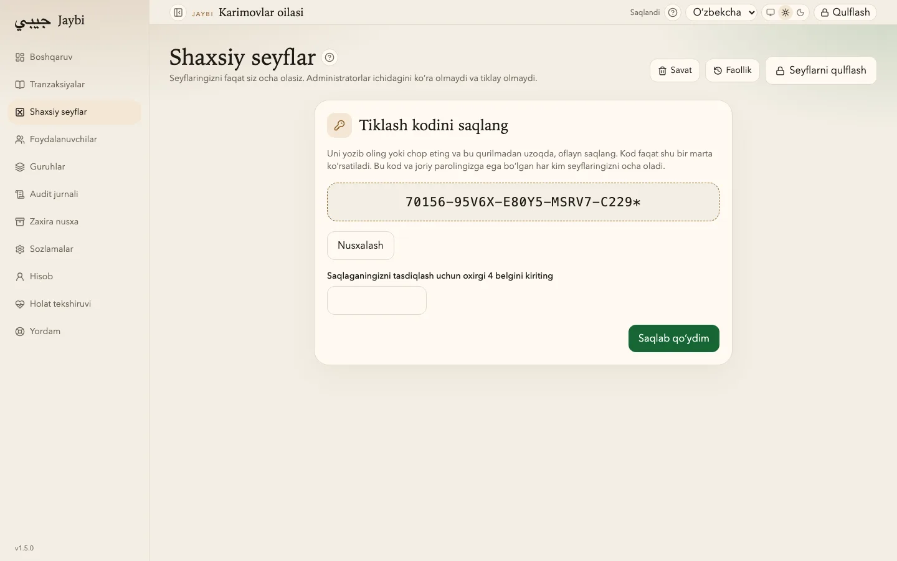

Sizda **Shaxsiy** nomli bitta boʻsh seyf paydo boʻladi.

### Tiklash kodi nega muhim

Tiklash kodi bitta holatda muhim: administrator parolingizni yangilaydi, siz esa oldingi parolingizni eslay olmaysiz. Kod boʻlmasa, bunday holatda seyflaringiz butunlay yoʻqoladi. Uni keyinroq **Hisob → Tiklash kodi** boʻlimida yaratishingiz yoki almashtirishingiz mumkin. Uni parolingiz kabi sir tuting.

### Kartalar

Seyfni oching va **Karta qoʻshish** tugmasini bosing. Nomi, karta raqami, karta egasining ismi, amal qilish muddati, bank va izohni kiriting. Jaybi toʻlov tizimini raqamdan aniqlaydi va nazorat raqamini tekshiradi. **Xavfsizlik kodi (CVV)** ixtiyoriy va **Xavfsizlik kodini qoʻshish** ortida yashiringan; banklar uni saqlamaslikni maslahat beradi. PIN-kod uchun joy yoʻq: PIN-kodni hech qachon, hech qayerda saqlamang.

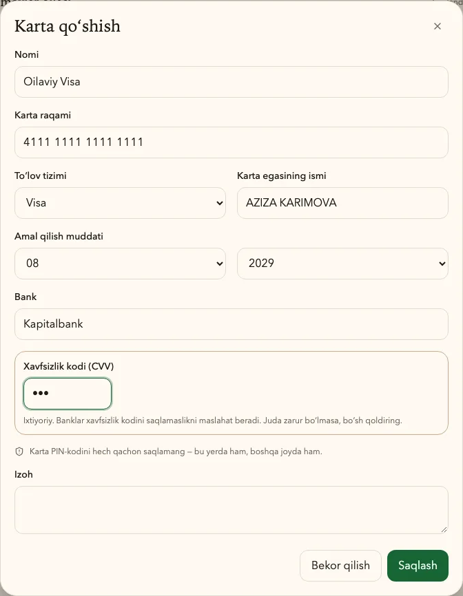

Karta raqamlari faqat oxirgi toʻrt raqami bilan koʻrsatiladi.

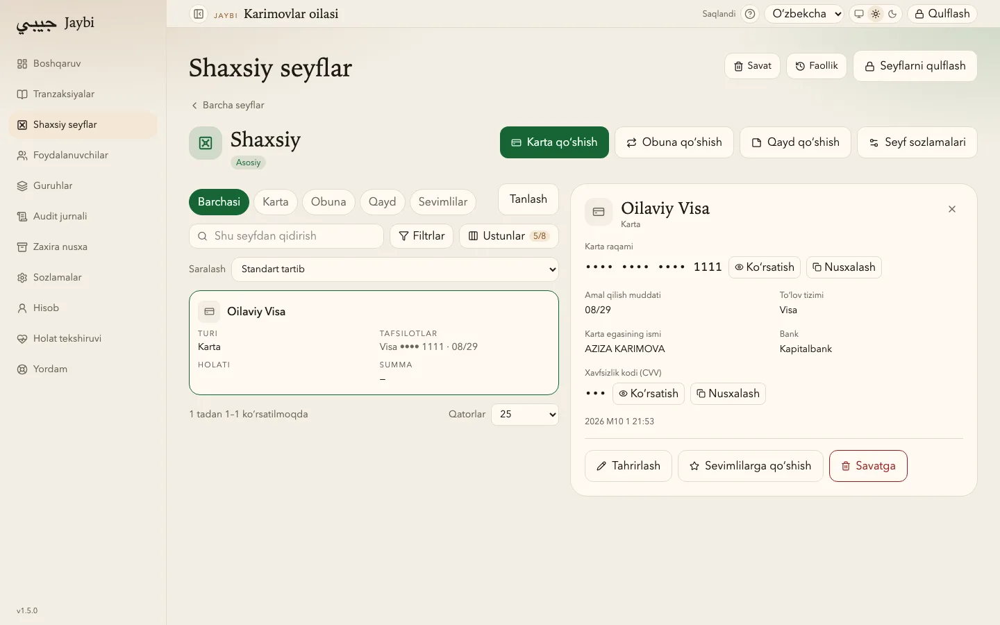

**Koʻrsatish** va **Nusxalash** soʻnggi 2 daqiqada parol kiritmagan boʻlsangiz, parolingizni soʻraydi. Koʻrsatilgan qiymat 15 soniyadan keyin yana yashiriladi; nusxalangan qiymat 30 soniyadan keyin buferdan tozalanadi. Ikkala vaqtni **Hisob** sahifasida oʻzgartirishingiz mumkin.

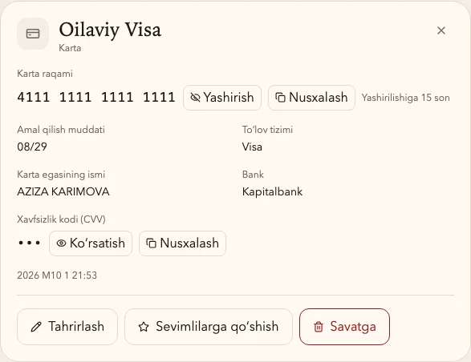

### Obunalar

**Obuna qoʻshish** tugmasini bosing va xizmat, narx va valyuta, toʻlov davri, toʻlov sanasi va holatini kiriting. Shuningdek, toʻlov qilinadigan kartani, saytni, hisobni, eslatma va izohni ham qoʻshishingiz mumkin.

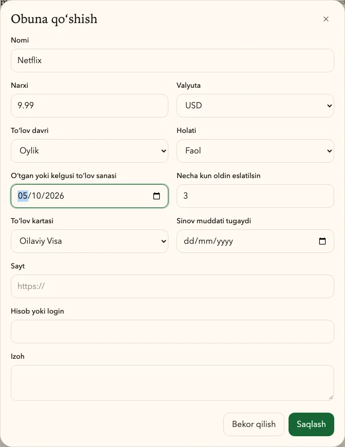

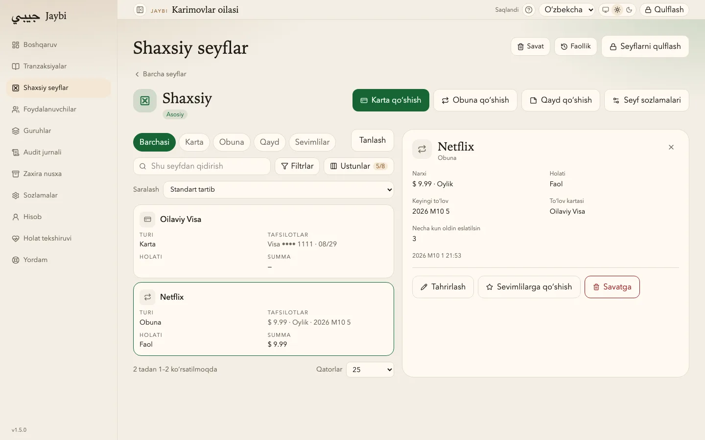

### Qaydlar

Boshqa har qanday narsa uchun **Qayd qoʻshish** tugmasini bosing: 10 000 tagacha belgili oddiy matn, masalan, Wi-Fi paroli. Tez-tez ishlatadigan narsalarni **Sevimlilarga qoʻshish** bilan belgilang.

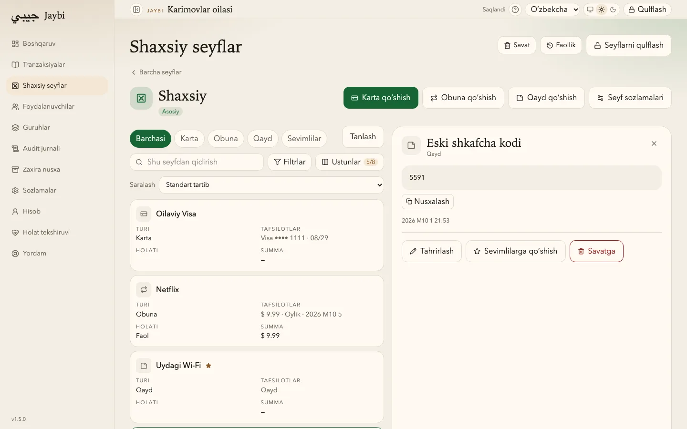

### Koʻproq seyflar

Yangi seyf qoʻshish uchun **Yangi seyf** tugmasini bosing va uning nomi, tavsifi, belgisi va rangini tanlang. Siz soʻramaguningizcha yopiq turishi kerak boʻlgan seyf uchun **Bu seyf har safar ochilganda parolim soʻralsin** katagini belgilang.

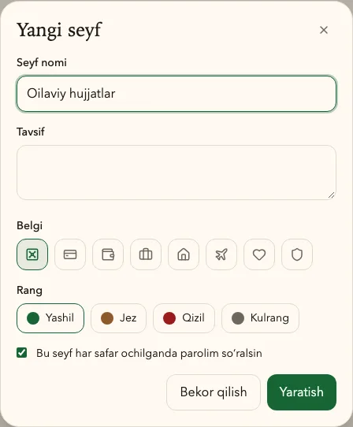

Seyflar sahifasida seyflaringiz, faol obunalaringiz oyiga va yiliga qanchaga tushishi, **Yaqin toʻlovlar (30 kun)**, muddati tez orada tugaydigan kartalar va sevimlilaringiz koʻrsatiladi. **Ochiq seyflardan qidirish** barcha ochiq seyflardan qidiradi.

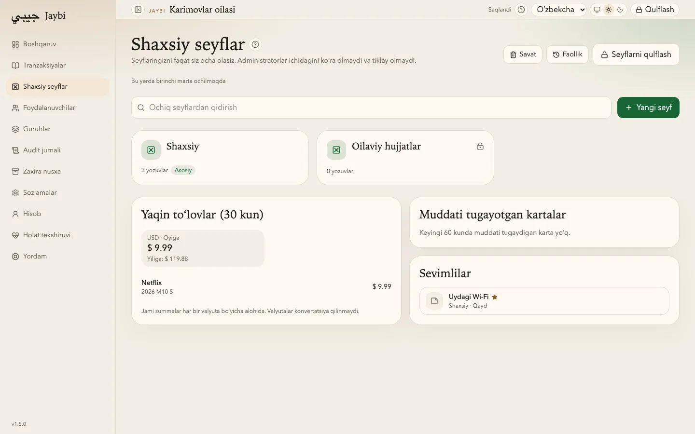

Parol soʻraydigan seyf ichidagilar oʻrniga parol maydonini koʻrsatadi.

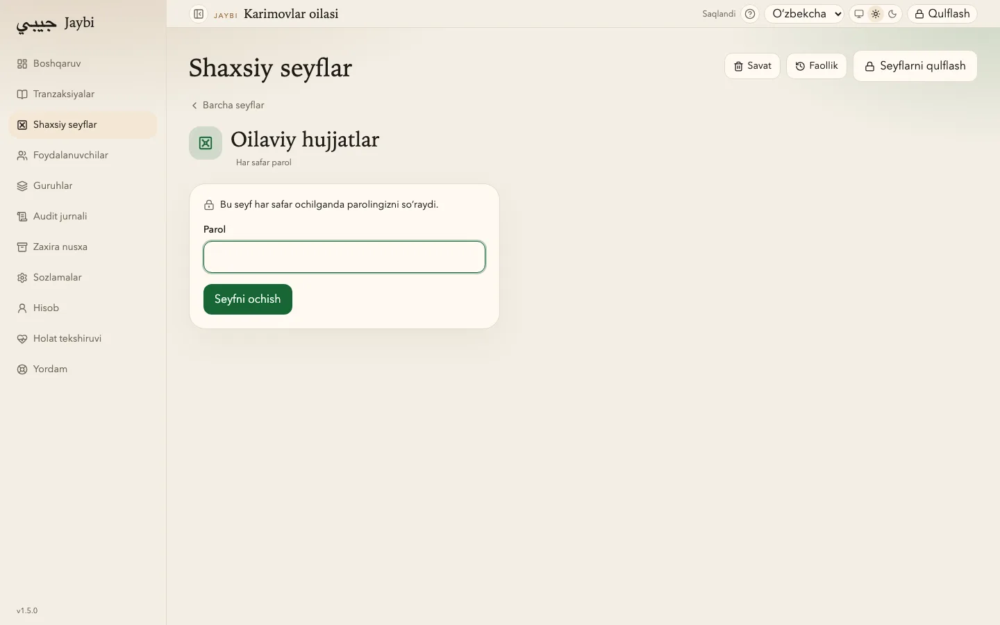

**Seyf sozlamalari**da seyfni asosiy qilish, arxivlash, uning shifrlash kalitini almashtirish yoki uni oʻchirish ham mumkin.

### Seyflarni ochish va qulflash

Tizimga kirish seyflaringizni ochmaydi. **Seyflarni ochish** tugmasini bosing va parolingizni yana kiriting. Jaybi seyflaringiz qachon ochilganini **Oldingi ochilish** ostida koʻrsatadi; agar bu vaqt sizga tanish boʻlmasa, parolingizdan boshqa kimdir foydalangan boʻlishi mumkin.

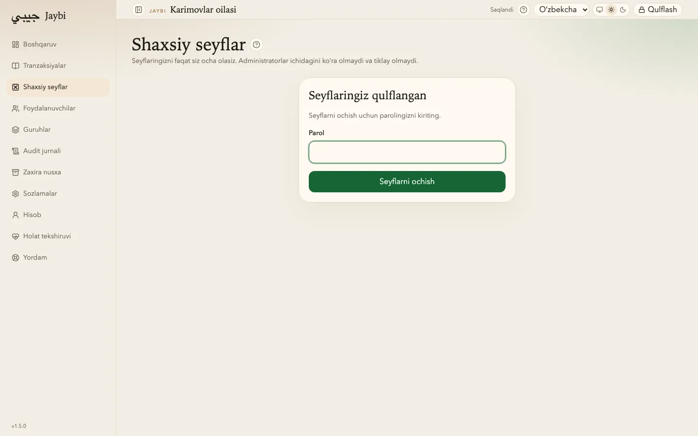

Seyflar siz ishlayotganingizda ochiq turadi va **Seyflarni qulflash** tugmasini bosganingizda yoki butun seyf qulflanganda yana qulflanadi.

### Savat va Faollik

Oʻchirilgan seyflar va yozuvlar 30 kunga **Savat**ga tushadi. **Tiklash** ularni qaytaradi; **Butunlay oʻchirish** ularni darhol yoʻq qiladi.

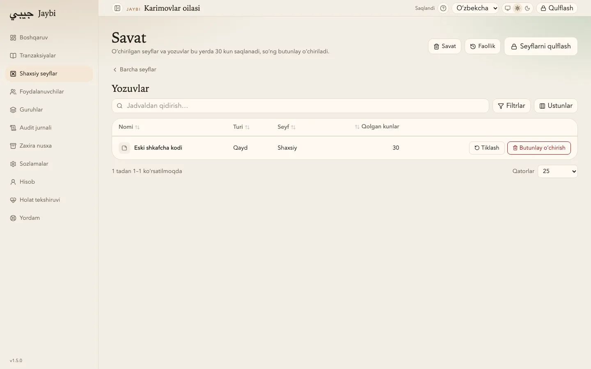

**Faollik** seyflaringizda nima va qachon boʻlganini koʻrsatadi: ochildi, qoʻshildi, oʻzgartirildi, koʻchirildi, oʻchirildi yoki tiklandi. Uni faqat siz oʻqiy olasiz.

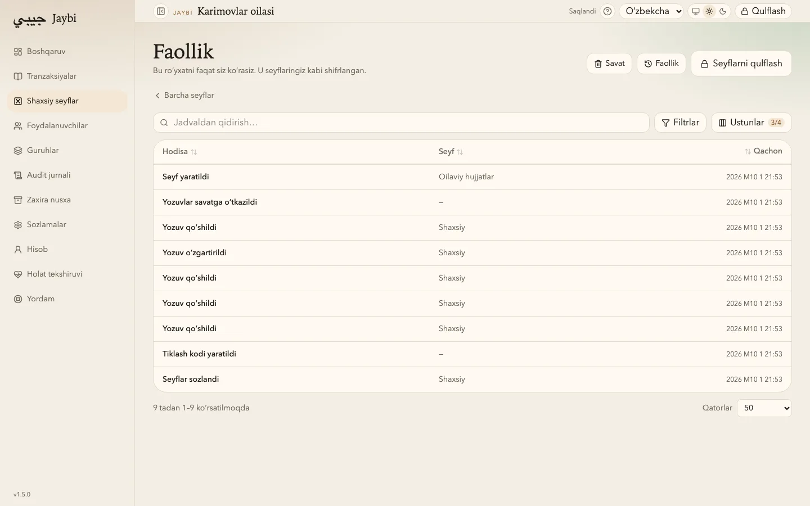

### Administrator parolingizni yangilagandan keyin

1. Parol yangilash kodi bilan yangi parol oʻrnating (yoki vaqtinchalik parol bilan kirib, yangisini tanlang).
2. **Shaxsiy seyflar** boʻlimini oching. Jaybi seyflar oxirgi marta ochilgandan beri parolingiz oʻzgarganini aytadi.
3. **Oldingi parol**ni, yaʼni parol yangilanishidan oldin oʻzingiz tanlagan parolni kiriting yoki tiklash kodidan foydalanishni tanlang. Joriy parolingizni ham kiriting.
4. Seyflaringiz ochiladi va bundan buyon ularni joriy parolingiz ochadi.

Administrator bergan vaqtinchalik parolni hech qachon oldingi parol sifatida yozmang. Agar oldingi parolingizni ham, tiklash kodingizni ham eslay olmasangiz, seyflaringizni hech kim ocha olmaydi; **Hisob → Qaytadan boshlash → Shaxsiy seyflarni noldan boshlash** sizga yangi, boʻsh seyflar beradi.

## Zaxira nusxalar va boshqa qurilmaga koʻchish

Zaxira nusxani faqat administratorlar oladi. Zaxira nusxa — butun seyfning bitta `.moliya` faylidagi shifrlangan nusxasi. Uni seyfga tegishli istalgan parol ochadi va bu brauzer maʼlumotlari yoʻqolsa, u seyfni qaytarishning **yagona** yoʻli.

[Zaxira nusxa sahifasini ochish](https://jaybi.uz/#/app/backup)

Yozuvlar bor-u, hali zaxira nusxa olinmagan boʻlsa yoki oxirgisi 7 kundan eski boʻlsa, har bir sahifada eslatma chiqadi.

### Zaxira nusxani yuklab olish

1. **Zaxira nusxa** sahifasini oching.
2. **Nusxani yuklab olish** tugmasini bosing.
3. Faylni shu qurilmadan boshqa joyda saqlang: USB fleshkada, boshqa kompyuterda yoki bulutli xotirada. U shifrlangan holda qoladi.

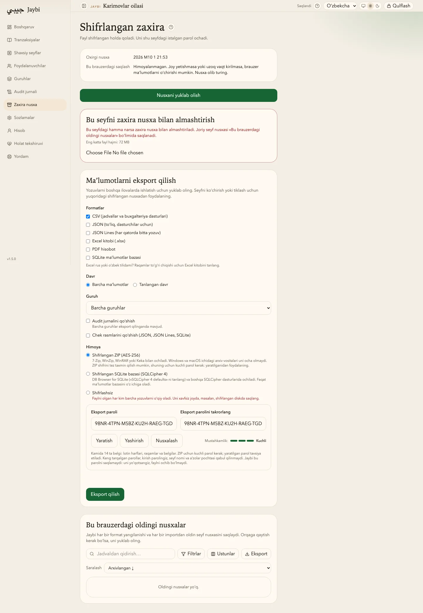

Sahifada **Bu brauzerdagi saqlash** holati ham koʻrsatiladi. «Himoyalanmagan» joy yetishmaganda brauzer maʼlumotlarni oʻchirib yuborishi mumkinligini bildiradi; [Holat tekshiruvi](#health) brauzerdan ularni saqlab qolishni soʻray oladi.

**Bu brauzerdagi oldingi nusxalar** Jaybi har bir format yangilanishi va har bir importdan oldin saqlaydigan nusxalarni koʻrsatadi. Orqaga qaytish kerak boʻlsa, ulardan birini yuklab oling.

### Boshqa ilovalar uchun maʼlumotlarni eksport qilish

**Maʼlumotlarni eksport qilish** yozuvlaringizni CSV, JSON, Excel, PDF hisobot yoki SQLite maʼlumotlar bazasi sifatida — barcha maʼlumotlar yoki tanlangan davr uchun, bitta yoki barcha guruhlar boʻyicha — yuklab beradi. Odatda fayl alohida eksport paroli bilan himoyalangan **Shifrlangan ZIP (AES-256)** boʻladi; kuchli parol uchun **Yaratish** tugmasidan foydalaning. Zaxira nusxa Jaybini tiklash uchun, eksport esa boshqa dasturlar uchun.

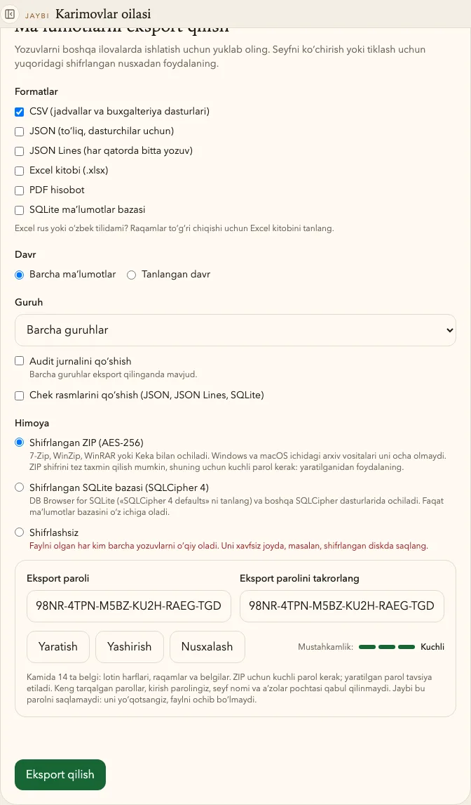

### Zaxira nusxani shu brauzerda tiklash

**Bu seyfni zaxira nusxa bilan almashtirish** ostida zaxira faylini tanlang, parolingizni kiriting va tasdiqlash uchun seyf nomini yozing, soʻng **Seyfni almashtirish** tugmasini bosing. Joriy seyf nusxasi **Bu brauzerdagi oldingi nusxalar** boʻlimida saqlanib qoladi.

Fayl tanlash maydoni ostida Jaybi **Bu qurilmada tiklash mumkin boʻlgan eng katta zaxira nusxa** hajmini va uni nima cheklashini koʻrsatadi: brauzerdagi boʻsh joy, qurilma xotirasi yoki har qanday brauzer ochishi mumkin boʻlgan eng katta hajm. 72 MB gacha boʻlgan zaxira nusxalar istalgan qurilmada tiklanadi. Nusxa kattaroq boʻlsa, Jaybi buni faylni oʻqishdan oldin aytadi va nima qilishni maslahat beradi: diskda joy boʻshatish yoki [“Holat tekshiruvi”](#health) sahifasida Jaybi maʼlumotlarini saqlashga ruxsat berish, boshqa varaqlar va ilovalarni yopish yoki nusxani xotirasi kattaroq kompyuterda tiklash. Yangi qurilmadagi seyf yaratish ekranida ham shunday.

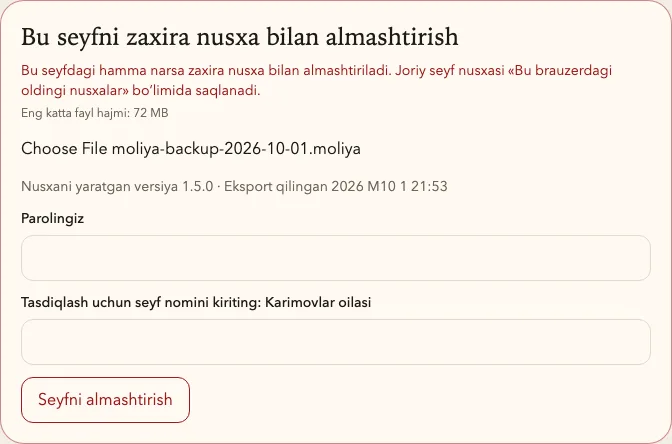

### Boshqa qurilmaga koʻchish

1. Eski qurilmada zaxira nusxani yuklab oling.
2. Yangi qurilmada [https://jaybi.uz](https://jaybi.uz) saytini oching. U **Seyf yarating** ekranini koʻrsatadi: uni toʻldirmang.
3. **Yoki zaxira nusxani import qiling** ostida zaxira faylini tanlang va **Seyfni almashtirish** tugmasini bosing.
4. Odatdagi pochta va parolingiz bilan tizimga kiring.

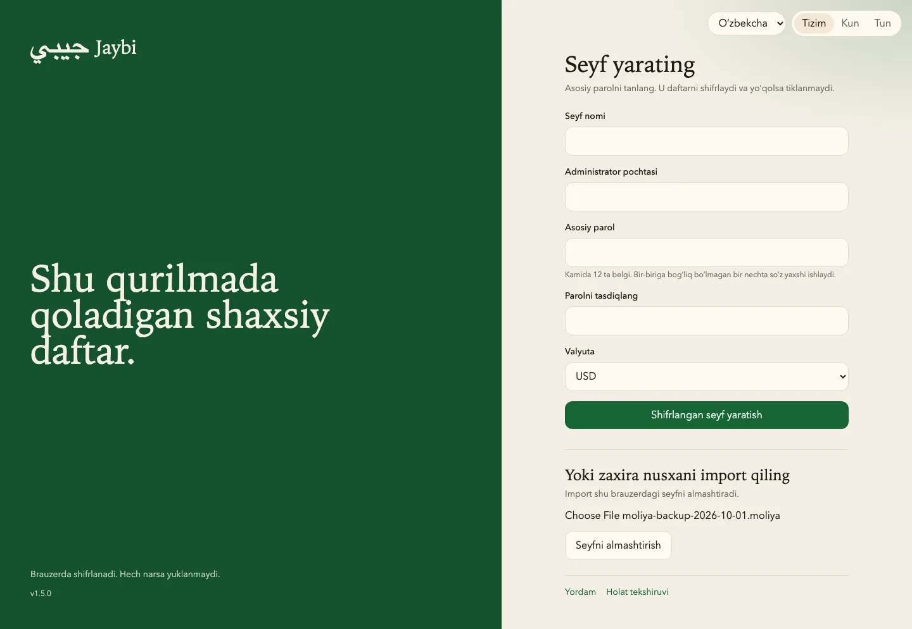

Seyfdagi har bir odam yangi qurilmada oʻz paroli bilan kira oladi. Seyf sinxronlanmaydi: koʻchgandan keyin faqat yangi qurilmadan foydalaning yoki seyfni xuddi shu usulda qaytarib koʻchiring.

## Seyf sozlamalari

Administratorlar butun seyf uchun parametrlarni **Sozlamalar** sahifasida oʻzgartiradi.

[Sozlamalarni ochish](https://jaybi.uz/#/app/settings)

- **Seyf nomi** va **Seyf valyutasi**, soʻng **Sozlamalarni saqlash**. Jami summalar faqat seyf valyutasidagi yozuvlarni hisoblaydi.
- **Toifalar**: daromad va xarajat toifalarini har bir tildagi nomi bilan qoʻshish, qayta nomlash yoki olib tashlash. Boʻsh tarjima oʻrniga inglizcha nom ishlatiladi. Yozuvlarda ishlatilgan toifani olib tashlab boʻlmaydi.
- **Versiya haqida**: ilova versiyasi, yigʻma, maʼlumotlar formati va seyf qachon yaratilgani. Muammo haqida xabar berganda shularni aytib oʻting.

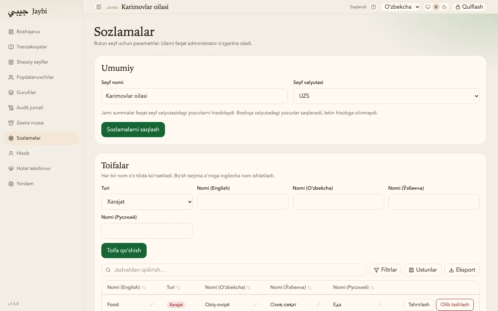

## Hisobingiz

Har kimda faqat oʻziga tegishli sozlamalar boʻlgan **Hisob** sahifasi bor.

[Hisob sahifasini ochish](https://jaybi.uz/#/app/account)

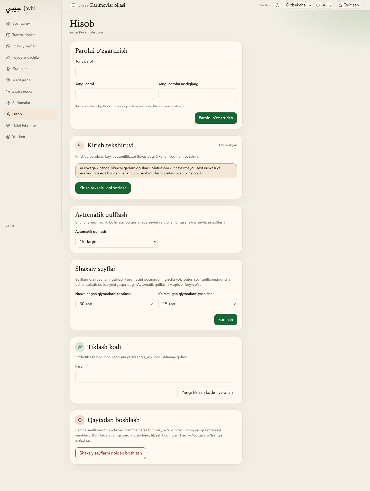

### Parolni oʻzgartirish

**Joriy parol**ni, soʻng **Yangi parol** va **Yangi parolni tasdiqlang** maydonlarini toʻldiring va **Parolni oʻzgartirish** tugmasini bosing. Shaxsiy seyflaringiz va kirish tekshiruvingiz ham shu zahoti yangi parolga oʻtadi.

Agar parolingizni administrator tanlagan boʻlsa, Jaybi hamma narsadan oldin yangisini tanlashni soʻraydi: shunday qilmaguningizcha har bir sahifa sizni **Hisob** sahifasiga olib boradi.

### Parol tanlash

Yangi parol 12 tadan 256 tagacha belgidan iborat boʻlishi, keng tarqalgan parol boʻlmasligi, pochtangiz yoki seyf nomidan tuzilmasligi va `qwertyuiop` kabi oddiy naqsh boʻlmasligi kerak. Bir-biriga bogʻliq boʻlmagan toʻrt-besh soʻz (xohlasangiz, boʻsh joylar bilan) eslab qolishga oson, taxmin qilishga esa qiyin. Boshqa saytdagi parolni qayta ishlatmang: seyf nusxalarini aynan parolingiz himoya qiladi.

### Kirish tekshiruvi (autentifikator ilovasi)

Kirish tekshiruvi paroldan keyin autentifikator ilovasidagi (Google Authenticator, Microsoft Authenticator, Aegis, 1Password va shunga oʻxshashlar) 6 xonali kodni soʻraydi. Kimdir parolingizni bilib olib, uni shu brauzerda sinab koʻrsa, u sizni himoya qiladi. U shifrlashni kuchaytirmaydi.

1. **Kirish tekshiruvini sozlash** tugmasini bosing.
2. QR kodni ilovangiz bilan skanerlang yoki **Sozlash kaliti**ni qoʻlda kiriting.
3. **Ilovadagi kod** va **Parolingiz** maydonlarini toʻldiring, soʻng **Tasdiqlash va yoqish** tugmasini bosing.
4. Jaybi 10 ta tiklash kodini (**Tiklash kodlari**) koʻrsatadi. Telefoningizni yoʻqotsangiz, ularning har biri bir marta ishlaydi. **Kodlarni yuklab olish** tugmasini bosing yoki ularni yozib oling, bu qurilmadan uzoqda saqlang va **Kodlarni saqlab qoʻydim** tugmasini bosing.

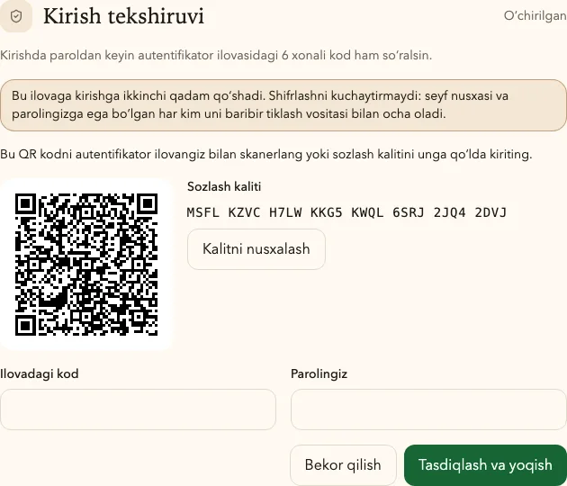

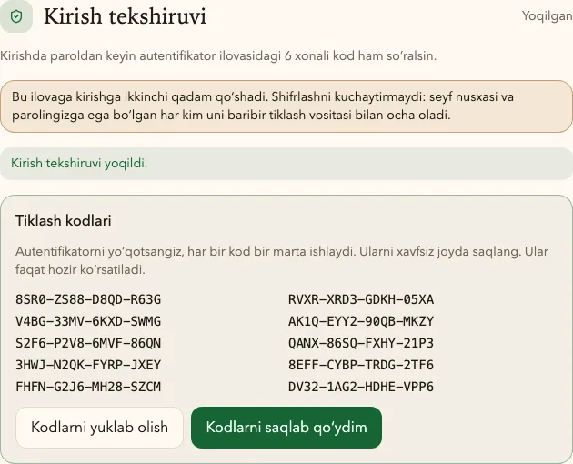

Uni oʻchirish uchun **Kirish tekshiruvini oʻchirish** tugmasini bosing va parolingizni kiriting. Yangi tiklash kodlarini olish uchun uni oʻchirib, qayta yoqing.

### Avtomatik qulflash va seyf taymerlari

**Avtomatik qulflash** shu qurilmada faollik boʻlmaganda seyf qancha vaqt ochiq turishini belgilaydi: 5 daqiqa, 15 daqiqa (odatiy), 30 daqiqa yoki 1 soat. **Shaxsiy seyflar** ostida nusxalangan qiymatlar buferda qancha turishini va koʻrsatilgan qiymatlar qancha vaqt koʻrinib turishini tanlaysiz.

## Audit jurnali

**Audit jurnali** kim nima va qachon qilganini koʻrsatadi: qoʻshilgan, oʻzgartirilgan va oʻchirilgan yozuvlar, qoʻshilgan yoki olib tashlangan odamlar, parol yangilashlar, zaxira nusxalar, eksportlar, sozlamalar va boshqalar. Uni faqat administratorlar koʻradi. Unda hech qachon summalar, izohlar yoki shaxsiy seyflar ichidagi narsalar koʻrsatilmaydi.

[Audit jurnalini ochish](https://jaybi.uz/#/app/audit)

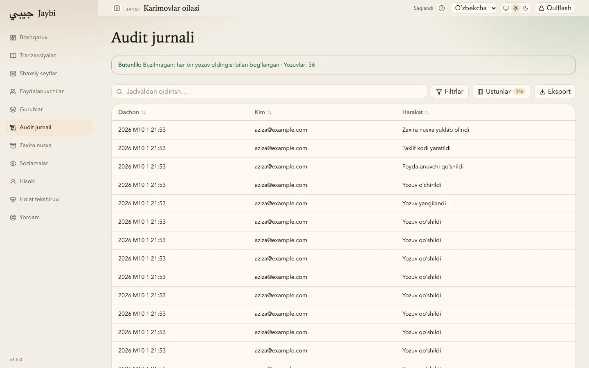

Har bir yozuv oʻzidan oldingisi bilan bogʻlangan. Ilovadan tashqarida hech narsa oʻzgartirilmagan boʻlsa, **Butunlik** qatorida «Buzilmagan: har bir yozuv oldingisi bilan bogʻlangan» deb yoziladi. Agar yozuvlar oʻzgartirilgan yoki oʻchirilgan boʻlsa, Jaybi har bir sahifada qizil chiziq koʻrsatadi va Holat tekshiruvi bu haqda xabar beradi. Agar bu oʻzgarishni kutgan boʻlsangiz, masalan, eskiroq zaxira nusxani import qilgandan keyin, **Jurnalni boricha qabul qilish** tugmasini bosing; aks holda yaqindagi zaxira nusxani tiklang va parollarni oʻzgartiring.

## Holat tekshiruvi

**Holat tekshiruvi** shu brauzerni, uning saqlash joyini, ilova versiyasini, seyfingizni va valyuta kurslarini koʻrib chiqadi hamda nima joyida va nima eʼtibor talab qilishini oddiy soʻzlar bilan tushuntiradi. Hammasi shu qurilmada bajariladi; hech narsa hech qayerga yuborilmaydi.

[Holat tekshiruvini oʻtkazish](https://jaybi.uz/#/app/health)

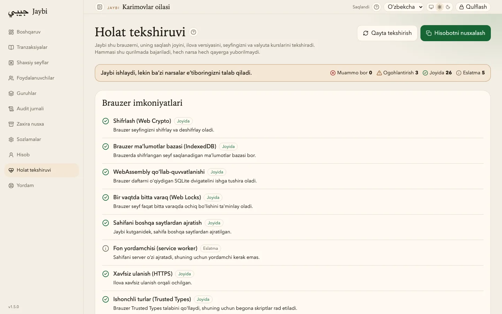

Har bir qator qisqa izoh bilan **Joyida**, **Ogohlantirish**, **Muammo bor** yoki **Eslatma** deb belgilanadi. Eʼtibor talab qiladigan qatorda **Qanday tuzatish mumkin** boʻlimi ham chiqadi va kerak boʻlganda **Maʼlumotlarni saqlashni soʻrash** yoki **“Zaxira nusxa” sahifasini ochish** kabi tugma ham boʻladi.

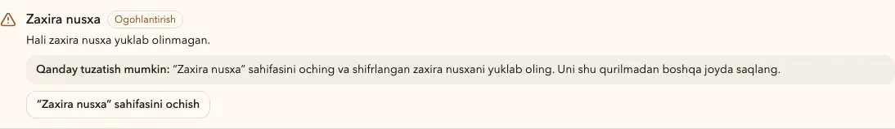

### Nimalar tekshiriladi

| Boʻlim | Tekshiruvlar |
| --- | --- |
| **Brauzer imkoniyatlari** | Shifrlash, brauzer maʼlumotlar bazasi, WebAssembly, bir vaqtda bitta varaq, sahifani ajratish, service worker, xavfsiz ulanish, Trusted Types, cookie va sayt maʼlumotlari, maxfiy oyna |
| **Saqlash joyi** | Saqlash joyiga yozish mumkinmi, boʻsh joy, joy kamayganda brauzer maʼlumotlarni saqlab qoladimi, kichik sozlamalar uchun joy, bu yerda seyf saqlanganmi, bu qurilmadagi eng katta seyf |
| **Ilova va versiya** | Yangiroq versiya chiqqanmi, yigʻma va kerak boʻlganda yuklanadigan sahifalar ishlayotgan versiyaga mosmi |
| **Seyf** | Maʼlumotlar formati, bu qurilma chegarasiga nisbatan seyf hajmi (kamida 48 MB), saqlash, zaxira nusxa qanchalik eskiligi, oldingi nusxalar, audit jurnalining butunligi, qurilma soati, kirish tekshiruvingiz, parolingiz va odamlar soni |
| **Valyuta kurslari** | Kurslar joriymi va nazorat yigʻindisiga mosmi |
| **Xavfsizlik** | Kontent xavfsizlik siyosati, boshqa sahifa ichida ishlamaslik va manzil |

**Faqat administrator uchun** deb belgilangan qatorlar faqat administratorlarga koʻrinadi: audit jurnali qatorlari, oldingi nusxalar, odamlar soni va **Hisoblar tartibi** — bu qator kimdir kira olmasa, kod muddati tugagan boʻlsa yoki eski parol nusxasi qolgan boʻlsa ogohlantiradi; unda faqat sonlar koʻrsatiladi. Administratorlar zaxira nusxa sanalari va soat belgilarini ham koʻradi. Boshqalar brauzer va oʻz hisobi haqidagi qisqaroq roʻyxatni koʻradi; zaxira nusxa qatori ularga faqat zaxira nusxalarni administrator olishini eslatadi.

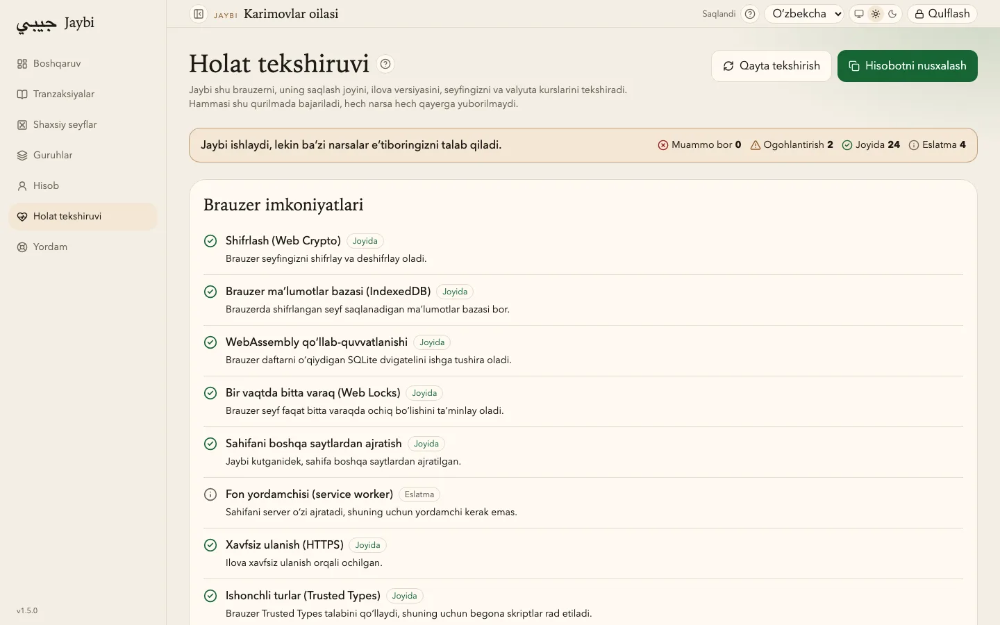

### Hisobot bilan boʻlishish

**Hisobotni nusxalash** sizga yordam beradigan odamga yoziladigan xabarga qoʻyish uchun oddiy matnli xulosani nusxalaydi. Unda versiyalar, hajmlar, sanalar va har bir tekshiruv natijasi boʻladi, parollar, kodlar, pochta manzillari, ismlar yoki summalar esa hech qachon boʻlmaydi. **Qayta tekshirish** biror narsani tuzatganingizdan keyin tekshiruvlarni takrorlaydi.

### Tizimga kira olmaganingizda

Kirish ekranidagi **Holat tekshiruvi** havolasi brauzer, saqlash joyi va versiya tekshiruvlarini tizimga kirmasdan bajaradi. Agar Jaybi umuman ishga tushmasa, xato ekrani ham xuddi shu tekshiruvni taklif qiladi.

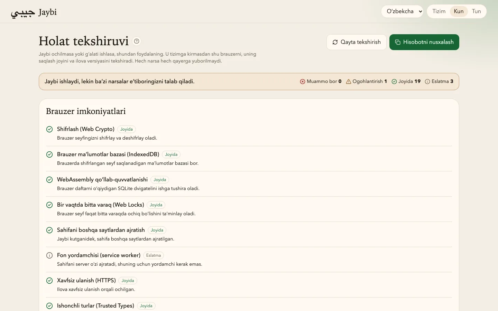

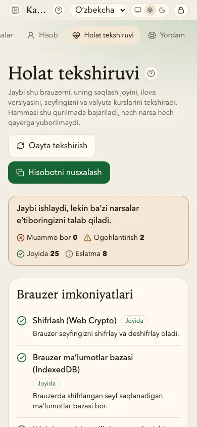

## Bu yordamdan foydalanish

Bu qoʻllanma Jaybi ichiga ham oʻrnatilgan. Menyudagi **Yordam** boʻlimini, yuqori paneldagi **?** tugmasini (u joriy sahifaga oid qismni ochadi) yoki kirish ekranidagi **Yordam** havolasini oching. Qoʻllanma siz tanlagan tilda koʻrsatiladi.

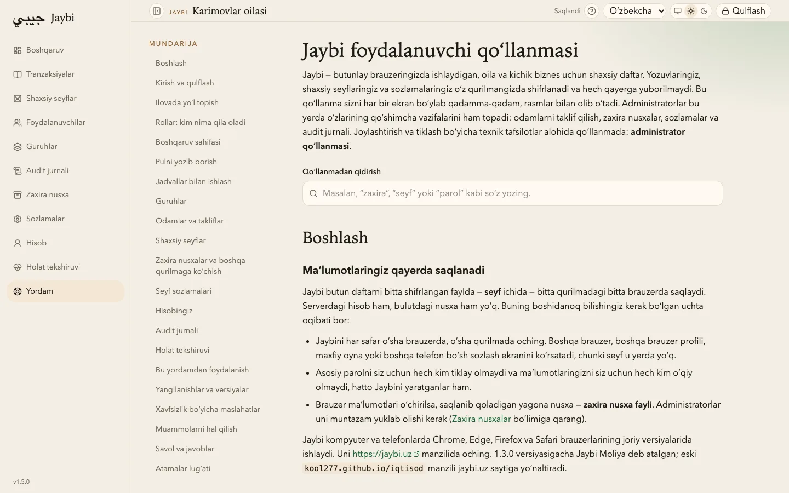

Tizimga kirishdan oldin **Yordam** xuddi shu qoʻllanmani alohida sahifada, kirish ekraniga qaytish havolasi bilan ochadi.

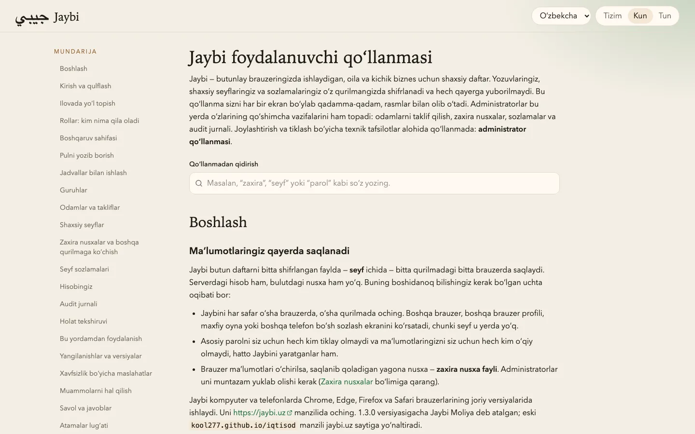

Faqat biror soʻz uchraydigan qismlarni koʻrsatish uchun **Qoʻllanmadan qidirish** maydoniga oʻsha soʻzni yozing. **Ochish** tugmalari sizni tasvirlanayotgan ekranga toʻgʻridan-toʻgʻri olib boradi.

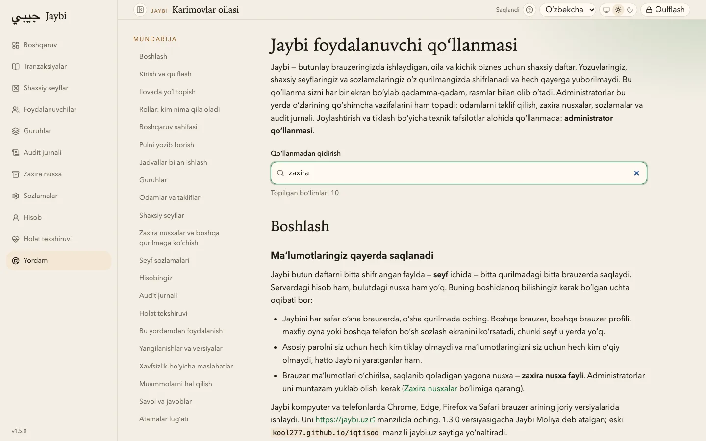

## Yangilanishlar va versiyalar

Jaybining yangi versiyasi chiqqanda **Jaybining yangi versiyasi chiqdi.** degan chiziq paydo boʻladi. Qulay paytda **Yangilash** tugmasini bosing: ishingiz saqlanadi va avval seyf qulflanadi, shuning uchun keyin qayta kiring. Yangilanishdan keyingi birinchi kirish Jaybi maʼlumotlarni yangilayotgani uchun bir necha soniya uzoqroq davom etishi mumkin. Bu bir marta boʻladi.

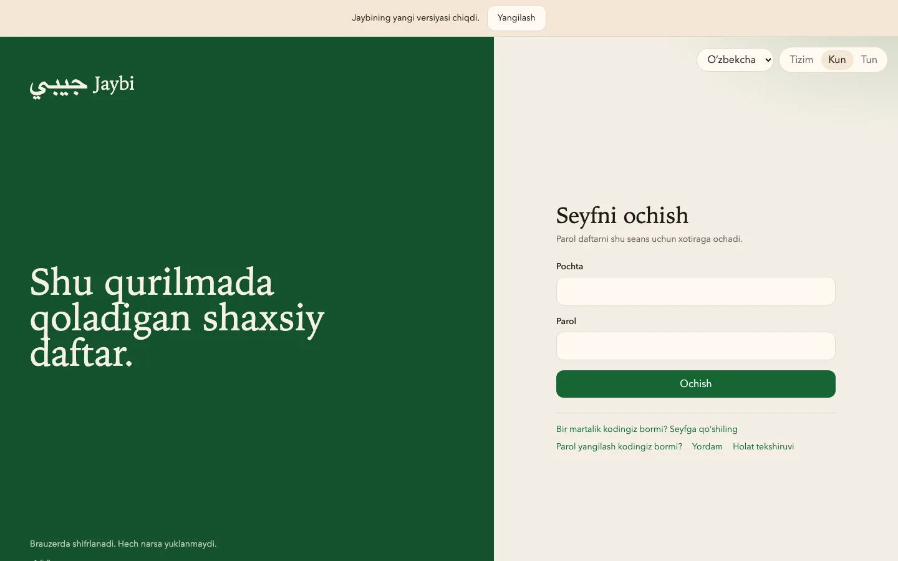

Foydalanayotgan versiyangiz menyuning pastida, kirish ekranida va Holat tekshiruvida koʻrsatiladi. Muammo haqida xabar berganda uni aytib oʻting.

## Xavfsizlik boʻyicha maslahatlar

- Boshqa hech qayerda ishlatmaydigan uzun parol tanlang. Seyf nusxalarini faqat u himoya qiladi.
- Umumiy qurilmadan ketishdan oldin seyfni qulflang, shaxsiy seyflaringiz bilan ishingiz tugagach, ularni ham qulflang.
- Kirish tekshiruvini yoqing va tiklash kodlarini bu qurilmadan uzoqda saqlang.
- Administratorlar: zaxira nusxani kamida haftada bir marta yuklab oling va uni bu qurilmadan tashqarida saqlang.
- Bu saytning brauzer maʼlumotlarini tozalamang: bu seyfni brauzerdan oʻchirib yuboradi.
- Bir martalik kodlardan tezroq foydalaning va kodingizni boshqa kimdir koʻrgan boʻlishi mumkin boʻlsa, administratorga ayting.
- Shaxsiy seyflaringiz uchun tiklash kodini yarating va uni oflayn saqlang.
- Manzilni doim tekshiring: rasmiy manzil — `jaybi.uz`. Jaybi boshqa sayt sahifasi ichida ishlashni rad etadi.
- Karta PIN-kodlarini hech qachon saqlamang. CVV kodni faqat juda zarur boʻlsa saqlang.

## Muammolarni hal qilish

[Holat tekshiruvi](#health)dan boshlang: aksariyat muammolar u yerda yechimi bilan birga koʻrinadi.

[Holat tekshiruvini oʻtkazish](https://jaybi.uz/#/app/health)

| Nimani koʻryapsiz | Nima qilish kerak |
| --- | --- |
| Seyfingiz boʻlsa ham **Seyf yarating** ekrani chiqyapti | Siz boshqa brauzer, profil, maxfiy oyna yoki manzildasiz. Jaybini seyfni yaratgan joyingizda oching yoki zaxira nusxani import qiling. Yangi seyf yaratmang. |
| «Pochta yoki parol notoʻgʻri» | Ikkalasini ham tekshiring. Bir necha urinishdan keyin teskari sanoq tugashini kuting. Parolni unutgan boʻlsangiz, administratordan parol yangilash kodini soʻrang. |
| **Urinishlar juda koʻp** | Teskari sanoq tugashini kuting; sahifani yangilash yordam bermaydi. |
| **Saqlab boʻlmadi** | Brauzer maʼlumotlarni saqlashni rad etdi. Varaqni ochiq qoldiring, diskda joy boʻshating, soʻng Holat tekshiruvini oʻtkazing. |
| **Saqlanmadi: boshqa joyda oʻzgartirilgan** | Seyf boshqa varaqda ochiq. Qulflang, qayta kiring va oxirgi oʻzgarishingizni takrorlang. |
| «boshqa varaq yoki oynada allaqachon ochiq» | Oʻsha varaqqa oʻting yoki u yerda qulflang. |
| Kod rad etildi | Uning muddati tugagan, u ishlatilgan yoki boshqa pochta uchun boʻlishi mumkin. Yangisini soʻrang. Soat tekshiruvi tilga olinsa, qurilma soatini toʻgʻrilang. |
| Valyuta kurslari yoʻq yoki **Eskirgan** | Internet aloqasini tekshiring. Bayram kunlaridan keyin banklar yangi kurs eʼlon qilmagan boʻlishi mumkin. |
| Yangilanishdan keyin sahifa boʻsh qolyapti | Sahifani qayta yuklang. |
| Audit jurnali haqida qizil chiziq | [Audit jurnali](#audit) boʻlimiga qarang. |
| Seyf hajmi chegarasiga yaqinlashdi | Eski yozuvlardagi katta cheklarni olib tashlang. |

### Sahifa topilmadi

Eski yoki xato yozilgan havola **Sahifa topilmadi** ekranini koʻrsatadi. **Boshqaruv sahifasiga oʻtish** tugmasini bosing.

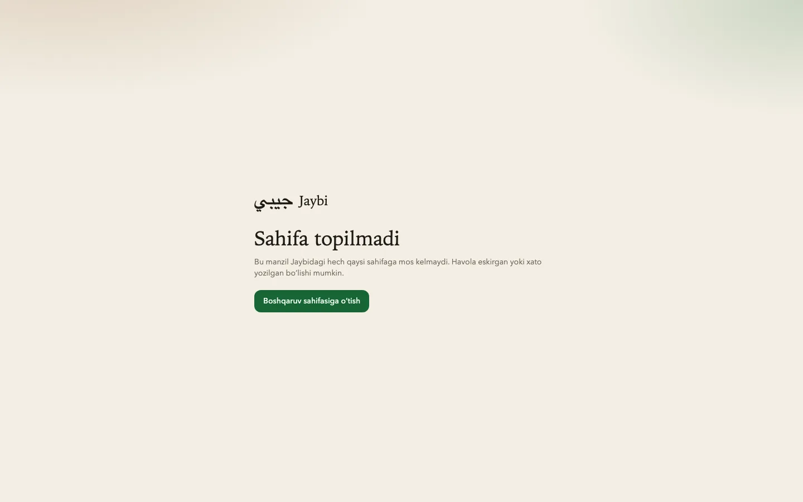

## Savol va javoblar

**Jaybidan telefonimda va kompyuterimda bir vaqtda foydalana olamanmi?** Yoʻq. Seyf bitta brauzerda turadi. Uni zaxira nusxa orqali koʻchirishingiz mumkin, lekin ikki nusxa oʻzaro sinxronlanmaydi.

**Administrator shaxsiy seyflarimni oʻqiy oladimi?** Yoʻq. Seyflar faqat parolingiz yoki tiklash kodingiz ochadigan kalit bilan shifrlangan.

**Parolimni unutdim. Uni kimdir tiklay oladimi?** Uni hech kim koʻra olmaydi, lekin administrator sizga parol yangilash kodini bera oladi. Agar yagona administrator parolini unutsa, uni hech kim yangilab bera olmaydi, shuning uchun ikkita administrator boʻlgani maʼqul.

**Jaybi maʼlumotlarimni biror joyga yuboradimi?** Yoʻq. Ilovaning oʻzidan tashqari Jaybi faqat ochiq valyuta kurslarini va eʼlon qilingan versiya raqamini yuklaydi.

**Nega baʼzi yozuvlar jami summaga kirmagan?** Ular boshqa valyutada. Ular **Boshqa valyutalar (jamiga kirmaydi)** ostida koʻrsatiladi.

**Zaxira nusxalar qayerda saqlanadi?** Yuklab olingan faylni qayerga saqlasangiz, oʻsha yerda. Jaybi siz uchun zaxira nusxalarni saqlab bermaydi.

**Kirish tekshiruvi kuchli parol oʻrnini bosadimi?** Yoʻq. U faqat ilova orqali kirishda bitta qadam qoʻshadi.

## Atamalar lugʻati

- **Seyf**: daftar, odamlar va ularning shaxsiy seyflari saqlanadigan, bitta brauzerda turadigan shifrlangan fayl.
- **Asosiy parol**: seyf yaratilganda tanlangan birinchi administrator paroli.
- **Guruh**: seyfning oʻz yozuvlari va odamlari bor qismi.
- **Yozuv**: daftardagi bitta daromad yoki xarajat.
- **Seyf valyutasi**: jami summalar va diagrammalar hisoblanadigan valyuta.
- **Bir martalik kod**: administrator beradigan, bir marta ishlaydigan va muddati tugaydigan taklif yoki parol yangilash kodi.
- **Kirish tekshiruvi**: paroldan keyin soʻraladigan, autentifikator ilovasidagi 6 xonali kod.
- **Tiklash kodlari**: autentifikatorni yoʻqotsangiz, uning oʻrnini bosadigan oʻnta bir martalik kod.
- **Shaxsiy seyf**: kartalar, obunalar va qaydlar uchun oʻzingizning shifrlangan joyingiz.
- **Tiklash kodi (seyflar)**: shaxsiy seyflaringizning zaxira kaliti.
- **Zaxira nusxa**: butun seyf saqlangan shifrlangan `.moliya` fayli.
- **Audit jurnali**: kim nima va qachon qilganini koʻrsatadigan, administratorga moʻljallangan oʻzaro bogʻlangan roʻyxat.
- **Holat tekshiruvi**: brauzer, saqlash joyi, versiya, seyf va kurslarni tekshiradigan sahifa.
